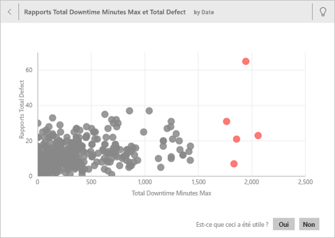
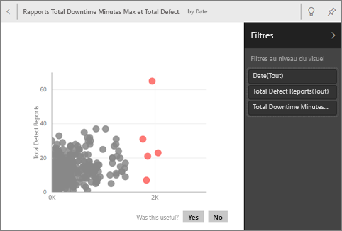
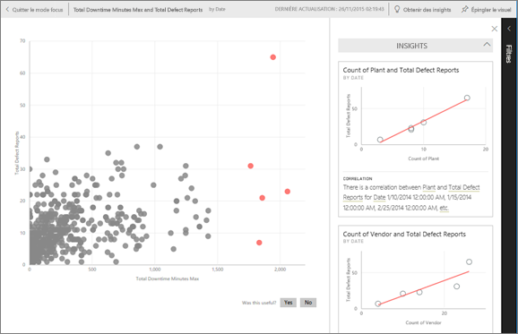

# Génération automatique d’insights sur un jeu de données avec Power BI
Vous disposez d’un nouveau jeu de données et vous ne savez pas par quoi commencer ?  Vous voulez créer rapidement un tableau de bord ?  Vous souhaitez rechercher des informations que vous auriez manquées ?

Exécutez Quick Insights pour générer des visualisations intéressantes à partir de vos données. Cet article explique comment exécuter Quick Insights sur tout un jeu de données (Quick Insights). Vous pouvez également exécuter [Quick Insights sur une vignette de tableau de bord en particulier](../consumer/end-user-insights.md) (Scoped Insights). Vous pouvez même exécuter un aperçu rapide sur un aperçu !

> [!NOTE]
> Les insights ne fonctionnent pas avec DirectQuery, seulement avec les données chargées dans Power BI.
> 

Nous avons créé la fonctionnalité d’insights sur un [ensemble croissant d’algorithmes analytiques avancés](../consumer/end-user-insight-types.md) que nous avons développés avec Microsoft Research. Nous continuons d’utiliser ces algorithmes pour aider toujours plus de gens à trouver des informations sur leurs données par des moyens inédits et intuitifs. Si vous le souhaitez, vous pouvez également apprendre à [optimiser vos données pour Quick Insights](service-insights-optimize.md).

## Exécuter un aperçu rapide sur un jeu de données
Regardez Amanda exécuter Quick Insights sur un jeu de données et ouvrir un insight en mode Focus. Amanda épingle un insight sous forme de vignette sur le tableau de bord, puis reçoit des insights sur une vignette de tableau de bord.

<iframe width="560" height="315" src="https://www.youtube.com/embed/et_MLSL2sA8" frameborder="0" allowfullscreen></iframe>

Maintenant, à vous de jouer. Explorez les insights en vous appuyant sur l’[exemple Analyse de la qualité des fournisseurs](sample-supplier-quality.md).

1. Sous l’onglet **Jeux de données**, sélectionnez **Autres options** (...), puis choisissez **Obtenir des insights rapides**.
   
    
   
    
2. Power BI utilise [différents algorithmes](../consumer/end-user-insight-types.md) pour rechercher des tendances dans votre jeu de données.
   
    
3. En quelques secondes, vos informations sont prêtes.  Sélectionnez **Afficher les informations** pour afficher des visualisations.
   
    
   
    > [!NOTE]
    > Certains jeux de données ne peuvent pas générer d’informations, car les données ne sont pas significatives d’un point de vue statistique.  Pour en savoir plus, consultez [Optimiser vos données pour obtenir des informations](service-insights-optimize.md).
    > 
    
4. Les visualisations s’affichent dans une zone de dessin **Informations rapides** spéciale comprenant jusqu’à 32 cartes d’information distinctes. Chaque carte possède un graphique et une brève description.
   
    

## Interagir avec les cartes d’informations

1. Pointez le curseur sur une carte, puis sélectionnez l’icône en forme d’épingle pour ajouter la visualisation à un tableau de bord.

2. Pointez sur une carte, sélectionnez **Autres options** (...), puis choisissez **Voir les insights**. 

    L’écran Insight s’ouvre en mode Focus.
   
    
3. Dans le mode Focus, vous pouvez :
   
   * Filtrez les visualisations. Si le volet **Filtres** n’est pas déjà ouvert, développez-le en sélectionnant la flèche sur le côté droit de la fenêtre.

       
   * Épinglez la carte d’insight à un tableau de bord en sélectionnant **Épingler un visuel**.
   * Exécutez les insights sur la carte proprement dite, ce qui permet d’obtenir des *insights avec étendue*. En haut à droite, sélectionnez l’icône en forme d’ampoule  ou **Obtenir des insights**.
     
       
     
     L’insight s’affiche à gauche. De nouvelles cartes, qui s’appuient uniquement sur les données de cet insight, apparaissent à droite.
     
       
4. Pour revenir au canevas d’aperçu d’origine, dans le coin supérieur gauche, sélectionnez **Quitter le mode Focus**.

## Étapes suivantes
- Si vous possédez un jeu de données, [optimisez-le pour Quick Insights](service-insights-optimize.md).
- En savoir plus sur les [types d’insights rapides disponibles](../consumer/end-user-insight-types.md).

D’autres questions ? [Posez vos questions à la Communauté Power BI](https://community.powerbi.com/).
