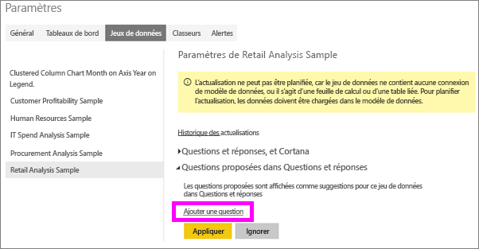
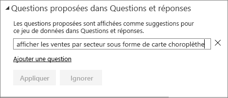
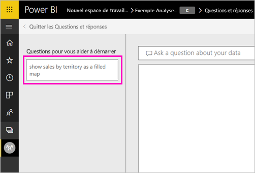

# Création de questions exemplaires pour les Q&R de Power BI
Si vous possédez un jeu de données, vous pouvez y ajouter vos propres questions exemplaires. Q&R Power BI montre ces questions aux collègues qui utilisent des rapports basés sur ce jeu de données.  Les questions exemplaires ont pour but de donner à vos collègues des idées sur les types de questions qu’ils peuvent poser concernant le jeu de données. Le choix des questions exemplaires que vous ajoutez vous appartient. Vous pouvez ajouter des questions fréquemment posées, des questions qui présentent des résultats intéressants ou des questions qui peuvent être difficiles à formuler.

> [!NOTE]
> Les questions proposées par la fonctionnalité Questions et réponses sont disponibles dans l’[application Microsoft Power BI pour iOS sur les appareils iPad, iPhone et iPod Touch](../consumer/mobile/mobile-apps-ios-qna.md) et Questions et réponses dans Power BI Desktop. La création des questions n’est disponible que dans le service Power BI (app.powerbi.com).
> 

## Créer une question proposée

Cet article utilise [l’Exemple Analyse de la vente au détail](sample-datasets.md). Suivez ces instructions pas à pas pour essayer d’explorer un jeu de données vous-même.

1. Sur le tableau de bord, sélectionnez la zone de questions Questions et réponses.   Notez que les Q&R sont déjà utiles en affichant une liste de termes qui figurent dans le jeu de données.
2. Pour compléter cette liste, sélectionnez l’icône d’engrenage dans le coin supérieur droit de Power BI.  
   
3. Sélectionnez **Paramètres** &gt; **Jeux de données** &gt; **Exemple Analyse de la vente au détail** &gt; **Questions proposées par Questions et réponses**.  
4. Sélectionnez **Ajouter une question**.
   
   
5. Tapez votre question dans la zone de texte, puis sélectionnez **Appliquer**.   Si vous le souhaitez, ajoutez une autre question en sélectionnant **Ajouter une question**.  
   
6. Revenez au tableau de bord de Power BI pour l’exemple « Retail Analysis Sample », puis placez le curseur dans la zone Q&R.   
   
7. La nouvelle question proposée **Sales by territory as a map** (Ventes par territoire sous forme de carte) figure en tête de la liste. Sélectionnez-la.  
8. Power BI crée la réponse et l’affiche sous la forme de visualisation de carte remplie.  
   

## Étapes suivantes

- [Q&R pour les consommateurs](../consumer/end-user-q-and-a.md)  
- [Utiliser Q&R dans des tableaux de bord et des rapports](power-bi-tutorial-q-and-a.md)  
- [Fondamentaux pour les concepteurs dans le service Power BI](../fundamentals/service-basic-concepts.md)  

D’autres questions ? [Posez vos questions à la communauté Power BI](https://community.powerbi.com/)
