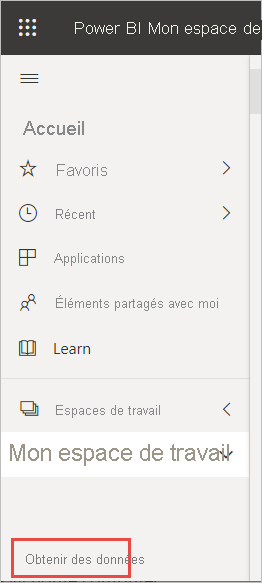
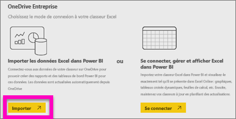
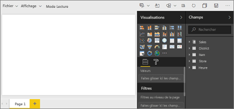
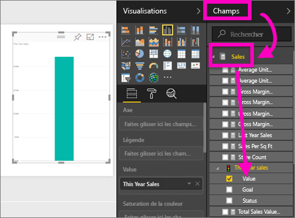
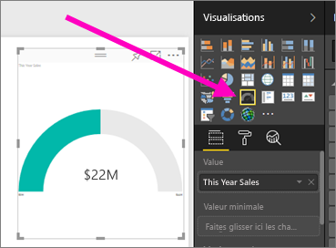
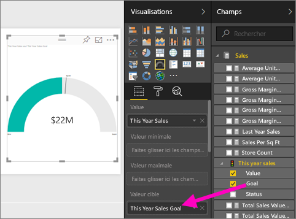
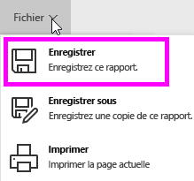
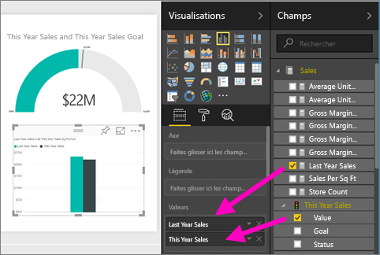
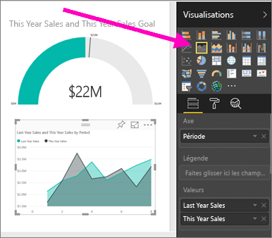
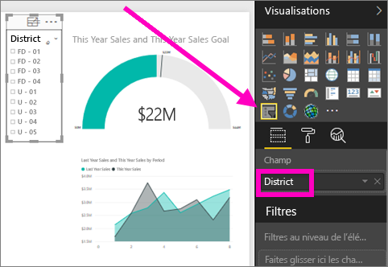

# Créer un rapport à partir d’un fichier Excel dans le service Power BI
Vous avez lu [apports dans Power BI](../consumer/end-user-reports.md) et vous souhaitez maintenant créer vos propres rapports. Il existe différentes façons de créer un rapport : Dans cet article, nous commençons par créer un rapport de base dans le service Power BI à partir d’un fichier Excel. Lorsque vous aurez compris les principes fondamentaux de la création d’un rapport, examinez les [étapes suivantes](#next-steps) plus bas pour accéder à des rubriques plus avancées concernant les rapports.  

## Conditions préalables
- [S’inscrire au service Power BI](../fundamentals/service-self-service-signup-for-power-bi.md). 
- [Téléchargez l’exemple de fichier Excel Analyse de la vente au détail](https://go.microsoft.com/fwlink/?LinkId=529778) et enregistrez-le dans OneDrive Entreprise ou localement.

## Importer le fichier Excel
Cette méthode de création d’un rapport démarre avec un fichier et un canevas de rapport vide. Vous pouvez suivre l’exemple de fichier Excel Analyse de la vente au détail.

1. Dans le volet de navigation, sélectionnez **Mon espace de travail**.
   
   :::image type="content" source="media/service-report-create-new/power-bi-select-my-workspace.png" alt-text="Capture d’écran de la sélection de Mon espace de travail.":::
2. Sélectionnez **Obtenir des données** en bas du volet de navigation.
   
   
3. Sélectionnez **Fichiers**, puis accédez à l’emplacement dans lequel vous avez enregistré l’exemple Analyse de la vente au détail.
   
    
4. Dans cet exercice, sélectionnez **Importer**.
   
   
5. Sélectionnez **Ouvrir**.

   Une fois le fichier Excel importé, il est listé sous la forme d’un *jeu de données* dans la liste des espaces de travail.

1. Sélectionnez **Autres options (...)** en regard du jeu de données, puis sélectionnez **Créer un rapport**.
   
   :::image type="content" source="media/service-report-create-new/power-bi-dataset-create-report.png" alt-text="Capture d’écran de la sélection de Créer un rapport.":::
6. L’éditeur de rapport s’ouvre. 
   
   

> [!TIP]
> Sélectionnez l’icône de menu pour masquer le volet de navigation, afin d’avoir plus de place.
> 
> :::image type="content" source="../media/power-bi-hide-navigation-pane.png" alt-text="Capture d’écran de la sélection de l’icône de menu pour masquer le volet de navigation.":::

## Ajouter une jauge radiale au rapport
À présent que notre jeu de données est importé, commençons à répondre à quelques questions.  Notre Directrice marketing veut savoir où nous en sommes par rapport aux objectifs de ventes de cette année. Une jauge est un [bon choix de visualisation](../visuals/power-bi-report-visualizations.md) pour l’affichage de ce type d’information.

1. Dans le volet Champs, sélectionnez **Sales (Ventes)** > **This Year Sales (Ventes de cette année)** > **Value (Valeur)**.
   
    
2. Convertissez le visuel en jauge en sélectionnant le modèle Jauge  dans le volet **Visualisations**.
   
    
3. Faites glisser **Sales (Ventes)**  > **This Year Sales (Ventes de cette année)**  > **Goal (Objectif)** dans la zone **Target value (Valeur cible)** . Il semble que nous sommes très proches de notre objectif.
   
    
4. Le moment est opportun pour enregistrer votre rapport.
   
   

## Ajouter un graphique en aires et un segment au rapport
Notre Directrice marketing a des questions supplémentaires à nous poser. Elle souhaite savoir comment se comportent les ventes de cette année par rapport à l’année dernière. Elle souhaite voir les résultats par district.

1. Tout d’abord, nous allons libérer de l’espace sur notre canevas. Sélectionnez la jauge et déplacez-la dans l’angle supérieur droit. Ensuite, faites glisser un des angles de la jauge, puis réduisez la taille de celle-ci.
2. Désélectionnez la jauge. Dans le volet Champs, sélectionnez **Sales (Ventes)**  > **This Year Sales (Ventes de cette année)**  > **Value (Valeur)** , puis sélectionnez **Sales (Ventes)**  > **Last Year Sales (Ventes de l’année dernière)** .
   
    
3. Convertissez le visuel en graphique en aires en sélectionnant le modèle Graphique en aires  dans le volet **Visualisations**.
4. Sélectionnez **Time** > **Period** (Période) pour l’ajouter au puits **Axe**.
   
    
5. Pour trier la visualisation par période, sélectionnez les points de suspension, puis choisissez **Trier par période**.
6. Nous allons à présent ajouter le segment. Sélectionnez une zone vide sur le canevas et choisissez le modèle Segment  . Nous disposons à présent d’un segment vide sur notre canevas.
   
        
7. Dans le volet Champs, sélectionnez **District** > **District**. Déplacez et redimensionnez le segment.
   
      
8. Utilisez le segment pour rechercher des modèles et des informations par secteur.
   
     

Continuer d’explorer vos données et d’ajouter des visualisations. Lorsque vous trouvez des informations particulièrement intéressantes, [épinglez-les à un tableau de bord](service-dashboard-pin-tile-from-report.md).

## Étapes suivantes

* [Épingler des visualisations à un tableau de bord](service-dashboard-pin-tile-from-report.md)
* [Modifier les paramètres de rapport dans le service Power BI](power-bi-report-settings.md)
* D’autres questions ? [Posez vos questions à la communauté Power BI](https://community.powerbi.com/)
