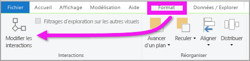
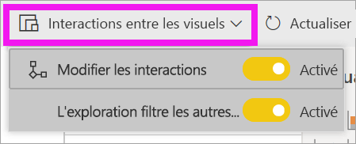
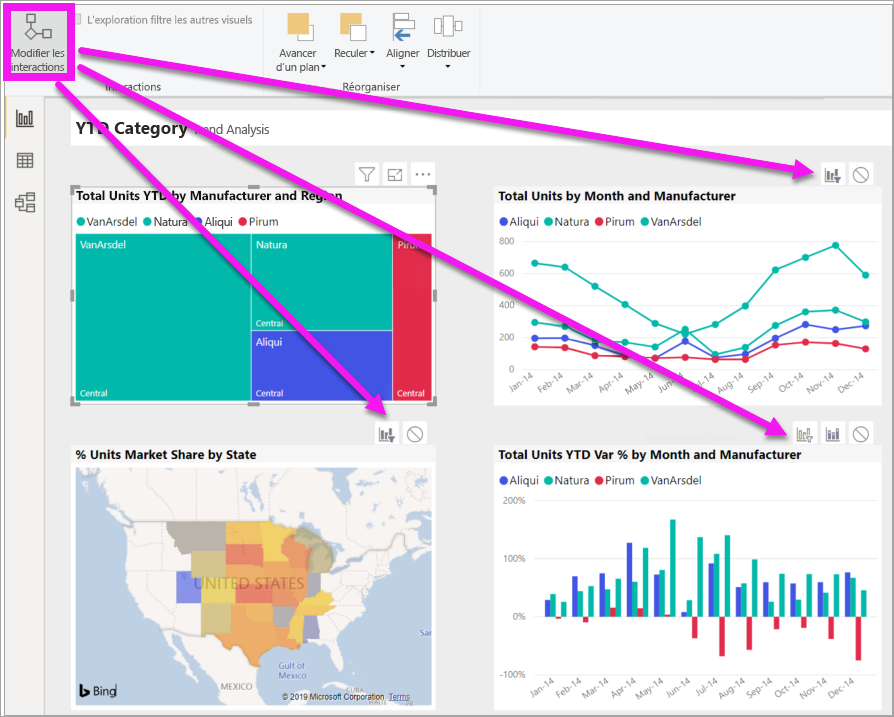

# Modifier l’interaction des visuels dans un rapport Power BI
Si vous avez des autorisations de modification sur un rapport, vous pouvez utiliser des **interactions entre visuels** pour changer l’impact entre les visualisations d’une page de rapport. 

## Introduction aux interactions avec des éléments visuels
Par défaut, vous pouvez utiliser les visualisations d’une page de rapport pour filtrer et mettre en évidence les autres visualisations de la page. On parle alors de « filtrage croisé » et de « mise en évidence croisée ».
Par exemple, si vous sélectionnez un état sur une visualisation de carte, l’histogramme est mis en évidence et le graphique en courbes est filtré pour afficher uniquement les données qui s’appliquent à cet état.
Consultez [À propos du filtrage et de la mise en évidence](power-bi-reports-filters-and-highlighting.md). Et si vous avez une visualisation qui prend en charge l’[exploration](../consumer/end-user-drill.md), par défaut, l’exploration d’une visualisation n’a aucun impact sur les autres visualisations de la page de rapport. Vous pouvez toutefois remplacer ces deux comportements par défaut et définir des interactions pour chaque visualisation.

Cet article vous explique comment utiliser des **interactions entre visuels** dans Power BI Desktop. Le processus est le même dans le service Power BI [Mode Édition](service-interact-with-a-report-in-editing-view.md). Si vous avez uniquement accès au mode Lecture ou que le rapport a été partagé avec vous, vous ne pouvez pas changer les paramètres d’interaction entre visuels.

Les termes *filtrage croisé* et *sélection croisée* permettent de distinguer le comportement décrit ici de celui qui résulte de l’utilisation du volet **Filtres** pour *filtrer* et *mettre en évidence* des visualisations.  

> [!NOTE]
> Cette vidéo utilise les anciennes versions de Power BI Desktop et du service Power BI. 
>
>

<iframe width="560" height="315" src="https://www.youtube.com/embed/N_xYsCbyHPw?list=PL1N57mwBHtN0JFoKSR0n-tBkUJHeMP2cP" frameborder="0" allowfullscreen></iframe>

## Activer les contrôles d'interaction entre les visuels
Si vous disposez des droits d'édition d'un rapport, vous pouvez activer les contrôles d'interaction entre les visuels, puis personnaliser le filtrage et la mise en évidence des visualisations de votre page de rapport. 

1. Sélectionnez une visualisation pour l’activer.  
2. Afficher les options **Interactions entre les visuels**.
    

    - Dans Desktop, sélectionnez **Format > Interactions**.

        

    - Dans le service Power BI, ouvrez le rapport en mode Edition, puis sélectionnez le menu déroulant dans la barre de menus du rapport.

        

3. Pour afficher les commandes d’interaction entre visualisations, sélectionnez **Modifier les interactions**. Power BI ajoute les icônes de filtrage et de sélection à toutes les autres visualisations de la page de rapport. Nous pouvons voir que le compartimentage filtre le graphique en courbes et la carte, et qu’il met en surbrillance l’histogramme. Vous pouvez maintenant modifier la façon dont la visualisation sélectionnée interagit avec les autres visualisations dans la page du rapport.
   
    

## Changer le comportement d’interaction
Familiarisez-vous avec la façon dont vos visualisations interagissent en sélectionnant une par une chaque visualisation sur votre page de rapport.  Sélectionnez un point de données, une barre ou une forme, puis observez l'impact sur les autres visualisations. Si le comportement affiché ne vous convient pas, vous pouvez modifier les interactions. Ces modifications sont enregistrées avec le rapport, de sorte que vous et les utilisateurs de votre rapport aurez la même expérience d'interaction visuelle.

Commencez par sélectionner une visualisation pour l’activer.  Notez que toutes les autres visualisations de la page présentent maintenant des icônes d’interaction. L’icône en gras est celle qui est appliquée. Déterminez maintenant l’impact que la **visualisation sélectionnée** doit avoir sur les autres.  Répétez éventuellement cette opération pour toutes les autres visualisations de la page de rapport.

Si la visualisation sélectionnée doit :
   
   * filtrer de façon croisée l’une des autres visualisations de la page, sélectionnez l’icône **filtrer** en haut à droite de cette visualisation .
   * mettre en surbrillance l’une des autres visualisations de la page, sélectionnez l’icône **mettre en surbrillance** .
   * n’avoir aucun impact sur les autres visualisations de la page, sélectionnez l’icône **aucun impact** .

## Modifier les interactions des visualisations explorables
[Certaines visualisations Power BI peuvent être explorées](../consumer/end-user-drill.md). Par défaut, lorsque vous explorez une visualisation, elle n'a aucun impact sur les autres visualisations de la page du rapport. Mais, ce comportement peut être modifié. 

> [!TIP]
> Testez-le vous-même en utilisant l'[exemple de fichier PBIX Ressources humaines](https://download.microsoft.com/download/6/9/5/69503155-05A5-483E-829A-F7B5F3DD5D27/Human%20Resources%20Sample%20PBIX.pbix). Vous disposez d’un histogramme dont l'onglet **Nouvelles recrues** a été développé.
>

1. Sélectionnez le visuel explorable pour l’activer. 

2. Pour activer l’exploration, sélectionnez l’icône Explorer au niveau du détail.

    

2. Dans la barre de menus, sélectionnez **Format** > **L'exploration filtre les autres visuels**.  Maintenant, quand vous explorez une visualisation, les autres visualisations de la page de rapport changent pour refléter votre sélection d’exploration actuelle. 

    

3. Si le comportement affiché ne vous convient pas, vous pouvez modifier les interactions [comme ci-dessus](#change-the-interaction-behavior).

## Considérations et résolution des problèmes
Si vous créez une matrice avec des champs de tables différentes, puis essayez d’effectuer une mise en surbrillance croisée en sélectionnant plusieurs éléments à différents niveaux de la hiérarchie, vous recevez des erreurs sur les autres visuels. 

    
## Étapes suivantes
[Filtrage et mise en évidence dans les rapports Power BI](power-bi-reports-filters-and-highlighting.md)