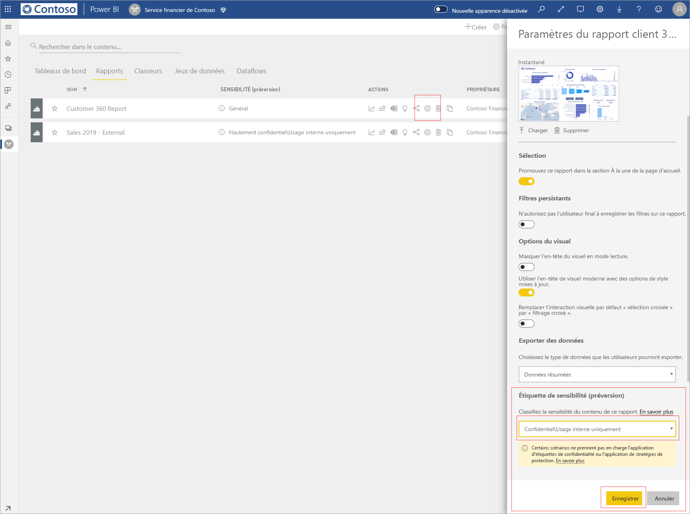

# Appliquer des étiquettes de sensibilité des données dans Power BI (préversion)

Quand les étiquettes de sensibilité sont activées dans le service Power BI, vous pouvez protéger vos tableaux de bord, rapports, jeux de données et dataflows contre les accès non autorisés et les fuites en leur appliquant des étiquettes de sensibilité des données. L’étiquetage correct des données avec des étiquettes de sensibilité des données garantit que seules les personnes autorisées peuvent accéder à vos données.

Quand la protection des données est activée, les étiquettes de sensibilité s’affichent dans la colonne de sensibilité en mode liste des tableaux de bord, des rapports, des jeux de données et dataflows.

> [!NOTE]
> L’application d’étiquettes de sensibilité aux tableaux de bord, rapports, jeux de données et dataflows Power BI requiert certaines licences et autorisations. Pour plus d’informations, consultez [Application d’étiquettes de sensibilité](#applying-sensitivity-labels).

## Application d’étiquettes de sensibilité

Afin d’appliquer des étiquettes de sensibilité dans Power BI, votre organisation et vous-même devez respecter les exigences suivantes :

* Votre organisation doit avoir défini les étiquettes de sensibilité dans le [Centre de sécurité Microsoft 365](https://security.microsoft.com/) ou dans le [Centre de conformité Microsoft 365](https://compliance.microsoft.com/).
* Vous devez appartenir à un groupe de sécurité qui dispose des autorisations nécessaires pour appliquer des étiquettes de sensibilité des données, comme décrit dans l’article intitulé [Activer les étiquettes de sensibilité des données dans Power BI (préversion)](../admin/service-security-enable-data-sensitivity-labels.md#enable-data-sensitivity-labels).
* Vous devez disposer d’une licence Power BI Pro et d’autorisations de modification sur les ressources que vous souhaitez étiqueter. 
* Vous devez disposer d’une licence Azure Information Protection Premium P1 ou Premium P2. Vous pouvez acheter Microsoft Azure Information Protection en autonome ou par le biais de l’une des suites de licences Microsoft. Pour plus d’informations, consultez les [tarifs Azure Information Protection](https://azure.microsoft.com/pricing/details/information-protection/).

Pour appliquer ou changer une étiquette de sensibilité sur un rapport, dans l’espace de travail, cliquez sur l’icône des paramètres de rapport pour l’élément de liste concerné, puis accédez à la section de la sensibilité des données dans le volet latéral des paramètres. Choisissez l’étiquette de sensibilité appropriée et enregistrez les paramètres.

L’étiquette de sensibilité mise à jour apparaît dans la colonne de la sensibilité. 

L’application ou la modification d’une étiquette de sensibilité sur un tableau de bord suit le même processus que celui décrit pour les rapports. 

Vous pouvez également définir des étiquettes de sensibilité sur les jeux de données et les dataflows. L’illustration suivante montre comment définir une étiquette de sensibilité sur un jeu de données ; les étapes pour les dataflows sont similaires.

Pour définir une étiquette de sensibilité sur un jeu de données, sélectionnez l’onglet Jeux de données, cliquez sur les trois points associés au jeu de données auquel vous souhaitez appliquer une étiquette, puis choisissez **Paramètres**.

Dans la page des paramètres du jeu de données, ouvrez la section Étiquette de sensibilité, choisissez l’étiquette de sensibilité souhaitée, puis cliquez sur **Appliquer**.

L’application ou la modification d’une étiquette de sensibilité sur un dataflow suit le même processus que celui décrit pour les jeux de données.

## Protection des données dans les fichiers exportés

Quand vous [exportez des données à partir d’un rapport](https://docs.microsoft.com/power-bi/consumer/end-user-export) qui a une étiquette de sensibilité, celle-ci est héritée par le fichier généré (Excel, PowerPoint et PDF ; CSV n’est pas pris en charge). L’étiquette de sensibilité est visible dans le fichier, et l’accès au fichier est limité aux personnes qui disposent d’autorisations suffisantes.

## Considérations et limitations

Voici une série de considérations concernant l’application d’étiquettes de sensibilité des données :

* L’affichage et l’application d’étiquettes Microsoft Information Protection dans Power BI exigent que les utilisateurs disposent d’une licence Azure Information Protection Premium P1 ou Premium P2. Vous pouvez acheter Microsoft Azure Information Protection en autonome ou par le biais de l’une des suites de licences Microsoft. Pour plus d’informations, consultez les [tarifs Azure Information Protection](https://azure.microsoft.com/pricing/details/information-protection/).
* Les étiquettes de sensibilité ne peuvent être appliquées que sur les tableaux de bord, les rapports, les jeux de données et les dataflows.
* L’application de contrôles de protection et d’étiquettes à des fichiers exportés est prise en charge uniquement pour les fichiers Excel, PowerPoint et PDF. L’étiquette et la protection ne sont pas appliquées quand les données sont exportées vers des fichiers .CSV, un e-mail d’abonnement, des visuels d’incorporation et une impression.
* Un utilisateur qui exporte un fichier à partir de Power BI dispose d’autorisations pour accéder à ce fichier et le modifier en fonction des paramètres d’étiquette de sensibilité. L’utilisateur qui exporte les données n’obtient pas d’autorisations de propriétaire sur le fichier. 
* Les étiquettes de sensibilité ne sont pas disponibles pour les [rapports paginés]( https://docs.microsoft.com/power-bi/paginated-reports-report-builder-power-bi) et les classeurs. 
* Vous ne pouvez pas supprimer une étiquette d’une ressource Power BI après son application.
* Les étiquettes de sensibilité sur des ressources Power BI sont visibles uniquement dans la liste d’espace de travail et les vues de traçabilité ; elles ne sont pas visibles dans les vues Favoris, Éléments partagés avec moi, Récents ou d’application. Notez, toutefois, qu’une étiquette appliquée à une ressource Power BI, même si elle n’est pas visible, est toujours conservée sur les données exportées vers des fichiers Excel, PowerPoint et PDF.
* Le *paramètre de chiffrement de fichier* des étiquettes de sensibilité, configuré dans le [Centre de sécurité Microsoft 365](https://security.microsoft.com/) ou le [Centre de conformité Microsoft 365](https://compliance.microsoft.com/), s’applique uniquement aux fichiers *exportés à partir de* Power BI ; il n’est pas appliqué *dans* Power BI.
* La [protection HYOK](https://docs.microsoft.com/azure/information-protection/configure-adrms-restrictions) n’est pas prise en charge pour les étiquettes appliquées dans Power BI.
* L’affichage et l’application d’étiquettes dans les applications Office sont soumis à des [conditions de licences](https://docs.microsoft.com/microsoft-365/compliance/sensitivity-labels-office-apps#subscription-and-licensing-requirements-for-sensitivity-labels).
* Les étiquettes de sensibilité sont uniquement prises en charge pour les locataires dans le cloud global (public). Les étiquettes de sensibilité ne sont pas prises en charge pour les locataires dans les autres clouds.

## Étapes suivantes

L’objectif de cet article était d’expliquer comment appliquer les étiquettes de sensibilité des données dans Power BI. Les articles suivants fournissent plus de détails sur la protection des données dans Power BI. 

* [Vue d’ensemble de la protection des données dans Power BI](../admin/service-security-data-protection-overview.md)
* [Activer les étiquettes de sensibilité des données dans Power BI](../admin/service-security-enable-data-sensitivity-labels.md)
* [Utilisation de contrôles Microsoft Cloud App Security dans Power BI](../admin/service-security-using-microsoft-cloud-app-security-controls.md)