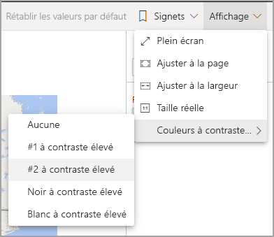
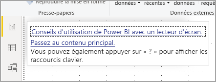

# Consommation des rapports dans Power BI avec les outils d’accessibilité
Power BI intègre de nombreuses fonctionnalités qui permettent aux personnes présentant un handicap de lire et d’utiliser plus facilement les rapports Power BI. Ces outils permettent aux utilisateurs d’obtenir les mêmes informations d’un rapport que ceux qui n’utilisent pas de technologie d’assistance.

Voici quelques termes que vous devez connaître lorsque vous lisez cet article :

* Le **focus** correspond à l’emplacement de la souris sur la page. Le focus est généralement indiqué par une bordure bleue entourant un objet.
* Le **canevas** est la zone de votre rapport dans la page.

Les sections suivantes décrivent les outils d’accessibilité disponibles pour utiliser les rapports Power BI.

## Navigation au clavier

Lorsque vous lancez Power BI Desktop ou le service Power BI, dès que vous appuyez sur **Tab**, une info-bulle apparaît dans l’angle supérieur droit. Le lien intitulé **Conseils d’utilisation de Power BI avec un lecteur d’écran** vous dirige vers l’article correspondant, qui fournit des informations sur la façon d’utiliser un rapport avec les outils d’accessibilité. Le fait de cliquer sur le lien **Passer au contenu principal** vous mène au canevas du rapport.

Un appui sur la touche  **?** ouvre une boîte de dialogue contenant les raccourcis clavier les plus fréquemment utilisés dans Power BI. Pour afficher la liste complète des raccourcis clavier disponibles dans Power BI, vous pouvez activer le lien en bas de la boîte de dialogue. Il vous permet d’accéder à la documentation Power BI sur les [raccourcis clavier](desktop-accessibility-keyboard-shortcuts.md).

Pour faire passer le focus d’un onglet de page de rapport à un autre ou d’un objet à un autre dans une page de rapport donnée, utilisez **Ctrl+F6**. Lorsque le focus est sur une page de rapport chargée, utilisez la touche **Tab** pour le faire passer d’un objet à un autre de la page, notamment les zones de texte, les images, les formes et les graphiques. 

En général, l’utilisation de la touche **Entrée** pour sélectionner ou entrer des données, et l’utilisation de la touche **Échap** pour quitter sont des commandes courantes dans Power BI.

### Navigation au clavier pour les visuels

De nombreux créateurs de rapports Power BI créent des rapports qui contiennent beaucoup de données. Pour parcourir un visuel, il peut être ennuyeux d’appuyer sur Tab pour accéder à chaque élément du visuel. La navigation au clavier pour les visuels a été conçue comme une hiérarchie à trois niveaux. Ces trois niveaux sont décrits dans les paragraphes suivants.

Pour parcourir le premier niveau, lorsque vous accédez à un visuel, appuyez sur **Ctrl+Flèche droite** pour entrer dans le visuel. Une fois que vous êtes entré dans le visuel, vous pouvez appuyer sur **Tab** pour parcourir en boucle les zones principales du visuel. Les zones principales que vous pouvez parcourir en boucle sont la zone de traçage des données, les catégories d’axe (le cas échéant dans le visuel) et la légende (si le visuel en a une).

Le fichier .gif suivant montre comment un utilisateur parcourt en boucle le premier niveau d’un visuel :

Le deuxième niveau de la hiérarchie est l’entrée dans l’une des zones principales (zone de traçage des données, catégories de l’axe X, légende) du visuel. Lorsque vous consommez un rapport, vous pouvez entrer dans l’une des zones principales et parcourir en boucle les points de données et les catégories de cette section du visuel. Une fois que vous avez choisi une zone à explorer plus profondément, vous pouvez appuyer sur **Entrée** pour parcourir en boucle cette zone spécifique.

Si vous souhaitez sélectionner tous les points de données d’une série, accédez à la légende et appuyez sur **Entrée**. Une fois dans la légende, vous pouvez appuyer sur **Tab** pour parcourir les différentes catégories de la légende. Appuyez sur **Entrée** pour sélectionner une série spécifique.

Pour sélectionner des points de données spécifiques, accédez à la zone de traçage des données et appuyez sur **Entrée**. Une fois dans la zone de traçage des données, vous pouvez appuyer sur **Tab** pour parcourir les points de données. Si votre visuel comporte plusieurs séries, vous pouvez appuyer sur **Flèche Haut** ou **Flèche Bas** pour accéder aux points de données d’une autre série.

Pour sélectionner tous les points de données d’un axe de catégorie, accédez aux étiquettes des axes et appuyez sur **Entrée**. Une fois dans les étiquettes des axes, vous pouvez appuyer sur **Tab** pour parcourir les étiquettes. Appuyez sur **Entrée** pour sélectionner une étiquette.

Si vous avez pénétré dans une couche, vous pouvez appuyer sur **Échap** pour sortir de cette couche. Le fichier. gif suivant montre comment un utilisateur peut entrer dans les niveaux d’un visuel et en sortir, et sélectionner des points de données, des étiquettes de catégorie de l’axe X, accéder à une autre série et sélectionner tous les points de données d’une série.

Si vous ne parvenez pas à accéder à un objet ou à un visuel en utilisant un clavier, cela peut être dû au fait que l’auteur du rapport a décidé de masquer cet objet dans l’ordre de tabulation. Les auteurs de rapports masquent souvent les objets décoratifs dans l’ordre de tabulation. Si vous ne pouvez pas parcourir par tabulations un rapport de manière logique, vous devez contacter l’auteur du rapport. Les auteurs de rapports peuvent définir l’ordre de tabulation pour les objets et les visuels.

### Navigation au clavier pour les segments

Les segments intègrent également des fonctionnalités d’accessibilité. Lorsque vous sélectionnez un segment, pour régler sa valeur, utilisez **Ctrl+Flèche droite** pour passer d’un contrôle à l’autre dans le segment. Par exemple, lorsque vous appuyez d’abord sur **Ctrl+flèche droite**, le focus est mis sur la gomme. Ensuite, un appui sur la **barre d’espace** équivaut à cliquer sur le bouton Gomme, ce qui efface toutes les valeurs sur le segment.

Vous pouvez parcourir les contrôles dans un segment en appuyant sur **Tab**. Appuyez sur **Tab** quand la gomme est sélectionnée pour accéder au bouton de liste déroulante. Un autre actionnement de la touche **Tab** vous amène à la première valeur de segment (s’il existe plusieurs valeurs pour le segment, comme une plage).

### Changement de pages

Lorsque le focus est sur les onglets de page du rapport, utilisez les touches **Tab** ou **flèche** pour le faire passer d’une page du rapport à la suivante. Le lecteur d’écran lit le titre de la page de rapport, et indique si cette page est actuellement sélectionnée. Pour charger la page de rapport actuellement mise en évidence, utilisez la touche **Entrée** ou la **barre d’espace**.

### Accès à l’en-tête du visuel
Quand vous naviguez entre les visuels, vous pouvez appuyer sur **Alt+Maj+F10** pour déplacer le focus sur l’en-tête du visuel. Celui-ci contient différentes options, notamment le tri, l’exportation de données dans le graphique et le mode Focus. Les icônes que vous voyez dans l’en-tête du visuel dépendent des options que l’auteur du rapport a décidé d’afficher.

## Lecteur d’écran

Lorsque vous affichez un rapport, il est préférable de maintenir le mode d’analyse désactivé. Power BI doit être traité plus comme une application que comme un document. Il a donc été configuré avec une navigation personnalisée pour faciliter la navigation. Lorsque vous utilisez un lecteur d’écran avec Power BI Desktop, vous devez également vous assurer que votre lecteur d’écran est ouvert avant d’ouvrir Power BI Desktop.

Quand vous parcourez des objets, le lecteur d’écran lit le type d’objet et le titre de l’objet (le cas échéant). Le lecteur d’écran lit également la description de l’objet (texte de remplacement) si elle est fournie par l’auteur du rapport.

### Afficher les données
Vous pouvez appuyer sur **Alt+Maj+F11** pour présenter une version accessible de la fenêtre **Afficher les données**. Cette fenêtre vous permet d’explorer dans une table HTML les données utilisées dans le visuel, en utilisant les mêmes raccourcis clavier que ceux que vous utilisez normalement avec votre lecteur d’écran.

La fonctionnalité **Afficher les données** correspond à une table HTML qui est accessible à un lecteur d’écran uniquement via ce raccourci clavier. Si vous ouvrez **Afficher les données** à partir de l’option dans l’en-tête du visuel, une table qui *n’est pas* compatible avec le lecteur d’écran est affichée.  Lorsque vous utilisez **Afficher les données** via des raccourcis clavier, activez le mode d’analyse pour tirer parti de toutes les touches d’accès rapide que fournit votre lecteur d’écran.

Pour quitter la vue **Afficher les données** et revenir à un rapport, appuyez sur **Échap**.

## Modes à contraste élevé

Le service Power BI tente de détecter les paramètres de contraste élevé sélectionnés pour Windows. L’efficacité et la précision de cette détection dépendent du navigateur présentant le service Power BI. Si vous souhaitez définir le thème manuellement dans le service Power BI, vous pouvez sélectionner **Affichage > Couleurs à contraste élevé** et choisir le thème que vous souhaitez appliquer au rapport.

## Étapes suivantes

Voici la liste des articles dédiés à l’accessibilité dans Power BI :

* [Vue d’ensemble de l’accessibilité dans Power BI](desktop-accessibility-overview.md) 
* [Création de rapports Power BI accessibles](desktop-accessibility-creating-reports.md) 
* [Création de rapports Power BI avec les outils d’accessibilité](desktop-accessibility-creating-tools.md)
* [Raccourcis clavier d’accessibilité pour les rapports Power BI](desktop-accessibility-keyboard-shortcuts.md)
* [Liste de vérification de l’accessibilité des rapports](desktop-accessibility-creating-reports.md#report-accessibility-checklist)

