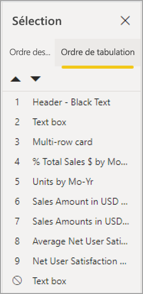
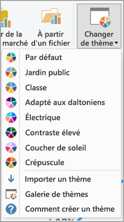

# Concevoir des rapports Power BI pour l’accessibilité
Vous pouvez concevoir et créer des rapports de haute qualité tout en favorisant leur accessibilité. Quel que soit le public concerné, vous devez veiller à ce que tous les rapports que vous créez puissent être utilisés par le plus grand nombre de personnes possible sans nécessiter ni adaptation, ni conception spéciale.

Cet article décrit les outils et fonctionnalités permettant de créer des rapports accessibles dans Power BI.

Pour améliorer le processus de création de rapports avec les lecteurs d’écran, un menu contextuel est disponible. Le menu permet de déplacer des champs dans le puits vers le haut ou vers le bas dans la liste **Champs**. Il permet également de déplacer le champ vers d’autres puits, comme **Légende** ou **Valeur**, entre autres.

## Types de fonctionnalités d’accessibilité

Power BI offre différentes fonctionnalités d’accessibilité pour la création de rapport. Toutefois, en tant qu’auteur de rapport, c’est à vous qu’il appartient de les intégrer. Cet article décrit trois catégories de fonctionnalités d’accessibilité :

* Fonctionnalités d’accessibilité intégrées (aucune configuration nécessaire)
* Fonctionnalités d’accessibilité intégrées (configuration nécessaire)
* Autres conseils et considérations

Nous aborderons chacune de ces catégories dans les sections suivantes.

## Fonctionnalités d’accessibilité intégrées

Power BI possède des fonctionnalités d’accessibilité intégrées qui ne nécessitent aucune configuration par l’auteur du rapport. Ces fonctionnalités sont les suivantes :

* Navigation au clavier
* Compatibilité avec les lecteurs d’écran
* Vue avec couleurs à contraste élevé
* Mode focus
* Table Afficher les données

Par ailleurs, certaines fonctionnalités simplifient l’expérience de consommation des rapports. Vous trouverez des liens vers les articles décrivant ces fonctionnalités dans la section [Étapes suivantes](#next-steps), à la fin de cet article.

Abordons à présent chacune des fonctionnalités d’accessibilité intégrées. 

### Navigation au clavier

En tant qu’auteur de rapport, vous n’avez pas à vous préoccuper de savoir si vos consommateurs pourront utiliser ou non leur clavier pour naviguer dans un rapport. Il est possible de naviguer dans tous les visuels de Power BI à l’aide du clavier. Le consommateur de rapport peut parcourir les points de données dans les visuels, basculer entre les onglets de page et accéder aux fonctionnalités interactives, notamment à la sélection croisée, au filtrage et au découpage.

Quand un consommateur parcourt un rapport, le focus apparaît pour lui indiquer où il se trouve dans le rapport. Selon le navigateur utilisé, le mode Focus peut se présenter de différentes façons.

Pour accéder aux raccourcis clavier utilisés le plus fréquemment, appuyez sur *?* afin d’afficher une boîte de dialogue de raccourcis clavier. Pour plus d’informations, consultez les articles sur les expériences de consommation accessible et les raccourcis clavier mentionnés dans la section [Étapes suivantes](#next-steps) à la fin de cet article.

### Compatibilité avec les lecteurs d’écran

En général, chaque objet de Power BI permettant la navigation au clavier est également compatible avec les lecteurs d’écran. Quand un consommateur de rapport accède à un visuel, le lecteur d’écran lit le titre, le type de visuel et tout texte de remplacement défini.

### Vue avec couleurs à contraste élevé

Power BI prend en charge le contraste élevé dans les rapports. Si vous utilisez un mode de contraste élevé dans Windows, Power BI Desktop détecte automatiquement le thème à contraste élevé utilisé et applique les paramètres correspondants à vos rapports. Ces couleurs à contraste élevé suivent le rapport quand celui-ci est publié sur le service Power BI ou ailleurs.

Le service Power BI essaie aussi de détecter les paramètres de contraste élevé sélectionnés pour Windows, mais l’efficacité et la précision de cette détection dépendent du navigateur utilisé pour le service Power BI. Si vous souhaitez définir le thème manuellement dans le service Power BI, vous pouvez sélectionner **Affichage > Couleurs à contraste élevé** et choisir le thème que vous souhaitez appliquer au rapport.

### Mode focus
Si un consommateur de rapport regarde un visuel dans un tableau de bord, il peut l’agrandir à l’écran en accédant au menu contextuel du visuel et en sélectionnant **Ouvrir en mode Focus**.

### Table Afficher les données
Les consommateurs de rapport peuvent également voir les données d’un visuel sous forme de table en appuyant sur **Alt + Maj + F11**. Cette table est semblable à celle obtenue avec l’option **Afficher les données** du menu contextuel d’un visuel. Elle est cependant mieux adaptée aux lecteurs d’écran.

## Fonctionnalités d’accessibilité intégrées nécessitant une configuration

Power BI offre des fonctionnalités d’accessibilité intégrées qui doivent être configurées par l’auteur du rapport.  En voici quelques exemples :

* Texte de remplacement
* Ordre de tabulation
* Titres et étiquettes
* Marqueurs
* Report themes

## Texte de remplacement

Les textes de remplacement (descriptions textuelles) sont utilisés pour décrire l’apparence et la fonction des visuels et images figurant sur la page du rapport. Ils sont destinés aux utilisateurs de lecteur d’écran. Les auteurs de rapport doivent ajouter un texte de remplacement à chaque objet qui communique des informations importantes sur un rapport. Ceci vous permet de garantir que les consommateurs de votre rapport comprennent ce que vous essayez de communiquer avec un visuel, même s’ils ne peuvent pas voir le visuel, l’image, la forme ou la zone de texte. Pour fournir un texte de remplacement pour un objet d’un rapport Power BI Desktop, sélectionnez l’objet (par exemple un visuel, une forme, etc.) puis, dans le volet **Visualisations**, sélectionnez la section **Format**. Développez **Général**, puis faites défiler vers le bas et renseignez la zone de texte **Texte de remplacement**. La zone de texte **Texte de remplacement** est limitée à 250 caractères.

Le texte de remplacement doit inclure des informations sur l’insight que le consommateur du rapport doit retenir du visuel. Étant donné qu’un lecteur d’écran lit le titre et le type d’un visuel, il vous suffit d’entrer une description. Pour le visuel ci-dessous, vous pourriez, par exemple, envisager le texte de remplacement suivant : *Satisfaction nette des utilisateurs selon la couleur du produit vendu, ventilée par classes de produit.*

N’oubliez pas qu’il n’est pas toujours préférable de mettre en avant un insight ou des points de données spécifiques dans un texte de remplacement statique. En effet, dans Power BI, les données sont dynamiques. Si vous souhaitez utiliser un texte de remplacement dynamique, consultez la section suivante qui décrit la mise en forme conditionnelle du texte de remplacement.

### Mise en forme conditionnelle du texte de remplacement

Si Power BI est un grand produit, c’est également parce que ses données sont dynamiques. Vous pouvez utiliser des mesures DAX et la mise en forme conditionnelle pour créer des textes de remplacement dynamiques. Les lecteurs d’écran peuvent alors énoncer des valeurs spécifiques aux données qu’un consommateur de rapport est en train de regarder.

### Ordre de tabulation
En définissant l’ordre de tabulation, vous permettez aux utilisateurs de clavier de naviguer dans le rapport en suivant l’ordre logique de consultation des visuels. Si vous incluez des images et des formes décoratives dans votre rapport, vous devez les retirer de l’ordre de tabulation. 

Pour définir l’ordre de tabulation, sélectionnez l’onglet **Affichage** dans le ruban, puis sélectionnez le bouton **Volet de sélection** pour afficher le volet de sélection.

Dans le **volet de sélection**, sélectionnez **Ordre de tabulation** pour voir l’ordre de tabulation actuel de votre rapport. Vous pouvez sélectionner un objet, puis utiliser les boutons fléchés vers le haut et le bas pour le déplacer dans la hiérarchie. Vous pouvez également sélectionner un objet à l’aide de la souris et le faire glisser vers l’emplacement de votre choix dans la liste. Si vous cliquez sur un nombre en regard d’un objet, ce dernier est masqué dans l’ordre de tabulation.

### Titres et étiquettes
Les titres des visuels et des pages du rapport sont des éléments d’accessibilité clés qui orientent le consommateur de rapport. Évitez les acronymes et le jargon dans les titres du rapport. Si vous partagez le rapport avec une personne externe à votre organisation ou un nouvel utilisateur, il ne saura peut-être pas ce que signifient les termes ou acronymes employés. L’illustration suivante montre un visuel avec un acronyme dans le titre (à gauche) et un titre plus clair pour le visuel (à droite).

Dans un visuel, assurez-vous que les titres, les étiquettes d’axe, les valeurs de légende et les étiquettes de données sont faciles à lire et à comprendre. Comparez les images suivantes. La première image contient peu de chiffres et de descriptions de données. La deuxième en contient beaucoup.

Avec les étiquettes de données, vous pouvez même choisir d’activer ou de désactiver les étiquettes pour chaque série dans votre visuel ou les placer au-dessus ou en dessous d’une série. Power BI essaie de placer au mieux les étiquettes de données au-dessus ou en dessous d’une ligne. Il se peut cependant que le résultat ne soit pas très clair. Dans le visuel suivant, les étiquettes de données sont désorganisées et ne sont pas faciles à lire.

Il peut être utile de positionner vos étiquettes de données au-dessus ou en dessous de votre série, en particulier si vous utilisez un graphique en courbes avec plusieurs lignes. Avec quelques ajustements, les étiquettes de données sont bien mieux présentées.

### Marqueurs

Il est recommandé d’éviter d’utiliser la couleur (et notamment les fonctionnalités de mise en forme conditionnelle) comme seule façon de communiquer des informations. Il est préférable d’utiliser des marqueurs pour communiquer des informations sur les différentes séries.

Pour les visuels Ligne, Zone et Zone de liste modifiable (ainsi que pour les visuels Nuage de points et Bulle), vous pouvez activer les marqueurs et utiliser une forme de marqueur différente pour chaque ligne.

Pour activer les marqueurs, sélectionnez la section Format du volet Visualisations, développez la section **Formes**, puis faites défiler vers le bas jusqu’à la bascule **Afficher les marqueurs** et placez-la sur **Activé** comme indiqué dans l’image suivante. 

Vous pouvez également utiliser l’option **Personnaliser la série** et sélectionner le nom de chaque ligne (ou aire, si vous utilisez un graphique en aires) dans la zone de liste déroulante de la section Formes. Sous la liste déroulante, vous pouvez alors ajuster de nombreux aspects du marqueur utilisé pour la ligne sélectionnée, notamment sa forme, sa couleur et sa taille.

Nous suggérons aux auteurs de rapport d’activer les étiquettes de données et les marqueurs. Cependant, si vous les activez tous pour chaque visuel, ceci peut nuire à la capacité de concentration du consommateur et rendre votre rapport moins accessible. Dans l’image suivante, vous pouvez comparer un visuel pour lequel les étiquettes de données et les marqueurs sont activés et une version plus compréhensible avec les étiquettes de données désactivées.

Si vous ne parvenez pas à déterminer si votre visuel ou votre rapport est trop encombré, effectuez un « [squint test](https://chrome.google.com/webstore/detail/the-squint-test/gppnipfbappicilfniaimcnagbpfflpg) » pour le vérifier.  Si les étiquettes de données attirent plus votre regard que les points de données, désactivez les étiquettes de données.

### Thèmes, contraste et couleurs adaptés aux personnes daltoniennes

Veillez à ce que le contraste entre le texte et les couleurs d’arrière-plan de vos rapports soit suffisant. Le critère de réussite 1.4.3 des règles WCAG 2.1 spécifie que le rapport de contraste entre le texte et la couleur d’arrière-plan doit être 4.5:1 au minimum. Vous pouvez utiliser différents outils pour vérifier les couleurs de votre rapport, par exemple [Color Contrast Analyzer](https://developer.paciellogroup.com/resources/contrastanalyser/), [WebAIM](https://webaim.org/resources/contrastchecker/) et [Accessible Colors](https://accessible-colors.com/).

Par ailleurs, pensez au fait que certaines personnes qui consulteront votre rapport peuvent souffrir de daltonisme. Certains outils comme [Coblis](https://www.color-blindness.com/coblis-color-blindness-simulator/) et [Vischeck](https://www.vischeck.com/vischeck/vischeckImage.php) simulent la façon dont les personnes daltoniennes verront votre rapport.  Si vous utilisez moins de couleurs ou une palette monochrome dans votre rapport, vous réduirez le risque de créer des rapports inaccessibles.

Certaines combinaisons de couleurs sont particulièrement difficiles à percevoir pour les personnes daltoniennes, notamment : 

* Vert et rouge
* Vert et marron
* Bleu et violet
* Vert et bleu
* Vert clair et jaune
* Bleu et gris
* Vert et gris
* Gris et noir

Évitez d’associer ces couleurs dans un graphique ou sur une même page d’un rapport. Power BI propose certains thèmes intégrés vous permettant de rendre votre rapport plus accessible. Cependant, il est recommandé de vérifier votre rapport à l’aide des outils supplémentaires suggérés dans cet article.

## Conseils et considérations
Cette section aborde certaines considérations que vous devez prendre en compte pour créer des rapports tout en favorisant leur accessibilité. Vous y trouverez également des directives et des conseils à appliquer à cette fin.

### Comprendre ce qu’attendent les consommateurs

La création d’un rapport est un processus itératif. Avant de commencer à placer des visuels sur une page, adressez-vous à certains de vos consommateurs pour mieux appréhender les informations qu’ils veulent en tirer et la façon dont ils souhaitent consulter ces informations.  

L’intégration de l’accessibilité doit s’inscrire dans ce processus. Vous constaterez peut-être que les consommateurs ne partagent pas votre propre vision. Préparez une version préliminaire de votre rapport et montrez-la à un consommateur pour recueillir ses commentaires. En tant qu’auteur du rapport, vous éviterez ainsi un flot de demandes de modification de la part de consommateurs insatisfaits.

### Assurer la simplicité et la cohérence de votre rapport

Faites en sorte que votre rapport soit aussi simple que possible. Les auteurs de rapport essaient souvent d’intégrer trop d’éléments à un même visuel. Souvent, un fractionnement en plusieurs visuels simplifie la compréhension. Envisagez d’utiliser plusieurs visuels s’ils présentent différentes facettes des données, et utilisez des filtres ou des interactions entre les visuels pour créer une expérience riche. Parallèlement, réduisez au minimum le nombre de visuels sur une page. Évitez les redondances inutiles et essayez de ne pas encombrer les pages. Il n’est pas nécessaire d’utiliser deux visuels pour présenter la même chose. Les consommateurs de rapport peuvent être submergés par la quantité d’informations provenant d’un trop grand nombre de visuels. Leur capacité de concentration et leur attention pourraient s’en trouver affectées. En suivant ce conseil, vous simplifierez la consommation de votre rapport. Sachez également qu’un trop grand nombre de visuels sur une page peut affecter les performances de votre rapport et ralentir sa consultation.

Assurez la cohérence de votre rapport en utilisant la même couleur et le même style de police pour tous les visuels. Utilisez la même taille de police pour tous les titres de visuel. Faites de même pour les étiquettes de données et les titres des axes. Si vous utilisez des segments sur plusieurs pages du rapport, conservez-les au même emplacement sur chaque page.

### Tester la consultation des rapports par des personnes malvoyantes

Un moyen rapide de tester l’aspect d’un rapport pour les consommateurs malvoyants consiste à réduire la luminosité de votre écran ou de votre appareil mobile.  Certains modules complémentaires pour navigateur vous permettent d’effectuer un « squint test ».

## Liste de vérification de l’accessibilité des rapports

Outre une diversité d’outils et fonctionnalités d’accessibilité, Power BI vous permet d’utiliser la liste de vérification suivante pour la création de rapports. Cette liste de vérification vous permet de vous assurer que vos rapports sont accessibles au plus grand nombre de personnes possible avant de les publier. 

### Tous les visuels

* Vérifiez que le contraste des couleurs entre le texte des titres, des étiquettes d’axe et des étiquettes de données et l’arrière-plan présente un rapport de 4.5:1 au minimum.
* Évitez d’utiliser la couleur comme seul moyen de communiquer des informations. Utilisez du texte ou des icônes pour compléter ou remplacer la couleur.
* Remplacez le jargon ou les acronymes inutiles.
* Assurez-vous qu’un **texte de remplacement** est ajouté à tous les visuels non décoratifs de la page.
* Vérifiez que la page de rapport est accessible aux personnes daltoniennes.

### Segments
* Si les pages du rapport comportent un ensemble de segments, assurez-vous qu’ils sont conçus de façon cohérente d’une page à l’autre. Utilisez autant que possible la même police, les mêmes couleurs et les mêmes emplacements.

### Zone de texte
* Assurez-vous que le contraste des couleurs entre la police et l’arrière-plan présente un rapport de 4.5:1 au minimum.
* Veillez à renseigner les zones de **texte de remplacement** pour que les lecteurs d’écran puissent les lire.

### Interactions entre les visuels
* Les informations clés sont-elles accessibles uniquement par le biais d’une interaction ? Si c’est le cas, réorganisez vos visuels pour qu’ils soient préfiltrés afin de rendre la conclusion clé plus évidente.
* Utilisez-vous des signets pour la navigation ? Essayez de naviguer dans votre rapport à l’aide d’un clavier pour vous assurer que l’expérience est acceptable pour les personnes qui utiliseront uniquement le clavier.

### Ordre de tri
* Avez-vous défini l’ordre de tri de chaque visuel de la page de façon pertinente ? La table d’accessibilité **Afficher les données** présente les données dans l’ordre de tri que vous avez défini sur le visuel.

### Info-bulles
* N’utilisez pas d’info-bulles pour communiquer des informations importantes. Les utilisateurs présentant des troubles moteurs et ceux qui n’utilisent pas la souris auront des difficultés à y accéder.
* N’ajoutez pas d’info-bulles aux graphiques pour apporter des informations complémentaires. Elles sont incluses dans la table d’accessibilité **Afficher les données** pour chaque visuel.

### Vidéo
* Évitez les vidéos qui démarrent automatiquement à l’affichage d’une page.
* Vérifiez que votre vidéo contient des sous-titres ou qu’elle est accompagnée d’une transcription.

### Audio
* Évitez les contenus audio dont la diffusion démarre automatiquement à l’affichage d’une page.
* Fournissez une transcription pour tout contenu audio.

### Formes
* Assurez-vous que les formes décoratives sont marquées comme masquées dans l’ordre de tabulation de sorte qu’elles ne soient pas annoncées par un lecteur d’écran.
* Évitez d’utiliser des formes décoratives trop nombreuses. Ceci pourrait affecter la capacité de concentration du consommateur.
* Quand vous utilisez des formes pour mettre en évidence des points de données, utilisez un **texte de remplacement** pour expliquer de quoi il s’agit.

### Images
* Quand vous utilisez des images pour mettre en évidence des points de données, utilisez un **texte de remplacement** pour expliquer de quoi il s’agit.
* Assurez-vous que les images décoratives sont marquées comme masquées dans l’ordre de tabulation de sorte qu’elles ne soient pas annoncées par un lecteur d’écran.
* Évitez d’utiliser des images décoratives trop nombreuses. Ceci pourrait affecter la capacité de concentration du consommateur.

### Visuels personnalisés
* Vérifiez les visuels personnalisés avec la table d’accessibilité **Afficher les données**. Si les informations présentées ne sont pas suffisantes, envisagez un autre visuel.
* Si vous utilisez le visuel personnalisé *Axe de lecture*, assurez-vous qu’il ne s’exécute pas automatiquement. Faites en sorte que l’utilisateur comprenne instantanément qu’il doit appuyer sur le bouton de lecture/pause pour démarrer/arrêter la lecture des valeurs.

### Visuels sur la page
* Définissez l’ordre de tabulation en désactivant tous les éléments décoratifs (marquez les éléments comme masqués).

## Considérations et limitations
Il existe quelques limitations et problèmes connus concernant les fonctionnalités d’accessibilité. Les descriptions de ces problèmes et limitations figurent dans la liste suivante :

* Pour une expérience optimale quand vous utilisez des lecteurs d’écran avec **Power BI Desktop**, ouvrez le lecteur d’écran de votre choix avant d’ouvrir des fichiers dans **Power BI Desktop**.

## Étapes suivantes

Voici la liste des articles dédiés à l’accessibilité dans Power BI :

* [Vue d’ensemble de l’accessibilité dans Power BI](desktop-accessibility-overview.md) 
* [Consommation des rapports Power BI avec les outils d’accessibilité](desktop-accessibility-consuming-tools.md)
* [Création de rapports Power BI avec les outils d’accessibilité](desktop-accessibility-creating-tools.md)
* [Raccourcis clavier d’accessibilité pour les rapports Power BI](desktop-accessibility-keyboard-shortcuts.md)
* [Liste de vérification de l’accessibilité des rapports](#report-accessibility-checklist)
