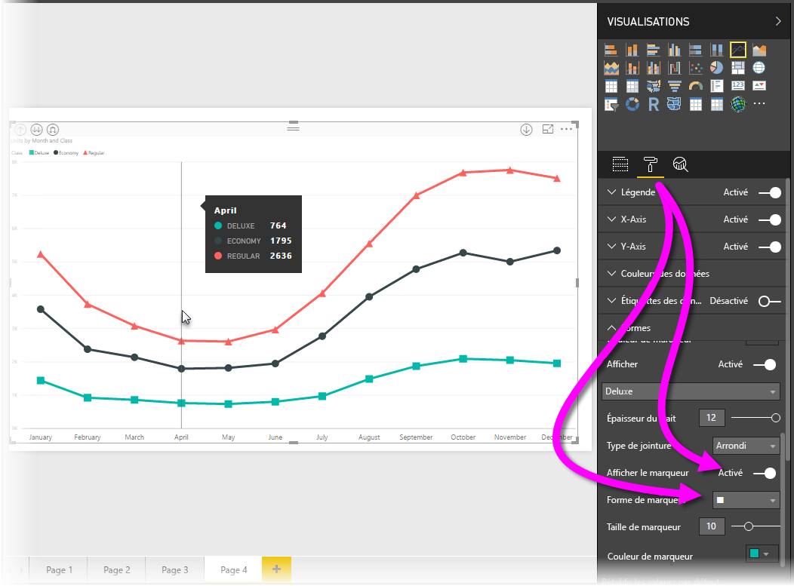
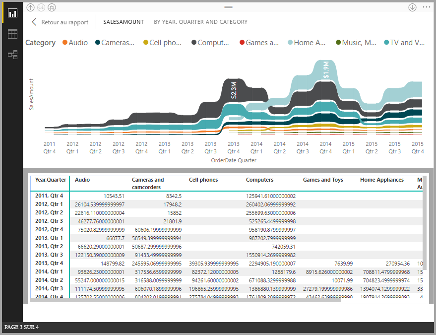
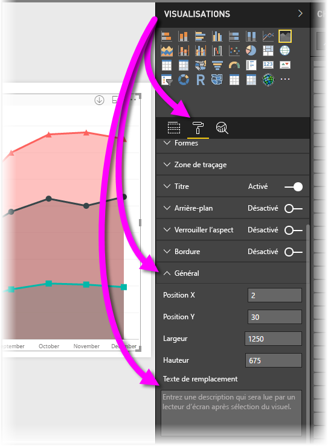

# Accessibilité dans les rapports Power BI Desktop
**Power BI Desktop** intègre des fonctionnalités qui permettent aux personnes présentant un handicap de plus facilement lire et utiliser les rapports **Power BI Desktop**, notamment la possibilité de lire un rapport à l’aide du clavier ou d’un lecteur d’écran et de mettre en évidence divers objets de la page à l’aide de la touche de tabulation, et l’utilisation judicieuse des marqueurs dans les visualisations.

> [!NOTE]
> Ces fonctionnalités d’accessibilité sont disponibles dans la version de juin 2017 de **Power BI Desktop** et dans les versions ultérieures. Des fonctionnalités d’accessibilité supplémentaires sont également prévues pour les versions futures.
> 
> 

## Lire un rapport Power BI Desktop à l’aide d’un clavier ou d’un lecteur d’écran
Depuis la version de septembre 2017 de **Power BI Desktop**, vous pouvez appuyer sur la touche **?** pour afficher une fenêtre décrivant les raccourcis clavier d’accessibilité disponibles dans **Power BI Desktop**.

Grâce aux améliorations en matière d’accessibilité, vous pouvez lire un rapport **Power BI Desktop** à l’aide d’un clavier ou d’un lecteur d’écran en procédant comme suit :

Pour faire passer la mise en évidence d’un onglet de page de rapport à un autre ou d’un objet à un autre d’une page de rapport donnée, utilisez la combinaison de touche **Ctrl+F6**.

* Lorsque la mise en évidence est sur les *onglets de page du rapport*, utilisez les touches *Tab* ou *flèche* pour faire passer la mise en évidence d’une page du rapport à la suivante. Le titre de la page de rapport est lu par le lecteur d’écran, qui indique également si cette page est actuellement sélectionnée. Pour charger la page de rapport actuellement mise en évidence, utilisez la touche *Entrée* ou *Espace*.
* Lorsque la mise en évidence est sur une *page de rapport* chargée, utilisez la touche *Tab* pour la faire passer d’un objet à un autre de la page, notamment les zones de texte, les images, les formes et les graphiques. Le lecteur d’écran lit le type d’objet et la description de l’objet fournie par l’auteur. 

Vous pouvez appuyer sur **Alt+Maj+F10** pour positionner le focus sur un menu de visuel.

Vous pouvez appuyer sur **Alt+Maj+F11** pour présenter une version accessible de la fenêtre *Voir les données*.

Ces ajouts à l’accessibilité ont été créés pour permettre aux utilisateurs d’exploiter pleinement les rapports **Power BI Desktop** à l’aide d’un lecteur d’écran et d’une navigation au clavier.

## Conseils pour la création de rapports accessibles
Les conseils suivants peuvent vous aider à créer des rapports **Power BI Desktop** plus accessibles.

* Pour les visuels **Ligne**, **Zone** et **Zone de liste modifiable** (ainsi que pour les visuels **Nuage de points** et **Bulle**), activez les marqueurs et utilisez une *forme de marqueur* différente pour chaque ligne.
  
  * Pour activer les *marqueurs*, sélectionnez la section **Format** du volet **Visualisations**, développez la section **Formes**, puis faites défiler vers le bas jusqu’à la bascule **Marqueurs** et réglez celle-ci sur *Activé*.
  * Ensuite, sélectionnez le nom de chaque ligne (ou aire, si vous utilisez un graphique en **aires**) dans la zone de liste déroulante de la section **Formes**. Sous la liste déroulante, vous pouvez alors ajuster de nombreux aspects du marqueur utilisé pour la ligne sélectionnée, notamment sa forme, sa couleur et sa taille.
  
  
  
  * L’utilisation d’une *forme de marqueur* différente pour chaque ligne permet aux lecteurs du rapport de plus facilement différencier les lignes (ou aires) les unes des autres.
* En complément de la puce précédente, ne vous fiez pas aux couleurs pour transmettre des informations. L’utilisation de formes sur des lignes (marqueurs, tels que décrits dans les puces précédentes) est utile.
* Sélectionnez un *thème* à contraste élevé et adapté pour les personnes daltoniennes dans la galerie de thèmes, puis importez-le à l’aide de la fonctionnalité en préversion [**Thème**](desktop-report-themes.md).
* Pour chaque objet d’un rapport, fournissez un *texte de remplacement*. Cela vous permet de garantir que les lecteurs de votre rapport comprennent ce que vous essayez de communiquer avec un visuel, même s’ils ne peuvent pas voir le visuel, l’image, la forme ou la zone de texte. Pour fournir un *Texte de remplacement* pour un objet d’un rapport **Power BI Desktop**, sélectionnez l’objet (par exemple un visuel, une forme, etc.) puis, dans le volet **Visualisations**, sélectionnez la section **Format**, développez **Général**, puis faites défiler vers le bas et renseignez la zone de texte **Texte de remplacement**.
  
  
* Veillez à ce qu’il y ait suffisamment de contraste entre le texte et les couleurs d’arrière-plan de vos rapports.
* Utilisez des tailles et polices de texte facilement lisibles. Les textes de petite taille ou les polices difficiles à lire ont un impact négatif sur l’accessibilité.
* Incluez un titre, des étiquettes d’axe et des étiquettes de données dans tous les visuels.

## Considérations et limitations
Il existe quelques limitations et problèmes connus concernant les fonctionnalités d’accessibilité, décrits dans la liste suivante :

* JAWS est pris en charge dans les rapports qui sont affichés dans le **service Power BI**, y compris les rapports incorporés. JAWS est également pris en charge dans **Power BI Desktop**. Toutefois, vous devez ouvrir le lecteur d’écran avant d’ouvrir des fichiers **Power BI Desktop** pour que la lecture de l’écran fonctionne correctement.

## Étapes suivantes
* [Utiliser des thèmes de rapport dans Power BI Desktop (préversion)](desktop-report-themes.md)

