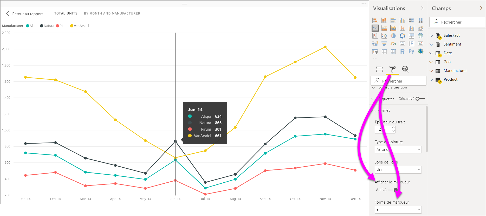
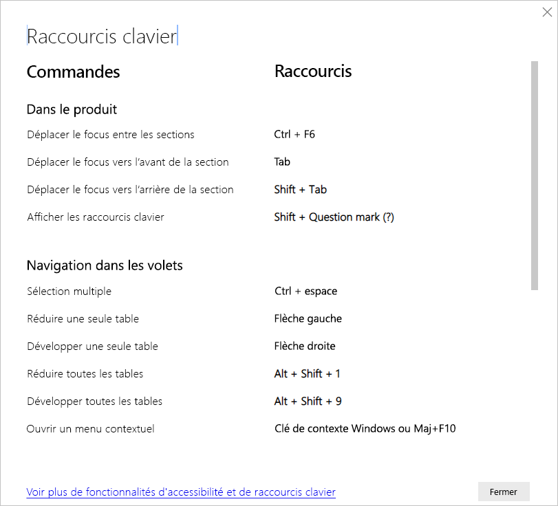
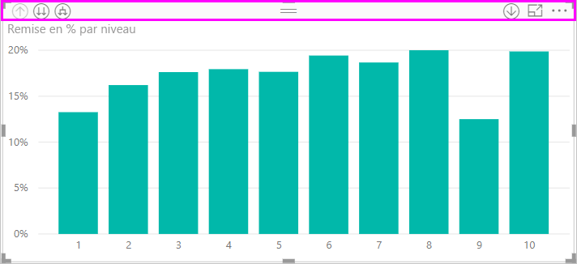
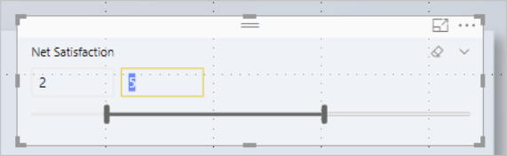
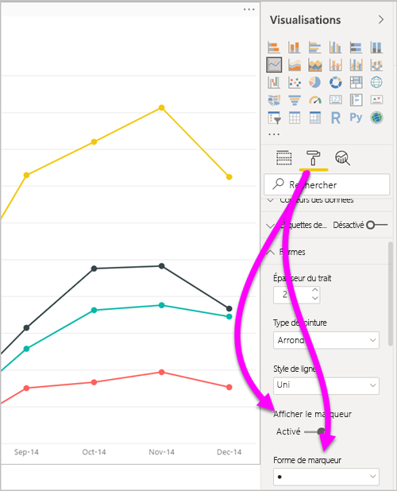
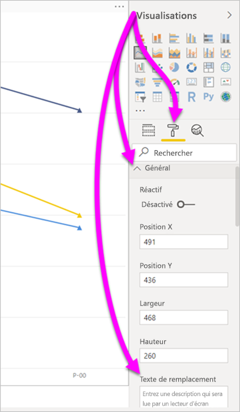
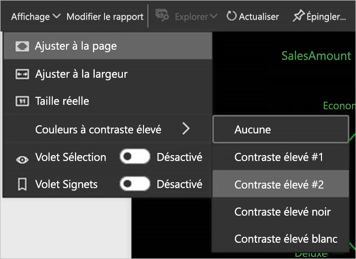

# Accessibilité dans les rapports Power BI Desktop
Power BI intègre des fonctionnalités qui permettent aux personnes présentant un handicap de lire et d’utiliser les rapports Power BI plus facilement, notamment la possibilité de lire un rapport à l’aide du clavier ou d’un lecteur d’écran et de mettre en évidence divers objets de la page à l’aide de la touche de tabulation, et l’utilisation judicieuse des marqueurs dans les visualisations.

## Lire un rapport Power BI Desktop à l’aide d’un clavier ou d’un lecteur d’écran
Depuis la version de septembre 2017 de **Power BI Desktop**, vous pouvez appuyer sur **Maj+?** pour afficher une fenêtre décrivant les raccourcis clavier d’accessibilité disponibles dans **Power BI Desktop**.

Grâce aux améliorations de l’accessibilité, vous pouvez lire un rapport Power BI en vous aidant d’un clavier ou d’un lecteur d’écran avec les techniques suivantes :

> [!NOTE]
> Lorsque vous voyez un rapport, vous devez généralement avoir le mode d’analyse désactivé.

Pour faire passer le focus d’un onglet de page de rapport à un autre ou d’un objet à un autre d’une page de rapport donnée, utilisez **Ctrl+F6**.

* Lorsque le focus est sur les onglets de page du rapport, utilisez les touches **Tab** ou **flèche** pour le faire passer d’une page du rapport à la suivante. Le lecteur d’écran lit le titre de la page de rapport, et indique si cette page est actuellement sélectionnée. Pour charger la page de rapport actuellement mise en évidence, utilisez la touche **Entrée** ou la barre d’espace.
* Lorsque le focus est sur une page de rapport chargée, utilisez la touche **Tab** pour le faire passer d’un objet à un autre de la page, notamment les zones de texte, les images, les formes et les graphiques. Le lecteur d’écran lit le type d’objet et le titre de l’objet (le cas échéant). Le lecteur d’écran lit également une description de cet objet si elle est fournie par l’auteur du rapport. 

Quand vous naviguez entre les visuels, vous pouvez appuyer sur **Alt+Maj+F10** pour déplacer le focus sur l’en-tête du visuel. Celui-ci contient différentes options, notamment le tri, l’exportation de données dans le graphique et le mode Focus. 

Vous pouvez appuyer sur **Alt+Maj+F11** pour présenter une version accessible de la fenêtre **Afficher les données**. Cette fenêtre vous permet d’explorer dans une table HTML les données utilisées dans le visuel, en utilisant les mêmes raccourcis clavier que ceux que vous utilisez normalement avec votre lecteur d’écran. 

> [!NOTE]
> La fonctionnalité **Afficher les données** n’est accessible à un lecteur d’écran qu’avec ce raccourci clavier. Si vous ouvrez **Afficher les données** par le biais de l’option disponible dans l’en-tête du visuel, elle ne sera pas accessible à un lecteur d’écran. Lorsque vous utilisez **Afficher les données**, activez le mode d’analyse pour tirer parti de toutes les touches d’accès rapide que fournit votre lecteur d’écran.

À partir de la version de juillet 2018 de **Power BI Desktop**, les segments sont également dotés d’une fonctionnalité d’accessibilité intégrée. Lorsque vous sélectionnez un segment, pour régler sa valeur, utilisez **Ctrl+flèche droite** (touche Contrôle plus touche Flèche droite) pour vous déplacer dans les différents contrôles du segment. Par exemple, lorsque vous appuyez d’abord sur **Ctrl+flèche droite**, le focus est mis sur la gomme. Le fait d’appuyer sur la barre d’espace revient à cliquer sur le bouton Gomme, ce qui efface toutes les valeurs sur le segment. 

Vous pouvez parcourir les contrôles dans un segment en appuyant sur la touche **Tab**. En appuyant sur la touche **Tab** lorsque vous êtes sur la gomme, vous accédez au bouton de liste déroulante. Un autre actionnement de la touche **Tab** vous amène à la première valeur de segment (s’il existe plusieurs valeurs pour le segment, comme une plage). 

Ces ajouts à l’accessibilité permettent aux utilisateurs de tirer pleinement parti des rapports Power BI à l’aide d’un lecteur d’écran et d’une navigation au clavier.

## Conseils pour la création de rapports accessibles
Les conseils suivants peuvent vous aider à créer des rapports **Power BI Desktop** plus accessibles.

### Conseils d’ordre général sur les rapports accessibles

* Pour les visuels **Ligne**, **Zone** et **Zone de liste modifiable**, ainsi que pour les visuels **Nuage de points** et **Bulle**, activez le bouton bascule **Afficher les marqueurs** et utilisez une **forme de marqueur** différente pour chaque ligne.
  
  * Pour activer le bouton bascule **Afficher les marqueurs**, sélectionnez la section **Format** dans le volet **Visualisations**, puis développez la section **Formes**. Faites défiler vers le bas pour trouver le bouton bascule **Afficher les marqueurs** et **activez-le**.
  * Pour personnaliser des lignes individuelles, recherchez le bouton bascule **Personnaliser la série** et **activez-le**. Ensuite, sélectionnez le nom de chaque ligne (ou aire, si vous utilisez un graphique en **aires**) dans la zone de liste déroulante de la section **Formes**. Sous la liste déroulante, vous pouvez alors ajuster de nombreux aspects du marqueur utilisé pour la ligne sélectionnée, notamment sa forme, sa couleur et sa taille.
  
    
  
  * L’utilisation d’une **forme de marqueur** différente pour chaque ligne permet aux lecteurs du rapport de plus facilement différencier les lignes (ou aires) les unes des autres.
* En complément de la puce précédente, ne vous fiez pas aux couleurs pour transmettre des informations. Lors de l’utilisation de formes sur les graphiques en courbes ou à nuages de points, ne vous appuyez pas sur la mise en forme conditionnelle pour fournir des insights dans des tables et des matrices. 
* Choisissez un ordre de tri intentionnel pour chaque visuel figurant sur votre rapport. Quand les utilisateurs de lecteur d’écran parcourent les données affichées dans le graphique, le lecteur d’écran utilise le même ordre de tri que le visuel.
* Sélectionnez un thème à contraste élevé et adapté pour les personnes daltoniennes dans la galerie de thèmes. Importez-le à l’aide de la [fonctionnalité d’évaluation **Thème**](desktop-report-themes.md).
* Pour chaque objet d’un rapport, fournissez un texte de remplacement. Cela vous permet de garantir que les lecteurs de votre rapport comprennent ce que vous essayez de communiquer avec un visuel. Cela peut même être utile s’ils ne peuvent pas voir le visuel, l’image, la forme ou la zone de texte. Pour fournir un texte de remplacement pour un objet d’un rapport **Power BI Desktop**, sélectionnez l’objet (par exemple un visuel, une forme, etc.) puis, dans le volet **Visualisations**, sélectionnez la section **Format**. Développez ensuite **Général**, faites défiler jusqu’en bas et renseignez la zone de texte **Texte de remplacement**.
  
  
* Veillez à ce qu’il y ait suffisamment de contraste entre le texte et les couleurs d’arrière-plan de vos rapports. Il existe plusieurs outils, comme [Color Contrast Analyser](https://developer.paciellogroup.com/resources/contrastanalyser/), que vous pouvez utiliser pour vérifier les couleurs de votre rapport. 
* Utilisez des tailles et polices de texte facilement lisibles. Les textes de petite taille ou les polices difficiles à lire ont un impact négatif sur l’accessibilité.
* Incluez un titre, des étiquettes d’axe et des étiquettes de données dans tous les visuels.
* Utilisez des titres significatifs pour toutes les pages du rapport.
* Évitez, si possible, les formes et les images décoratives dans votre rapport, car elles sont incluses dans l’ordre de tabulation du rapport. Si vous avez besoin d’inclure des objets décoratifs dans votre rapport, mettez à jour le texte de légende de l’objet pour informer les utilisateurs du lecteur d’écran qu’il est décoratif.

### Organisation des éléments dans des compartiments Champ
À partir de la version d’octobre 2018 de **Power BI Desktop**, vous pouvez accéder au puits **Champs** avec un clavier et il interagit avec les lecteurs d’écran. 

Pour améliorer le processus de création de rapports avec les lecteurs d’écran, un menu contextuel est disponible. Le menu permet de déplacer des champs dans le puits vers le haut ou vers le bas dans la liste **Champs**. Il permet également de déplacer le champ vers d’autres puits, comme **Légende** ou **Valeur**, entre autres.

## Prise en charge du contraste élevé dans les rapports

Lorsque vous utilisez les modes de contraste élevé dans Windows, ces paramètres et la palette que vous sélectionnez sont également appliqués aux rapports dans **Power BI Desktop**. 

**Power BI Desktop** détecte automatiquement le thème à contraste élevé que Windows utilise et applique ces paramètres à vos rapports. Ces couleurs à contraste élevé suivent le rapport quand celui-ci est publié sur le service Power BI, ou ailleurs.

Le service Power BI essaie aussi de détecter les paramètres de contraste élevé sélectionnés pour Windows. L’efficacité et la précision de cette détection dépendent du navigateur présentant le service Power BI. Si vous souhaitez définir le thème manuellement dans le service Power BI, vous pouvez sélectionner **Affichage** > **Couleurs à contraste élevé** et choisir le thème que vous souhaitez appliquer au rapport.

## Considérations et limitations
Il existe quelques limitations et problèmes connus concernant les fonctionnalités d’accessibilité. Les descriptions de ces problèmes et limitations figurent dans la liste suivante :

* Pour une expérience optimale quand vous utilisez des lecteurs d’écran avec **Power BI Desktop**, ouvrez le lecteur d’écran de votre choix avant d’ouvrir des fichiers dans **Power BI Desktop**.
* Si vous utilisez le Narrateur, il existe certaines limitations concernant la navigation dans la fonctionnalité **Afficher les données** sous la forme d’une table HTML.

## Raccourcis clavier
Les raccourcis clavier sont utiles pour vous déplacer dans les rapports Power BI à l’aide d’un clavier. Les tableaux suivants décrivent les raccourcis disponibles dans un rapport Power BI. Outre l’utilisation de ces raccourcis clavier dans **Power BI Desktop**, ces raccourcis fonctionnent aussi dans les expériences suivantes :

* Boîte de dialogue **Explorateur Q&R**
* Boîte de dialogue **Bien démarrer**
* Menu **Fichier** et boîte de dialogue **À propos de**
* Barre d’**avertissement**
* Boîte de dialogue **Restauration du fichier**
* Boîte de dialogue **Smileys mécontents**

Dans nos efforts constants pour améliorer l’accessibilité, les expériences mentionnées ci-dessus prennent également en charge les lecteurs d’écran et les paramètres de contraste élevé.

### Raccourcis fréquemment utilisés
| Pour effectuer cette action           | Appuyer sur                |
| :------------------- | :------------------- |
| Déplacer le focus entre les sections  | **Ctrl+F6** |
| Déplacer le focus vers l’avant de la section | **Tab**         |
| Déplacer le focus vers l’arrière de la section | **Maj+Tab** |
| Sélectionner ou effacer la sélection d’un objet | **Entrée** ou **barre d’espace** |
| Sélection de plusieurs objets | **Ctrl+barre d’espace** |

### Sur le visuel
| Pour effectuer cette action           | Appuyer sur                |
| :------------------- | :------------------- |
| Déplacer le focus sur le menu du visuel | **Alt+Maj+F10** |
| Afficher les données | **Alt+Maj+F11**  |
| Entrer un visuel | **Ctrl+flèche droite** |
| Entrer un calque | **Entrée** |
| Quitter un calque ou un visuel | **Échap** |
| Sélectionner ou effacer la sélection d’un point de données | **Entrée** ou **barre d’espace** |
| Sélection multiple | **Ctrl+Entrée** ou **Ctrl+barre d’espace** |
| Cliquer avec le bouton droit | <ul><li>Clavier Windows : **Clé de contexte Windows+F10**. La touche de contexte Windows se trouve entre la touche Alt de gauche et la touche Flèche Gauche</li><li>Autre clavier : **Maj+F10**</li></ul> |
| Effacer la sélection | **Ctrl+Maj+C** |

### Navigation dans des tables et des matrices
| Pour effectuer cette action          | Appuyer sur                |
| :------------------- | :------------------- |
| Déplacer le focus vers le haut/bas d’une cellule (dans toutes les cellules de toutes les zones)  | **Flèche vers le haut** / **Flèche vers le bas** |
| Déplacer le focus vers la gauche/droite d’une cellule (dans toutes les cellules de toutes les zones)  | **Flèche gauche** / **Flèche droite** |

### Dans les volets
| Pour effectuer cette action           | Appuyer sur                |
| :------------------- | :------------------- |
| Sélection multiple | **Ctrl+barre d’espace** |
| Réduire une seule table | **Flèche gauche** |
| Développer une seule table | **Flèche droite** |
| Réduire toutes les tables | **Alt+Maj+1** |
| Développer toutes les tables | **Alt+Maj+9** |
| Ouvrir un menu contextuel | <ul><li>Clavier Windows : **Clé de contexte Windows+F10**.  La touche de contexte Windows se trouve entre la touche Alt de gauche et la touche Flèche Gauche</li><li>Autre clavier : **Maj+F10**</li></ul> |

### Segment
| Pour effectuer cette action         | Appuyer sur                |
| :------------------- | :------------------- |
| Interagir avec un segment | **Ctrl+flèche droite** |

### Volet Sélection
| Pour effectuer cette action           | Appuyer sur                |
| :------------------- | :------------------- |
| Activer le volet Sélection | **F6** |
| Déplacer un objet vers le haut dans la superposition | **Ctrl+Maj+F** |
| Déplacer un objet vers le bas dans la superposition | **Ctrl+Maj+B** |
| Masquer/afficher un objet | **Ctrl+Maj+S** |

### Éditeur DAX
| Pour effectuer cette action          | Appuyer sur                |
| :------------------- | :------------------- |
| Déplacer une ligne vers le haut/le bas | **Alt+flèche vers le haut** / **Flèche vers le bas** |
| Copier une ligne en haut / bas | **Maj+Alt+flèche vers le haut** / **Flèche vers le bas** |
| Insérer la ligne ci-dessous | **Ctrl+Entrée** |
| Insérer la ligne ci-dessus | **Ctrl+Maj+Entrée** |
| Sauter au crochet correspondant | **Ctrl+Maj+**  \ |
| Mettre en retrait la ligne/Prolonger la ligne dans la marge | **Ctrl+]**  /  **[** |
| Insérer le curseur | **Alt+Clic** |
| Sélectionner la ligne actuelle | **Ctrl+I** |
| Sélectionner toutes les occurrences de la sélection actuelle | **Ctrl+Maj+L** |
| Sélectionner toutes les occurrences du mot actuel | **Ctrl+F2** |

### Entrer des données
| Pour effectuer cette action           | Appuyer sur                |
| :------------------- | :------------------- |
| Quitter la grille modifiable | **Ctrl+Tab** |

## Étapes suivantes
* [Utiliser des thèmes de rapport dans Power BI Desktop (préversion)](desktop-report-themes.md)

