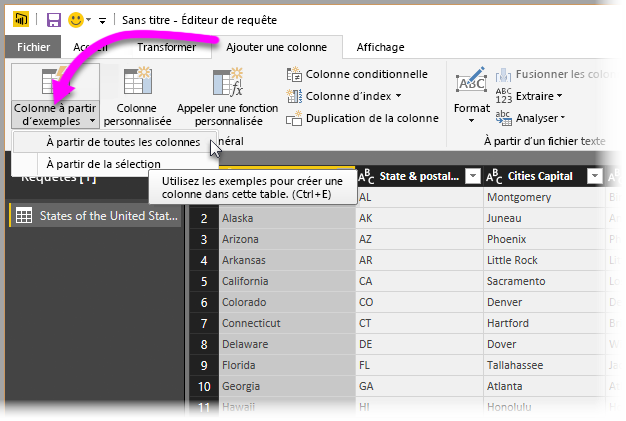
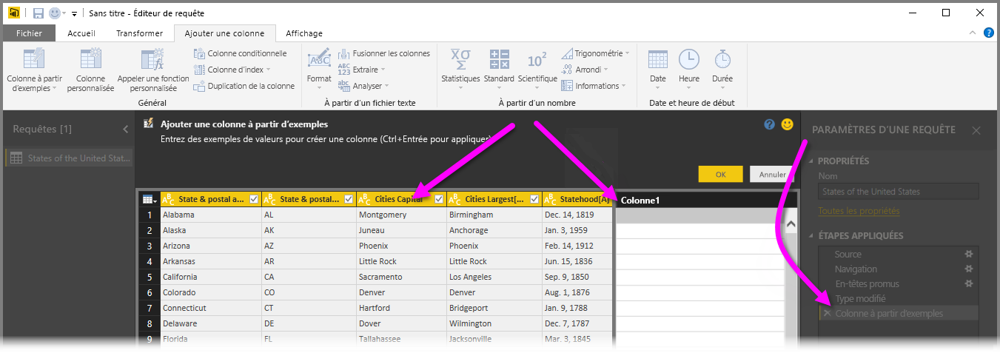
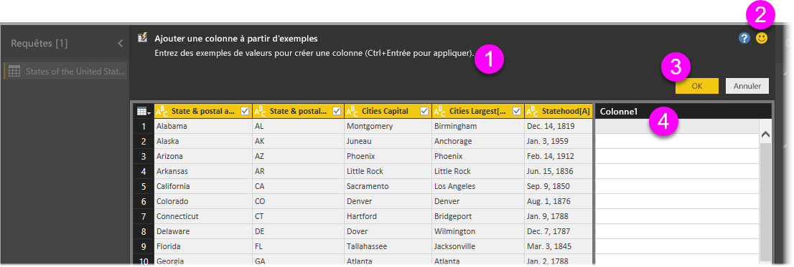
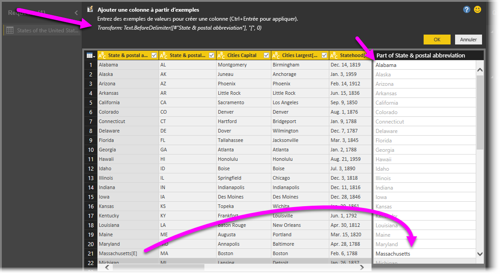

# Ajouter une colonne à partir d’un exemple dans Power BI Desktop
Depuis la publication de **Power BI Desktop** d’avril 2017, vous pouvez ajouter des colonnes de données à votre modèle à l’aide de l’**Éditeur de requête** en fournissant un ou plusieurs exemples de valeurs pour votre nouvelle colonne. Vous pouvez créer un exemple de colonne à partir d’une sélection active ou en fournissant une entrée basée sur la totalité ou une sélection des colonnes d’un tableau donné.

Cette approche vous aide à créer rapidement et aisément des colonnes, et s’avère particulièrement utile dans les situations suivantes :

* Vous connaissez le résultat de données que vous souhaitez voir apparaître dans la nouvelle colonne, mais n’êtes pas certain de la transformation (ou de la collection de transformations) permettant de l’obtenir.
* Vous connaissez déjà les transformations nécessaires, mais ne savez pas où cliquer ou les sélections à effectuer dans l’interface utilisateur pour que les transformations opèrent.
* Vous savez tout des transformations à effectuer à l’aide d’une expression *Colonne personnalisée* dans **M**, mais une ou plusieurs de ces expressions sur lesquelles vous pourriez cliquer ou que vous pourriez ajouter ne sont pas disponibles dans l’interface utilisateur.

L’utilisation de la fonctionnalité **Ajouter une colonne à partir d’un exemple** est simple et directe. Les sections suivantes montrent à quel point cela est facile.

## Utiliser l’Éditeur de requête pour ajouter une colonne à partir d’exemples
Pour créer une colonne à partir d’un exemple, démarrez l’**Éditeur de requête**. Pour ce faire, dans le ruban **Accueil** de **Power BI Desktop**, sélectionnez **Modifier les requêtes**.

Dans le cadre de cet article, nous utilisons des données de l’article de Wikipedia répertoriant les États et territoires des États-Unis (il s’agit d’un lien sur lequel vous pouvez cliquer afin d’obtenir les données nécessaires pour suivre la procédure) :

* [**List of states and territories of the United States**](https://wikipedia.org/wiki/List_of_states_and_territories_of_the_United_States)

Une fois l’**Éditeur de requête** lancé et certaines données chargées, vous pouvez commencer à ajouter une colonne à partir d’exemples. Pour ajouter une colonne, dans l’**Éditeur de requête**, sélectionnez l’onglet **Ajouter une colonne** dans le ruban, puis choisissez **Colonne à partir d’exemples**. Si vous choisissez la liste déroulante, vous pouvez sélectionner **À partir de toutes les colonnes** (ce qui est l’option par défaut si vous choisissez le bouton au lieu de la liste déroulante) ou **À partir de la sélection**. Dans le cadre de cet article, nous allons sélectionner **À partir de toutes les colonnes**.

## Volet Ajouter une colonne à partir d’exemples
Lorsque vous opérez une sélection pour ajouter une colonne à partir d’exemples, un nouveau volet contenant les colonnes du tableau actif (il se peut que vous deviez faire défiler pour les voir toutes) s’affiche. La nouvelle colonne (**Colonne1**) s’affiche du côté droit. Il s’agit de la colonne que **Power BI Desktop** va créer à partir de vos exemples. Sous le nouvel en-tête **Colonne1** figurent des cellules vides dans lesquelles vous pouvez entrer les exemples que Power BI doit utiliser pour créer les règles et transformations correspondantes.

Notez également qu’il s’agit de l’une des **Étapes appliquées** dans le volet **Paramètres d’une requête**. Comme toujours, l’**Éditeur de requête** enregistre vos étapes de transformation, puis les applique à la requête dans le même ordre.

Ci-dessous figure le volet **Ajouter une colonne à partir d’exemples** qui comprend quatre zones principales :

1. La **Barre de commandes** qui contient une brève description de la fonctionnalité ou de la transformation.
2. L’option **Envoyer des commentaires** qui vous d’aider Power BI à améliorer cette fonctionnalité.
3. Les boutons **OK** et **Annuler** qui vous permettent respectivement de valider vos transformations pour ajouter la colonne ou d’annuler l’opération.
4. La zone de la nouvelle colonne dans laquelle vous pouvez entrer vos exemples de valeurs dans les lignes de votre choix (pour fournir l’exemple à Power BI), en rapport avec d’autres colonnes de cette ligne.

À mesure que vous tapez votre exemple dans la nouvelle colonne, Power BI affiche un aperçu de la façon dont la colonne en cours de création s’affichera, en fonction des transformations qu’il détecte. Par exemple, nous avons tapé *Alabama* dans la première ligne, ce qui correspond à la valeur *Alabama* dans la première colonne du tableau. Dès que nous appuyons sur *Entrée*, Power BI remplit la colonne sur la base de cette valeur.

Ensuite, quand nous sommes passés à la ligne contenant *Massachusetts [E]* et avons supprimé les caractères *[E]* (parce que nous ne les voulions pas), Power BI a détecté la modification et utilisé l’exemple pour créer une transformation. Vous pouvez voir l’explication de la transformation dans le volet central supérieur.

À mesure que vous continuez à fournir des exemples, l’**Éditeur de requête** complète les transformations. Lorsque vous êtes satisfait, vous pouvez sélectionner **OK** pour valider vos modifications.

## Voir la fonctionnalité Ajouter une colonne à partir d’exemples en action
Vous voulez voir la fonctionnalité opérer ? La vidéo suivante montre son exécution à l’aide de la source de données fournie précédemment dans cet exemple. Jetez-y un coup de œil et suivez la procédure de votre côté.

<iframe width="560" height="315" src="https://www.youtube.com/embed/-ykbVW9wQfw" frameborder="0" allowfullscreen></iframe>

## Considérations et limitations
De nombreuses transformations sont disponibles lorsque vous utilisez la fonctionnalité **Ajouter une colonne à partir d’exemples**, mais certaines d’entre elles ne sont pas incluses. La liste suivante répertorie toutes les transformations qui *sont* prises en charge.

* **Référence**
  
  * Référence à une colonne spécifique (incluant des transformations de suppression d’espaces, de nettoyage (depuis juin 2017) et de casse)
* **Transformations Text**
  
  * Combiner (prend en charge la combinaison de chaînes littérales et de valeurs de colonne entière)
  * Remplacer
  * Longueur
  * Extraire
    
    * Premiers caractères
    * Derniers caractères
    * Plage
    * Texte avant le délimiteur
    * Texte après le délimiteur
    * Texte entre les délimiteurs
  * Les **transformations Text** prises en charge suivantes sont disponibles depuis la publication de **Power BI Desktop** du mois de juin 2017  :
    
    * Longueur

> [!NOTE]
> Toutes les transformations *Text* prennent en compte le besoin potentiel de supprimer des espaces, de nettoyer (depuis juin 2017) ou d’appliquer une transformation de casse aux valeurs de la colonne.
> 
> 

* **Transformations Date**
  
  * Jour
  * Jour de la semaine
  * Nom du jour de la semaine
  * Jour de l’année
  * Mois
  * Nom du mois
  * Trimestre de l’année
  * Semaine du mois
  * Semaine de l’année
  * Année
* Les transformations **Date** supplémentaires prises en charge suivantes sont disponibles depuis la publication de **Power BI Desktop** du mois de juin 2017 :
  
  * Âge
  * Début de l’année
  * Fin de l’année
  * Début du mois
  * Fin du mois
  * Début du trimestre
  * Jours du mois
  * Fin du trimestre
  * Début de semaine
  * Fin de semaine
  * Jour du mois
  * Début de journée
  * Fin de journée
* **Transformations Time**
  
  * Heure
  * Minute
  * Seconde
* **Transformations de Date/Heure/Fuseau horaire** : les transformations prises en charge suivantes sont disponibles depuis la publication de **Power BI Desktop** du mois de juillet 2017 :
  
  * Vers Heure locale

> [!NOTE]
> Toutes les transformations *Date* et *Time* prennent en compte le besoin potentiel de convertir les valeurs de la colonne en *Date*, *Time* ou *DateTime*.
> 
> 

* **Transformations de nombre** : les transformations prises en charge suivantes sont disponibles depuis la publication de **Power BI Desktop** du mois de juillet 2017 :
  * Valeur absolue
  * Arccosinus
  * Arcsinus
  * Arctangente
  * Convertir en nombre
  * Cosinus
  * Cube
  * Diviser
  * Exposant
  * Factorielle
  * Diviser par entier
  * Est pair
  * Est impair
  * Ln
  * Logarithme de base 10
  * Modulo
  * Multiplier
  * Arrondi à l’entier inférieur
  * Arrondi à l’entier supérieur
  * Signe
  * Sin
  * Racine carrée
  * Carré
  * Soustraire
  * Somme
  * Tangente

