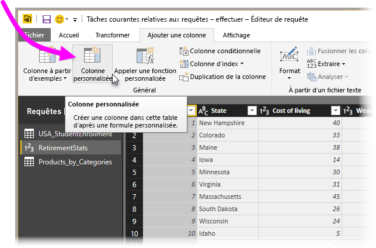
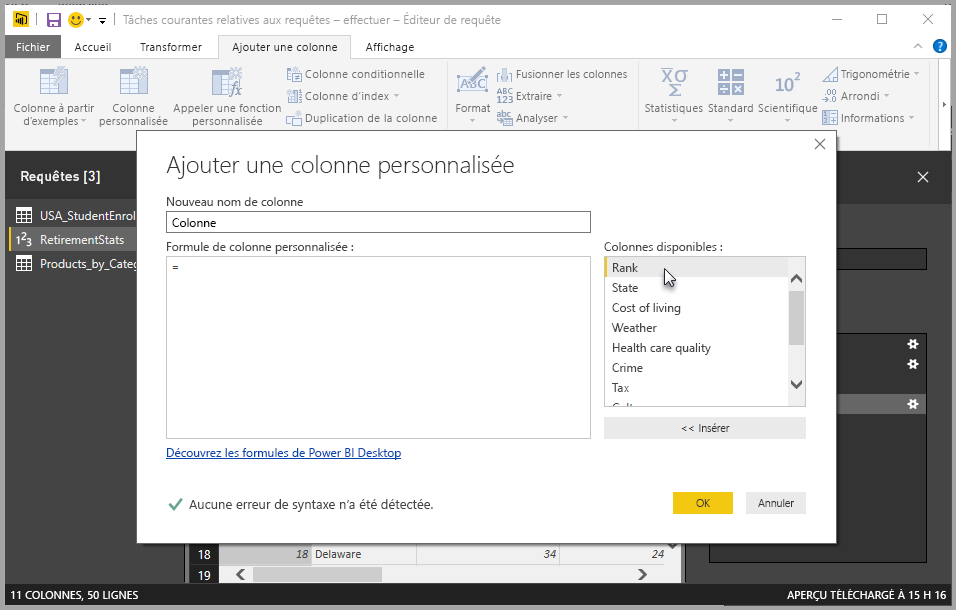
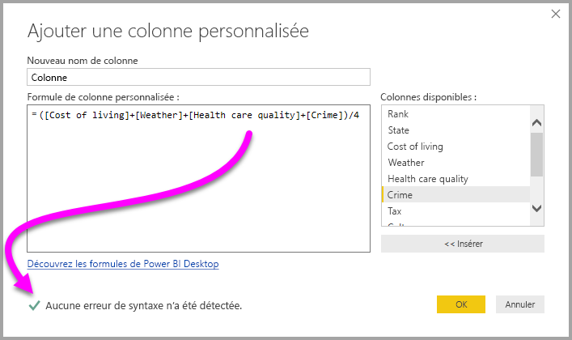
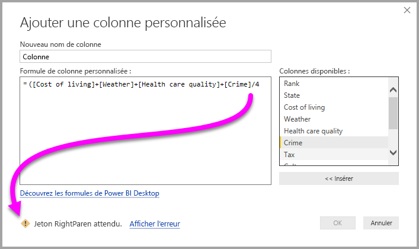

# Ajouter une colonne personnalisée dans Power BI Desktop
Vous pouvez facilement ajouter une nouvelle colonne personnalisée de données à votre modèle à l’aide de l’**éditeur de requête** dans **Power BI Desktop**. Vous pouvez créer et renommer votre colonne personnalisée à l’aide de boutons conviviaux pour créer des [formules M](https://msdn.microsoft.com/library/mt270235.aspx) qui définissent votre colonne personnalisée. Un [contenu de référence complet sur les fonctions](https://msdn.microsoft.com/library/mt779182.aspx) est disponible pour la formule M. 

La création d’une colonne personnalisée est une autre **étape appliquée** à la requête que vous créez dans l’**éditeur de requête**, ce qui signifie qu’elle peut être déplacée à un moment antérieur ou ultérieur ou modifiée à tout moment.

## Utiliser l’Éditeur de requête pour ajouter une nouvelle colonne personnalisée
Pour créer une colonne personnalisée, démarrez l’**Éditeur de requête**. Pour ce faire, dans le ruban **Accueil** de **Power BI Desktop**, sélectionnez **Modifier les requêtes**.

Une fois que vous avez lancé l’**éditeur de requête** et chargé quelques données, vous pouvez ajouter une colonne personnalisée en sélectionnant l’onglet **Ajouter une colonne** sur le ruban, puis en sélectionnant **Colonne personnalisée**.

La fenêtre **Ajouter une colonne personnalisée** s’affiche alors. Elle est décrite dans la section suivante.

## Fenêtre Ajouter une colonne personnalisée
Dans la fenêtre **Ajouter une colonne personnalisée**, consultez la liste des champs disponibles dans le volet de droite, le nom de votre colonne personnalisée en haut (vous pouvez la renommer en tapant simplement un nouveau nom dans cette zone de texte) et la formule [**M**](https://msdn.microsoft.com/library/mt779182.aspx) que vous créez (ou que vous écrivez) en fonction de l’insertion de champs à partir de la droite, de l’ajout d’opérateurs ou de la création de la formule sur laquelle votre nouvelle colonne personnalisée est définie. 

## Créer des formules pour votre colonne personnalisée
Vous pouvez sélectionner un champ à partir de la liste **Colonnes disponibles :** à droite, puis sélectionner **<< Insérer** pour les ajouter à la formule de colonne personnalisée. Vous pouvez également double-cliquer sur une colonne dans la liste pour l’ajouter.

Quand vous tapez la formule et que vous créez votre colonne, la partie inférieure de la fenêtre affiche un indicateur qui vous informe en temps réel (au fil de la frappe) si des erreurs de syntaxe sont détectées. Si tout est correct, une coche verte s’affiche.

Cependant, si votre syntaxe contient une erreur, une icône d’avertissement jaune s’affiche, ainsi que l’erreur détectée et un lien qui place le curseur (dans votre formule) là où l’erreur est détectée.

Lorsque vous sélectionnez **OK**, votre colonne personnalisée est ajoutée au modèle et l’étape **Personnalisée ajoutée** est ajoutée aux **Étapes appliquées** de votre requête.

Si vous double-cliquez sur l’étape **Personnalisée ajoutée** dans le volet **Étapes appliquées**, la fenêtre **Ajouter une colonne personnalisée** s’affiche à nouveau : la formule de colonne personnalisée que vous avez créée est déjà chargé et vous pouvez la modifier si nécessaire.

## Utilisation de l’éditeur avancé pour les colonnes personnalisées
Vous pouvez également créer une colonne personnalisée (et modifier toutes les étapes de votre requête) à l’aide de l’**éditeur avancé**. Dans l’**éditeur de requête**, sélectionnez l’onglet **Affichage**, puis **Éditeur avancé** pour afficher l’**éditeur avancé**.

L’**éditeur avancé** vous donne un contrôle total sur votre requête.

## Étapes suivantes
Il existe d’autres façons de créer une colonne personnalisée, par exemple la création d’une colonne basée sur des exemples que vous fournissez à l’**éditeur de requête**. Pour plus d’informations sur la création de colonnes personnalisées à partir d’exemples, consultez l’article suivant :

* [Ajouter une colonne à partir d’un exemple dans Power BI Desktop](desktop-add-column-from-example.md)
* [Introduction au langage de formule M](https://msdn.microsoft.com/library/mt270235.aspx)
* [Référence sur les fonctions M](https://msdn.microsoft.com/library/mt779182.aspx)  

