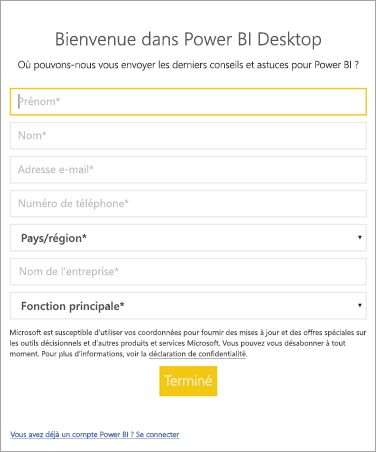

# <a name="how-administrators-can-manage-the-power-bi-desktop-sign-in-form"></a>Gestion du formulaire de connexion Power BI Desktop par les administrateurs
La première fois que Power BI Desktop est lancé, un formulaire de connexion s’affiche. Vous pouvez renseigner les informations demandées ou vous connecter à Power BI pour continuer. Les administrateurs gèrent ce formulaire avec une clé de Registre. 



Les administrateurs utilisent la clé de Registre suivante pour désactiver le formulaire de connexion. Ceci peut également être envoyé (push) à toute une organisation avec des stratégies globales.

```
Key: HKEY_LOCAL_MACHINE\SOFTWARE\Policies\Microsoft\Power BI Desktop
valueName: ShowLeadGenDialog
```

La valeur 0 désactive la boîte de dialogue.

D’autres questions ? [Essayez d’interroger la communauté Power BI](http://community.powerbi.com/)

