# Agrégations dans Power BI Desktop (préversion)

L’utilisation d’**agrégations** dans Power BI permet d’effectuer une analyse interactive de Big Data jusqu’ici impossible. Les **agrégations** peuvent réduire considérablement le coût de déverrouillage des jeux de données volumineux pour la prise de décision.

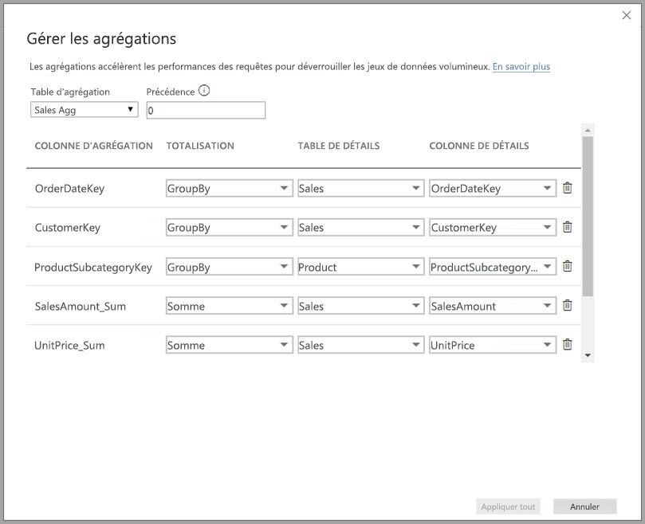

La liste suivante décrit les avantages offerts par l’utilisation des **agrégations** :

* **Performances des requêtes sur de grands jeux de données** : à mesure que les utilisateurs interagissent avec les visuels dans les rapports Power BI, les requêtes DAX sont soumises au jeu de données. Vous pouvez améliorer la rapidité des requêtes en mettant en cache les données au niveau agrégé, à l’aide d’une fraction des ressources requises au niveau du détail. Déverrouillez les Big Data d’une manière qui serait impossible autrement.
* **Optimisation de l’actualisation des données** : réduisez la taille des caches et la durée des actualisations en mettant en cache les données au niveau agrégé. Accélérez la mise à disposition des données aux utilisateurs.
* **Bénéficiez d’architectures équilibrées** : autorisez le cache en mémoire de Power BI à gérer l’agrégation des requêtes, ce qu’il fait efficacement. Limitez les requêtes envoyées à la source de données en mode DirectQuery, afin de rester dans les limites de concurrence. Les requêtes qui parviennent à passer sont le plus souvent des requêtes filtrées, au niveau transactionnel, normalement bien gérées par les systèmes de Big Data et les entrepôts de données.

### Stockage de niveau table
Le stockage de niveau table est normalement utilisé avec la fonctionnalité d’agrégations. Pour plus d’informations, consultez l’article [Mode de stockage dans Power BI Desktop (préversion)](desktop-storage-mode.md).

### Types de sources de données
Les agrégations sont utilisées avec des sources de données représentant des modèles dimensionnels, telles que des mini-Data Warehouses et des entrepôts de données, ainsi que des sources de Big Data basées sur Hadoop. Cet article décrit les principales différences de modélisation dans Power BI pour chaque type de source de données.

Toutes les sources (non-multidimensionnelles) DirectQuery et d’importation Power BI fonctionnent avec les agrégations.

## Activation de la fonctionnalité d’évaluation d’agrégations

La fonctionnalité d’**agrégations** est en préversion et doit être activée dans **Power BI Desktop**. Pour activer les **agrégations**, sélectionnez **Fichier > Options et paramètres > Options > Fonctionnalités en préversion**, puis cochez les cases **Modèles composites** et **Gérer les agrégations**. 

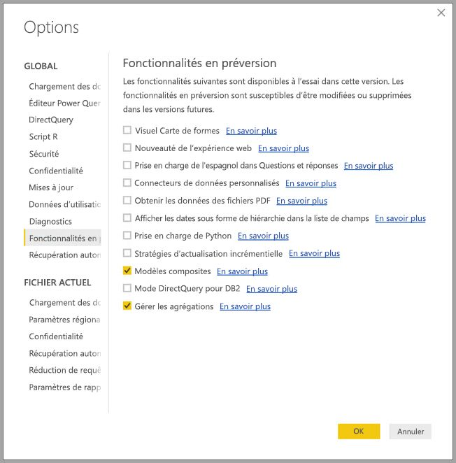

Vous devrez redémarrer **Power BI Desktop** pour activer la fonctionnalité.

## Agrégations basées sur des relations

Les **agrégations** basées sur des relations sont généralement utilisées avec les modèles dimensionnels. Les jeux de données Power BI qui proviennent d’entrepôts de données et de mini-Data Warehouses ressemblent à des schémas en étoile/flocons de neige avec des relations entre les tables de dimension et les tables de faits.

Considérez le modèle suivant, qui provient d’une seule source de données. Supposez que toutes les tables utilisent DirectQuery pour commencer. La table de faits **Sales** contient des milliards de lignes. La définition du mode de stockage de **Sales** sur **Importer** pour la mise en cache entraînerait une charge de mémoire et de gestion considérable.

À la place, nous créons la table **Sales Agg** en tant que table d’agrégation. Elle se trouve à un niveau de granularité plus élevé que **Sales**, et donc contiendra beaucoup moins de lignes. Le nombre de lignes doit être égal à la somme des **SalesAmount** regroupés par **CustomerKey**, **DateKey** et **ProductSubcategoryKey**. Au lieu d’avoir plusieurs milliards de lignes, nous n’en aurons peut-être que quelques millions, ce qui est beaucoup plus facile à gérer.

Supposez que les tables de dimension suivantes sont les plus couramment utilisées pour les requêtes à forte valeur métier. Il s’agit des tables qui peuvent filtrer **Sales Agg** à l’aide de relations *un-à-plusieurs* (ou *plusieurs-à-un*). Les autres types de relations tels que *plusieurs-à-plusieurs* ou *à sources multiples* ne sont pas pris en compte pour les agrégations.

* Geography
* Client
* Date
* Sous-catégorie de produit
* Catégorie de produit

L’image suivante illustre ce modèle.

> [!NOTE]
> La table **Sales Agg** étant simplement une autre table, elle offre la flexibilité de pouvoir être chargée de différentes manières. Par exemple, l’agrégation peut être effectuée dans la base de données source à l’aide de processus ETL/ELT, ou par l’[expression M](https://msdn.microsoft.com/query-bi/m/power-query-m-reference) pour la table. Elle peut utiliser le mode de stockage Importer avec ou sans [actualisation incrémentielle dans Power BI Premium](service-premium-incremental-refresh.md), ou peut utiliser DirectQuery et être optimisée pour les requêtes rapides à l’aide d’[index columnstore](https://docs.microsoft.com/sql/relational-databases/indexes/columnstore-indexes-overview). Cette flexibilité permet d’obtenir des architectures équilibrées qui répartissent la charge de requête afin d’éviter les goulots d’étranglement.

### Mode de stockage 
Poursuivons avec notre exemple. Nous affectons **Importer** comme mode de stockage de **Sales Agg** afin d’accélérer les requêtes.

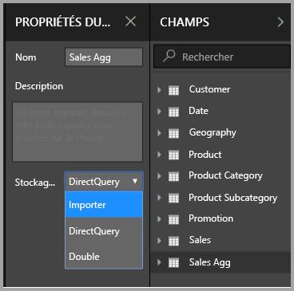

La boîte de dialogue suivante s’affiche et nous signale que les tables de dimension connexes seront définies sur le mode de stockage **Double**. 

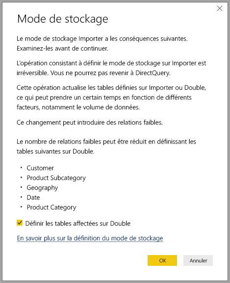

La définition du mode **Double** permet aux tables de dimension connexes d’agir en mode Importer ou DirectQuery, en fonction de la sous-requête.

* Les requêtes qui agrègent des métriques à partir de la table **Sales Agg**, qui utilise le mode Importer, et qui groupent par attribut à partir des tables Double associées, peuvent être retournées à partir du cache en mémoire.
* Les requêtes qui agrègent des métriques dans la table **Sales**, qui utilise le mode DirectQuery, et qui groupent par attribut à partir des tables Double associées, peuvent être retournées en mode DirectQuery. La logique de requête incluant l’opération « Grouper par » sera passée à la base de données source.

Pour plus d’informations sur le mode de stockage **Double**, consultez l’article [Mode de stockage](desktop-storage-mode.md).

> Remarque : La table **Sales Agg** est masquée. Les tables d’agrégation doivent être masquées aux yeux des consommateurs du jeu de données. Les consommateurs et les requêtes font référence à la table de détail, et non à la table d’agrégation. Ils n’ont même pas besoin de savoir que la table d’agrégation existe.

### Boîte de dialogue Gérer les agrégations
Maintenant, nous allons définir les agrégations. Sélectionnez le menu contextuel **Gérer les agrégations** pour la table **Sales Agg** en cliquant avec le bouton droit sur la table.

La boîte de dialogue **Gérer les agrégations** apparaît. Elle affiche une ligne pour chaque colonne de la table **Sales Agg**, où nous pouvons spécifier le comportement d’agrégation. Les requêtes soumises au jeu de données Power BI qui font référence à la table **Sales** sont redirigées en interne vers la table **Sales Agg**. Les consommateurs du jeu de données n’ont même pas besoin de savoir que la table **Sales Agg** existe.

Le tableau suivant présente les agrégations pour la table **Sales Agg**.

#### Fonction de totalisation

La liste déroulante Totalisation permet de sélectionner les valeurs suivantes.
* Nombre
* GroupBy
* Max
* Min
* Somme
* Compter les lignes de la table

#### Validations

Les validations notables suivantes sont appliquées par la boîte de dialogue :

* La colonne de détail sélectionnée doit avoir le même type de données que la colonne d’agrégation, sauf pour les fonctions de totalisation Nombre et Compter les lignes de la table. Les options Nombre et Compter les lignes de la table sont proposées uniquement pour les colonnes d’agrégation d’entiers et ne nécessitent pas de type de données correspondant.
* Les agrégations chaînées couvrant trois tables ou plus ne sont pas autorisées. Par exemple, vous ne pouvez pas configurer des agrégations sur **Table A** faisant référence à **Table B** qui a des agrégations faisant référence à **Table C**.
* Les agrégations en double, où deux entrées utilisent la même fonction de totalisation et font référence à la même table/colonne de détail, ne sont pas autorisées.

Durant cette préversion publique de la fonctionnalité d’**agrégations**, les validations suivantes sont également appliquées. Nous prévoyons de supprimer ces validations lors de la publication en disponibilité générale.

* Les agrégations ne peuvent pas être utilisées avec la sécurité au niveau des lignes (RLS). *Limitation de la préversion publique.*
* La table de détail doit utiliser DirectQuery, et non Importer. *Limitation de la préversion publique.*

La plupart des ces validations sont appliquées en désactivant les valeurs de liste déroulante et en affichant un texte explicatif dans l’info-bulle, comme illustré dans l’image suivante.

### Grouper par colonnes

Dans cet exemple, les trois entrées GroupBy sont facultatives ; elles n’affectent pas le comportement d’agrégation (sauf pour l’exemple de requête DISTINCTCOUNT, illustré dans l’image plus bas). Elles sont incluses principalement à des fins de lisibilité. Sans ces entrées GroupBy, les agrégations seront quand même atteintes en fonction des relations. Ce comportement est différent de l’utilisation des agrégations sans relations, qui est couvert par l’exemple de Big Data qui suit plus loin dans cet article.

### Détecter si les agrégations sont atteintes ou manquées par les requêtes

Pour plus d’informations sur la façon de détecter si les requêtes sont retournées à partir du cache en mémoire (moteur de stockage) ou de DirectQuery (envoyées à la source de données) à l’aide de SQL Profiler, consultez l’article [Mode de stockage](desktop-storage-mode.md). Vous pouvez également utiliser ce processus pour détecter si les agrégations sont atteintes.

De plus, l’événement étendu suivant est fourni dans SQL Profiler.

    Query Processing\Aggregate Table Rewrite Query

L’extrait de code JSON suivant montre un exemple de sortie de l’événement quand une agrégation est utilisée.

* **matchingResult** indique qu’une agrégation a été utilisée pour la sous-requête.
* **dataRequest** indique les colonnes Grouper par et les colonnes agrégées utilisées par la sous-requête.
* **mapping** indique les colonnes de la table d’agrégation avec lesquelles le mappage a été effectué.

### Exemples de requêtes
La requête suivante atteint l’agrégation, car les colonnes de la table *Date* sont au niveau de granularité qui peut atteindre l’agrégation. L’agrégation **Sum** pour **SalesAmount** sera utilisée.

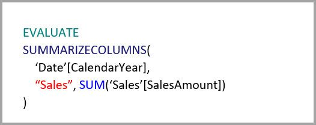

La requête suivante n’atteindra pas l’agrégation. Bien qu’elle demande la somme de **SalesAmount**, elle exécute une opération Grouper par sur une colonne de la table **Product**, qui ne se trouve pas au niveau de granularité pouvant atteindre l’agrégation. Si vous observez les relations dans le modèle, une sous-catégorie de produits peut avoir plusieurs lignes **Product** ; la requête ne serait pas en mesure de déterminer le produit à agréger. Dans ce cas, la requête rebascule vers DirectQuery et soumet une requête SQL à la source de données.

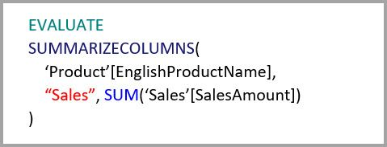

Les agrégations ne sont pas uniquement destinées aux calculs simples qui effectuent une simple addition. Les calculs complexes peuvent également en tirer parti. Conceptuellement, un calcul complexe est divisé en sous-requêtes pour chaque SUM, MIN, MAX et COUNT, et chaque sous-requête est évaluée afin de déterminer si l’agrégation peut être atteinte. Cette logique n’est pas valable dans tous les cas en raison de l’optimisation du plan de requête, mais en général elle doit s’appliquer. L’exemple suivant atteindra l’agrégation :

La fonction COUNTROWS peut tirer parti des agrégations. La requête suivante atteindra l’agrégation, car il y a une agrégation **Count** des lignes de la table définie pour la table **Sales**.

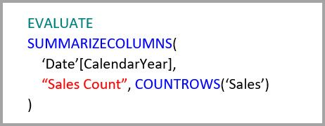

La fonction AVERAGE peut tirer parti des agrégations. La requête suivante atteindra l’agrégation, car en interne AVERAGE équivaut à une SUM divisée par un COUNT. Étant donné que la colonne **UnitPrice** a des agrégations définies pour SUM et COUNT, l’agrégation est atteinte.

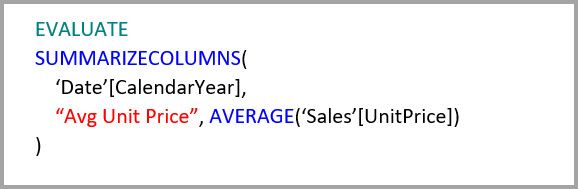

Dans certains cas, la fonction DISTINCTCOUNT peut tirer parti des agrégations. La requête suivante atteindra l’agrégation, car il existe une entrée GroupBy pour **CustomerKey**, qui préserve le caractère distinct de **CustomerKey** dans la table d’agrégation. Cette technique est toujours soumise au seuil de performances, où une quantité de valeurs distinctes comprise entre deux et cinq millions peut affecter les performances des requêtes. Toutefois, elle peut être utile dans les scénarios où il existe des milliards de lignes dans la table de détail et de deux à cinq millions de valeurs distinctes dans la colonne. Dans ce cas, il peut être plus rapide de compter les valeurs distinctes que d’analyser la table contenant des milliards de lignes, même si elles sont mises en cache en mémoire.

## Agrégations basées sur des colonnes Grouper par 

Les modèles de Big Data basés sur Hadoop ont des caractéristiques différentes des modèles dimensionnels. Pour éviter les jointures entre les tables de grande taille, ils évitent souvent de reposer sur les relations. Au lieu de cela, les attributs de dimension sont souvent dénormalisés en tables de faits. Ces modèles de Big Data peuvent être déverrouillés pour effectuer une analyse interactive à l’aide d’**agrégations** basées sur des colonnes Grouper par.

Le tableau suivant contient la colonne numérique **Movement** à agréger. Toutes les autres colonnes sont des attributs par lesquels effectuer un regroupement. Cette table contient des données IoT et une quantité immense de lignes. Le mode de stockage est DirectQuery. Les requêtes sur la source de données agrégées sur l’ensemble du jeu de données sont lentes en raison du volume élevé.

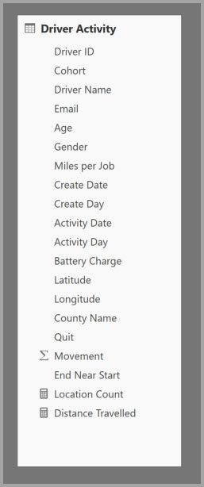

Pour permettre l’analyse interactive sur ce jeu de données, nous ajoutons une table d’agrégation qui regroupe par la plupart des attributs, mais exclut les attributs à cardinalité élevée comme la longitude et la latitude. Cela réduit considérablement le nombre de lignes, qui est suffisamment petit pour tenir confortablement dans un cache en mémoire. Le mode de stockage de **Driver Activity Agg** est Importer.

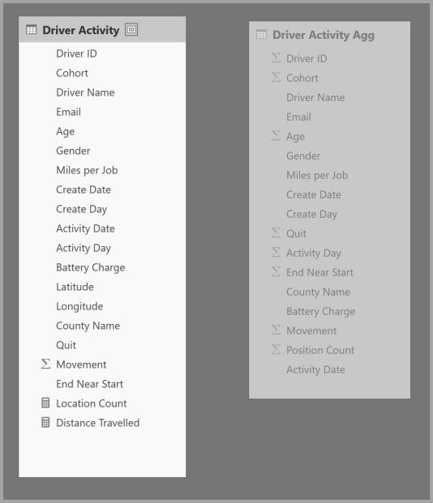

Ensuite, nous définissons les mappages d’agrégations dans la boîte de dialogue **Gérer les agrégations**. Elle affiche une ligne pour chaque colonne de la table **Driver Activity Agg**, où nous pouvons spécifier le comportement d’agrégation.

Le tableau suivant présente les agrégations pour la table **Sales Agg**.

### Grouper par colonnes

Dans cet exemple, les entrées **GroupBy** **ne sont pas facultatives** ; sans elles, les agrégations ne seraient pas atteintes. Il s’agit d’un comportement différent de l’utilisation des agrégations basées sur des relations, qui est traitée par l’exemple de modèle dimensionnel fourni plus haut dans cet article.

### Exemples de requêtes

La requête suivante atteindra l’agrégation, car la colonne **Activity Date** est couverte par la table d’agrégation. L’agrégation Compter les lignes de la table est utilisée par la fonction COUNTROWS.

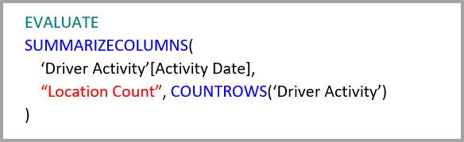

Il est préférable d’utiliser des agrégations Compter les lignes de la table, en particulier pour les modèles qui contiennent des attributs de filtres dans les tables de faits. Power BI peut soumettre des requêtes au jeu de données à l’aide de COUNTROWS dans des cas où cela n’est pas demandé explicitement par l’utilisateur. Par exemple, la boîte de dialogue de filtres indique le nombre de lignes pour chaque valeur.

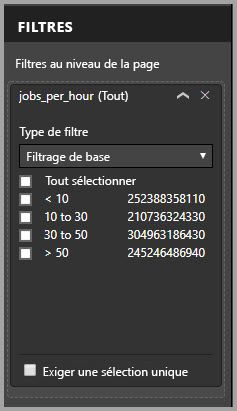

## Précédence d’agrégation

La précédence d’agrégation permet à plusieurs tables d’agrégation d’être prises en compte par une sous-requête unique.

Prenez l’exemple suivant. Il s’agit d’un [modèle composite](desktop-composite-models.md) contenant plusieurs sources DirectQuery.

* La table d’importation **Driver Activity Agg2** est à un niveau de granularité élevé, car les attributs Grouper par sont peu nombreux et ont une faible cardinalité. Le nombre de lignes pourrait n’être que de quelques milliers, et donc tenir facilement dans un cache en mémoire. Ces attributs étant utilisés par le tableau de bord d’un cadre supérieur, les requêtes qui y font référence doivent être le plus rapides possible.
* La table **Driver Activity Agg** est une table d’agrégation intermédiaire en mode DirectQuery. Elle contient plus d’un milliard de lignes et est optimisée à la source à l’aide d’index columnstore.
* La table **Driver Activity** est en mode DirectQuery et contient plus d’un milliard de lignes de données IoT provenant d’un système de Big Data. Elle satisfait les requêtes d’extraction pour afficher des relevés IoT individuels dans des contextes de filtrage contrôlés.

L’encombrement mémoire de ce modèle est relativement faible, mais il déverrouille un jeu de données volumineux. Il représente une architecture équilibrée, car il répartit la charge de requête parmi les composants de l’architecture et les utilise en fonction de leurs points forts.

La boîte de dialogue **Gérer les agrégations** pour **Driver Activity Agg2** indique que le champ *Précédence* est 10, ce qui est supérieur à celui de **Driver Activity Agg**. Cela signifie qu’elle sera prise en compte en premier par les requêtes utilisant des agrégations. Les sous-requêtes qui ne sont pas au niveau de granularité pouvant être satisfait par **Driver Activity Agg2** considéreront **Driver Activity Agg** à la place. Les requêtes de détail qui ne peuvent être satisfaites par aucune de ces tables d’agrégation seront dirigées vers **Driver Activity**.

La table spécifiée dans la colonne **Table de détails** est **Driver Activity**, et non **Driver Activity Agg**, car les agrégations chaînées ne sont pas autorisées (voir [ Validations](#validations) plus haut dans cet article).

Le tableau suivant présente les agrégations pour la table **Sales Agg**.

## Agrégations basées sur des colonnes Grouper par combinées à des relations

Vous pouvez même combiner les deux techniques pour les agrégations décrites plus haut dans cet article. Les **agrégations** basées sur les relations peuvent nécessiter le fractionnement en plusieurs tables des tables de dimension dénormalisées. Si cette opération est coûteuse ou difficile pour certaines tables de dimension, les attributs nécessaires peuvent être répliqués dans la table d’agrégation pour certaines dimensions et les relations utilisées pour d’autres.

Le modèle suivant réplique*Month*, *Quarter*, *Semester* et *Year* dans la table **Sales Agg**. Il n’existe aucune relation entre **Sales Agg** et la table **Date**. Il existe des relations avec **Customer** et **Product Subcategory**. Le mode de stockage de **Sales Agg** est Importer.

Le tableau suivant présente les entrées définies dans la boîte de dialogue **Gérer les agrégations** pour la table **Sales Agg**. Les entrées GroupBy où **Date** est la table de détail sont obligatoires pour atteindre les agrégations pour les requêtes qui regroupent par attribut Date. Comme dans l’exemple précédent, les entrées GroupBy pour CustomerKey et ProductSubcategoryKey n’affectent pas les accès aux agrégations en raison de la présence des relations (ici encore à l’exception de DISTINCTCOUNT).

> Remarque : Ce modèle exige que la table **Date** soit en mode DirectQuery pour renseigner la boîte de dialogue Gérer les agrégations, car il s’agit d’une table de détail. Il s’agit d’une limitation de la préversion que nous avons l’intention de supprimer pour la disponibilité générale.

### Exemples de requêtes

La requête suivante atteint l’agrégation car CalendarMonth est couvert par la table d’agrégation, et CategoryName est accessible par le biais de relations un-à-plusieurs. L’agrégation Sum pour **SalesAmount** est utilisée.

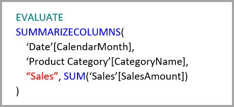

La requête suivante n’atteindra pas l’agrégation, car CalendarDay n’est pas couvert par la table d’agrégation.

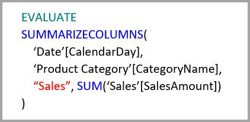

La requête Time Intelligence suivante n’atteindra pas l’agrégation, car la fonction DATESYTD génère une table de valeurs CalendarDay, qui n’est pas couverte par la table d’agrégation.

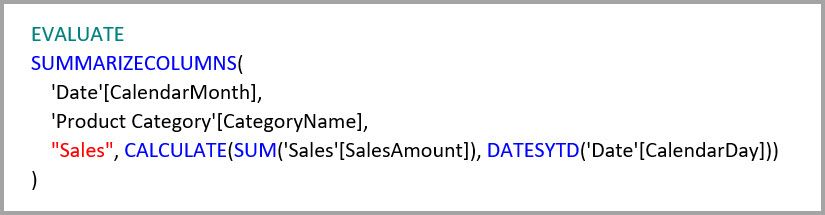

## Les caches doivent toujours être synchronisés.

Les **agrégations** qui combinent les modes de stockage DirectQuery et Importer et/ou Double peuvent retourner des données différentes si le cache en mémoire n’est pas synchronisé avec la source de données. L’exécution de la requête ne tentera pas de masquer des problèmes de données, par exemple, en filtrant les résultats DirectQuery pour qu’ils correspondent aux valeurs mises en cache. Ces fonctionnalités sont des optimisations de performances. Elles doivent être utilisées uniquement d’une manière qui ne compromet pas votre capacité à répondre aux besoins de l’entreprise. Il vous incombe de connaître vos flux de données et de réaliser la conception en conséquence. Il existe des techniques établies pour gérer ces problèmes à la source, si nécessaire.

## Étapes suivantes

Les articles suivants décrivent en détail les modèles composites ainsi que le mode DirectQuery.

* [Modèles composites dans Power BI Desktop (préversion)](desktop-composite-models.md)
* [Relations plusieurs-à-plusieurs dans Power BI Desktop (préversion)](desktop-many-to-many-relationships.md)
* [Mode de stockage dans Power BI Desktop (préversion)](desktop-storage-mode.md)

Articles DirectQuery :

* [Utilisation de DirectQuery dans Power BI](desktop-directquery-about.md)
* [Sources de données prises en charge par DirectQuery dans Power BI](desktop-directquery-data-sources.md)

