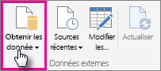
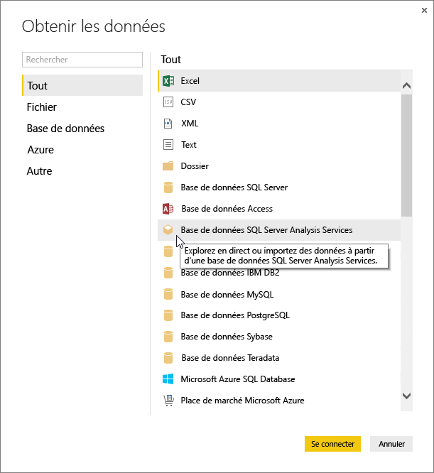
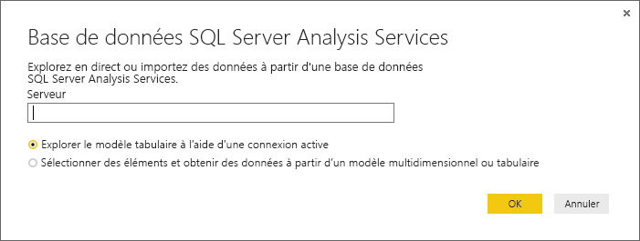
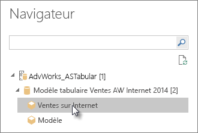
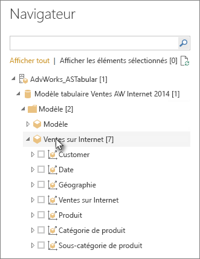
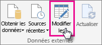
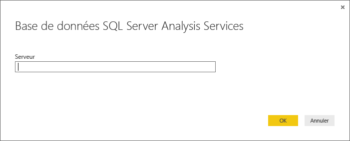

# Utilisation de données tabulaires Analysis Services dans Power BI Desktop
Avec Power BI Desktop, il existe deux moyens de se connecter aux modèles tabulaires SQL Server Analysis Services et d’en récupérer des données : les explorer à l’aide d’une connexion active ou sélectionner des éléments et les importer dans Power BI Desktop.

Examinons cela de plus près.

**Explorer à l’aide d’une connexion active** : lors de l’utilisation d’une connexion active, les éléments dans votre perspective ou modèle tabulaire, comme les tables, les colonnes et les mesures, apparaissent dans votre liste Champs dans Power BI Desktop. Vous pouvez utiliser les outils de visualisation et de création de rapports avancés de Power BI Desktop pour explorer votre modèle tabulaire de manière interactive et novatrice.

Lors de la connexion en temps réel, aucune donnée du modèle tabulaire n’est importée dans Power BI Desktop. Chaque fois que vous interagissez avec une visualisation, Power BI Desktop interroge le modèle tabulaire et calcule les résultats que vous voyez. Vous visualisez toujours les données les plus récentes qui sont disponibles dans le modèle tabulaire, provenant du dernier traitement ou des tables DirectQuery disponibles dans le modèle tabulaire. 

Gardez à l’esprit que les modèles tabulaires sont hautement sécurisés. Les éléments qui apparaissent dans Power BI Desktop varient en fonction des autorisations dont vous disposez sur le modèle tabulaire auquel vous êtes connecté.

Quand vous avez créé des rapports dynamiques dans Power BI Desktop, vous pouvez les partager en les publiant sur votre site Power BI. Quand vous publiez sur votre site Power BI un fichier Power BI Desktop avec une connexion active à un modèle tabulaire, une passerelle de données locale doit être installée et configurée par un administrateur. Pour plus d’informations, consultez [Passerelle de données locale](service-gateway-onprem.md).

**Sélectionner des éléments et les importer dans Power BI Desktop** : lorsque vous vous connectez avec cette option, vous pouvez sélectionner des éléments tels que des tables, des colonnes et des mesures dans votre perspective ou modèle tabulaire et les charger dans un modèle Power BI Desktop. Vous pouvez utiliser l’Éditeur de requête avancé de Power BI Desktop pour préciser ce que vous souhaitez obtenir. Vous pouvez utiliser les fonctionnalités de modélisation de Power BI Desktop pour modéliser davantage les données. Aucune connexion active entre Power BI Desktop et le modèle tabulaire n’est conservée. Vous pouvez ensuite explorer votre modèle Power BI Desktop hors connexion ou le publier sur votre site Power BI.

## Pour vous connecter à un modèle tabulaire
1. Dans Power BI Desktop, sous l’onglet **Accueil**, cliquez sur **Obtenir des données**.
   
   
2. Cliquez sur **Base de données SQL Server Analysis Services**, puis sur **Se connecter**.
   
   
3. Entrez le nom du serveur et sélectionnez un mode de connexion. 
   
   
4. Cette étape varie en fonction du mode de connexion que vous avez sélectionné :

* Si vous vous connectez en temps réel, dans le navigateur, sélectionnez une perspective ou un modèle tabulaire.
  
  
* Si vous avez choisi de sélectionner des éléments et d’obtenir des données, dans le navigateur, sélectionnez une perspective ou un modèle tabulaire. Vous pouvez sélectionner en plus uniquement des tables ou des colonnes spécifiques à charger. Pour mettre en forme vos données avant le chargement, cliquez sur Modifier pour ouvrir l’Éditeur de requête. Lorsque vous êtes prêt, cliquez sur Charger pour importer les données dans Power BI Desktop.

  

## Forum Aux Questions
**Question :** Une passerelle de données locale est-elle nécessaire ?

**Réponse :** Cela dépend. Si vous utilisez Power BI Desktop pour vous connecter en temps réel à un modèle tabulaire mais que vous n’avez pas l’intention de publier sur votre site Power BI, vous n’avez pas besoin de passerelle. En revanche, si vous envisagez de publier sur votre site Power BI, une passerelle de données est nécessaire pour garantir une communication sécurisée entre le service Power BI et votre serveur Analysis Services local. Parlez à votre administrateur de serveur Analysis Services avant d’installer une passerelle de données.

Si vous choisissez de sélectionner des éléments et d’obtenir des données, vous importez des données de modèle tabulaire directement dans votre fichier Power BI Desktop. Dans ce cas, aucune passerelle n’est nécessaire.

**Question :** Quelle est la différence entre une connexion active à un modèle tabulaire à partir du service Power BI et une connexion active à partir de Power BI Desktop ?

**Réponse :** Si vous établissez une connexion active à un modèle tabulaire de votre site dans le service Power BI vers une base de données Analysis Services locale dans votre organisation, une passerelle de données locale est nécessaire pour sécuriser les communications. Lors de la connexion active à un modèle tabulaire à partir de Power BI Desktop, une passerelle n’est pas nécessaire car Power BI Desktop et le serveur Analysis Services auquel vous vous connectez s’exécutent localement dans votre organisation. Toutefois, si vous publiez votre fichier Power BI Desktop sur votre site Power BI, une passerelle est nécessaire.

**Question :** Si j’ai créé une connexion active, puis-je me connecter à une autre source de données dans le même fichier Power BI Desktop ?

**Réponse :** Non. Vous ne pouvez pas explorer des données actives et vous connecter à un autre type de source de données dans le même fichier. Si vous avez déjà importé des données ou si vous vous êtes connecté à une autre source de données dans un fichier Power BI Desktop, vous devez créer un fichier pour effectuer une exploration active.

**Question :** Si j’ai créé une connexion active, puis-je modifier le modèle ou la requête dans Power BI Desktop ?

**Réponse :** Vous pouvez créer des mesures au niveau du rapport dans Power BI Desktop, mais toutes les autres fonctionnalités de requêtes et de modélisation sont désactivées lors de l’exploration de données actives.

**Question :** La connexion active que j’ai créée est-elle sécurisée ?

**Réponse :** Oui. Vos informations d’identification Windows actuelles sont utilisées pour la connexion au serveur Analysis Services. Vous ne pouvez pas utiliser d’informations d’identification de base ou stockées dans le service Power BI ou Power BI Desktop lors de l’exploration active.

**Question :** Dans le navigateur, je vois un modèle et une perspective. Quelle est la différence ?

**Réponse :** Une perspective est une présentation particulière d’un modèle tabulaire. Elle peut inclure uniquement des tables, des colonnes ou des mesures spécifiques, en fonction des besoins d’analyse des données. Un modèle tabulaire contient toujours au moins une perspective, qui peut inclure tout le contenu du modèle. Si vous ne savez pas quoi sélectionner, contactez votre administrateur.

## Pour modifier le nom du serveur après la connexion initiale
Lorsque vous créez un fichier Power BI Desktop avec une connexion active, il peut arriver que vous souhaitiez basculer la connexion vers un autre serveur. Par exemple, si vous avez créé votre fichier Power BI Desktop lors de la connexion à un serveur de développement, et avant la publication vers le service Power BI, vous souhaitez basculer la connexion vers un serveur de production.

1. Sélectionnez **Modifier les requêtes** dans le ruban.
   
   
2. Entrez le nouveau nom du serveur.
   
   
   
   
## Résolution des problèmes 
La liste suivante décrit tous les problèmes connus lors de la connexion à SQL Server Analysis Services (SSAS) ou Azure Analysis Services. 

* **Erreur : Impossible de charger le schéma de modèle** : cette erreur se produit généralement quand l’utilisateur qui se connecte à Analysis Services n’a pas accès à la base de données/au modèle.

