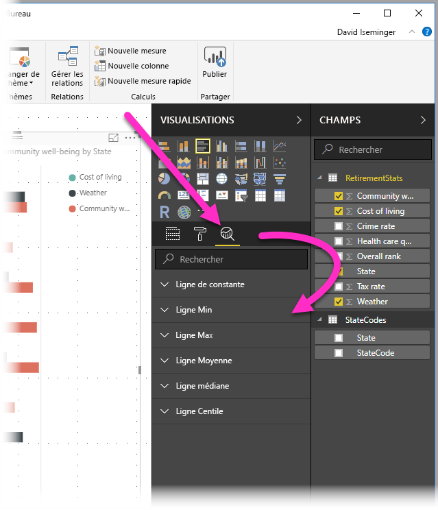
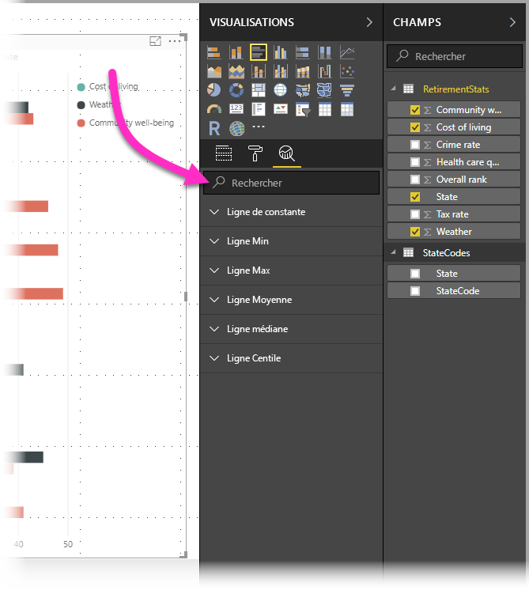
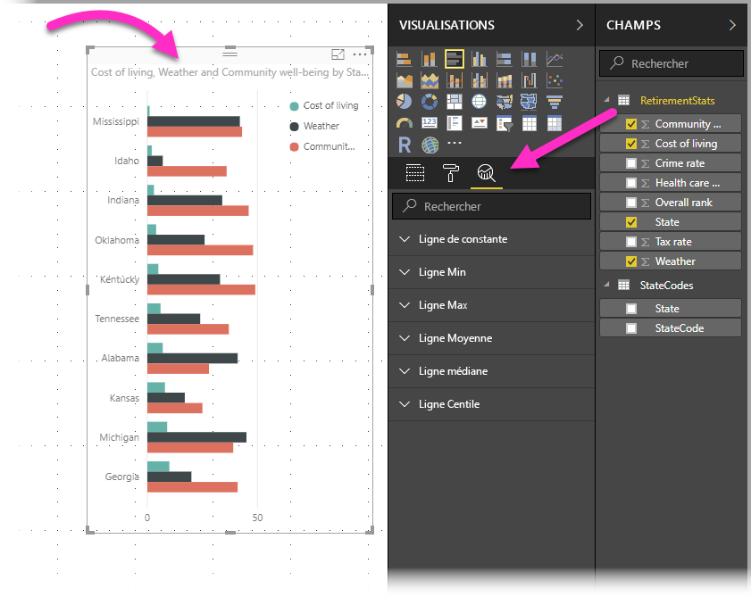
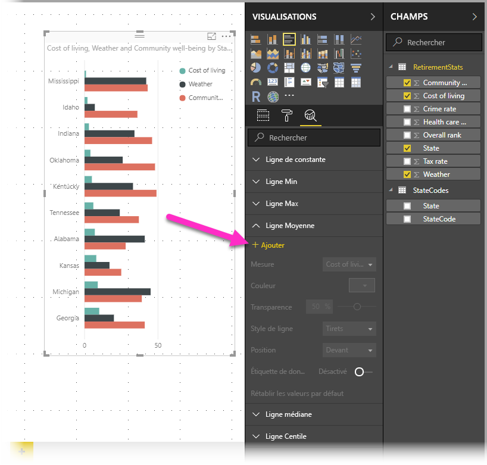
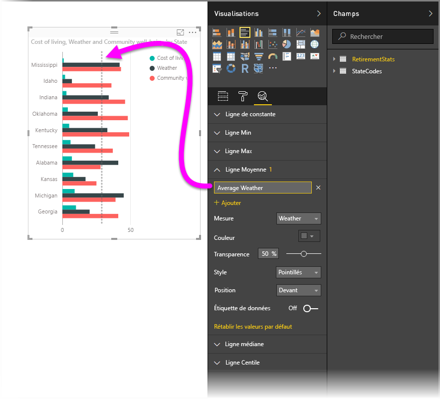
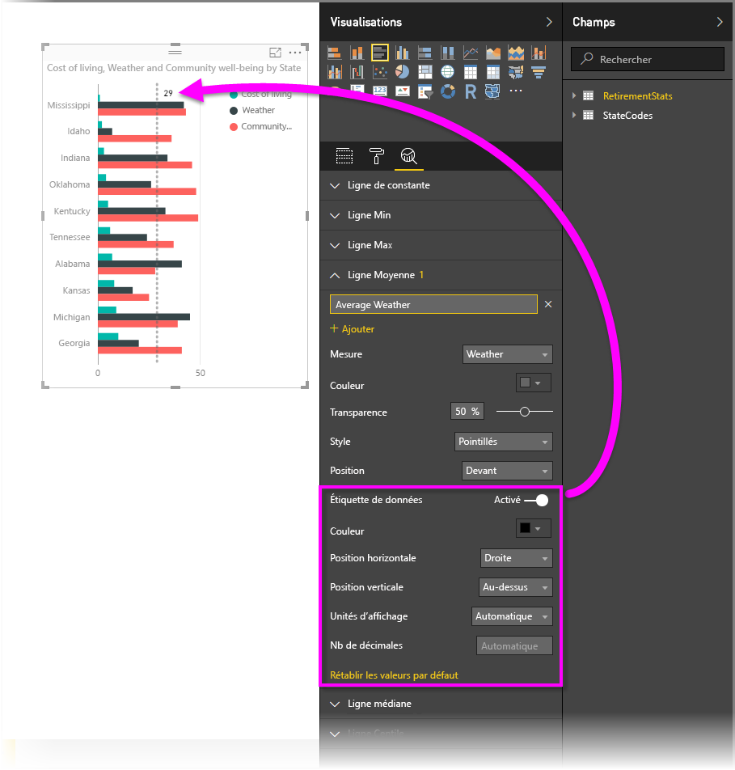
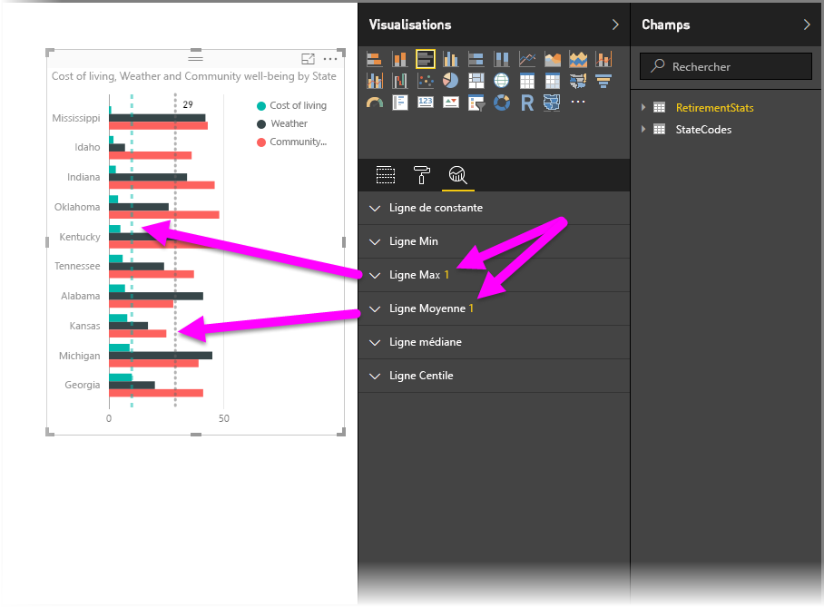
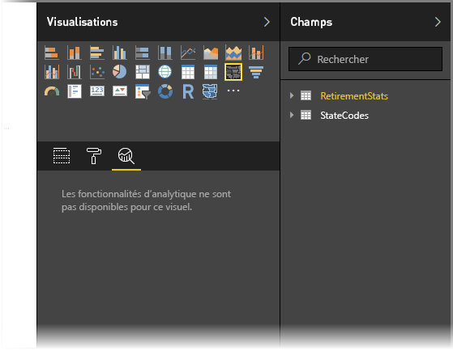
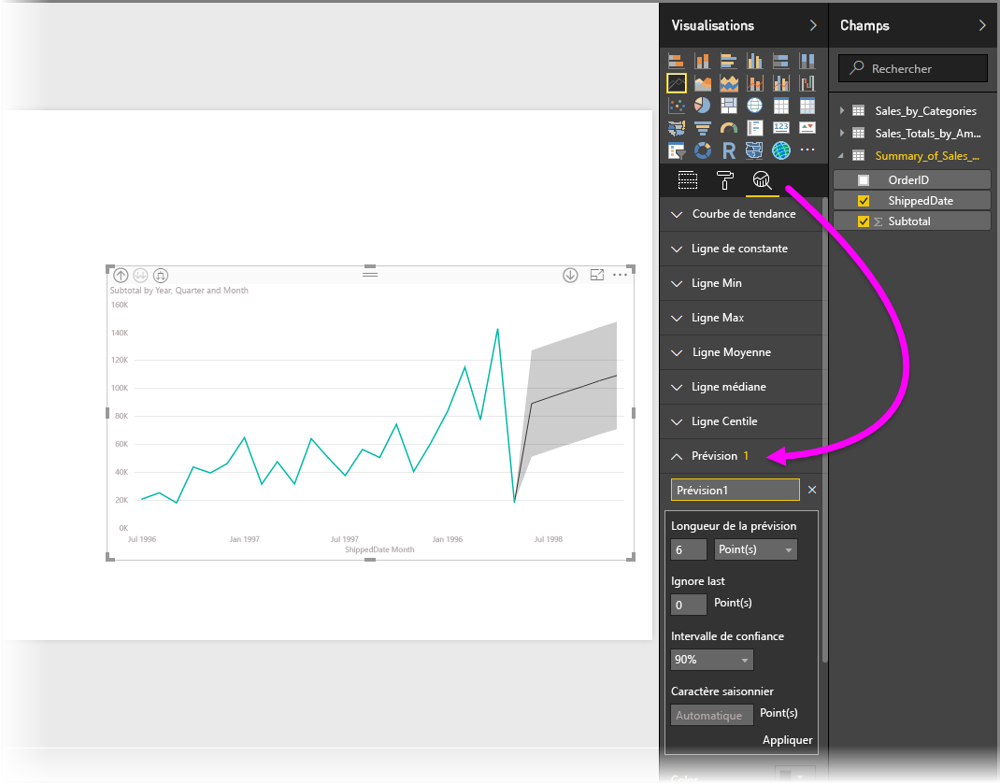

# Utiliser le volet Analytique dans Power BI Desktop

Avec le volet **Analytique** de Power BI Desktop, vous pouvez ajouter des *lignes de référence* dynamiques aux visuels et mettre en relief les tendances et les recommandations analytiques importantes. L’icône et le volet **Analytique** se trouvent dans la partie **Visualisations** de Power BI Desktop.

> [!NOTE]
> Le volet **Analyse** s’affiche uniquement quand vous sélectionnez un élément visuel sur la zone de dessin de Power BI Desktop.

## Effectuer une recherche dans le volet Analyse

À partir de la version de février 2018 de Power BI Desktop (version 2.55.5010.201 ou ultérieure), vous pouvez effectuer une recherche dans le volet **Analytique**, qui est une sous-section du volet **Visualisations**. La zone de recherche s’affiche lorsque vous sélectionnez l’icône **Analytique**.

## Utilisation du volet Analytique

Avec le volet **Analytique**, vous pouvez créer les types de lignes de référence dynamiques suivants :

* Ligne de constante de l’axe X
* Ligne de constante de l’axe Y
* Ligne Min
* Ligne Max
* Ligne moyenne
* Ligne médiane
* Ligne Centile
* Symétrie en grisé

> [!NOTE]
> Toutes les lignes ne sont pas disponibles pour tous les types de visuels.

Les sections suivantes montrent comment vous pouvez utiliser le volet **Analyse** et les lignes de référence dynamiques dans vos visualisations.

Pour afficher les lignes de référence dynamiques pour un élément visuel, procédez comme suit :

1. Sélectionnez ou créez un élément visuel, puis sélectionnez l’icône **Analyse** dans la section **Visualisations**.

    

2. Sélectionnez le type de ligne que vous souhaitez créer afin de développer ses options. Dans ce cas, nous allons sélectionner **Ligne moyenne**.

    

3. Pour créer une ligne, sélectionnez **+&nbsp;Ajouter**. Vous pouvez ensuite nommer la ligne. Double-cliquez sur la zone de texte et entrez votre nom.

    Vous disposez maintenant de toutes sortes d’options pour votre ligne. Vous pouvez spécifier sa **Couleur**, son pourcentage de **Transparence**, son **Style de ligne** et sa **Position** (par rapport aux éléments de données du visuel). Vous pouvez également choisir d’inclure ou non **l’Étiquette de données**. Pour indiquer sur quelle mesure visuelle vous baserez votre ligne, sélectionnez la liste déroulante **Mesure**, qui est automatiquement remplie avec les éléments de données du visuel. Dans ce cas, nous allons sélectionner **Culture** comme mesure, lui attribuer une étiquette *Average of Culture* (Culture moyenne) et personnaliser d’autres options.

    

4. Si vous souhaitez faire apparaître une étiquette de données, faites passer **l’Étiquette de données** de **Désactivée** à **Activée**. En procédant ainsi, vous obtenez un grand nombre d’options supplémentaires pour l’étiquette de données.

    

5. Notez le numéro qui s’affiche en regard de l’élément **Ligne moyenne** dans le volet **Analyse**. Ce dernier indique le nombre de lignes dynamiques dont vous disposez actuellement sur votre élément visuel, ainsi que leur type. Si l’on ajoute une **Ligne Max** pour **Affordability** (Prix abordable), le volet **Analytique** indique qu’une ligne de référence dynamique **Ligne Max** est maintenant également appliquée à ce visuel.

    

Si le visuel que vous avez sélectionné ne peut comporter de lignes de référence dynamiques (dans ce cas, un visuel **Carte**), le message suivant apparaît lorsque vous sélectionnez le volet **Analytique**.

Vous pouvez mettre en surbrillance des recommandations analytiques intéressantes en créant des lignes de référence dynamiques avec le volet **Analytique**.

Nous prévoyons d’ajouter davantage de fonctionnalités, notamment le développement des visuels auxquels peuvent s’appliquer des lignes de référence dynamiques. N’hésitez pas à revenir consulter les nouveautés.

## Appliquer des prévisions

Si vous avez des données de temps dans votre source de données, vous pouvez utiliser la fonctionnalité *Prévision*. Sélectionnez simplement un visuel, puis développez la section **Prévision** du volet **Analytique**. Vous pouvez spécifier de nombreuses entrées pour modifier la prévision, comme **Longueur de la prévision** ou **Intervalle de confiance**. L’illustration suivante montre un visuel de ligne de base auquel est appliquée la prévision. Utilisez votre imagination (et jouez avec les prévisions) pour voir comment elle peut s’appliquer à vos modèles.

> [!NOTE]
> La fonctionnalité de prévision n’est disponible que pour les visuels de graphique en courbes.

## Limites

La possibilité d’utiliser des lignes de référence dynamiques est basée sur le type d’élément visuel utilisé. Les listes suivantes décrivent plus en détail ces limitations.

Vous pouvez utiliser la *ligne constante de l’axe X*, la *ligne constante de l’axe Y* et *l’ombrage de symétrie* sur le visuel suivant :

* Nuage de points

Il est possible d’utiliser la *ligne constante*, la *ligne min*, la *ligne max*, la *ligne moyenne *, la* ligne médiane*et la*ligne de centile* sur ces visuels :

* Graphique en aires
* Graphique à barres groupées
* Histogramme groupé
* Graphique en courbes
* Nuage de points

Les éléments visuels suivants peuvent utiliser uniquement une *ligne de constante* à partir du volet **Analyse** :

* Graphique en aires empilées
* Graphique à barres empilées
* Histogramme empilé
* Graphique en cascade
* Graphique à barres empilées 100 %
* Histogramme empilé 100 %

Les visuels suivants peuvent utiliser une *ligne de tendance* en présence de données de temps :

* Graphique en aires
* Histogramme groupé
* Graphique en courbes
* Graphique en courbes et histogramme groupé

Enfin, de nombreux visuels n’acceptent pas à l’heure actuelle les lignes dynamiques, notamment :

* Entonnoir
* Graphique en courbes et histogramme groupé
* Graphique en courbes et histogramme empilé
* Graphique de ruban
* Visuels non cartésiens, comme les graphiques en anneau, les jauges, les matrices, les graphiques à secteurs et les tableaux

La *ligne des centiles* n’est disponible qu’avec des données importées dans Power BI Desktop ou en cas de connexion active à un modèle sur un serveur exécutant **Analysis Service 2016** ou une version ultérieure, **Azure Analysis Services** ou un jeu de données sur le service Power BI.

## Étapes suivantes

Power BI Desktop permet d’effectuer des tâches très diverses. Pour plus d’informations sur ses fonctionnalités, passez en revue les ressources suivantes :

* [Nouveautés dans Power BI Desktop](desktop-latest-update.md)
* [Obtenir Power BI Desktop](desktop-get-the-desktop.md)
* [Qu’est-ce que Power BI Desktop ?](desktop-what-is-desktop.md)
* [Vue d’ensemble des requêtes dans Power BI Desktop](desktop-query-overview.md)
* [Types de données dans Power BI Desktop](desktop-data-types.md)
* [Mettre en forme et combiner des données dans Power BI Desktop](desktop-shape-and-combine-data.md)
* [Effectuer des tâches courantes dans Power BI Desktop](desktop-common-query-tasks.md)
