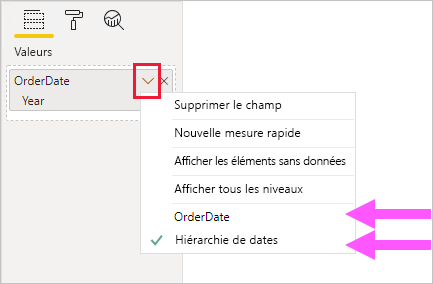

# <a name="apply-auto-datetime-in-power-bi-desktop"></a>Appliquer l’option de date/heure automatique dans Power BI Desktop

Cet article s’adresse aux modélisateurs de données développant des modèles d’importation ou composites dans Power BI Desktop. Il présente et décrit l’option _Date/heure automatique_.

L’option Date/heure automatique est une option de chargement des données dans Power BI Desktop. Cette option assure la prise en charge de rapports utilisant l’intelligence temporelle ; des rapports pratiques basés sur des colonnes de dates chargées dans un modèle. Plus précisément, elle permet aux auteurs de rapports qui utilisent votre modèle de données de filtrer, de regrouper et d’extraire à l’aide de périodes calendaires (années, trimestres, mois et jours). Ce qui est important, c’est que vous n’avez pas besoin de développer explicitement ces fonctionnalités Time Intelligence.

Quand cette option est activée, Power BI Desktop crée une table de date/heure automatique masquée pour chaque colonne de date. Pour cela, toutes les conditions suivantes doivent être remplies :

- Le mode de stockage de table est défini sur Importer.
- Les données de colonne sont de type date ou date/heure.
- La colonne n’est pas le côté « plusieurs » d’une relation de modèle.

## <a name="how-it-works"></a>Fonctionnement

En fait, chaque table de date/heure automatique est une [table calculée](desktop-calculated-tables.md) qui génère des lignes de données à l’aide de la fonction [CALENDAR](/dax/calendar-function-dax) DAX. Chaque table inclut également six colonnes calculées : **Jour**, **NoMois**, **Mois**, **NoTrimestre**, **Trimestre**et **Année**.

> [!NOTE]
> Power BI traduit et met en forme les noms et valeurs de colonnes selon la [langue du modèle](supported-languages-countries-regions.md#choose-the-language-for-the-model-in-power-bi-desktop).

Power BI Desktop crée également une relation entre la colonne **Date** de la table de date/heure automatique et la colonne de date du modèle.

La table de date/heure automatique contient les années calendaires complètes. Elle inclut toutes les valeurs de date stockées dans la colonne de date du modèle. Par exemple, si la valeur la plus ancienne d’une colonne de date est le 20 mars 2016 et que la valeur la plus récente est le 23 octobre 2019, la table contient 1 461 lignes. Chaque date est représentée par une ligne pour les quatre années civiles de 2016 à 2019. Lorsque Power BI actualise le modèle, chaque table de date/heure automatique est également actualisée. De cette façon, le modèle contient toujours les dates incluant les valeurs de la colonne de date.

S’il était possible de voir les lignes d’une table de date/heure automatique, elles pourraient se présenter comme suit :


> [!NOTE]
> Les tables de date/heure automatique sont toujours masquées, y compris auprès des modélisateurs. Elles ne peuvent pas apparaître dans le volet **Champs** ni dans le diagramme de vue Modèle, et leurs lignes ne peuvent pas apparaître dans la vue de données. En outre, la table et sa colonne ne peuvent pas être directement référencées par des expressions DAX.

La table définit également une hiérarchie avec des visuels permettant d’explorer les données au niveau des années, trimestres, mois et jours.

S’il était possible de voir une table de date/heure automatique dans le diagramme de vue Modèle, elle pourrait se présenter comme suit (les colonnes associées sont mises en surbrillance) :

![Exemple de représentation d’une table de date/heure automatique masquée. L’image présente deux tables : Sales et LocalDateTime. Les tables sont liées par la colonne OrderDate de la table Sales et la colonne Date de la table LocalDateTime. La table LocalDateTime définit sept colonnes : Date, Jour, Mois, NoMois, Trimestre, NoTrimestre et Année. Elle définit également une hiérarchie unique. La hiérarchie est nommée Hiérarchie de dates et se compose de quatre niveaux : Année, Trimestre, Mois et Jour.](media/desktop-auto-date-time/auto-date-time-hidden-table-example-diagram.png)

## <a name="work-with-auto-datetime"></a>Utiliser la fonctionnalité de date/heure automatique

Quand une table de date/heure automatique est associée à une colonne de date (et que cette colonne est visible), les auteurs de rapport ne voient pas cette colonne en tant que champ dans le volet **Champs**. En fait, ils voient un objet extensible qui porte le nom de la colonne de date. Vous pouvez l’identifier facilement car il est accompagné d’une icône représentant un calendrier. Quand l’auteur du rapport développe l’objet de calendrier, il accède à une hiérarchie nommée **Hiérarchie de dates**. Une fois la hiérarchie développée, il peut voir quatre niveaux : **Année**, **Trimestre**, **Mois** et **Jour**.


La hiérarchie générée par la fonctionnalité de date/heure automatique peut être utilisée pour configurer un visuel exactement de la même façon que des hiérarchies classiques. Les visuels peuvent être configurés avec l’ensemble de la hiérarchie **Hiérarchie de dates** ou des niveaux spécifiques de la hiérarchie.

Vous disposez, par ailleurs, d’une fonctionnalité supplémentaire qui n’est pas prise en charge par les hiérarchies classiques. Quand la hiérarchie de date/heure automatique ou un niveau de la hiérarchie est ajouté à une zone de visuels, l’auteur du rapport peut basculer entre l’utilisation de la hiérarchie et celle de la colonne de date. Cette approche est particulièrement pertinente pour certains visuels, notamment quand il a uniquement besoin de la colonne de date et non de la hiérarchie et de ses niveaux. Il commence par configurer le champ visuel (en cliquant dessus avec le bouton droit ou en cliquant sur la flèche vers le bas), puis il bascule entre la colonne de date et la hiérarchie de dates à l’aide du menu contextuel.



Enfin, les calculs de modèle, écrits en DAX, peuvent référencer une colonne de date _directement_ ou les colonnes d’une table de date/heure automatique masquées _indirectement_.

Une formule écrite dans Power BI Desktop peut référencer une colonne de date de façon classique. Toutefois, les colonnes d’une table de date/heure automatique doivent être référencées à l’aide d’une syntaxe étendue spéciale. Commencez par référencer la colonne de date et faites-la suivre d’un point (.). Dans la barre de formule, la saisie semi-automatique vous permet de sélectionner une colonne dans la table de date/heure automatique.

![Exemple d’entrée d’une expression de mesure DAX dans la barre de formule. Pour l’instant, la formule est Date Count = COUNT(Sales[OrderDate]. La liste de saisie semi-automatique présente les sept colonnes de la table de date/heure automatique masquée. Ces colonnes sont les suivantes : Date, Jour, Mois, NoMois, Trimestre, NoTrimestre et Année.](media/desktop-auto-date-time/auto-date-time-dax-auto-complete.png)

Voici un exemple d’expression de mesure valide dans Power BI Desktop :

```dax
Date Count = COUNT(Sales[OrderDate].[Date])
```

> [!NOTE]
> Cependant, si cette expression de mesure est valide dans Power BI Desktop, il ne s’agit pas d’une syntaxe DAX correcte. En interne, Power BI Desktop transpose votre expression pour référencer la colonne de la table de date/heure automatique (masquée) réelle.

## <a name="configure-auto-datetime-option"></a>Configurer l’option de date/heure automatique

Vous pouvez configurer l’option de date/heure automatique de façon _globale_ ou pour le _fichier actuel_. L’option Global s’applique aux nouveaux fichiers Power BI Desktop. Elle peut être activée ou désactivée à tout moment. Avec une nouvelle installation de Power BI Desktop, les deux options sont activées par défaut.

L’option Fichier actuel peut également être activée ou désactivée à tout moment. Quand elle est activée, des tables de date/heure automatique sont créées. Quand elle est désactivée, toutes les tables de date/heure automatique sont supprimées du modèle.

> [!CAUTION]
> Soyez vigilant quand vous désactivez l’option Fichier actuel, car les tables de date/heure automatique seront supprimées. Veillez à corriger tous les visuels ou filtres de rapport rompus, qui ont été configurés pour les utiliser.

Dans Power BI Desktop, sélectionnez _Fichier > Options et paramètres > Options_, puis la page **Global** ou **Fichier actuel**. Dans les deux pages, l’option est disponible dans la section **Time Intelligence**.


## <a name="next-steps"></a>Étapes suivantes

Pour plus d’informations en rapport avec cet article, consultez les ressources suivantes :

- [Conseils sur les dates/heures automatiques dans Power BI Desktop](guidance/auto-date-time.md)
- [Définir et utiliser des tables de dates dans Power BI Desktop](desktop-date-tables.md)
- Vous avez des questions ? [Essayez d’interroger la communauté Power BI](https://community.powerbi.com/)
