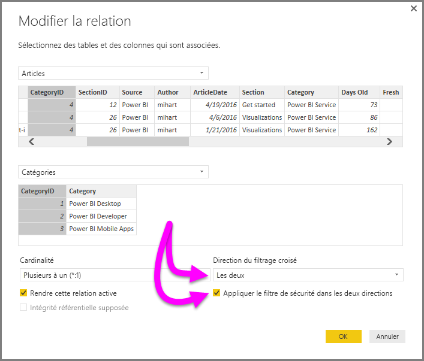

# Filtrage croisé bidirectionnel avec DirectQuery dans Power BI Desktop

Lorsqu’ils filtrent les tables afin de créer la vue de données appropriée, les créateurs de rapports (et les modélisateurs de données) font face à des difficultés pour déterminer comment le filtrage est appliqué au rapport. Le contexte de filtre d’une table a été maintenu d’un côté de la relation mais pas de l’autre, nécessitant ainsi souvent des formules DAX complexes pour obtenir les résultats souhaités.

Avec le filtrage bidirectionnel croisé, les créateurs de rapports (et les modélisateurs de données) peuvent désormais mieux contrôler la façon dont les filtres sont appliqués sur les tables liées, ces filtres étant appliqués des *deux* côtés de la relation de table. Pour cela, le contexte de filtre doit être propagé vers une deuxième table liée de l’autre côté de la relation de table.

## Livre blanc détaillé pour le filtrage croisé bidirectionnel
Un [livre blanc détaillé](http://download.microsoft.com/download/2/7/8/2782DF95-3E0D-40CD-BFC8-749A2882E109/Bidirectional%20cross-filtering%20in%20Analysis%20Services%202016%20and%20Power%20BI.docx) explique le filtrage croisé bidirectionnel dans Power BI Desktop. (Ce livre blanc aborde également SQL Server Analysis Services 2016, tous les deux ayant le même comportement).

* Télécharger le livre blanc sur le [filtrage croisé bidirectionnel pour Power BI Desktop](http://download.microsoft.com/download/2/7/8/2782DF95-3E0D-40CD-BFC8-749A2882E109/Bidirectional%20cross-filtering%20in%20Analysis%20Services%202016%20and%20Power%20BI.docx).

## Activer le filtrage croisé bidirectionnel pour DirectQuery

Pour activer le filtrage croisé, dans la boîte de dialogue **Modifier la relation** d’une relation, les éléments suivants doivent être activés :

* La valeur de **Direction du filtrage croisé** doit être **Les deux**.
* L’option **Appliquer le filtre de sécurité dans les deux directions** doit également être activée.

  

> [!NOTE]
> Lors de la création de formules DAX de filtrage croisé dans Power BI Desktop, utilisez le *nom d’utilisateur principal* (qui est souvent le même que le nom de connexion de l’utilisateur, par exemple <em>joe@contoso.com</em>), plutôt que le *nom d’utilisateur*. Par conséquent, vous devez peut-être créer une table liée qui mappe le *nom d’utilisateur* (ou l’ID d’employé, par exemple) au *nom d’utilisateur principal*.

Pour plus d’informations et pour obtenir des exemples de fonctionnement du filtrage croisé bidirectionnel, consultez le [livre blanc](http://download.microsoft.com/download/2/7/8/2782DF95-3E0D-40CD-BFC8-749A2882E109/Bidirectional%20cross-filtering%20in%20Analysis%20Services%202016%20and%20Power%20BI.docx) mentionné plus haut dans cet article.

