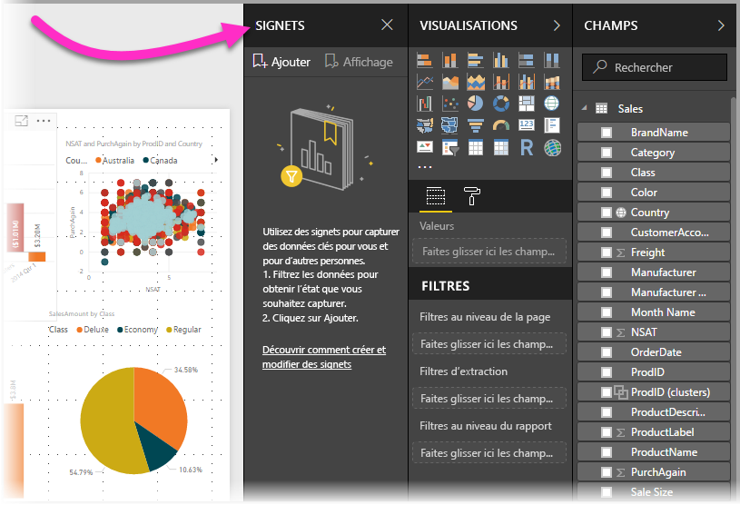
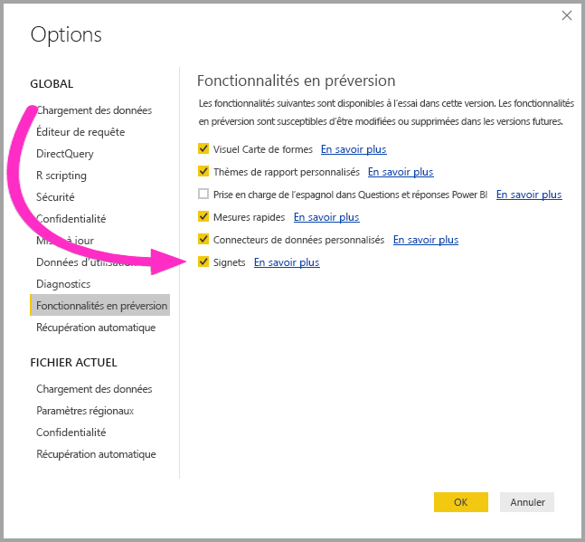
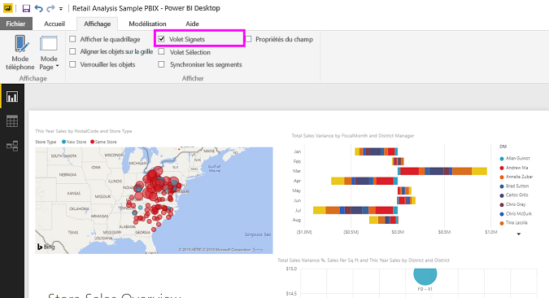
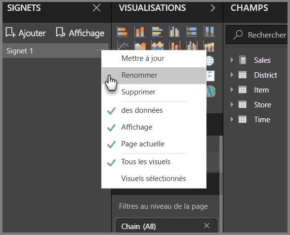
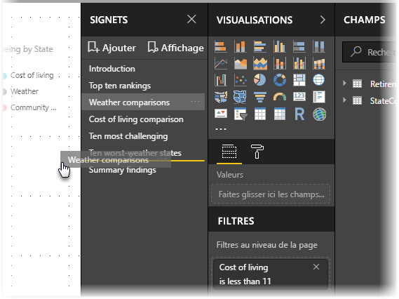
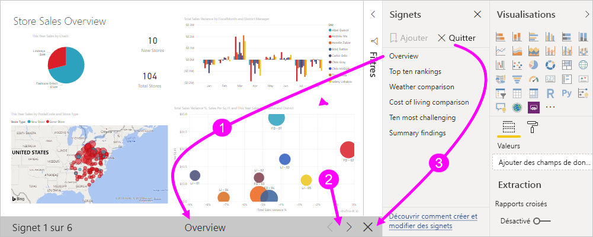
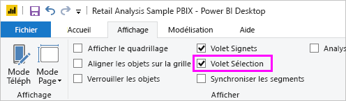
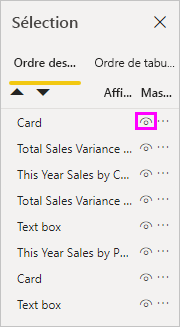
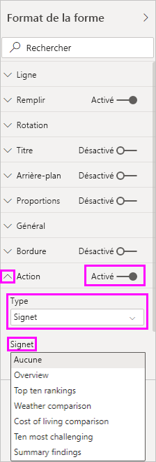
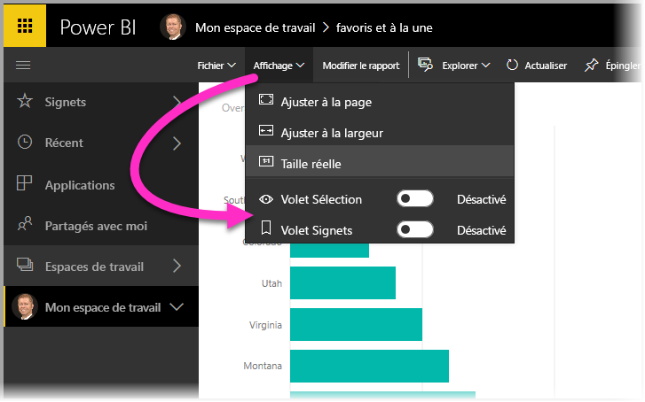

# Utiliser des signets pour partager des insights et créer des récits dans Power BI 
Les **signets** de Power BI permettent de capturer la vue actuellement configurée d’une page de rapport, filtrage et état des visuels compris, puis de revenir à cet état en sélectionnant simplement le signet enregistré. 

Vous pouvez également créer une collection de signets, les réorganiser dans l’ordre de votre choix, puis parcourir chaque signet d’une présentation pour mettre en avant une série d’insights ou le récit que vous souhaitez raconter avec vos visuels et rapports. 

Les signets ont de nombreuses utilisations. Vous pouvez les utiliser pour suivre la progression de la création de rapports (les signets sont faciles à ajouter, à supprimer et à renommer). Il est également possible de créer des signets pour concevoir une présentation de type PowerPoint qui parcourt les signets dans l’ordre, de façon à accompagner votre rapport d’un récit. Il existe peut-être d’autres utilisations en fonction de votre usage.

### Activer la préversion des signets (versions antérieures à mars 2018)
Depuis la version de mars 2018 de Power BI Desktop, les signets sont en disponibilité générale. 

Nous vous conseillons de toujours effectuer la mise à niveau vers la version la plus récente. Si vous utilisez une version antérieure de Power BI Desktop, vous pouvez essayer la fonctionnalité **Signets** à partir de la version **d’octobre 2017** de **Power BI Desktop** et, pour les rapports compatibles avec les signets, dans le **service Power BI** également. Pour activer la fonctionnalité en préversion, sélectionnez **Fichier > Options et paramètres > Options > Fonctionnalités en préversion**, puis cochez la case à côté de **Signets**. 

Vous devrez redémarrer **Power BI Desktop** après avoir activé la préversion des signets.

## Utilisation des signets
Pour utiliser des signets, sélectionnez le ruban **Vue**, puis activez la case du **volet Signets**. 

Lorsque vous créez un signet, les éléments suivants sont enregistrés :

* Page actuelle
* Filtres
* Segments
* Ordre de tri
* Emplacement d’exploration
* Visibilité (d’un objet, à l’aide du volet **Sélection**)
* Le mode focus ou **À la une** des objets visibles

Actuellement, les signets n’enregistrent pas l’état de sélection croisée. 

Configurez une page de rapport comme vous souhaitez qu’elle apparaisse dans le signet. Une fois que votre page de rapport et les visuels sont organisés comment vous le souhaitez, sélectionnez **Ajouter** dans le volet **Signets** pour ajouter un signet. 

**Power BI Desktop** crée un signet et lui donne un nom générique. Vous pouvez facilement *renommer*, *supprimer* ou *mettre à jour* un signet en sélectionnant les points de suspension en regard de son nom, puis en sélectionnant une action dans le menu qui s’affiche.

Une fois que vous avez un signet, vous pouvez l’afficher en cliquant simplement dessus dans le volet **Signets**. 

Vous pouvez également choisir si chaque signet appliquera des propriétés de *données*, comme des filtres et des segments, des propriétés *d’affichage*, comme À la une et sa visibilité, et les modifications de la page représentant la page qui était visible lors de l’ajout du signet. Ces fonctionnalités sont utiles si vous utilisez les signets pour naviguer entre les types de visuels. Dans ce cas, vous devrez sans doute désactiver les propriétés de données, afin que les filtres ne soient pas réinitialisés lorsque les utilisateurs modifient les types de visuels. 

Pour effectuer ces modifications, sélectionnez les points de suspension en regard du nom du signet, comme illustré dans l’image précédente, puis sélectionnez ou désélectionnez les coches en regard de *Données*, *Affichage* et autres contrôles. 

## Organisation des signets
Lorsque vous créez des signets, vous pouvez trouver que l’ordre dans lequel vous les créez n’est pas nécessairement l’ordre dans lequel vous voulez les présenter à votre audience. Cela ne constitue pas un problème, car vous pouvez facilement réorganiser l’ordre des signets.

Dans le volet **Signets**, effectuez simplement un glisser-déplacer des signets pour modifier leur ordre, comme dans l’image suivante. La barre jaune entre les signets désigne où le signet déplacé sera positionné.

L’ordre de vos signets peut devenir important lorsque vous utilisez la fonctionnalité **Vue** des signets, comme décrit dans la section suivante.

## Signets en mode diaporama
Lorsque vous avez une collection de signets que vous souhaitez présenter dans l’ordre, vous pouvez sélectionner **Vue** dans le volet **Signets** pour lancer un diaporama.

Le mode **Vue** offre quelques fonctionnalités utiles :

1. Le nom du signet apparaît dans la barre de titre de celui-ci, qui apparaît au bas du canevas.
2. La barre de titre des signets comporte des flèches permettant de passer au signet suivant ou précédent.
3. Vous pouvez quitter le mode **Vue** en sélectionnant **Quitter** dans le volet **Signets** ou la croix (**X**) dans la barre de titre des signets. 

Lorsque vous êtes en mode **Vue**, vous pouvez fermer le volet **Signets** (en cliquant sur le signe X sur ce volet) pour fournir davantage d’espace pour votre présentation. De plus, en mode **Vue**, tous les visuels sont interactifs et compatibles avec la sélection croisée, comme dans toute autre interaction. 

## Visibilité à l’aide du volet Sélection
Un nouveau volet **Sélection** est également mis à disposition avec les signets. Le volet **Sélection** donne la liste de tous les objets de la page active. Il permet de sélectionner l’objet et de spécifier si un objet en particulier est visible. 

Vous pouvez sélectionner un objet à l’aide du volet **Sélection**. De plus, vous pouvez indiquer si l’objet est actuellement visible en cliquant sur l’icône en forme d’œil à droite du visuel. 

Lorsque vous ajoutez un signet, l’état visible de chaque objet est également enregistré en fonction de son paramètre dans le volet **Sélection**. 

Il est important de noter que **des segments** continuent de filtrer une page de rapport, qu’ils soient visibles ou non. Par conséquent, vous pouvez créer différents signets, avec différents paramètres de segment. Vous pouvez ainsi donner un aspect complètement différent à une page de rapport (et mettre en évidence différents insights) en créant différents signets.

## Signets pour les formes et images
Vous pouvez également lier des formes et des images à des signets. Lorsque vous cliquez sur un objet, cette fonctionnalité affiche le signet associé à cet objet. Cela peut s’avérer particulièrement utile si vous travaillez avec des boutons. Pour en savoir plus, lisez l’article sur [l’utilisation des boutons dans Power BI](desktop-buttons.md). 

Pour affecter un signet à un objet, sélectionnez l’objet, puis développez la section **Action** dans le volet **Format de la forme**, comme indiqué dans l’image suivante.

Une fois que vous avez activé le curseur **Action** en le définissant sur **Activé**, vous pouvez indiquer si l’objet est un bouton de retour, un signet ou une commande Q&R. Si vous sélectionnez Signet, vous pouvez ensuite sélectionner les signets auxquels l’objet est lié.

Les signets liés à des objets vous permettent d’effectuer des tâches très diverses. Vous pouvez créer un tableau visuel de contenu sur la page de rapport. Vous pouvez également fournir différentes vues (telles que les types de visuels) de la même information, en cliquant simplement sur un objet.

Lorsque vous êtes en mode Modification, vous pouvez utiliser Ctrl + clic pour suivre le lien. Si vous êtes dans un autre mode, cliquez simplement sur l’objet pour suivre le lien. 

## Utilisation du mode À la une
La fonctionnalité **À la une** est également fournie avec les signets. Avec la fonction **À la une**, vous pouvez attirer l’attention sur un graphique spécifique, par exemple lors de la présentation de vos signets en mode **Vue**.

Comparons les modes **À la une** et **Focus** pour voir en quoi ils diffèrent.

1. En mode **focus**, vous pouvez avoir un visuel qui remplit l’intégralité du canevas en sélectionnant l’**icône Mode focus**.
2. En utilisant le mode **À la une**, vous pouvez mettre en évidence un visuel dans sa taille d’origine et atténuer tous les autres visuels en les rendant presque transparents. 

Lorsque le visuel dans l’image précédente a l’icône **focus** activée, la page a l’aspect suivant :

En revanche, quand **À la une** est sélectionné dans le menu des points de suspension du visuel, la page ressemble à ce que vous voyez ici :

Si l’un des modes est sélectionné lors de l’ajout d’un signet, ce mode (Focus ou À la une) est conservé dans le signet.

## Signets dans le service Power BI
Lorsque vous publiez un rapport contenant au moins un signet dans le **service Power BI** , vous pouvez afficher et utiliser les signets dans le **service Power BI**. Lorsque les signets sont disponibles dans un rapport, vous pouvez sélectionner **Vue > volet Sélection** ou **Vue > volet Signets** pour afficher chacun de ces volets.

Dans le **service Power BI**, le **volet Signets** fonctionne comme dans **Power BI Desktop**, y compris la possibilité de sélectionner **Vue** pour afficher vos signets dans l’ordre, comme un diaporama.

Notez que vous devez utiliser la barre de titre de signets en gris pour naviguer entre les signets et pas les flèches noires (celles-ci vous permettent de passer d’une page de rapport à une autre, et pas d’un signet à un autre).

## Considérations et limitations
Pour cette préversion des **signets**, vous devez garder à l’esprit les considérations et limitations suivantes.

* La plupart des visuels personnalisés doivent fonctionner correctement avec l’attribution de signets. Si vous rencontrez des problèmes avec l’attribution de signets et un visuel personnalisé, contactez le créateur de ce dernier et demandez-lui d’ajouter la prise en charge des signets pour son visuel. 
* Si vous ajoutez un visuel sur une page de rapport après la création d’un signet, le visuel s’affiche dans son état par défaut. Cela signifie également que si vous introduisez un segment dans une page où vous avez précédemment créé des signets, le segment se comporte avec son état par défaut.
* Le déplacement parmi les visuels après la création d’un signet est reflété dans le signet. 

## Étapes suivantes
Pour plus d’informations sur les fonctionnalités qui sont similaires ou pour interagir avec des signets, consultez les articles suivants :

* [Utiliser une extraction dans Power BI Desktop](desktop-drillthrough.md)
* [Afficher une vignette de tableau de bord ou un visuel de rapport en mode Focus](service-focus-mode.md)

