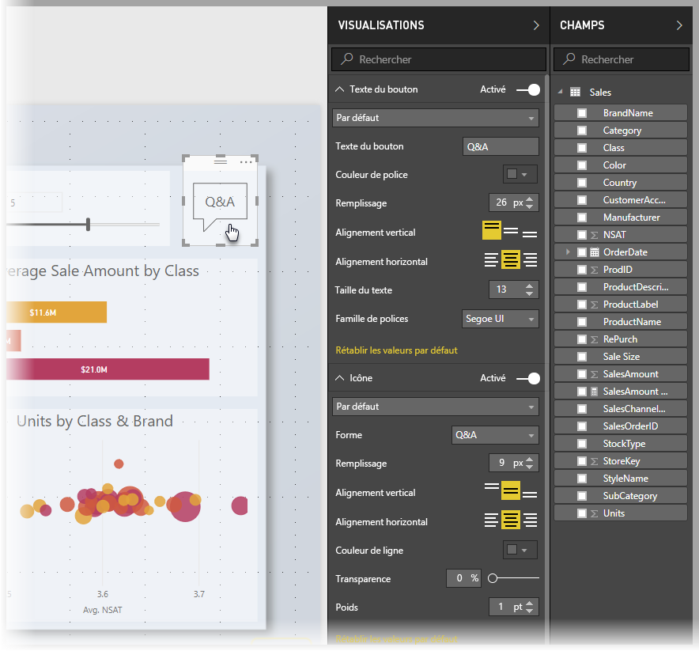
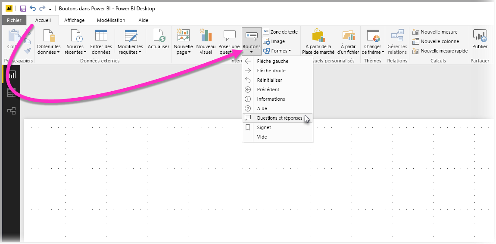
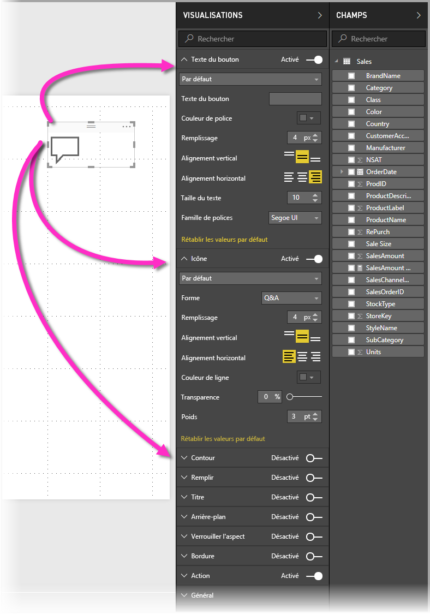
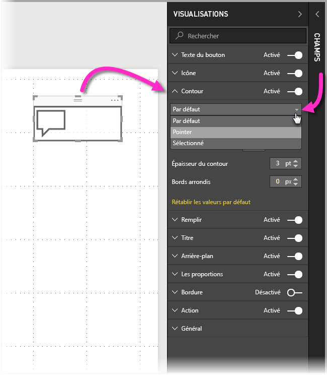
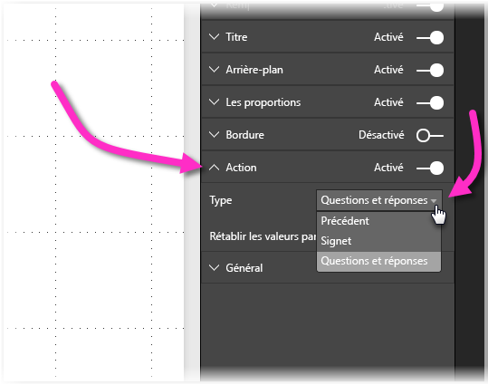

# Utilisation des boutons dans Power BI
En utilisant les **boutons** de Power BI, vous pouvez créer des rapports et des tableaux de bord qui se comportent comme des applications et donc créer un environnement plus interactif dans lequel les utilisateurs peuvent se déplacer, cliquer et interagir davantage avec le contenu Power BI. Vous pouvez ajouter des boutons aux rapports de **Power BI Desktop**et partager ou publier ces rapports dans le service Power BI pour créer des tableaux de bord qui offrent un comportement semblable à celui des applications pour les utilisateurs.

Les boutons que vous créez dans **Power BI Desktop** peuvent être utilisés dans les rapports ou les tableaux de bord qui sont publiés dans le **service Power BI**.

## Création de boutons dans les rapports
Pour créer un bouton dans un rapport **Power BI Desktop**, sur le ruban **Accueil**, sélectionnez **Boutons**. Un menu déroulant s’affiche, dans lequel vous pouvez sélectionner le bouton souhaité dans une collection d’options, comme illustré dans l’image suivante. 

Quand vous créez un bouton et le sélectionnez dans le canevas de rapport, le volet **Visualisations** vous montre les nombreuses façons de personnaliser le bouton pour répondre à vos besoins. Par exemple, vous pouvez activer ou désactiver **Texte du bouton** en actionnant le curseur dans la carte du volet **Visualisations**. Vous pouvez également changer l’icône du bouton, le remplissage du bouton, le titre et l’action effectuée quand les utilisateurs cliquent sur le bouton dans un rapport ou un tableau de bord, entre autres propriétés.

## Définir les propriétés d’un bouton quand celui-ci est inactif, survolé ou sélectionné

Les boutons de Power BI présentent trois états : par défaut (comme ils apparaissent quand ils ne sont ni survolés ni sélectionnés), survolé ou sélectionné (souvent quand les utilisateurs *cliquent* dessus). Un grand nombre des cartes du volet **Visualisations** peuvent être modifiées individuellement en fonction de ces trois états, ce qui vous donne une grande souplesse pour personnaliser vos boutons.

Les cartes suivantes du volet **Visualisations** vous permettent d’ajuster la mise en forme ou le comportement d’un bouton en fonction de ses trois états :

* Texte du bouton
* Icône
* Plan
* Remplissage

Pour sélectionner la manière dont le bouton doit apparaître pour chaque état, développez l’une de ces cartes et sélectionnez la liste déroulante qui apparaît en haut. Dans l’image suivante, vous voyez la carte **Plan** développée, avec la liste déroulante sélectionnée pour montrer les trois états :

## Sélectionner l’action d’un bouton

Vous pouvez sélectionner l’action à effectuer quand un utilisateur sélectionne un bouton dans Power BI. Vous pouvez accéder aux options des actions de bouton dans la carte **Action** du volet **Visualisations**.

Les options des actions de bouton sont :

* Précédent
* Signet
* Questions et réponses

La sélection de **Précédent** renvoie l’utilisateur à la page précédente du rapport. C’est particulièrement utile pour les pages d’exploration.

La sélection de **Signet** présente la page de rapport qui est associée à un signet défini pour le rapport actuel. Vous pouvez [en savoir plus sur les signets dans Power BI](desktop-bookmarks.md). 

La sélection de **Questions et réponses** dans la liste déroulante présente une fenêtre **Explorateur de Questions et réponses**. 

Certains boutons ont une action par défaut sélectionnée automatiquement. Par exemple, le type de bouton **Questions et réponses** sélectionne automatiquement **Questions et réponses** comme action par défaut. Vous pouvez en savoir plus sur l’**Explorateur de Questions et réponses** en consultant [ce billet de blog](https://powerbi.microsoft.com/blog/power-bi-desktop-april-2018-feature-summary/#Q&AExplorer).

Vous pouvez essayer ou tester les boutons que vous créez pour votre rapport en utilisant *Ctrl + clic* sur le bouton que vous souhaitez utiliser. 

## Étapes suivantes
Pour plus d’informations sur les fonctionnalités qui sont similaires ou pour interagir avec des boutons, consultez les articles suivants :

* [Utiliser une extraction dans Power BI Desktop](desktop-drillthrough.md)
* [Afficher une vignette de tableau de bord ou un visuel de rapport en mode Focus](service-focus-mode.md)
* [Utiliser des signets pour partager des insights et créer des récits dans Power BI](desktop-bookmarks.md)

