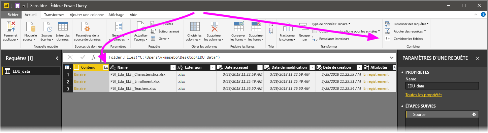
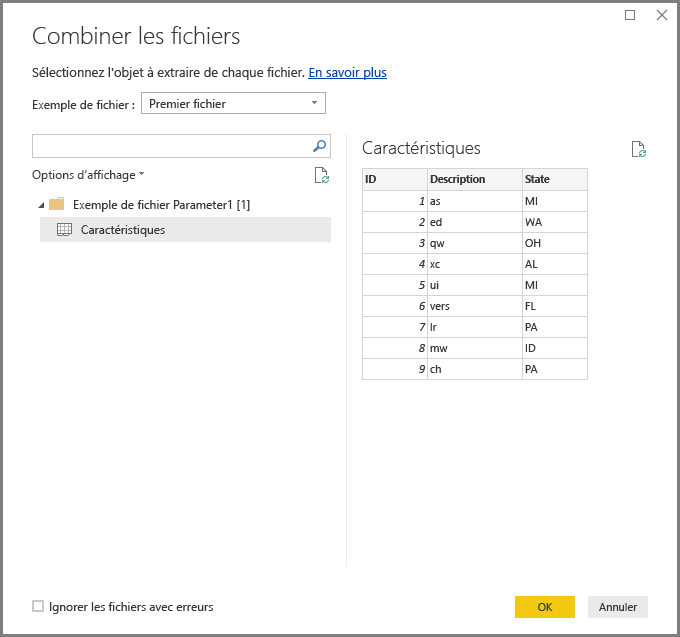
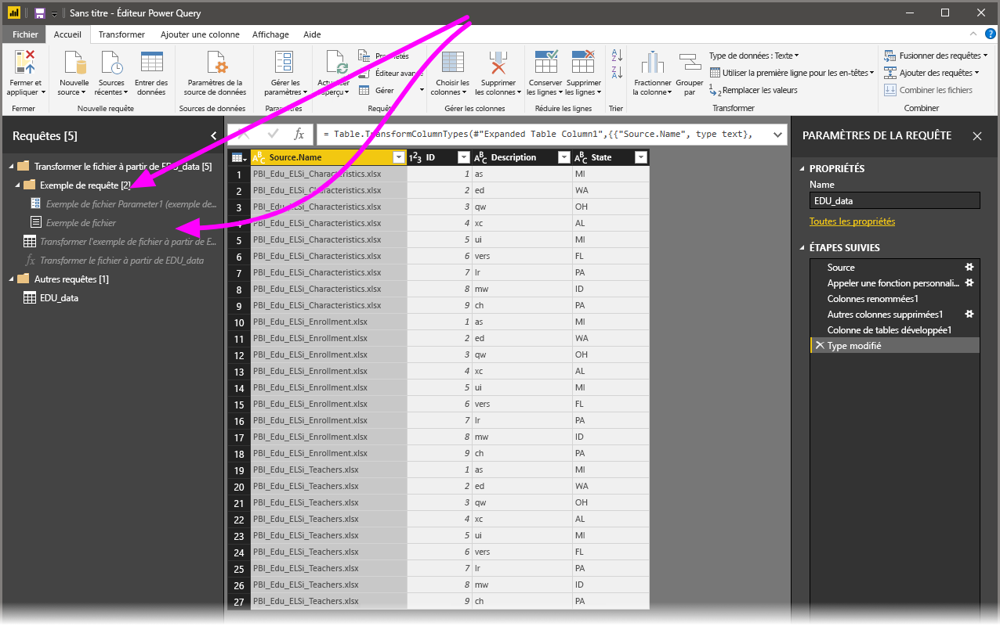

# Combiner des fichiers (binaires) dans Power BI Desktop
Une approche intéressante pour l’importation de données dans **Power BI Desktop** est de combiner plusieurs fichiers ayant le même schéma dans une seule table logique. Cette approche pratique et répandue a été rendue encore plus pratique et complète, comme décrit dans cet article.

Pour lancer le processus de combinaison de fichiers à partir du même dossier, sélectionnez **Obtenir des données > Fichier > Dossier**.

## Comportement de la combinaison de fichiers
Vous pouvez **combiner des fichiers (binaires)** en sélectionnant **Combiner les fichiers** dans l’onglet du ruban **Accueil** de l’**Éditeur de requête** ou dans la colonne elle-même.

La transformation **Combiner les fichiers** se comporte comme suit :

* La transformation **Combiner des fichiers** analyse chaque fichier d’entrée et détermine le format de fichier à utiliser, par exemple, *texte*, *classeur Excel* ou *JSON*.
* La transformation vous permet de sélectionner un objet spécifique dans le premier fichier, par exemple un *classeur Excel*, à extraire.
  
  
* La transformation **Combiner des fichiers** effectue alors automatiquement les requêtes suivantes :
  
  * Crée un exemple de requête qui effectue toutes les étapes d’extraction requises dans un seul fichier.
  * Crée une *requête de fonction* qui ajuste l’entrée de fichier/binaire pour l’*exemple de requête*. L’exemple de requête et la requête de fonction sont liés afin que les modifications apportées à l’exemple de requête soient répercutées dans la requête de fonction.
  * Applique la *requête de fonction* à la requête d’origine avec les fichiers binaires d’entrée (par exemple la requête *Dossier*) : applique donc la requête de fonction pour les entrées binaires sur chaque ligne, puis développe l’extraction de données qui en résulte en tant que colonnes de niveau supérieur.
    
    

> [!NOTE]
> L’étendue de votre sélection dans un classeur Excel affecte le comportement de la combinaison de fichiers binaires. Par exemple, vous pouvez sélectionner une feuille de calcul spécifique pour combiner cette feuille de calcul ou sélectionner la racine pour combiner le fichier complet. La sélection d’un dossier combine les fichiers figurant dans ce dossier. 

Avec le comportement de **Combiner des fichiers**, il est facile de combiner tous les fichiers d’un dossier donné, à condition qu’ils aient le même type et la même structure de fichier (par exemple les mêmes colonnes).

En outre, vous pouvez appliquer des étapes de transformation ou d’extraction supplémentaires en modifiant *l’exemple de requête* créé automatiquement sans avoir à modifier ou à créer d’autres étapes de *requête de fonction*. Les modifications apportées à *l’exemple de requête* sont automatiquement générées dans la *requête de fonction* liée.

## Étapes suivantes
Vous pouvez connecter toutes sortes de données à l’aide de Power BI Desktop. Pour plus d’informations sur les sources de données, consultez les ressources suivantes :

* [Qu’est-ce que Power BI Desktop ?](desktop-what-is-desktop.md)
* [Sources de données dans Power BI Desktop](desktop-data-sources.md)
* [Mettre en forme et combiner des données dans Power BI Desktop](desktop-shape-and-combine-data.md)
* [Se connecter à des fichiers CSV dans Power BI Desktop](desktop-connect-csv.md)   
* [Entrer des données directement dans Power BI Desktop](desktop-enter-data-directly-into-desktop.md)   

