# Tâches courantes relatives aux requêtes dans Power BI Desktop
Quand vous travaillez dans la fenêtre **Éditeur de requête** de Power BI Desktop, vous avez accès à un certain nombre de tâches courantes. Ce document décrit ces tâches courantes et fournit des liens pour plus d’informations. 

Les tâches courantes relatives aux requêtes illustrées ici sont les suivantes :

* Connectez-vous à vos données
* Mettre en forme et combiner des données
* Regrouper des lignes
* Créer un tableau croisé dynamique des colonnes
* Créer des colonnes personnalisées
* Utiliser des formules de requête

Nous allons utiliser plusieurs connexions de données pour effectuer ces tâches. Vous pouvez télécharger ces données ou vous y connecter, au cas où vous souhaiteriez parcourir ces tâches vous-même.

La première connexion de données est un classeur Excel. L’autre est une ressource web (également utilisée dans d’autres contenus d’aide de Power BI Desktop), accessible à partir d’ici :

[*http://www.bankrate.com/finance/retirement/best-places-retire-how-state-ranks.aspx*](http://www.bankrate.com/finance/retirement/best-places-retire-how-state-ranks.aspx)

Les étapes nécessaires pour se connecter à ces deux sources de données marquent le début des tâches courantes relatives aux requêtes.

## Connectez-vous à vos données
Pour vous connecter à des données dans Power BI Desktop, cliquez sur le bouton **Obtenir des données** sous l’onglet **Accueil** du ruban. Power BI Desktop présente un menu qui répertorie les sources de données les plus courantes. Pour obtenir la liste complète des sources de données auxquelles Power BI Desktop peut se connecter, sélectionnez le bouton **Autres...** en bas du menu. Pour plus d’informations, consultez [Sources de données dans Power BI Desktop](https://powerbi.uservoice.com/knowledgebase/articles/471643).

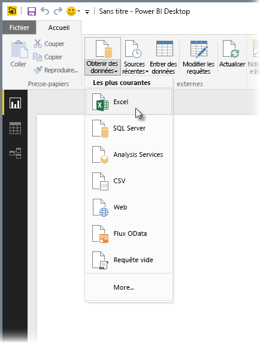

Pour commencer, sélectionnez **Excel** , accédez au classeur, puis sélectionnez-le. L’Éditeur de requête inspecte le classeur, puis présente les données qu’elle a trouvées dans la fenêtre **Navigateur** .

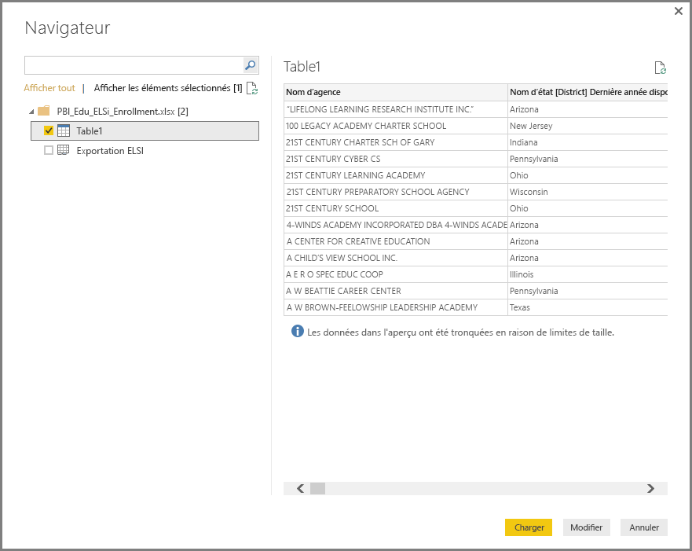

Vous pouvez sélectionner **Modifier la requête** pour ajuster, ou *mettre en forme* , les données avant de les charger dans Power BI Desktop. Modifier une requête avant le chargement s’avère particulièrement utile pour alléger les jeux de données volumineux. Nous voulons le faire, et nous sélectionnons **Modifier**.

Il est tout aussi facile de se connecter à différents types de données. Nous souhaitons également nous connecter à une ressource web. Sélectionnez **Obtenir des données \> Autres...**, puis **Autre \> Web**.

La fenêtre **À partir du web** s’affiche, où vous pouvez taper l’URL de la page web.

Sélectionnez **OK**, et comme auparavant, Power BI Desktop inspecte le classeur et présente les données qu’elle trouve dans la fenêtre **Navigateur** .

Les autres connexions de données sont similaires. Si l’authentification est nécessaire pour établir une connexion de données, Power BI Desktop vous invite à entrer les informations d’identification appropriées.

Pour obtenir une démonstration détaillée de la connexion à des données dans Power BI Desktop, consultez [Connect to Data in Power BI Desktop](https://powerbi.uservoice.com/knowledgebase/articles/471635) (Se connecter à des données dans Power BI Desktop).

## Mettre en forme et combiner des données
Vous pouvez facilement mettre en forme et combiner des données au moyen de l’Éditeur de requête. Cette section comprend quelques exemples de mise en forme des données. Pour obtenir une démonstration plus complète de la mise en forme et de la combinaison de données, consultez ****[Shape and Combine Data with Power BI Desktop](https://powerbi.uservoice.com/knowledgebase/articles/471644) (Mettre en forme et combiner des données dans Power BI Desktop).

Dans la section précédente, nous avons connecté deux jeux de données : un classeur Excel et une ressource web. Une fois ces derniers chargés, l’Éditeur de requête présente l’aspect suivant, la requête issue de la page web étant sélectionnée (parmi les requêtes disponibles répertoriées dans le volet **Requêtes** , à gauche de la fenêtre Éditeur de requête).

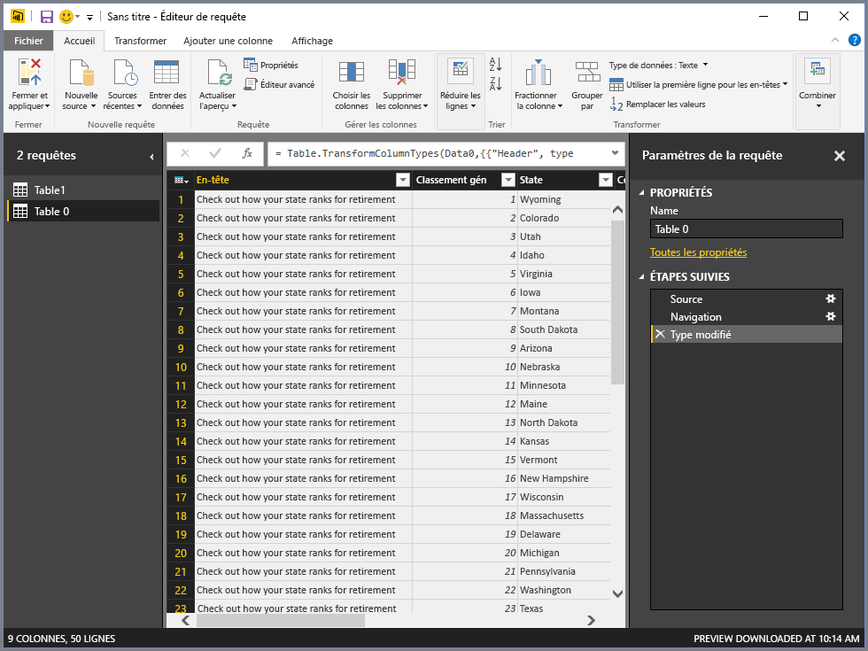

Quand vous mettez en forme les données, vous transformez une source de données en fonction de vos besoins. Dans notre cas, la première colonne intitulée *Header*étant superflue, nous allons la supprimer.

Dans l’ **Éditeur de requête**, de nombreuses commandes sont accessibles dans le ruban et dans un menu contextuel. Par exemple, quand je clique avec le bouton droit sur la colonne *Header* , le menu qui apparaît me permet de supprimer la colonne. Je pourrais également sélectionner la colonne, puis cliquer sur le bouton **Supprimer les colonnes** du ruban.

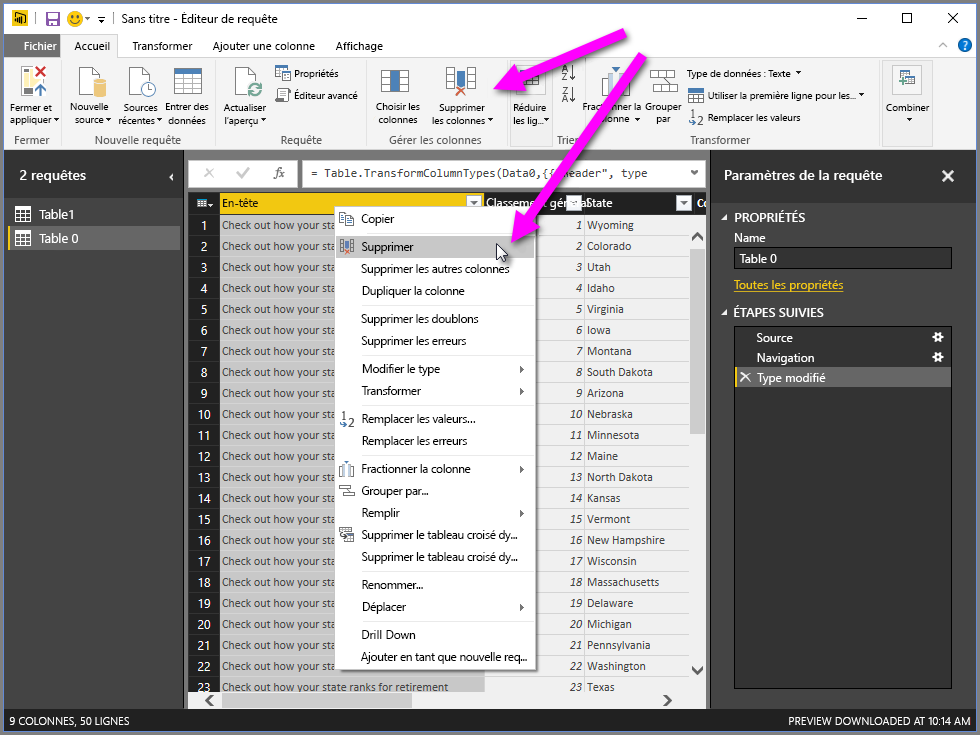

Il existe d’autres façons de mettre en forme les données dans cette requête. Je pourrais supprimer un nombre quelconque de lignes à partir du haut ou du bas, ajouter des colonnes, fractionner des colonnes, remplacer des valeurs et effectuer d’autres tâches de mise en forme pour indiquer à l’Éditeur de requête d’obtenir les données comme je le souhaite.

## Regrouper des lignes
Dans l’Éditeur de requête, vous pouvez regrouper les valeurs de plusieurs lignes en une seule valeur. Cela peut être utile pour récapituler le nombre de produits proposés, le total des ventes ou le nombre d’étudiants.

Dans cet exemple, nous regroupons des lignes dans un jeu de données d’inscription à des études. Les données se trouvent dans un classeur Excel et ont été mises en forme dans l’Éditeur de requête pour obtenir uniquement les colonnes dont nous avons besoin, puis la table a été renommée et quelques autres transformations ont été effectuées.

Nous allons rechercher le nombre d’organismes (y compris les secteurs scolaires et autres organismes d’éducation) que compte chaque État. Nous sélectionnons la colonne *State Abbr* , puis nous cliquons sur le bouton **Regrouper par** situé sous l’onglet **Transformer** ou **Accueil** du ruban (**Regrouper par** est disponible sous les deux onglets).

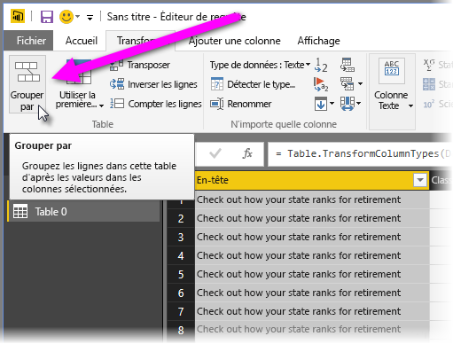

La fenêtre **Regrouper par...** s’affiche. Quand l’Éditeur de requête regroupe des lignes, elle crée une colonne dans laquelle elle place les résultats de l’opération **Regrouper par** . Vous pouvez ajuster l’opération **Regrouper par** comme suit :

1. *Regrouper par* : il s’agit de la colonne à regrouper ; l’Éditeur de requête choisit la colonne sélectionnée, mais vous pouvez dans cette fenêtre remplacer cette colonne par n’importe quelle colonne de la table.
2. *Nouveau nom de colonne* : l’Éditeur de requête suggère un nom pour la nouvelle colonne, en fonction de l’opération qu’elle applique à la colonne regroupée, mais vous pouvez nommer la nouvelle colonne comme vous le souhaitez.
3. *Opération* : ici, vous spécifiez l’opération appliquée par l’Éditeur de requête.
4. *Signes + et -* : vous pouvez effectuer des opérations d’agrégation (actions**Regrouper par** ) sur plusieurs colonnes et effectuer plusieurs agrégations, toutes dans la fenêtre **Regrouper par** et simultanément. L’Éditeur de requête crée une colonne (en fonction des sélections que vous avez effectuées dans cette fenêtre) qui implique plusieurs colonnes. Cliquez sur le bouton **+** pour ajouter des colonnes ou des agrégations à une opération **Regrouper par**. Vous pouvez supprimer une colonne ou une agrégation en cliquant sur l’icône – ; essayez donc et regardez ce que cela donne. 
   
   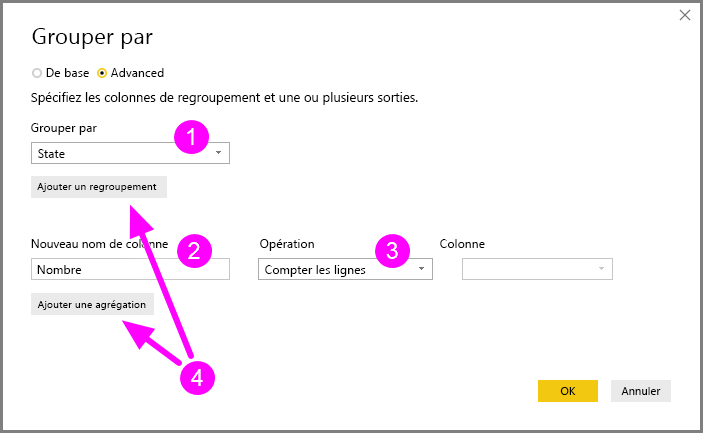

Quand nous sélectionnons **OK**, l’Éditeur de requête effectue l’opération **Regrouper par** et retourne les résultats. Eh bien, regardez ça : l’Ohio, le Texas, l’Illinois et la Californie comptent chacun plus de mille organismes !

De plus, avec l’Éditeur de requête, vous pouvez toujours supprimer la dernière opération de mise en forme en cliquant sur l’icône **X** en regard de l’étape qui vient de se terminer. Profitez-en pour faire des essais, effectuez de nouveau l’étape si les résultats ne vous conviennent pas, jusqu’à ce que l’Éditeur de requête mette en forme vos données exactement comme vous le souhaitez.

## Créer un tableau croisé dynamique des colonnes
Avec Power BI Desktop, vous pouvez créer un tableau croisé dynamique des colonnes et générer une table qui contient des valeurs agrégées pour chaque valeur unique dans une colonne. Par exemple, si vous avez besoin de savoir combien de produits différents compte chaque catégorie de produits, vous pouvez rapidement créer une table à cette fin.

Examinons un exemple. La table **Products** suivante a été mise en forme pour afficher uniquement chaque produit unique (par nom) et la catégorie à laquelle chaque produit appartient. Pour créer une table qui affiche un nombre de produits pour chaque catégorie (d’après la colonne *CategoryName* ), sélectionnez la colonne, puis sélectionnez **Colonne de tableau croisé dynamique** sous l’onglet **Transformer** du ruban.

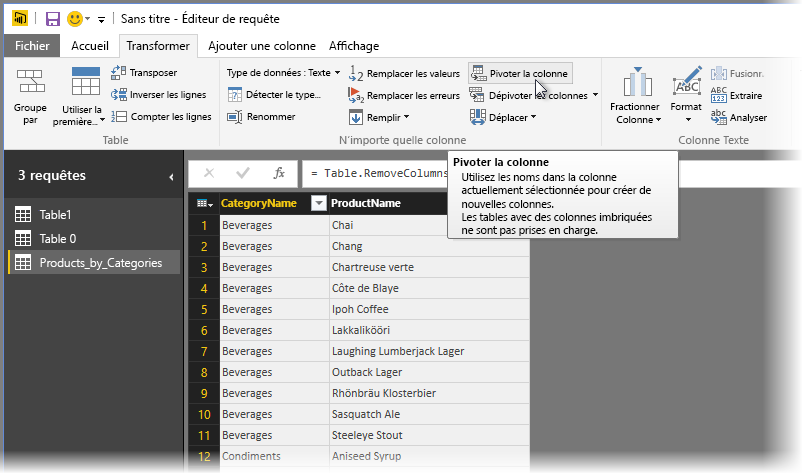

La fenêtre **Colonne de tableau croisé dynamique** s’affiche, vous informant que les valeurs de la colonne permettront de créer des colonnes (1), et quand vous développez **Options avancées** (2), vous pouvez sélectionner la fonction à appliquer aux valeurs agrégées (3).

Quand vous cliquez sur **OK**, l’Éditeur de requête affiche la table selon les instructions de transformation fournies dans la fenêtre **Colonne de tableau croisé dynamique** .

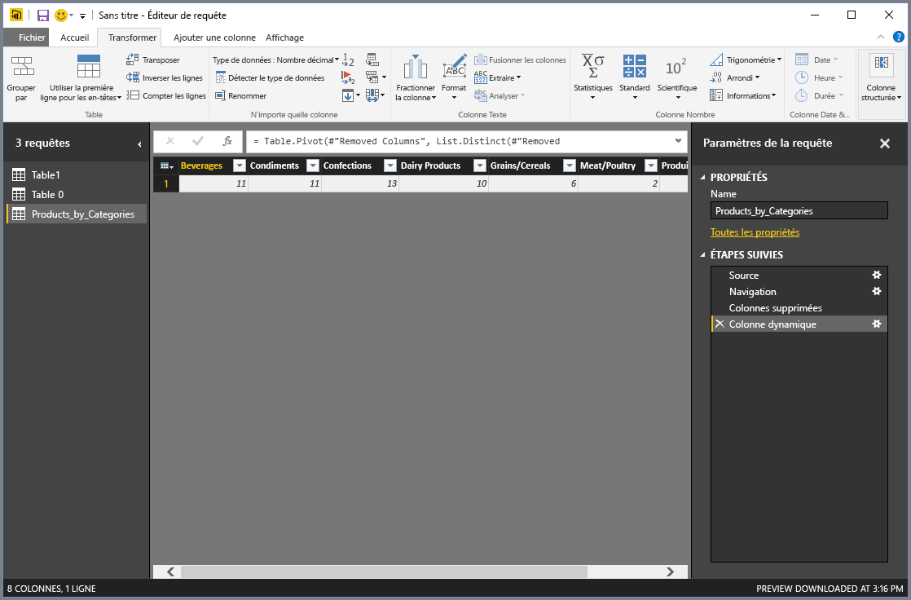

## Créer des colonnes personnalisées
Dans l’Éditeur de requête, vous pouvez créer des formules personnalisées qui impliquent plusieurs colonnes de votre table, puis placer les résultats de ces formules dans une nouvelle colonne (personnalisée). L’Éditeur de requête facilite la création de colonnes personnalisées.

Dans l’Éditeur de requête, sélectionnez **Ajouter une colonne personnalisée** sous l’onglet **Ajouter une colonne** du ruban.

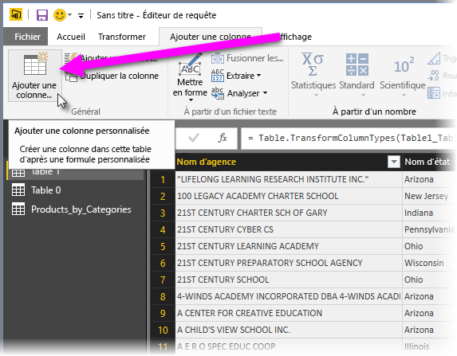

La fenêtre suivante s’affiche. Dans l’exemple suivant, nous créons une colonne personnalisée appelée *Percent ELL* qui calcule le pourcentage d’étudiants qui sont des apprenants de la langue anglaise (ELL, English Language Learners).

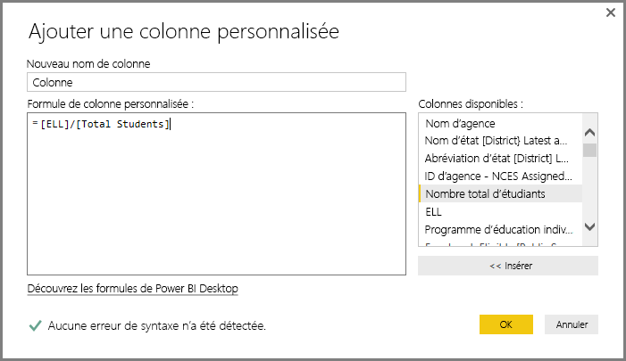

Comme toute autre étape appliquée dans l’Éditeur de requête, si la nouvelle colonne personnalisée ne fournit pas les données que vous recherchez, vous pouvez simplement supprimer l’étape de la section **Étapes appliquées** du volet **Paramètres d’une requête** en sélectionnant l’icône **X** en regard de l’étape **Personnalisée ajoutée** .

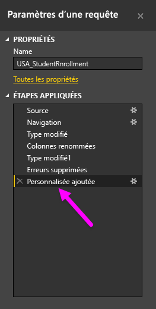

## Utiliser des formules de requête
Vous pouvez modifier les étapes générées par l’Éditeur de requête, et vous pouvez créer des formules personnalisées pour contrôler avec précision la connexion à vos données et leur mise en forme. Chaque fois que l’Éditeur de requête effectue une action sur les données, la formule associée à l’action s’affiche dans la **barre de formule**. Pour afficher la **barre de formule**, cochez la case en regard de **Barre de formule** sous l’onglet **Affichage** du ruban.

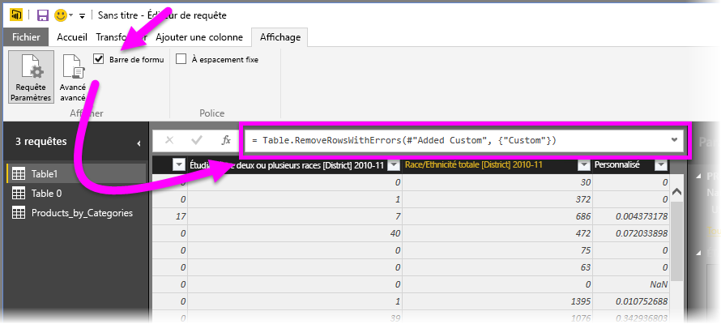

L’Éditeur de requête conserve toutes les étapes appliquées pour chaque requête sous forme de texte que vous pouvez afficher ou modifier. Vous pouvez afficher ou modifier le texte de toute requête en utilisant l’ **Éditeur avancé**, qui apparaît quand vous sélectionnez **Éditeur avancé** sous l’onglet **Affichage** du ruban.

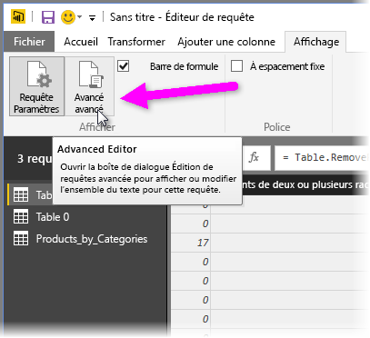

Voici un aperçu de l’**Éditeur avancé**, où figurent les étapes associées à la requête **USA\_StudentEnrollment** affichée. Ces étapes sont créées dans le langage de formule Power Query, souvent appelé **M**. Pour plus d’informations, consultez [En savoir plus sur les formules Power Query](https://support.office.com/article/Learn-about-Power-Query-formulas-6bc50988-022b-4799-a709-f8aafdee2b2f?ui=en-US&rs=en-US&ad=US). Pour afficher la spécification du langage proprement dite, téléchargez le document [Microsoft Power Query for Excel Formula Language Specification](http://go.microsoft.com/fwlink/?linkid=320633) (Spécification du langage de formule Microsoft Power Query pour Excel).

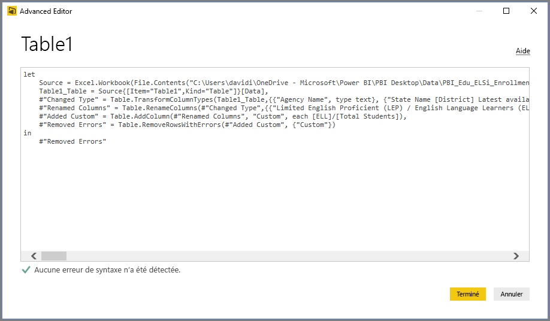

Power BI Desktop fournit un ensemble complet de catégories de formules. Pour en savoir plus et pour obtenir des informations de référence complètes sur toutes les formules disponibles dans l’Éditeur de requête, consultez [Power Query Formula Categories](https://support.office.com/en-in/article/Power-Query-formula-categories-125024ec-873c-47b9-bdfd-b437f8716819) (Catégories de formules Power Query).

Les catégories de formules pour l’Éditeur de requête sont les suivantes :

* Number
  * Constantes
  * Informations
  * Conversion et mise en forme
  * Format
  * Arrondi
  * Opérations
  * Nombre aléatoire
  * Trigonométrie
  * Octets
* Text
  * Informations
  * Comparaisons de texte
  * Extraction
  * Modification
  * Appartenance
  * Transformations
* Logical
* Date
* Time
* DateTime
* DateTimeZone
* Duration
* Record
  * Informations
  * Transformations
  * Sélection
  * Sérialisation
* List
  * Informations
  * Sélection
  * Transformation
  * Appartenance
  * Opérations sur les ensembles
  * Classement
  * Moyennes
  * Ajout
  * Fonctions numériques
  * Générateurs
* Table
  * Création de table
  * Conversions
  * Informations
  * Opérations sur les lignes
  * Opérations sur les colonnes
  * Appartenance
* Valeurs
* Opérations arithmétiques
* Types de paramètres
* Métadonnées
* Accès aux données
* URI
* Formats binaires
  * Lecture de nombres
* Binary
* Lines
* Expression
* Function
* Error
* Comparer
* Splitter
* Combiner
* Replacer
* Type

## Étapes suivantes
Power BI Desktop vous permet d’effectuer des tâches très diverses. Pour plus d’informations sur ses fonctionnalités, passez en revue les ressources suivantes :

* [Prise en main de Power BI Desktop](desktop-getting-started.md)
* [Présentation des requêtes dans Power BI Desktop](desktop-query-overview.md)
* [Sources de données dans Power BI Desktop](desktop-data-sources.md)
* [Se connecter aux données dans Power BI Desktop](desktop-connect-to-data.md)
* [Mettre en forme et combiner des données dans Power BI Desktop](desktop-shape-and-combine-data.md)

