# Mise en forme conditionnelle dans les tables 
Avec la mise en forme conditionnelle des tables, vous pouvez spécifier des couleurs de cellule personnalisées en fonction des valeurs des cellules, ou en fonction d’autres valeurs ou champs, et notamment utiliser des couleurs de dégradé. Vous pouvez également afficher les valeurs des cellules avec des barres de données. 

Pour accéder à la mise en forme conditionnelle, dans la zone **Champs** du volet **Visualisations** de Power BI Desktop, sélectionnez la flèche vers le bas à côté de la valeur dans la zone **Valeurs** que vous voulez mettre en forme (ou cliquez avec le bouton droit sur le champ). Vous pouvez uniquement gérer la mise en forme conditionnelle des champs dans la zone **Valeurs** de la zone **Champs**.

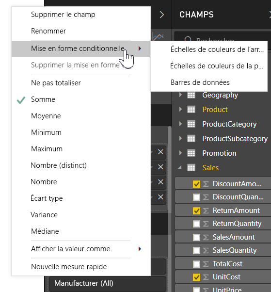

Les sections suivantes décrivent chacune de ces trois options de mise en forme conditionnelle. Vous pouvez combiner une ou plusieurs options dans une même colonne de table.

> [!NOTE]
> Appliquée à une table, la mise en forme conditionnelle remplace les styles de table personnalisés appliqués aux cellules soumises à une mise en forme conditionnelle.

Pour supprimer la mise en forme conditionnelle d’une visualisation, il suffit de cliquer à nouveau avec le bouton droit sur le champ, et de sélectionner **Supprimer la mise en forme conditionnelle**, puis le type de mise en forme à supprimer.

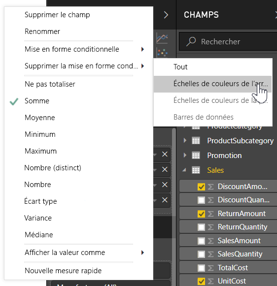

## Nuances de couleurs de l’arrière-plan

Le fait de sélectionner **Mise en forme conditionnelle**, puis **Échelles de couleurs de l’arrière-plan**, affiche la boîte de dialogue suivante.

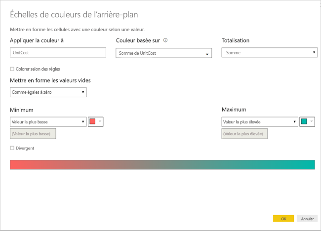

Vous pouvez sélectionner un champ de votre modèle de données sur lequel baser les couleurs en définissant **Couleur basée sur** sur ce champ. En outre, vous pouvez spécifier le type d’agrégation pour le champ sélectionné avec la valeur **Résumé**. Le champ à mettre en couleur est spécifié dans le champ **Appliquer la couleur à**, ce qui vous permet d’en garder la trace. Vous pouvez appliquer une mise en forme conditionnelle à des champs de date et de texte, à condition de choisir une valeur numérique comme base de la mise en forme.

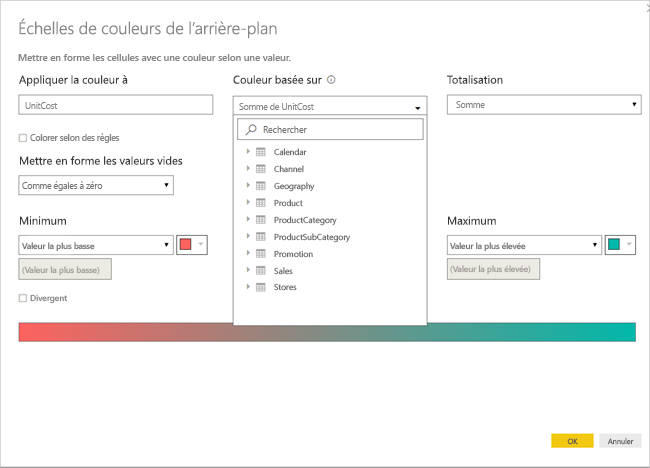

Pour utiliser des valeurs de couleur discrètes pour des plages de valeurs données, sélectionnez **Colorer selon des règles**. Pour utiliser un spectre de couleurs, laissez **Colorer selon des règles** non cochée. 

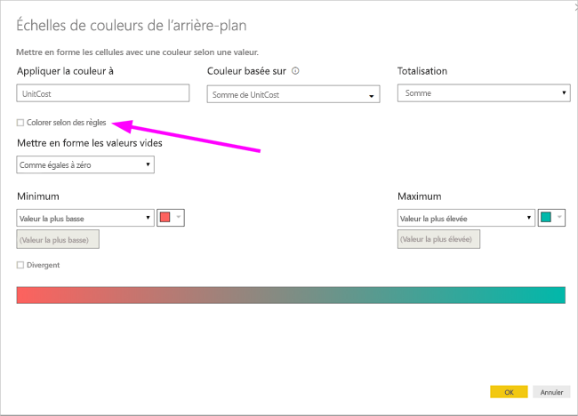

### Colorer selon des règles

Quand vous sélectionnez **Colorer selon des règles**, vous pouvez entrer une ou plusieurs plages de valeurs, chacune avec une couleur définie.  Chaque plage de valeurs commence par une condition *Si la valeur*, une condition de valeur *et* et une couleur.

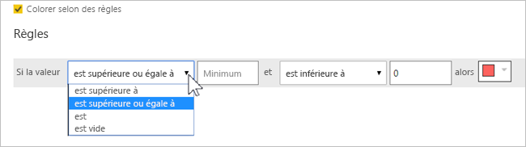

Les cellules du tableau avec des valeurs comprises dans chaque plage apparaissent avec la couleur donnée. Trois règles sont présentes dans l’illustration suivante.

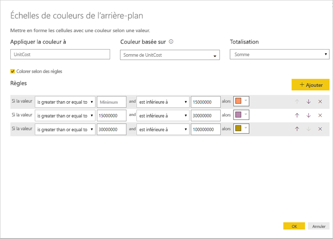

L’exemple de tableau se présente maintenant comme ceci :

### Colorer du minimum au maximum

Vous pouvez configurer les valeurs *Minimum* et *Maximum* et leurs couleurs. Si vous sélectionnez la zone **Divergent**, vous pouvez également configurer une valeur *Centrale* en option.

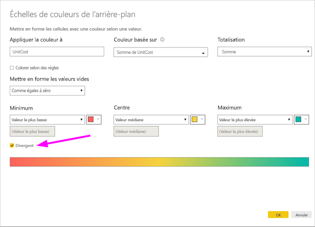

L’exemple de tableau se présente maintenant comme ceci :

## Échelles de couleurs de la police

Le fait de sélectionner **Mise en forme conditionnelle**, puis **Échelles de couleurs de la police**, affiche la boîte de dialogue suivante. Cette boîte de dialogue est similaire à la boîte de dialogue **Échelles de couleurs de l’arrière-plan**, mais elle change la couleur de la police au lieu de la couleur d’arrière-plan de la cellule.

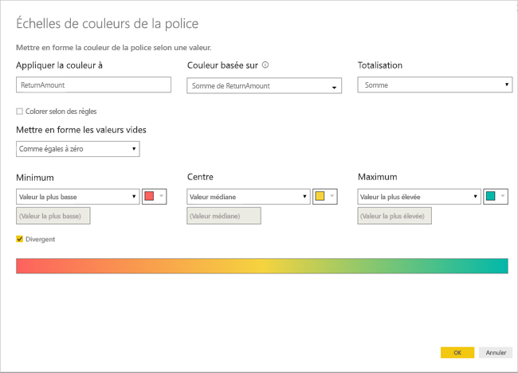

L’exemple de tableau se présente maintenant comme ceci :

## Barres de données

Le fait de sélectionner **Mise en forme conditionnelle**, puis **Barres de données**, affiche la boîte de dialogue suivante. 

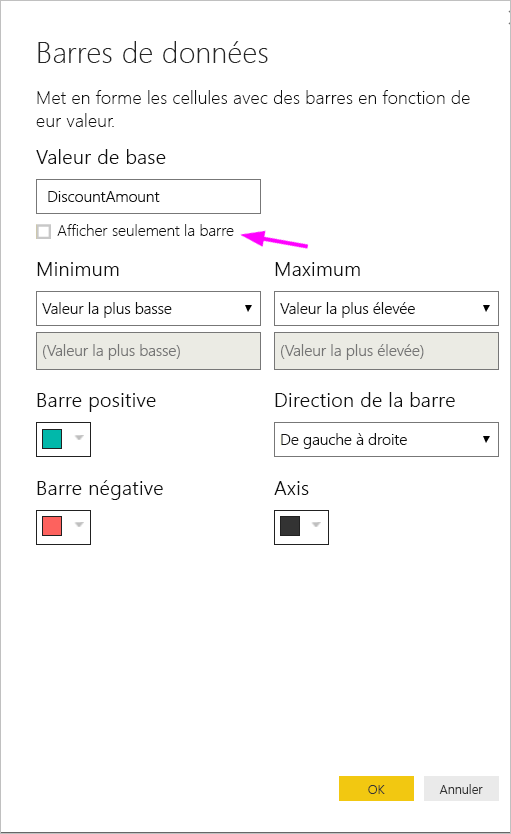

Par défaut, l’option **Afficher seulement la barre** est décochée : la cellule du tableau montre donc à la fois la barre et la valeur réelle.

Si l’option **Afficher seulement la barre** est cochée, la cellule du tableau montre seulement la barre.

## Mise en forme des couleurs en fonction de la valeur du champ

Vous pouvez utiliser une mesure ou une colonne avec une couleur spécifique en utilisant une valeur de texte ou un code hexadécimal, pour appliquer cette couleur à l’arrière-plan de la couleur de police d’un visuel de table ou de matrice. Vous pouvez également créer une logique personnalisée pour un champ donné et utiliser cette logique pour appliquer la couleur souhaitée à la police ou à l’arrière-plan.

Par exemple, dans le tableau suivant, une couleur est associée à chaque modèle de produit. 

Pour mettre en forme cette cellule en fonction de sa valeur de champ, sélectionnez la boîte de dialogue **Mise en forme conditionnelle** en cliquant sur la colonne *Couleur* pour ce visuel et sélectionnez dans le cas présent **Couleur d’arrière-plan**  dans le menu. 

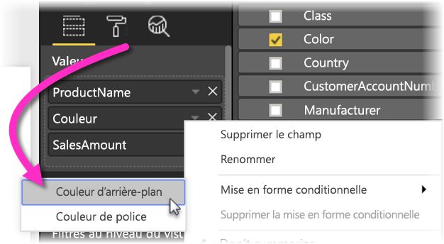

Dans la boîte de dialogue qui apparaît, sélectionnez **Valeur du champ** dans la zone de liste déroulante **Mettre en forme par**, comme illustré dans l’image suivante.

Vous pouvez répéter ce processus pour la couleur de police : le résultat dans le visuel est alors une couleur unie dans la colonne **Couleur**, comme illustré dans l’écran suivant.

Vous pouvez également créer un calcul DAX basé sur la logique métier, qui génère des codes hexadécimaux différents en fonction de conditions de votre choix. C’est généralement plus facile que de créer plusieurs règles dans la boîte de dialogue Mise en forme conditionnelle. Considérons le champ *ColorKPI* dans l’exemple d’image suivant.

Vous pouvez ensuite définir la valeur du champ pour **Couleur d’arrière-plan** de la façon suivante.

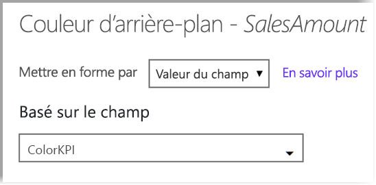

Vous pouvez alors obtenir des résultats comme la matrice suivante.

Vous pouvez créer de nombreuses autres variations, avec simplement votre imagination et un peu de code DAX.

## Étapes suivantes
Pour plus d’informations, consultez l’article suivant :  

* [Trucs et astuces pour la mise en forme des couleurs dans Power BI](service-tips-and-tricks-for-color-formatting.md)  

