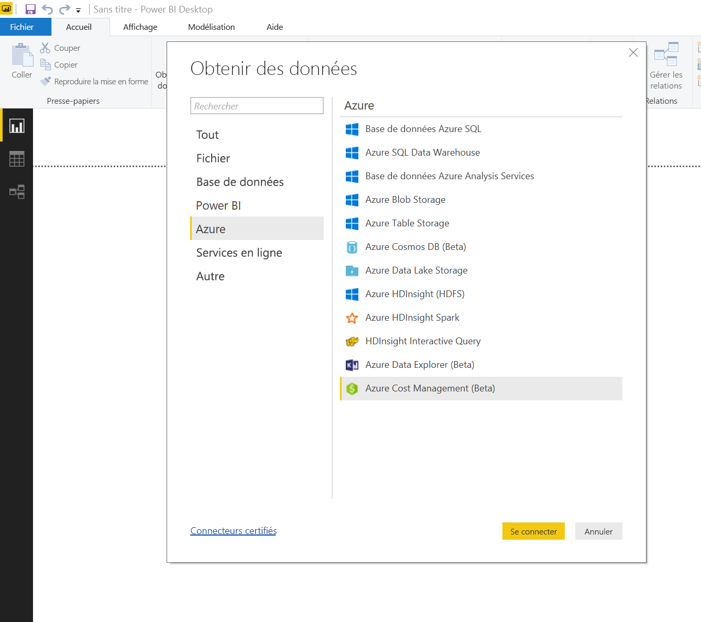
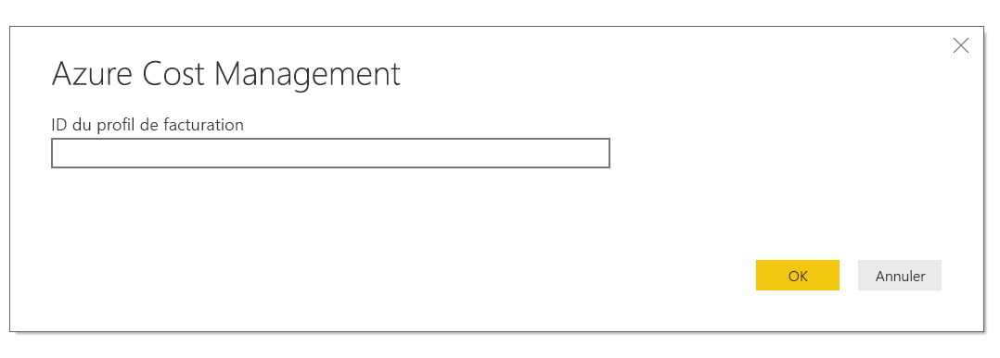
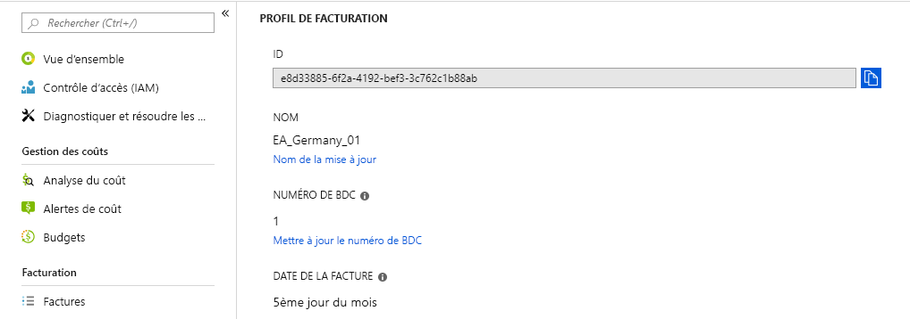
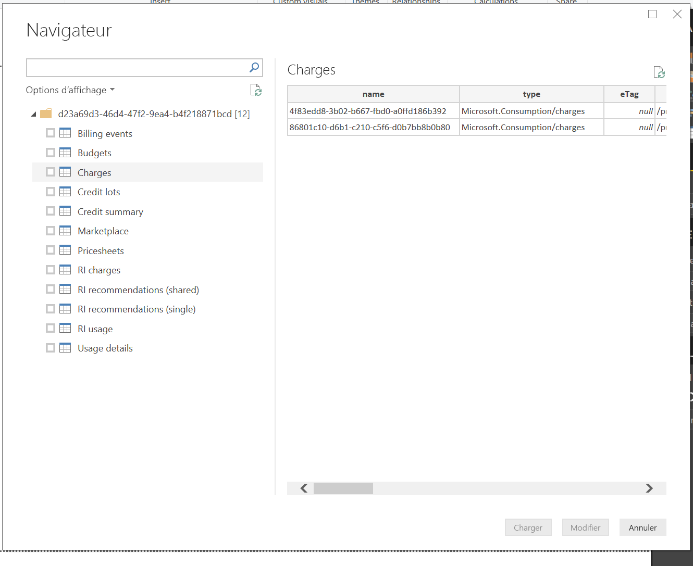
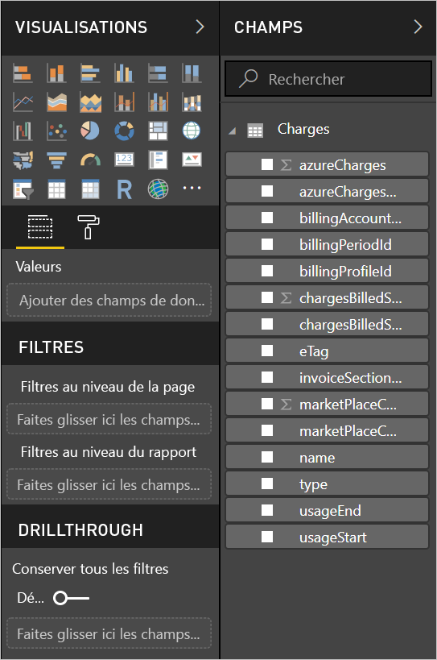

# <a name="analyze-azure-cost-and-usage-data-in-power-bi-desktop"></a>Analyser les données sur les coûts et l’utilisation d’Azure dans Power BI Desktop

Vous pouvez utiliser Power BI Desktop pour vous connecter à Azure et obtenir des données détaillées sur l’utilisation des services Azure dans votre organisation. Avec ces données, vous pouvez créer des mesures et des rapports personnalisés qui vous aident à mieux comprendre et analyser vos dépenses Azure.

Power BI prend actuellement en charge la connexion aux comptes de facturation Contrat Entreprise et Contrat Client.

* Les utilisateurs ayant un **Contrat Entreprise** doivent se connecter avec le **connecteur Azure Consumption Insights** (ci-dessous).

* Les utilisateurs ayant un **Contrat Entreprise** doivent se connecter avec le [**connecteur Azure Cost Management**](#connect-with-azure-cost-management).

## <a name="connect-with-azure-consumption-insights"></a>Se connecter à l’aide d’Azure Consumption Insights

Azure Consumption Insights vous permet de vous connecter aux comptes de facturation Contrat Entreprise Azure.

Dans cette section, vous découvrez comment obtenir les données que vous devez migrer avec le connecteur Azure Enterprise. Vous trouverez également un mappage des *colonnes de détails d’utilisation* disponibles dans l’API **ACI** (Azure Consumption Insights).

Pour pouvoir utiliser le connecteur **Azure Consumption Insights**, vous devez avoir accès aux fonctionnalités Entreprise du portail Azure.

Pour utiliser le connecteur **Azure Consumption Insights** dans **Power BI Desktop** : 

1. Dans le ruban **Accueil**, sélectionnez **Obtenir des données**.

1. Dans les catégories de gauche, sélectionnez **Services en ligne**.  

1. Sélectionnez **Microsoft Azure Consumption Insights (Bêta)** . 

1. Sélectionnez **Se connecter**.

   

   Dans la boîte de dialogue qui s’affiche, entrez votre **Numéro d’inscription Azure**.

   

   * Vous pouvez trouver celui-ci sur le portail [Azure Enterprise Portal](https://ea.azure.com), à l’emplacement montré dans l’image suivante :

  

   Cette version du connecteur prend en charge seulement les inscriptions d’entreprise depuis https://ea.azure.com. Les inscriptions en Chine ne sont pas prises en charge actuellement.

   Ensuite, entrez votre *Clé d’accès* pour établir la connexion.

   

   * Votre clé d’accès pour l’inscription est disponible sur le portail [Microsoft Azure Enterprise Portal](https://ea.azure.com).

  

Une fois que vous avez entré votre *Clé d’accès* et sélectionné **Se connecter**, une fenêtre **Navigateur** apparaît et montre neuf tables disponibles :

| Table        | Description |
|------------- | -------------------------------------------------------------|
| **Budgets** | Informations budgétaires permettant de comparer les coûts et l’utilisation réels aux objectifs budgétaires. |
| **MarketPlace** | Coûts de la Place de marché Azure en fonction de l’utilisation. |
| **PriceSheets** | Tarifs applicables par compteur pour une inscription. |
| **RICharges** | Coûts associés à vos instances réservées au cours des 24 derniers mois. |
| **RIRecommendations_Single** | Recommandations d’achat d’instances réservées en fonction des tendances de votre utilisation sur un seul abonnement au cours des 7, 30 ou 60 derniers jours. |
| **RIRecommendations_Shared** | Recommandations d’achat d’instances réservées en fonction des tendances de votre utilisation sur tous vos abonnements au cours des 7, 30 ou 60 derniers jours. |
| **RIUsage** | Informations sur la consommation de vos instances réservées existantes au cours du mois dernier. |
| **Summaries** | Récapitulatif mensuel des soldes, des nouveaux achats, des coûts des services de la Place de marché Azure, des ajustements et des dépassements de coûts. |
| **UsageDetails** | Répartition des quantités consommées et des coûts d’inscription estimés. |

Vous pouvez activer une case à cocher en regard d’une table pour afficher un aperçu. Vous pouvez sélectionner une ou plusieurs tables en cochant la case en regard de leur nom, puis sélectionner **Charger**.


> [!NOTE]
> Les tableaux *Résumé* et *Grille tarifaire* sont disponibles seulement pour la clé d’API au niveau inscription. De plus, les données de ces tables sont, par défaut, celles du mois en cours pour l’*Utilisation* et la *Grille tarifaire*. Les tables *Résumé* et *Place de marché* ne sont pas limitées au mois en cours.
>
>

Quand vous sélectionnez **Charger**, les données sont chargées dans **Power BI Desktop**.


Une fois les données sélectionnées chargées, les tables et les champs que vous avez sélectionnés sont visibles dans le volet **Champs**.


## <a name="using-azure-consumption-insights"></a>Utilisation d’Azure Consumption Insights
Pour utiliser le connecteur **Azure Consumption Insights**, vous accédez aux fonctionnalités Entreprise du portail Azure.

Une fois les données chargées avec le connecteur **Azure Consumption Insights**, vous pouvez créer vos propres mesures et colonnes personnalisées avec l’**Éditeur de requête**. Vous pouvez également créer des visuels, des rapports et des tableaux de bord à partager dans le **service Power BI**.

Avec une requête vide, vous pouvez récupérer une collection d’exemples de requêtes personnalisées Azure. Vous pouvez la récupérer de deux façons : 

Dans **Power BI Desktop** : 

1. Sélectionnez le ruban **Accueil** 
2. Sélectionnez **Obtenir des données** > **Requête vide** 

Ou bien, dans l'**Éditeur de requêtes** : 

1. Cliquez avec le bouton droit dans le volet gauche **Requêtes** 
2. Sélectionnez **Nouvelle requête > Requête vide** dans le menu qui s’affiche

Dans la **Barre de formule**, tapez :

    = MicrosoftAzureConsumptionInsights.Contents

L’illustration suivante montre une collection d’exemples qui apparaît.


Quand vous utilisez des rapports et que vous créez des requêtes, vous pouvez :

* Pour définir le nombre de mois à partir de la date actuelle, utilisez *numberOfMonth*.
  * Utilisez une valeur comprise entre 1 et 36. Représentez le nombre de mois que vous voulez importer à partir de la date actuelle. Nous vous recommandons de ne pas obtenir plus de 12 mois de données. Cette limite permet d’éviter les contraintes d’importation des requêtes et les seuils de volumes de données de Power BI.
* Pour définir une période de mois dans une fenêtre de temps historique, utilisez *startBillingDataWindow* et *endBillingDataWindow*.
* N’utilisez pas *numberOfMonth* avec *startBillingDataWindow* ou *endBillingDataWindow*

## <a name="migrate-from-the-azure-enterprise-connector"></a>Migrer à partir du connecteur Azure Enterprise

Certains clients ont créé des visuels avec le *connecteur Azure Enterprise (Bêta)* . À un moment donné, il sera remplacé par le connecteur **Azure Consumption Insights**. Le nouveau connecteur a les fonctionnalités et améliorations suivantes :

* Sources de données supplémentaires disponibles pour la *Synthèse de solde* et les *Achats sur la Place de marché*.
* Paramètres nouveaux et avancés, tels que *startBillingDataWindow* et *endBillingDataWindow*.
* Performances et réactivité améliorées.

Les étapes suivantes montrent comment effectuer la transition vers le connecteur **Azure Consumption Insights**. Ces étapes préservent le travail que vous avez déjà effectué lors de la création de tableaux de bord ou de rapports personnalisés.

### <a name="step-1-connect-to-azure-using-the-new-connector"></a>Étape 1 : Se connecter à Azure à l’aide du nouveau connecteur
La première étape consiste utiliser le connecteur **Azure Consumption Insights** précédemment décrit en détail dans cet article. Dans le cadre de cette étape, dans le ruban **Accueil** de **Power BI Desktop**, sélectionnez **Obtenir des données > Requête vide**.

### <a name="step-2-create-a-query-in-advanced-editor"></a>Étape 2 : Créer une requête dans l’Éditeur avancé
Dans l’**Éditeur de requête**, sélectionnez **Éditeur avancé** dans la section **Requête** du ruban **Accueil**. Dans la fenêtre **Éditeur avancé** qui apparaît, entrez cette requête :

    let    
        enrollmentNumber = "100",
        optionalParameters = [ numberOfMonth = 6, dataType="DetailCharges" ],
        data = MicrosoftAzureConsumptionInsights.Contents(enrollmentNumber, optionalParameters)   
    in     
        data


Vous devez remplacer la valeur *enrollmentNumber* par votre numéro d’inscription. Vous pouvez obtenir votre numéro auprès d’[Azure Enterprise Portal](https://ea.azure.com). Le paramètre *numberOfMonth* spécifie le nombre de mois de données sur lesquels vous voulez revenir à partir de la date actuelle. Utilisez zéro (0) pour le mois en cours.

Quand vous sélectionnez **Terminé** dans la fenêtre **Éditeur avancé**, l’aperçu est actualisé pour afficher les données de la plage de mois spécifiée dans la table. Sélectionnez **Fermer & appliquer**, puis appuyez sur Entrée.

### <a name="step-3-move-measures-and-custom-columns-to-the-new-report"></a>Étape 3 : Déplacer les mesures et les colonnes personnalisées vers le nouveau rapport
Vous devez ensuite déplacer les colonnes ou mesures personnalisées que vous avez créées vers la nouvelle table des détails. Voici comment procéder.

1. Ouvrez l’application Bloc-notes (ou un autre éditeur de texte).
2. Sélectionnez la mesure à déplacer, puis copiez le texte du champ *Formule* et collez-le dans l’application Bloc-notes.

   
3. Remplacez *Query1* par le nom de la table des détails d’origine.
4. Pour créer des mesures de table et des colonnes personnalisées, cliquez avec le bouton droit sur votre table, puis choisissez **Nouvelle mesure**. Ensuite, coupez et collez chacune de vos mesures et colonnes stockées.

### <a name="step-4-relink-tables-that-had-relationships"></a>Étape 4 : Lier à nouveau les tables qui avaient des relations
De nombreux tableaux de bord comportent des tables supplémentaires qui sont utilisées pour la recherche ou le filtrage, telles que des tables de dates ou des tables destinées à des projets personnalisés. Le rétablissement de ces relations résout la plupart des problèmes restants. Voici comment procéder.

- Sous l’onglet **Modélisation** de **Power BI Desktop**, sélectionnez **Gérer les relations** pour afficher une fenêtre permettant de gérer les relations au sein du modèle. Liez à nouveau vos tables en fonction des besoins.

    

### <a name="step-5-verify-your-visuals-and-adjust-field-formatting-as-needed"></a>Étape 5 : Vérifier vos visuels et ajuster la mise en forme des champs au besoin
À ce stade, la plupart de vos visuels, tables et vues détaillées d’origine devraient fonctionner comme prévu. Toutefois, certaines modifications mineures peuvent être nécessaires pour en mettre en forme avec précision l’apparence. Prenez un peu de temps pour jeter un coup d’œil à chacun de vos tableaux de bord et visuels pour vérifier qu’ils s’affichent comme vous le souhaitez.

## <a name="using-the-azure-consumption-and-insights-aci-api-to-get-consumption-data"></a>Utilisation de l’API ACI (Azure Consumption Insights) pour obtenir des données de consommation
Azure fournit également l’[ **API ACI (Azure Consumption Insights)** ](https://azure.microsoft.com/blog/announcing-general-availability-of-consumption-and-charge-apis-for-enterprise-azure-customers/). L’API ACI vous permet de créer vos propres solutions personnalisées pour la collecte et la visualisation d’informations, ainsi que la création de rapports.

### <a name="mapping-names-and-usage-details-between-the-portal-the-connector-and-the-api"></a>Mappage des noms et des détails d’utilisation entre le portail, le connecteur et l’API
Les colonnes et les noms des détails sur le portail Azure sont similaires dans l’API et dans le connecteur, mais pas toujours identiques. Pour aider à la clarification, le tableau suivant en fournit un mappage. Il spécifie également si des colonnes sont obsolètes. Pour plus d’informations et des définitions de ces termes, consultez le [dictionnaire des données de facturation d’Azure](https://docs.microsoft.com/azure/billing/billing-enterprise-api-usage-detail).

| Connecteur ACI / ContentPack ColumnName | Nom de colonne dans l’API ACI | Nom de colonne dans EA | Obsolète / présent pour la compatibilité descendante |
| --- | --- | --- | --- |
| AccountName |accountName |Account Name |Non |
| AccountId |accountId | |Oui |
| AcccountOwnerId |accountOwnerEmail |AccountOwnerId |Non |
| AdditionalInfo |additionalInfo |AdditionalInfo |Non |
| AdditionalInfold | | |Oui |
| Consumed Quantity |consumedQuantity |Consumed Quantity |Non |
| Consumed Service |consumedService |Consumed Service |Non |
| ConsumedServiceId |consumedServiceId | |Oui |
| Cost |cost |ExtendedCost |Non |
| Cost Center |costCenter |Cost Center |Non |
| Date |date |Date |Non |
| Jour | |Jour |Non |
| DepartmentName |departmentName |Department Name |Non |
| DepartmentID |departmentId | |Oui |
| Instance ID | | |Oui |
| InstanceId |instanceId |Instance ID |Non |
| Emplacement | | |Oui |
| Meter Category |meterCategory |Meter Category |Non |
| Meter ID | | |Oui |
| Meter Name |meterName |Meter Name |Non |
| Meter Region |meterRegion |Meter Region |Non |
| Meter Sub-Category |meterSubCategory |Meter Sub-Category |Non |
| MeterId |meterId |Meter ID |Non |
| Mois | |Mois |Non |
| Produit |product |Produit |Non |
| ProductId |productId | |Oui |
| Groupe de ressources |resourceGroup |Groupe de ressources |Non |
| Resource Location |resourceLocation |Resource Location |Non |
| ResourceGroupId | | |Oui |
| ResourceLocationId |resourceLocationId | |Oui |
| ResourceRate |resourceRate |ResourceRate |Non |
| ServiceAdministratorId |serviceAdministratorId |ServiceAdministratorId |Non |
| ServiceInfo1 |serviceInfo1 |ServiceInfo1 |Non |
| ServiceInfo1Id | | |Oui |
| ServiceInfo2 |serviceInfo2 |ServiceInfo2 |Non |
| ServiceInfo2Id | | |Oui |
| Store Service Identifier |storeServiceIdentifier |Store Service Identifier |Non |
| StoreServiceIdentifierId | | |Oui |
| Nom de l’abonnement |subscriptionName |Nom de l’abonnement |Non |
| Étiquettes |tags |Étiquettes |Non |
| TagsId | | |Oui |
| Unit Of Measure |unitOfMeasure |Unit Of Measure |Non |
| Année | |Année |Non |
| SubscriptionId |subscriptionId |SubscriptionId |Oui |
| SubscriptionGuid |subscriptionGuid |SubscriptionGuid |Non |

## <a name="connect-with-azure-cost-management"></a>Se connecter à l’aide d’Azure Cost Management

Cette section explique comment vous connecter à votre compte de facturation Contrat Client.

> [!NOTE]
> Le connecteur Azure Cost Management prend actuellement en charge les clients bénéficiant du **Contrat Client**.  Les clients ayant un compte **Contrat Entreprise** doivent utiliser le connecteur Microsoft Azure Consumption Insights.
>
>

Pour utiliser le connecteur **Azure Cost Management** dans **Power BI Desktop** :

1. Dans le ruban **Accueil**, sélectionnez **Obtenir des données**.

1. Dans les catégories à gauche, sélectionnez **Azure**.

1. Sélectionnez **Azure Cost Management (Bêta)** à droite.

1. Sélectionnez **Se connecter**.


   

   Dans la boîte de dialogue qui s’affiche, entrez votre **ID de profil de facturation**.

   

Vous pouvez obtenir votre ID de profil de facturation auprès du [portail Azure](https://portal.azure.com) :

1. Accédez à **Gestion des coûts + facturation**.

1. Sélectionnez votre compte de facturation.

1. Sélectionnez **Profils de facturation** dans la barre latérale.

1. Sélectionnez votre profil de facturation.

1. Sélectionnez **Propriétés** dans la barre latérale.

1. Copiez l’ID de votre profil de facturation.

   

   Vous êtes alors invité à vous connecter en utilisant votre adresse e-mail et votre mot de passe Azure.  Une fois que vous êtes authentifié, vous voyez une fenêtre **Navigateur** avec 12 tables disponibles :

| Table        | Description |
|-------------------- | -------------------------------------------------------------|
| **Événements de facturation** | Journal des événements liés aux nouvelles factures, achats de crédits, etc. |
| **Budgets** | Informations budgétaires permettant de comparer les coûts et l’utilisation réels aux objectifs budgétaires. |
| **Coûts** | Un récapitulatif mensuel de l’utilisation d’Azure, des coûts de la Place de marché et des coûts facturés séparément. |
| **Lots de crédits** | Informations sur les achats de lots de crédits Azure pour le profil de facturation spécifié. |
| **Récapitulatif des crédits** | Récapitulatif des crédits pour le profil de facturation spécifié. |
| **Place de marché** | Coûts de la Place de marché Azure en fonction de l’utilisation. |
| **Grilles tarifaires** | Tarifs applicables par compteur pour le profil de facturation spécifié. |
| **Coûts des instances réservées** | Coûts associés à vos instances réservées au cours des 24 derniers mois. |
| **Recommandations d’instances réservées (uniques)** | Recommandations d’achat d’instances réservées en fonction des tendances de votre utilisation sur un seul abonnement au cours des 7, 30 ou 60 derniers jours. |
| **Recommandations d’instances réservées (partagées)** | Recommandations d’achat d’instances réservées en fonction des tendances de votre utilisation sur tous vos abonnements au cours des 7, 30 ou 60 derniers jours. |
| **Utilisation des instances réservées** | Informations sur la consommation de vos instances réservées existantes au cours du mois dernier. |
| **Détails de l’utilisation** | Une répartition des quantités consommées et des coûts estimés pour l’ID de profil de facturation indiqué. |

Vous pouvez cocher une case en regard d’une table pour en afficher un aperçu.  Vous pouvez sélectionner une ou plusieurs tables en cochant la case en regard de leur nom et en sélectionnant **Charger**.



Quand vous sélectionnez **Charger**, les données sont chargées dans **Power BI Desktop**.


Une fois les données sélectionnées chargées, les tables et les champs que vous avez sélectionnés sont visibles dans le volet **Champs**.



Regardez [comment analyser les dépenses dans Power BI avec Azure Consumption Insights](https://www.youtube.com/watch?v=QKBMXXrlpEk). Cette vidéo explique comment examiner vos données de coût dans Power BI Desktop en utilisant le connecteur Azure Consumption Insights.

## <a name="writing-custom-queries"></a>Création de requêtes personnalisées

Vous pouvez créer une [requête M](/powerquery-m/power-query-m-reference) personnalisée pour personnaliser le nombre de mois, changer de version d’API ou appliquer une logique plus avancée sur les données retournées.

Dans **Power BI Desktop** :

1. Sélectionnez le ruban **Accueil**
2. Sélectionnez **Obtenir des données** > **Requête vide**

Ou bien, dans l'**Éditeur de requêtes** :

1. Cliquez avec le bouton droit dans le volet gauche **Requêtes**
2. Sélectionnez **Nouvelle requête > Requête vide** dans le menu qui s’affiche

Dans la **barre de formule**, tapez ce qui suit, en remplaçant `billingProfileId` par votre ID réel et "charges" par le nom d’une table valide (voir la liste ci-dessus).

```
let
    Source = AzureCostManagement.Tables(billingProfileId, [ numberOfMonths = 3 ]),
    charges = Source{[Key="charges"]}[Data]
in
    charges
```

En plus de remplacer `numberOfMonths` par une autre valeur comprise entre 1 et 36, vous pouvez aussi spécifier :

* `apiVersion` pour personnaliser la version d’API appelée par la requête.
* `lookbackWindow`, afin de changer la période pour laquelle des recommandations d’instances réservées (uniques ou partagées) sont générées (options possibles : 7, 30 ou 60 jours).

## <a name="next-steps"></a>Étapes suivantes

Vous pouvez vous connecter à de nombreuses sources de données différentes à l’aide de Power BI Desktop. Pour plus d’informations, consultez les articles suivants :

* [Qu’est-ce que Power BI Desktop ?](desktop-what-is-desktop.md)
* [Sources de données dans Power BI Desktop](desktop-data-sources.md)
* [Mettre en forme et combiner des données dans Power BI Desktop](desktop-shape-and-combine-data.md)
* [Se connecter à des classeurs Excel dans Power BI Desktop](desktop-connect-excel.md)   
* [Entrer des données directement dans Power BI Desktop](desktop-enter-data-directly-into-desktop.md)   
