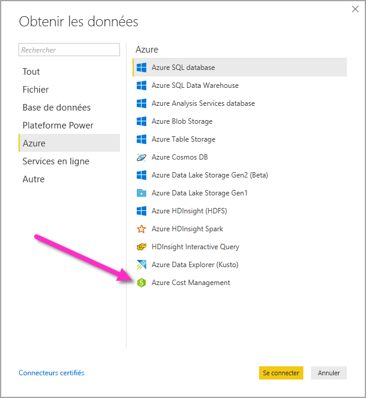

# Créer des visuels et des rapports avec le connecteur Azure Cost Management dans Power BI Desktop

Vous pouvez utiliser le connecteur Azure Cost Management pour Power BI Desktop pour créer des visualisations et des rapports puissants et personnalisés qui vous aideront à mieux comprendre vos dépenses Azure. Le connecteur Azure Cost Management prend actuellement en charge les clients disposant d’un [Contrat client Microsoft](https://azure.microsoft.com/pricing/purchase-options/microsoft-customer-agreement/) ou d’un [Contrat Entreprise](https://azure.microsoft.com/pricing/enterprise-agreement/).  

Le connecteur Azure Cost Management utilise la norme OAuth 2.0 pour l’authentification auprès d’Azure et identifie les utilisateurs qui vont utiliser le connecteur. Les jetons générés dans ce processus sont valides pour une période spécifique. Power BI conserve le jeton pour la connexion suivante. OAuth 2.0 est une norme encadrant le processus d’arrière-plan qui garantit la gestion sécurisée de ces autorisations. Pour vous connecter, vous devez utiliser un compte [Administrateur Entreprise](https://docs.microsoft.com/azure/billing/billing-understand-ea-roles) pour les Contrats Entreprise ou un [Propriétaire de compte de facturation](https://docs.microsoft.com/azure/billing/billing-understand-mca-roles) pour les Contrats clients Microsoft. 

> [!NOTE]
> Ce connecteur remplace les connecteurs précédemment disponibles [Azure Consumption Insights et Azure Cost Management (bêta)](desktop-connect-azure-consumption-insights.md). Tous les rapports créés avec le connecteur précédent doivent être recréés à l’aide de ce connecteur.

## Se connecter avec Azure Cost Management

Pour utiliser le **connecteur Azure Cost Management** dans Power BI Desktop, procédez comme suit :

1.  Dans le ruban **Accueil**, sélectionnez **Obtenir des données**.
2.  Sélectionnez **Azure** dans la liste des catégories de données.
3.  Sélectionnez **Azure Cost Management**.

    

4. Dans la boîte de dialogue qui s’affiche, entrez votre **ID de profil de facturation** pour les **Contrats clients Microsoft**, ou votre **Numéro d’inscription** pour les **Contrats Entreprise**. 

## Se connecter à un compte de contrat client Microsoft 

Pour vous connecter avec un compte de **Contrat client Microsoft**, vous pouvez obtenir votre **ID de profil de facturation** à partir du portail Azure :

1.  Dans le [portail Azure](https://portal.azure.com/), accédez à **Gestion des coûts + facturation**.
2.  Sélectionnez votre profil de facturation. 
3.  Sous **Paramètres** dans le menu, sélectionnez **Propriétés** dans la barre latérale.
4.  Sous **Profil de facturation**, copiez **l’ID**. 
5.  Pour **Choisir l’étendue**, sélectionnez **ID du profil de facturation** et collez l’ID du profil de facturation de l’étape précédente. 
6.  Entrez le nombre de mois et sélectionnez **OK** .

    

7.  Lorsque vous y êtes invité, connectez-vous avec votre compte d’utilisateur et votre mot de passe Azure. 

## Se connecter à un compte Contrat Entreprise

Pour vous connecter avec un compte Contrat Entreprise, vous pouvez récupérer votre ID d’inscription à partir du portail Azure :

1.  Dans le [portail Azure](https://portal.azure.com/), accédez à **Gestion des coûts + facturation**.
2.  Sélectionnez votre compte de facturation.
3.  Dans le menu **Vue d’ensemble**, copiez **l’ID de compte de facturation**.
4.  Pour **Choisir l’étendue**, sélectionnez **Numéro d’inscription** et collez l’ID du compte de facturation de l’étape précédente. 
5.  Entrez le nombre de mois, puis sélectionnez **OK** .

    

6.  Lorsque vous y êtes invité, connectez-vous avec votre compte d’utilisateur et votre mot de passe Azure. 

## Données disponibles par le biais du connecteur

Une fois que vous vous êtes correctement authentifié, une fenêtre de **Navigateur** s’affiche avec les tables de données disponibles suivantes :

| **Table** | **Description** |
| --- | --- |
| **Résumé du solde** | Résumé du solde pour les Contrats Entreprise. |
| **Événements de facturation** | Journal des événements liés aux nouvelles factures, achats de crédits, etc. Contrats clients Microsoft uniquement. |
| **Budgets** | Informations budgétaires permettant de comparer les coûts et l’utilisation réels aux objectifs budgétaires. |
| **Coûts** | Un récapitulatif mensuel de l’utilisation d’Azure, des coûts de la Place de marché et des coûts facturés séparément. Contrats clients Microsoft uniquement. |
| **Lots de crédits** | Informations sur les achats de lots de crédits Azure pour le profil de facturation spécifié. Contrats clients Microsoft uniquement. |
| **Grilles tarifaires** | Tarifs applicables par compteur pour le profil de facturation spécifié ou sur l’inscription de Contrat Entreprise. |
| **Coûts des instances réservées** | Coûts associés à vos instances réservées au cours des 24 derniers mois. |
| **Recommandations d’instances réservées (partagées)** | Recommandations d’achat d’instances réservées en fonction des tendances de votre utilisation sur tous vos abonnements au cours des 7, 30 ou 60 derniers jours. |
| **Recommandations d’instances réservées (uniques)** | Recommandations d’achat d’instances réservées en fonction des tendances de votre utilisation sur un seul abonnement au cours des 7, 30 ou 60 derniers jours. |
| **Détails de l’utilisation des instances réservées** | Informations sur la consommation de vos instances réservées existantes au cours du mois dernier. |
| **Récapitulatif de l’utilisation des instances réservées** | Pourcentage d'utilisation des réservation Azure quotidiennes. |
| **Détails de l’utilisation** | Une répartition des quantités consommées et des coûts estimés pour le profil de facturation indiqué sur l’inscription de Contrat Entreprise. |
| **Détails d’utilisation amortis** | Une répartition des quantités consommées et des coûts amortis estimés pour le profil de facturation indiqué sur l’inscription de Contrat Entreprise. |

Vous pouvez sélectionner une table pour afficher une boîte de dialogue d’aperçu. Vous pouvez sélectionner une ou plusieurs tables en sélectionnant la case en regard de leur nom, puis en sélectionnant **Charger**.

Quand vous sélectionnez **Charger**, les données sont chargées dans Power BI Desktop. 

Une fois les données sélectionnées chargées, les tables de données et les champs s’affichent dans le volet **Champs**.

## Étapes suivantes

Vous pouvez vous connecter à de nombreuses sources de données différentes à l’aide de Power BI Desktop. Pour plus d’informations, consultez les articles suivants :

* [Qu’est-ce que Power BI Desktop ?](desktop-what-is-desktop.md)
* [Sources de données dans Power BI Desktop](desktop-data-sources.md)
* [Mettre en forme et combiner des données dans Power BI Desktop](desktop-shape-and-combine-data.md)
* [Se connecter à des classeurs Excel dans Power BI Desktop](desktop-connect-excel.md)   
* [Entrer des données directement dans Power BI Desktop](desktop-enter-data-directly-into-desktop.md)   
