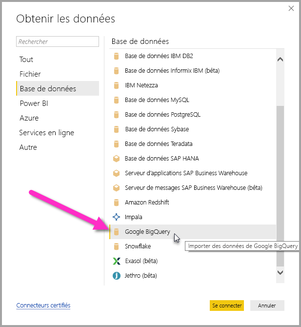
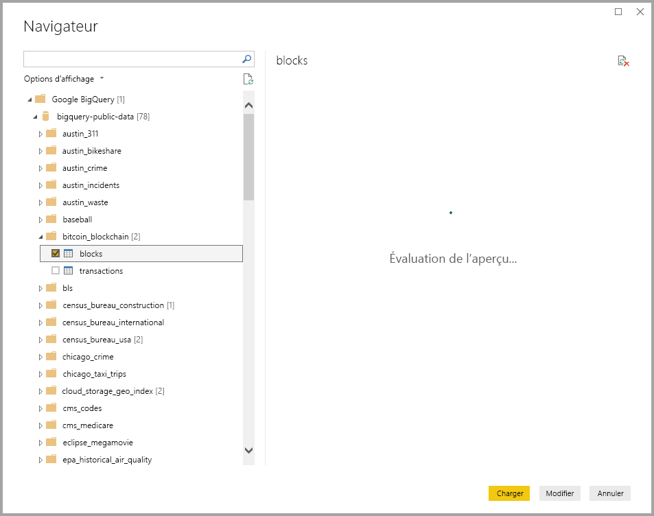

# <a name="connect-to-a-google-bigquery-database-in-power-bi-desktop"></a>Se connecter à une base de données Google BigQuery dans Power BI Desktop
Dans Power BI Desktop, vous pouvez vous connecter à une base de données Google **BigQuery** et utiliser les données sous-jacentes comme n’importe quelle autre source de données dans Power BI Desktop.

## <a name="connect-to-google-bigquery"></a>Se connecter à Google BigQuery
Pour vous connecter à une base de données Google **BigQuery**, sélectionnez **Obtenir des données** dans le ruban **Accueil** de Power BI Desktop. Sélectionnez **Base de données** dans les catégories à gauche pour afficher **Google BigQuery**.



Dans la fenêtre **Google BigQuery** qui s’affiche, connectez-vous à votre compte Google BigQuery et sélectionnez **Connect**.


Lorsque vous êtes connecté, vous voyez la fenêtre suivante qui indique que vous avez été authentifié. 


Une fois que vous êtes connecté, une fenêtre **Navigateur** apparaît et affiche les données disponibles sur le serveur. Vous pouvez ensuite sélectionner un ou plusieurs éléments à importer et utiliser dans **Power BI Desktop**.



## <a name="considerations-and-limitations"></a>Considérations et limitations
Il existe quelques limites et considérations à prendre en compte pour le connecteur Google **BigQuery** :

* Le connecteur Google BigQuery est disponible dans Power BI Desktop et dans le service Power BI. Dans le service Power BI, le connecteur est accessible à l’aide de la connexion cloud-à-cloud de Power BI à Google BigQuery.

Vous pouvez utiliser Power BI avec le **projet de facturation** Google BigQuery. Par défaut, Power BI utilise le premier projet de la liste retournée pour l’utilisateur. Pour personnaliser le comportement du projet de facturation quand vous l’utilisez avec Power BI, effectuez les étapes suivantes :

 * Spécifiez l’option suivante dans le M sous-jacent à l’étape Source, qui peut être personnalisée à l’aide de l’**éditeur Power Query** dans Power BI Desktop :

    ```Source = GoogleBigQuery.Database([BillingProject="Include-Billing-Project-Id-Here"])```

## <a name="next-steps"></a>Étapes suivantes
Vous pouvez connecter toutes sortes de données à l’aide de Power BI Desktop. Pour plus d’informations sur les sources de données, consultez les ressources suivantes :

* [Qu’est-ce que Power BI Desktop ?](desktop-what-is-desktop.md)
* [Sources de données dans Power BI Desktop](desktop-data-sources.md)
* [Mettre en forme et combiner des données dans Power BI Desktop](desktop-shape-and-combine-data.md)
* [Se connecter à des classeurs Excel dans Power BI Desktop](desktop-connect-excel.md)   
* [Entrer des données directement dans Power BI Desktop](desktop-enter-data-directly-into-desktop.md)   

