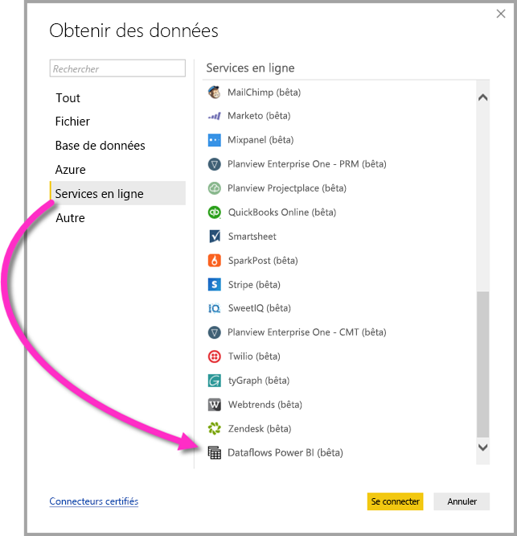

# Se connecter à des données créées par des dataflows Power BI dans Power BI Desktop (version bêta)
Dans **Power BI Desktop**, vous pouvez vous connecter à des données créées par des **dataflows Power BI** comme toute autre source de données dans Power BI Desktop.

Le connecteur **Dataflows Power BI (bêta)** vous permet d’établir des connexions à des entités créées par des dataflows dans le service Power BI. 

## Considérations et limitations

Pour utiliser cette version bêta du **connecteur Dataflows Power BI**, vous devez exécuter la version la plus récente de **Power BI Desktop**. Vous pouvez toujours [télécharger Power BI Desktop](desktop-get-the-desktop.md) et l’installer sur votre ordinateur pour être certain d’avoir la version la plus récente.  

> [!NOTE]
> La version précédente du connecteur Dataflows Power BI vous obligeait à télécharger un fichier .MEZ et à la placer dans un dossier. Les versions actuelles de **Power BI Desktop** incluent le connecteur Dataflows Power BI, de sorte que le fichier n’est plus nécessaire et peut entrer en conflit avec la version du connecteur incluse. Si vous avez manuellement placé le fichier .MEZ dans le dossier, vous *devez* supprimer ce fichier .MEZ téléchargé de votre dossier **Documents > Power BI Desktop > Connecteurs personnalisés** pour éviter tout conflit. 

## Performances de Power BI Desktop
**Power BI Desktop** s’exécute localement sur l’ordinateur sur lequel il est installé. Les performances d’ingestion de flux de données sont déterminées par plusieurs facteurs. Ces facteurs incluent la taille des données, le processeur et la mémoire RAM de votre ordinateur, la bande passante réseau, la distance depuis le centre de données et d’autres facteurs.

Vous pouvez améliorer les performances d’ingestion des données des flux de données. Par exemple, si la taille des données ingérées est trop grande pour permettre à **Power BI Desktop** de les gérer sur votre ordinateur, vous pouvez utiliser des entités liées et calculées dans le flux de données pour agréger les données (au sein de flux de données) et recevoir uniquement les données agrégées et préalablement préparées. De cette manière, le traitement de données volumineuses est effectué en ligne dans le flux de données et non localement dans votre instance en cours d’exécution de **Power BI Desktop**. Cette approche permet à Power BI Desktop d’ingérer de petites quantités de données et maintient la réactivité et la rapidité des flux de données.

## Étapes suivantes
Les flux de données Power BI permettent d’effectuer toutes sortes de choses intéressantes. Pour plus d’informations, consultez les ressources suivantes :

* [Préparation des données en libre-service avec des flux de données](service-dataflows-overview.md)
* [Créer et utiliser des flux de données dans Power BI](service-dataflows-create-use.md)
* [Utilisation d’entités calculées sur Power BI Premium (préversion)](service-dataflows-computed-entities-premium.md)
* [Utilisation de flux de données avec des sources de données locales (préversion)](service-dataflows-on-premises-gateways.md)
* [Ressources du développeur pour les flux de données Power BI (préversion)](service-dataflows-developer-resources.md)

Il existe également des articles sur **Power BI Desktop** qui peuvent vous être utiles :

* [Sources de données dans Power BI Desktop](desktop-data-sources.md)
* [Mettre en forme et combiner des données dans Power BI Desktop](desktop-shape-and-combine-data.md)
* [Entrer des données directement dans Power BI Desktop](desktop-enter-data-directly-into-desktop.md)   

