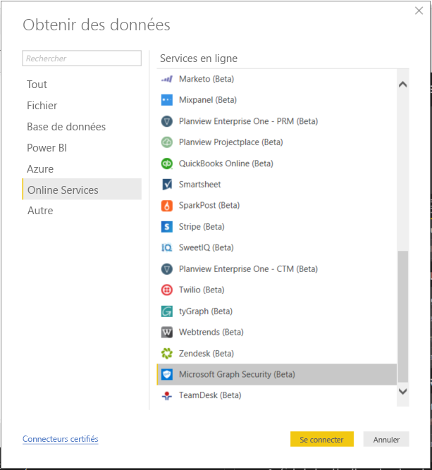

# Se connecter à Microsoft Graph Security dans Power BI Desktop

Vous pouvez utiliser Power BI Desktop pour vous connecter à l’API Microsoft Graph Security à l’aide du connecteur Microsoft Graph Security de Power BI. Cela vous permet de créer des tableaux de bord et des rapports qui fournissent des insights utiles sur vos [alertes](https://docs.microsoft.com/graph/api/resources/alert?view=graph-rest-1.0) de sécurité et le [degré de sécurisation](https://docs.microsoft.com/graph/api/resources/securescores?view=graph-rest-beta). L’[API Microsoft Graph Security](https://aka.ms/graphsecuritydocs) connecte [plusieurs solutions de sécurité](https://aka.ms/graphsecurityalerts) de Microsoft et de partenaires de l’écosystème afin de faciliter la corrélation des alertes, permettre l’accès à des informations contextuelles plus complètes et simplifier l’automatisation. De cette manière, les organisations peuvent rapidement obtenir des insights utiles et prendre les mesures appropriées pour leurs produits de sécurité, tout en réduisant le coût et la complexité de l’élaboration et de la maintenance d’intégrations multiples.

## Prérequis à la connexion à l’aide du connecteur Microsoft Graph Security

* Pour utiliser le connecteur Microsoft Graph Security, vous devez avoir *explicitement donné* à votre administrateur de locataire Azure Active Directory (AD) votre consentement, qui est une des [exigences d’authentification de Microsoft Graph Security](https://aka.ms/graphsecurityauth). Il nécessite de fournir le nom et l’ID d’application du connecteur Microsoft Graph Security de Power BI, informations que vous pouvez également trouver dans le [portail Azure](https://portal.azure.com) :

   | Propriété | Valeur |
   |----------|-------|
   | **Nom de l’application** | `MicrosoftGraphSecurityPowerBIConnector` |
   | **ID de l’application** | `cab163b7-247d-4cb9-be32-39b6056d4189` |
   |||

   Pour donner son consentement à l’utilisation du connecteur, votre administrateur de locataire Azure AD peut suivre ces étapes :

   * [Donner un consentement d’administrateur de locataire pour les applications Azure AD](https://docs.microsoft.com/azure/active-directory/develop/v2-permissions-and-consent).

   * À sa première exécution, votre application logique peut demander le consentement à votre administrateur de locataire Azure AD par le biais de l’[expérience de consentement de l’application](https://docs.microsoft.com/azure/active-directory/develop/application-consent-experience).
   
* Le compte d’utilisateur employé pour la connexion au connecteur Microsoft Graph Security de Power BI doit avoir le rôle administrateur limité Lecteur Sécurité dans Azure AD (Lecteur Sécurité ou Administrateur de la sécurité). Suivez les étapes décrites dans la section [Attribuer des rôles d’Azure AD aux utilisateurs](https://docs.microsoft.com/graph/security-authorization#assign-azure-ad-roles-to-users). 

## Utilisation du connecteur Microsoft Graph Security

Suivez ces étapes pour utiliser le connecteur **Microsoft Graph Security** :

1. Sélectionnez **Obtenir des données -> Plus…** dans le ruban **Accueil** de Power BI Desktop.
2. Sélectionnez **Services en ligne** dans les catégories à gauche.
3. Cliquez sur **Microsoft Graph Security (Bêta)**.

    
    
4. Dans la fenêtre **Microsoft Graph Security** qui s’affiche, sélectionnez la version de l’API Microsoft Graph que vous souhaitez interroger. Vous avez le choix entre la version 1.0 et la version bêta.

    
    
5. Connectez-vous à votre compte Azure Active Directory quand vous y êtes invité. Ce compte doit avoir le rôle **Lecteur Sécurité** comme indiqué dans la section des prérequis ci-dessus.

    
    
6. Si vous êtes l’administrateur du locataire, **et** que vous n’avez pas encore donné votre consentement pour utiliser le connecteur (application) Microsoft Graph Security de Power BI, ce qui est l’un des prérequis, vous voyez la boîte de dialogue suivante. Vous devez sélectionner **Consent on behalf of your organization** (Donner le consentement au nom de votre organisation).

    
    
7. Une fois que vous êtes connecté, vous voyez la fenêtre suivante qui indique que vous avez été authentifié. Sélectionnez **Se connecter**.

    
    
8. Après la connexion, une fenêtre **Navigateur** apparaît, comme dans l’exemple ci-dessous. Cette fenêtre affiche les entités, telles que les alertes, etc., qui sont disponibles dans l’[API Microsoft Graph Security](https://aka.ms/graphsecuritydocs) pour la version que vous avez sélectionnée dans les étapes précédentes. Sélectionnez une ou plusieurs entités à importer et utiliser dans **Power BI Desktop**. Cliquez sur **Charger** pour obtenir la vue des résultats illustrée à l’étape 10.

   
    
9. Si vous souhaitez envoyer une requête complexe à l’API Microsoft Graph Security, sélectionnez la fonction **Specify custom Microsoft Graph Security URL to filter results** (Spécifier une URL Microsoft Graph Security personnalisée pour filtrer les résultats). Cette fonction vous permet d’envoyer une requête [OData.Feed](https://docs.microsoft.com/power-bi/desktop-connect-odata) à l’API Microsoft Graph Security avec les autorisations requises pour accéder à l’API.

   > [!NOTE]
   > L’exemple de serviceUri utilisé ci-dessous est `https://graph.microsoft.com/v1.0/security/alerts?$filter=Severity eq 'High'`. Consultez la section sur les [paramètres de requête ODATA pris en charge par Graph](https://docs.microsoft.com/graph/query-parameters) pour savoir comment créer des requêtes afin de filtrer, classer ou récupérer la plupart des résultats récents.

   
    
   Quand vous sélectionnez **Invoke**, la fonction OData.Feed appelle l’API qui ouvre l’Éditeur de requête dans lequel vous pouvez filtrer et affiner le jeu de données que vous souhaitez utiliser, puis charger ce jeu de données affiné dans Power BI Desktop.

10. L’image suivante illustre la fenêtre de résultats pour l’entité ou les entités Microsoft Graph Security que vous avez demandées.

   
    

Vous êtes maintenant prêt à utiliser les données importées du connecteur Microsoft Graph Security dans Power BI Desktop pour créer des visuels et des rapports ou bien pour interagir avec les autres données auxquelles vous souhaitez vous connecter et que vous voulez importer, comme d’autres classeurs Excel ou bases de données, ou toute autre source de données.

## Étapes suivantes
* Consultez les exemples et modèles Power BI qui utilisent ce connecteur dans le [dépôt GitHub d’exemples Power BI pour Microsoft Graph Security](https://aka.ms/graphsecuritypowerbiconnectorsamples).

* Découvrez des scénarios utilisateur et des informations supplémentaires dans le [billet de blog sur le connecteur Microsoft Graph Security de Power BI](https://aka.ms/graphsecuritypowerbiconnectorblogpost).

* Vous pouvez connecter toutes sortes de données à l’aide de Power BI Desktop. Pour plus d’informations sur les sources de données, consultez les ressources suivantes :

    * [Qu’est-ce que Power BI Desktop ?](desktop-what-is-desktop.md)
    * [Sources de données dans Power BI Desktop](desktop-data-sources.md)
    * [Mettre en forme et combiner des données dans Power BI Desktop](desktop-shape-and-combine-data.md)
    * [Se connecter à des classeurs Excel dans Power BI Desktop](desktop-connect-excel.md)
    * [Entrer des données directement dans Power BI Desktop](desktop-enter-data-directly-into-desktop.md)
