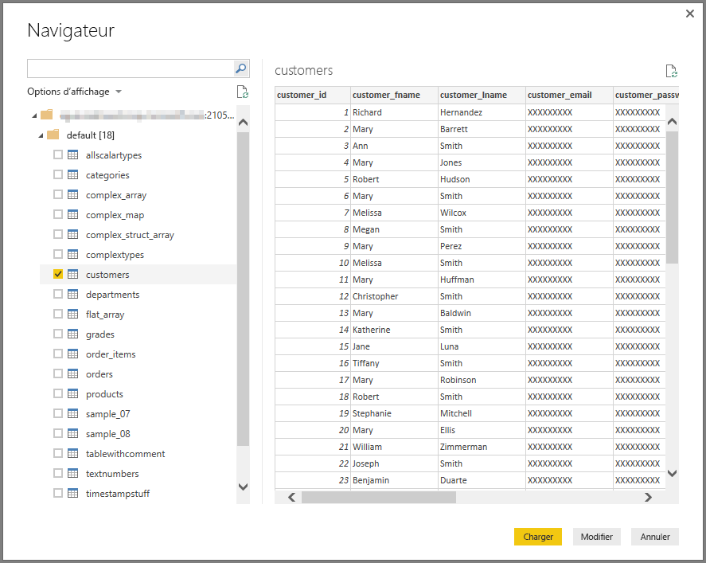

# Se connecter à une base de données Impala dans Power BI Desktop
Dans Power BI Desktop, vous pouvez vous connecter à une base de données **Impala** et utiliser les données sous-jacentes comme n’importe quelle autre source de données dans Power BI Desktop.

## Se connecter à une base de données Impala
Pour vous connecter à une base de données **Impala**, sélectionnez **Obtenir des données** dans le ruban **Accueil** de Power BI Desktop. Sélectionnez **Base de données** dans les catégories à gauche pour afficher **Impala**.

Dans la fenêtre **Impala** qui s’affiche, tapez ou collez l’URL de votre serveur Impala dans la zone, puis sélectionnez **OK**. Notez que vous pouvez choisir d’**importer** des données directement dans Power BI, ou utiliser **DirectQuery**. En savoir plus sur [l’utilisation de DirectQuery](desktop-use-directquery.md).

Lorsque vous y êtes invité, entrez vos informations d’identification, ou connectez-vous de façon anonyme. Le connecteur Impala prend en charge l’authentification anonyme, de base (nom d’utilisateur + mot de passe) et Windows.

> [!NOTE]
> Une fois que vous indiquez le nom d’utilisateur et le mot de passe d’un serveur **Impala** donné, Power BI Desktop les utilise dans les tentatives de connexion ultérieures. Pour modifier ces informations d’identification, accédez à **Fichier > Options et paramètres > Paramètres de la source de données**.
> 
> 

Une fois que vous êtes connecté, une fenêtre **Navigateur** apparaît et affiche les données disponibles sur le serveur. Vous pouvez ensuite sélectionner un ou plusieurs éléments à importer et utiliser dans **Power BI Desktop**.

## Considérations et limitations
Il existe quelques limites et considérations à prendre en compte pour le connecteur **Impala** :

* Le connecteur Impala est pris en charge sur la passerelle de données locale en utilisant l’un des trois mécanismes d’authentification pris en charge.

## Étapes suivantes
Vous pouvez connecter toutes sortes de données à l’aide de Power BI Desktop. Pour plus d’informations sur les sources de données, consultez les ressources suivantes :

* [Prise en main de Power BI Desktop](desktop-getting-started.md)
* [Sources de données dans Power BI Desktop](desktop-data-sources.md)
* [Mettre en forme et combiner des données dans Power BI Desktop](desktop-shape-and-combine-data.md)
* [Se connecter à des classeurs Excel dans Power BI Desktop](desktop-connect-excel.md)   
* [Entrer des données directement dans Power BI Desktop](desktop-enter-data-directly-into-desktop.md)   

