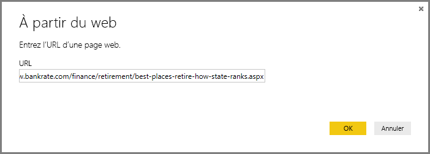
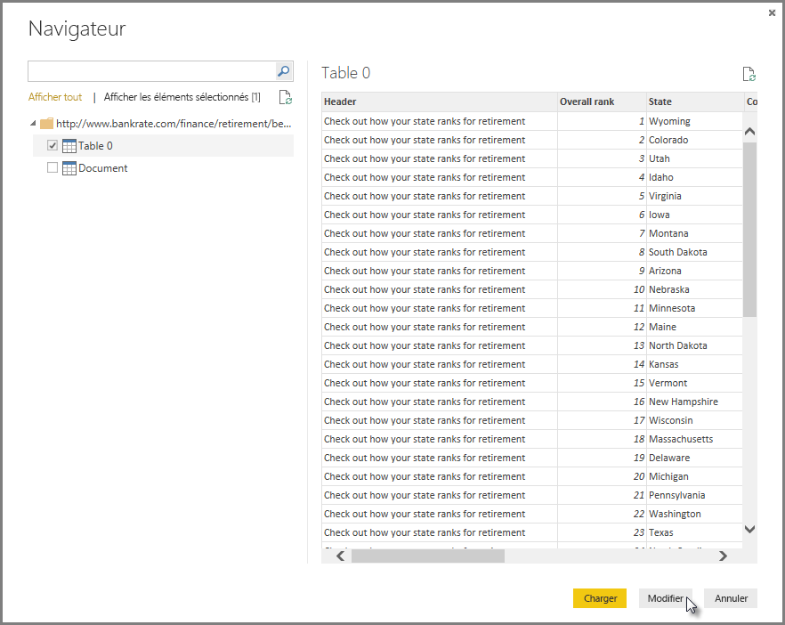
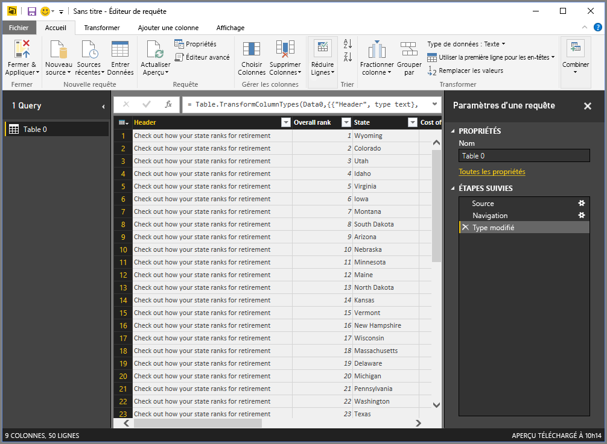
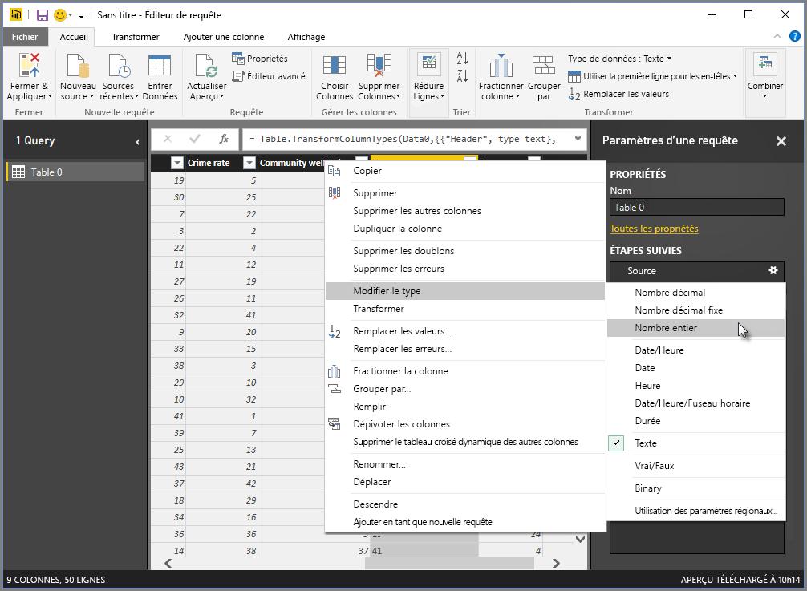
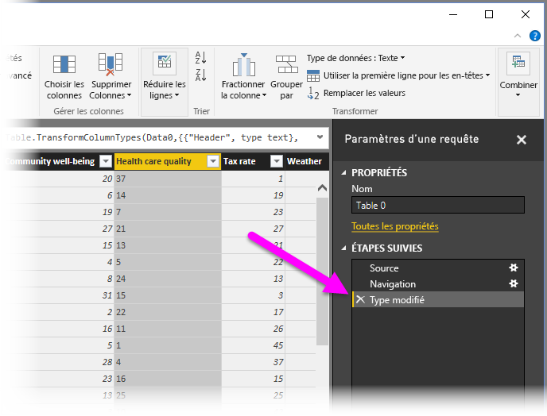
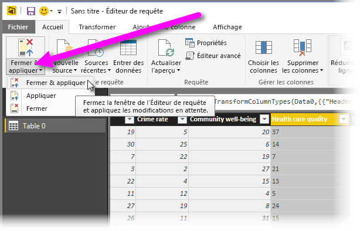
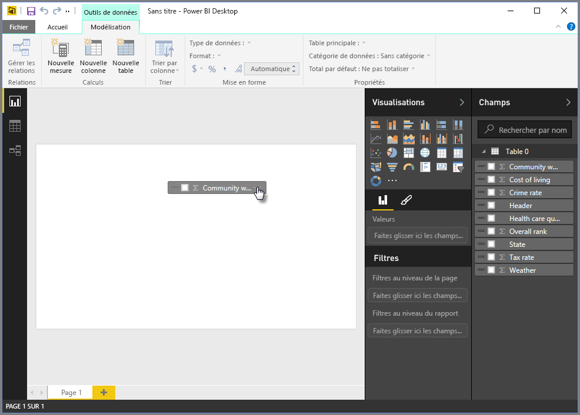
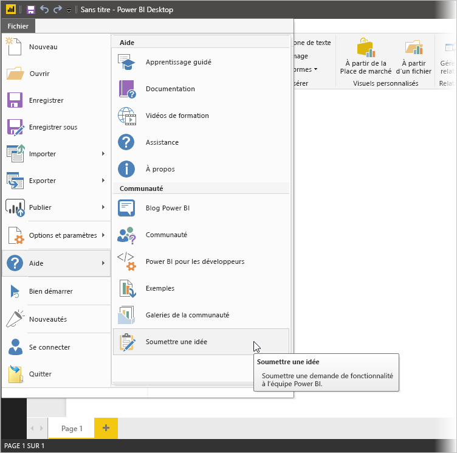

# Se connecter à des sources de données dans Power BI Desktop
Power BI Desktop vous permet de vous connecter facilement au monde des données en perpétuelle expansion. Si vous ne possédez pas Power BI Desktop, vous pouvez le [télécharger](https://go.microsoft.com/fwlink/?LinkID=521662) et l’installer.

De *nombreuses sortes* de sources de données sont disponibles dans Power BI Desktop. L’illustration ci-dessous montre comment se connecter aux données, en sélectionnant l’onglet **Fichier** du ruban, puis **Obtenir des données \> Autres**.

## Exemple de connexion à des données
Pour cet exemple, nous allons nous connecter à une source de données **web** .

Imaginez que vous prenez la retraite : vous souhaitez vivre dans un endroit ensoleillé, à la fiscalité avantageuse et proposant un système de soins de qualité. Ou... peut-être que vous êtes analyste de données et que vous souhaitez que ces informations soient utiles à vos clients, pour qu’ils puissent cibler les marchés *particulièrement porteurs*.

Dans les deux cas, vous trouvez une ressource web qui contient des données intéressantes sur ces thèmes, et sur d’autres :

[*https://www.bankrate.com/finance/retirement/best-places-retire-how-state-ranks.aspx*](https://www.bankrate.com/finance/retirement/best-places-retire-how-state-ranks.aspx)

Vous sélectionnez **Obtenir des données \> Web** et tapez l’adresse.

Quand vous sélectionnez **OK**, la fonctionnalité **Requête** de Power BI Desktop entre en jeu. Power BI Desktop contacte la ressource web et la fenêtre **Navigateur** renvoie les résultats trouvés dans cette page web. Dans ce cas, il a trouvé une table (Table 0) et le document global. Cette table nous intéresse. Sélectionnez-la dans la liste. La fenêtre **Navigateur** affiche un aperçu.

À ce stade, vous pouvez modifier la requête avant de charger la table, en sélectionnant **Modifier** au bas de la fenêtre, ou vous pouvez charger la table.

Si nous sélectionnons **Modifier**, la table est chargée et l’Éditeur de requête est lancé. Le volet **Paramètres d’une requête** s’affiche (dans le cas contraire, vous pouvez sélectionner **Affichage** dans le ruban, puis **Afficher \> Paramètres d’une requête**pour afficher le volet **Paramètres d’une requête**). Vous obtenez :

Les données sont plutôt du texte que des nombres, or nous avons besoin de nombres. Pour cela, il suffit de cliquer avec le bouton droit sur l’en-tête de la colonne et de sélectionner **Modifier le type \> Nombre entier** pour les modifier. Pour sélectionner plusieurs colonnes, commencez par sélectionner une colonne, maintenez la touche **Maj**enfoncée pour sélectionner des colonnes adjacentes supplémentaires, puis cliquez avec le bouton droit sur un en-tête de colonne pour modifier toutes les colonnes sélectionnées. Utilisez la touche **Ctrl** pour sélectionner des colonnes qui ne sont pas adjacentes.

Dans **Paramètres d’une requête**, les **Étapes appliquées** reflètent toutes les modifications apportées. Quand vous apportez des modifications supplémentaires aux données, l’Éditeur de requête enregistre ces modifications dans la section **Étapes appliquées**. Libre à vous de les ajuster, réexaminer, réorganiser ou supprimer.

Vous pouvez apporter des modifications supplémentaires à la table après son chargement, mais nous n’en avons pas besoin pour l’instant. Une fois terminé, nous sélectionnons **Fermer et appliquer** dans le ruban **Accueil**, et Power BI Desktop applique nos modifications et ferme l’Éditeur de requête.

Le modèle de données étant chargé, dans la vue **Rapport** dans Power BI Desktop, nous pouvons commencer à créer des visualisations en faisant glisser des champs sur la zone de dessin.

Bien sûr, il s’agit d’un modèle simple avec une connexion de données unique ; la plupart des rapports Power BI Desktop ont des connexions à différentes sources de données, mises en forme en fonction de vos besoins, avec des relations qui produisent un modèle de données enrichi. 

## Étapes suivantes
Power BI Desktop vous permet d’effectuer des tâches très diverses. Pour plus d’informations sur ses fonctionnalités, passez en revue les ressources suivantes :

* [Qu’est-ce que Power BI Desktop ?](desktop-what-is-desktop.md)
* [Présentation des requêtes dans Power BI Desktop](desktop-query-overview.md)
* [Sources de données dans Power BI Desktop](desktop-data-sources.md)
* [Mettre en forme et combiner des données dans Power BI Desktop](desktop-shape-and-combine-data.md)
* [Tâches courantes relatives aux requêtes dans Power BI Desktop](desktop-common-query-tasks.md)   

Vous souhaitez nous faire parvenir vos commentaires ? Vous pouvez facilement le faire par le biais du menu **Donner votre avis** dans Power BI Desktop ou de la page [Commentaires de la communauté](https://community.powerbi.com/t5/Community-Feedback/bd-p/community-feedback). Nous attendons avec impatience vos commentaires.

