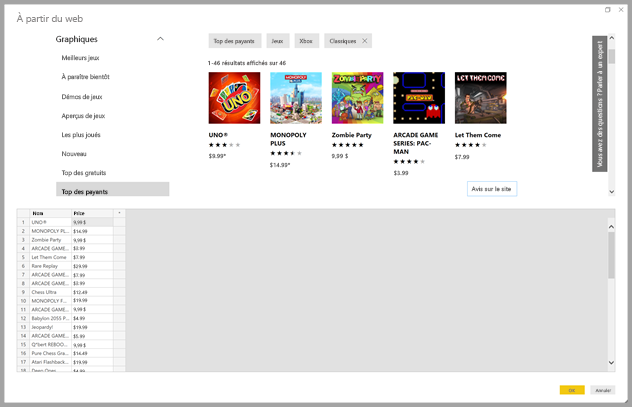
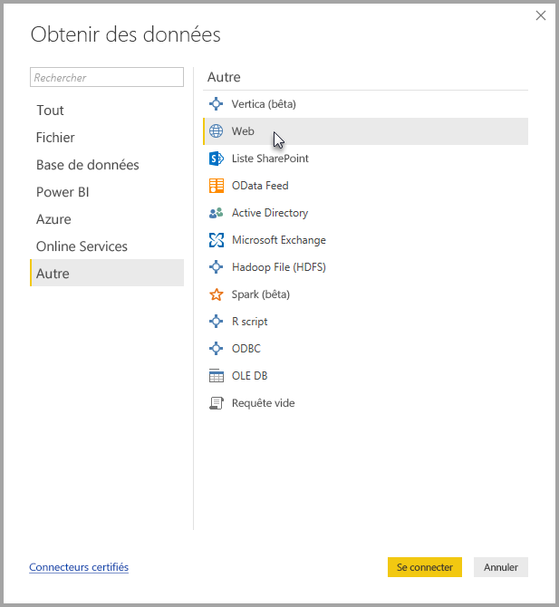
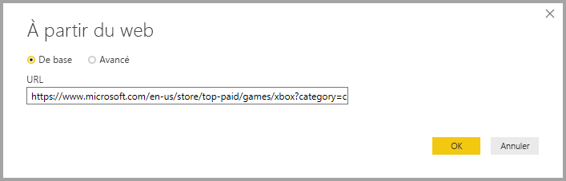
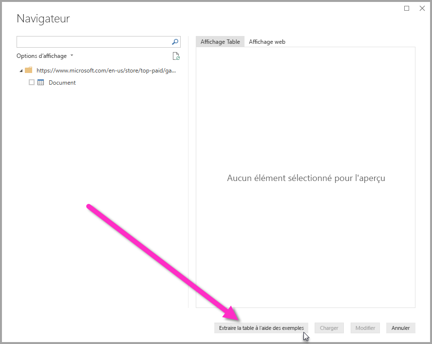
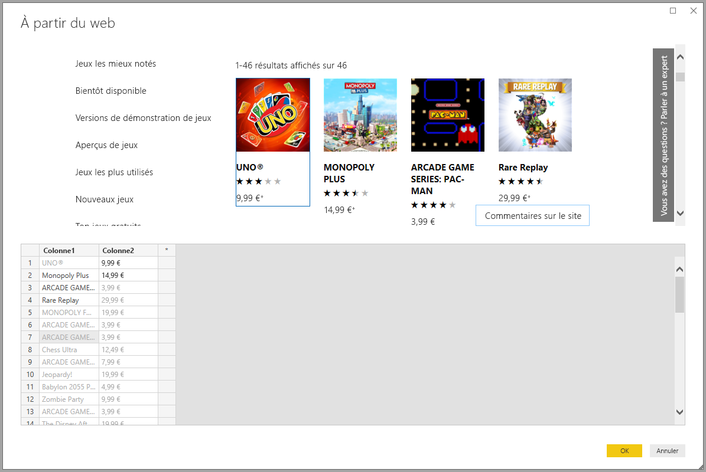
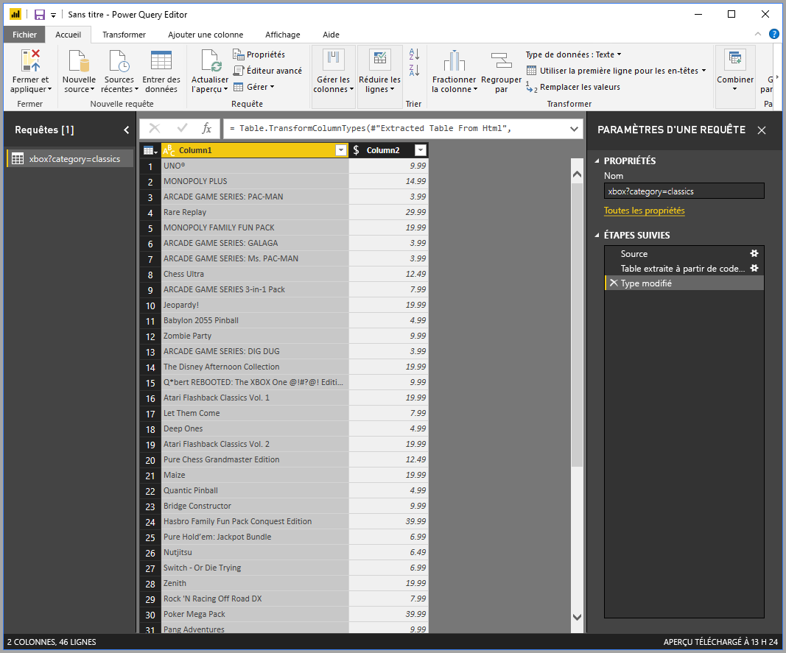

# Obtenir les données d’une page web en fournissant un exemple

L’obtention des données d’une page web permet aux utilisateurs d’extraire facilement les données de pages web et d’importer ces données dans **Power BI Desktop**. Cependant, les données des pages web figurent souvent dans des tables mal classées et donc difficiles à extraire. L’obtention des données de ces pages peut être compliquée, même si les données sont structurées et cohérentes. 

Mais il existe une solution. Grâce à la fonctionnalité **Obtenir les données du web par exemple**, vous pouvez indiquer à **Power BI Desktop** les données à extraire en fournissant un ou plusieurs exemples dans la boîte de dialogue du connecteur : les autres données sur la page correspondant à vos exemples seront alors regroupées. Cette solution vous permet d’extraire toutes sortes de données de pages web, y compris les données de tables *et* d’autres données ne figurant pas dans des tables. 

## Utilisation de l’option Obtenir les données du web par exemple

Pour utiliser **Obtenir les données du web par exemple**, sélectionnez **Obtenir les données** dans le menu du ruban **Accueil**. Dans la fenêtre qui s’affiche, sélectionnez **Autres** parmi les catégories dans le volet gauche, puis choisissez **Web**.

De là, entrez l’URL de la page web à partir de laquelle vous souhaitez extraire des données. Dans cet article, nous allons utiliser la page web du Microsoft Store pour montrer le fonctionnement de ce connecteur. 

Si vous souhaitez suivre la procédure, vous pouvez utiliser l’[URL du Microsoft Store](https://www.microsoft.com/store/top-paid/games/xbox?category=classics) mentionnée dans cet article :

    https://www.microsoft.com/store/top-paid/games/xbox?category=classics

Si vous sélectionnez **OK**, vous êtes dirigé vers la boîte de dialogue **Navigateur**, dans laquelle sont présentées toutes les tables automatiquement détectées dans la page web. Dans le cas illustré dans l’image ci-dessous, aucune table n’a été trouvée, mais il existe un bouton en bas de la page appelé **Extraire la table à l’aide des exemples** et qui vous permet de fournir des exemples.

L’option **Extraire la table à l'aide des exemples** affiche une fenêtre interactive dans laquelle vous pouvez afficher le contenu de la page web et entrer des exemples de valeurs des données que vous souhaitez extraire. 

Dans cet exemple, nous allons extraire le *nom* et le *prix* de chacun des jeux dans la page. Pour cela, nous spécifions deux exemples provenant de la page pour chaque colonne, comme indiqué dans l’image suivante. Une fois ces exemples entrés, **Power Query** (la technologie sous-jacente qui extrait les données de la page web) peut extraire les données qui correspondent au modèle des exemples d’entrées à l’aide d’algorithmes d’extraction de données intelligents.

> Remarque : Les suggestions de valeurs incluent uniquement les valeurs inférieures ou égales à 128 caractères en longueur.

Après avoir extrait les données de la page web, nous sélectionnons **OK** pour accéder à l’**Éditeur de requête**, dans lequel nous pouvons appliquer plusieurs transformations ou mettre en forme les données, par exemple en les combinant avec d’autres données ou sources.

De là, vous pouvez créer des éléments visuels ou utiliser les données de la page web lorsque vous créez vos rapports **Power BI Desktop**.

## Étapes suivantes
Vous pouvez connecter toutes sortes de données à l’aide de **Power BI Desktop**. Pour plus d’informations sur les sources de données, consultez les ressources suivantes :

* [Ajouter une colonne par exemple](desktop-add-column-from-example.md)
* [Se connecter à une page web](desktop-connect-to-web.md)
* [Sources de données dans Power BI Desktop](desktop-data-sources.md)
* [Mettre en forme et combiner des données dans Power BI Desktop](desktop-shape-and-combine-data.md)
* [Se connecter à des classeurs Excel dans Power BI Desktop](desktop-connect-excel.md)   
* [Se connecter à des fichiers CSV dans Power BI Desktop](desktop-connect-csv.md)   
* [Entrer des données directement dans Power BI Desktop](desktop-enter-data-directly-into-desktop.md)   

