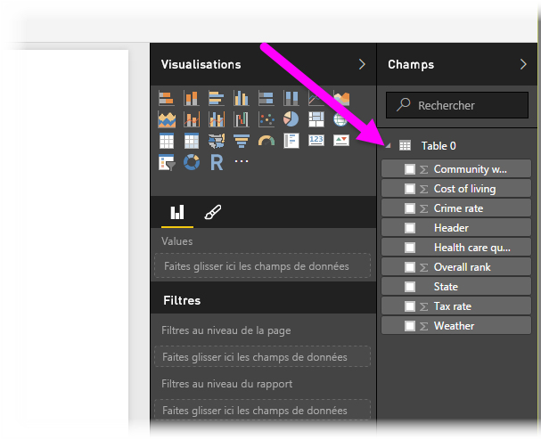

# Se connecter à une page web à partir de Power BI Desktop
Vous pouvez vous connecter à une page web et importer ses données dans Power BI Desktop, pour les utiliser dans vos éléments visuels et dans vos modèles de données.

Dans Power BI Desktop, sélectionnez **Obtenir des données > Web** dans le ruban **Accueil**.

Une boîte de dialogue s’affiche vous demandant l’URL de la page web à partir de laquelle vous souhaitez importer les données.

Une fois que vous avez tapé ou collé l’URL, sélectionnez **OK**. Power BI Desktop se connecte à la page, puis présente les données disponibles dans cette page dans la fenêtre **Navigateur**. Lorsque vous sélectionnez un des éléments de données disponibles, comme une table de la page entière, la fenêtre **Navigateur** affiche un aperçu de ces données sur le côté droit de la fenêtre.

Vous pouvez utiliser le bouton **Modifier**, qui lance l’**Éditeur de requête**, dans lequel vous pouvez mettre en forme et transformer les données de cette page web avant de les importer dans Power BI Desktop. Vous pouvez également cliquer sur le bouton **Charger** et importer tous les éléments de données que vous avez sélectionnés dans le volet de gauche.

Lorsque vous sélectionnez **Charger**, Power BI Desktop importe les éléments sélectionnés et les place dans le volet **Champs**, à droite de la vue Rapports dans Power BI Desktop.

Voilà comment se connecter à une page web et importer les données qu’elle contient dans Power BI Desktop.

À partir de là, vous pouvez faire glisser ces champs sur le canevas de rapport et créer toutes les visualisations que vous voulez. Vous pouvez également utiliser les données de cette page web comme vous le feriez pour d’autres données : vous pouvez les mettre en forme, vous pouvez créer des relations entre elles et d’autres sources de données de votre modèle et faire aussi ce dont vous avez besoin pour créer le rapport Power BI souhaité.

Pour voir plus d’informations sur la connexion à une page web et voir ce processus en action, consultez le [Guide de prise en main de Power BI Desktop](desktop-getting-started.md).

### Étapes suivantes
Vous pouvez connecter toutes sortes de données à l’aide de Power BI Desktop. Pour plus d’informations sur les sources de données, consultez les ressources suivantes :

* [Sources de données dans Power BI Desktop](desktop-data-sources.md)
* [Mettre en forme et combiner des données dans Power BI Desktop](desktop-shape-and-combine-data.md)
* [Se connecter à des classeurs Excel dans Power BI Desktop](desktop-connect-excel.md)   
* [Se connecter à des fichiers CSV dans Power BI Desktop](desktop-connect-csv.md)   
* [Entrer des données directement dans Power BI Desktop](desktop-enter-data-directly-into-desktop.md)   

