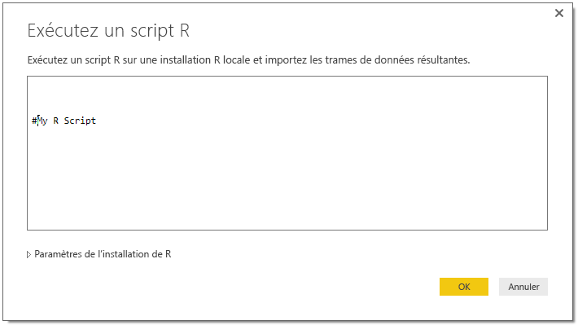

# Se connecter à des données à l’aide d’interfaces génériques dans Power BI Desktop
Vous pouvez vous connecter à un large éventail de sources de données différentes dans **Power BI Desktop**, à l’aide de connecteurs de données intégrés (des **bases de données Access** aux ressources **Zendesk**), comme indiqué dans la fenêtre **Obtenir des données**. Vous pouvez également vous connecter à toutes sortes d’*autres* sources de données, ce qui augmente encore davantage vos options de connectivité, en utilisant les interfaces génériques (telles que **ODBC** ou l’**API REST**) intégrées dans **Power BI Desktop**.

## Interfaces de données Power BI Desktop
**Power BI Desktop** inclut une collection croissante de connecteurs de données qui sont conçus pour se connecter à une source de données spécifique. Par exemple, le connecteur de données **Liste SharePoint** fournit des champs spécifiques et des informations de support lors de la séquence de connexion qui sont conçus pour les **listes SharePoint**, ce qui est le cas avec d’autres sources de données disponibles dans la fenêtre qui s’affiche lorsque vous sélectionnez **Obtenir des données > Plus...** (voir l’image précédente).

En outre, **Power BI Desktop** permet de vous connecter aux sources de données qui ne sont pas spécifiquement identifiées dans les listes **Obtenir des données**, en utilisant une des interfaces de données génériques suivantes :

* **ODBC**
* **OLE DB**
* **OData**
* **API REST**
* **Scripts R**

En fournissant les paramètres appropriés dans les fenêtres de connexion fournies par ces interfaces génériques, l’éventail de sources de données auxquelles vous pouvez accéder et que vous pouvez utiliser dans **Power BI Desktop** augmente de manière significative.

Dans les sections suivantes, vous pouvez rechercher les listes de sources de données qui sont accessibles par ces interfaces génériques.

Vous ne trouvez pas la source de données que vous souhaitez utiliser avec **Power BI Desktop** ? [Faites-le-nous savoir](https://ideas.powerbi.com/) afin que nous l’ajoutions à notre liste d’idées et de demandes.

## Sources de données accessibles via ODBC
Le connecteur **ODBC** dans **Power BI Desktop** vous permet d’importer des données à partir de n’importe quel pilote ODBC en spécifiant simplement un **nom de source de données** ou une *chaîne de connexion*. En option, vous pouvez également spécifier une instruction SQL à exécuter sur le pilote ODBC.

La liste suivante décrit quelques exemples de sources de données auxquelles **Power BI Desktop** peut se connecter à l’aide de l’interface générique **ODBC**.

| Connecteur générique Power BI Desktop | Source de données externe | Lien vers plus d’informations |
| --- | --- | --- |
| ODBC |Cassandra |[Pilote ODBC Cassandra](http://www.simba.com/drivers/cassandra-odbc-jdbc/) |
| ODBC |Couchbase DB |[Couchbase et Power BI](https://powerbi.microsoft.com/en-us/blog/visualizing-data-from-couchbase-server-v4-using-power-bi/) |
| ODBC |DynamoDB |[Pilote ODBC DynamoDB](http://www.simba.com/drivers/dynamodb-odbc-jdbc/) |
| ODBC |Google BigQuery |[Pilote ODBC BigQuery](http://www.simba.com/drivers/bigquery-odbc-jdbc/) |
| ODBC |Hbase |[Pilote ODBC Hbase](http://www.simba.com/drivers/hbase-odbc-jdbc/) |
| ODBC |Hive |[Pilote ODBC Hive](http://www.simba.com/drivers/hive-odbc-jdbc/) |
| ODBC |IBM Netezza |[Informations IBM Netezza](https://www.ibm.com/support/knowledgecenter/SSULQD_7.2.1/com.ibm.nz.datacon.doc/c_datacon_plg_overview.html) |
| ODBC |Presto |[Pilote ODBC Presto](http://www.simba.com/drivers/presto-odbc-jdbc/) |
| ODBC |Project Online |[Article Project Online](desktop-project-online-connect-to-data.md) |
| ODBC |Progress OpenEdge |[Billet de blog sur le pilote Progress OpenEdge ODBC](https://na01.safelinks.protection.outlook.com/?url=https%3A%2F%2Fwww.progress.com%2Fblogs%2Fconnect-microsoft-power-bi-to-openedge-via-odbc-driver&data=02%7C01%7CMatt.Masson%40microsoft.com%7C5e63742e6c454308b58a08d4034b5923%7C72f988bf86f141af91ab2d7cd011db47%7C1%7C0%7C636137069555329811&sdata=gSu2Rq3vZ0uBVOgjaXxd8Y3uBf%2B8DidX6PG33jwAduY%3D&reserved=0) |

## Sources de données accessibles via OLE DB
Le connecteur **OLE DB** dans **Power BI Desktop** vous permet d’importer des données à partir de n’importe quel pilote OLE DB en spécifiant simplement une *chaîne de connexion*. En option, vous pouvez également spécifier une instruction SQL à exécuter sur le pilote OLE DB.

La liste suivante décrit quelques exemples de sources de données auxquelles **Power BI Desktop** peut se connecter à l’aide de l’interface générique **OLE DB**.

| Connecteur générique Power BI Desktop | Source de données externe | Lien vers plus d’informations |
| --- | --- | --- |
| OLE DB |SAS OLE DB |[Fournisseur SAS pour OLE DB](https://support.sas.com/downloads/package.htm?pid=648) |
| OLE DB |Sybase OLE DB |[Fournisseur Sybase pour OLE DB](http://infocenter.sybase.com/help/index.jsp?topic=/com.sybase.infocenter.dc35888.1550/doc/html/jon1256941734395.html) |

## Sources de données accessibles via OData
Le connecteur **OData** dans **Power BI Desktop** vous permet d’importer des données de n’importe quelle URL **OData** en tapant ou collant l’URL **OData**. Vous pouvez ajouter plusieurs parties de l’URL en tapant ou en collant ces liens dans les zones de texte fournies dans la fenêtre **Flux OData**.

La liste suivante décrit quelques exemples de sources de données auxquelles **Power BI Desktop** peut se connecter à l’aide de l’interface générique **OData**.

| Connecteur générique Power BI Desktop | Source de données externe | Lien vers plus d’informations |
| --- | --- | --- |
| OData |Bientôt disponible |Revenez prochainement pour obtenir des informations sur les sources de données OData |

## Sources de données accessibles via des API REST
Vous pouvez vous connecter aux sources de données à l’aide des **API REST** et ainsi utiliser les données de toutes sortes de sources de données qui prennent en charge **REST**.

La liste suivante décrit quelques exemples de sources de données auxquelles **Power BI Desktop** peut se connecter à l’aide de l’interface générique **API REST**.

| Connecteur générique Power BI Desktop | Source de données externe | Lien vers plus d’informations |
| --- | --- | --- |
| API REST |Couchbase DB |[Informations sur l’API REST Couchbase](https://powerbi.microsoft.com/en-us/blog/visualizing-data-from-couchbase-server-v4-using-power-bi/) |

## Sources de données accessibles via un script R
Vous pouvez utiliser des **scripts R** pour accéder aux sources de données et les utiliser dans **Power BI Desktop**.

La liste suivante décrit quelques exemples de sources de données auxquelles **Power BI Desktop** peut se connecter à l’aide de l’interface générique **Scripts R**.

| Connecteur générique Power BI Desktop | Source de données externe | Lien vers plus d’informations |
| --- | --- | --- |
| Script R |Fichiers SAS |[Conseils sur les scripts R sur le site CRAN](https://cran.r-project.org/doc/manuals/R-data.html) |
| Script R |Fichiers SPSS |[Conseils sur les scripts R sur le site CRAN](https://cran.r-project.org/doc/manuals/R-data.html) |
| Script R |Fichiers de statistiques R |[Conseils sur les scripts R sur le site CRAN](https://cran.r-project.org/doc/manuals/R-data.html) |

## Étapes suivantes
Vous pouvez connecter toutes sortes de sources de données à l’aide de Power BI Desktop. Pour plus d’informations sur les sources de données, consultez les ressources suivantes :

* [Prise en main de Power BI Desktop](desktop-getting-started.md)
* [Sources de données dans Power BI Desktop](desktop-data-sources.md)
* [Mettre en forme et combiner des données dans Power BI Desktop](desktop-shape-and-combine-data.md)
* [Se connecter à des classeurs Excel dans Power BI Desktop](desktop-connect-excel.md)   
* [Entrer des données directement dans Power BI Desktop](desktop-enter-data-directly-into-desktop.md)   

