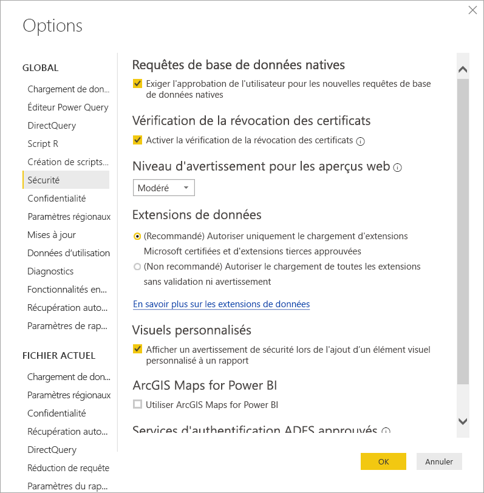
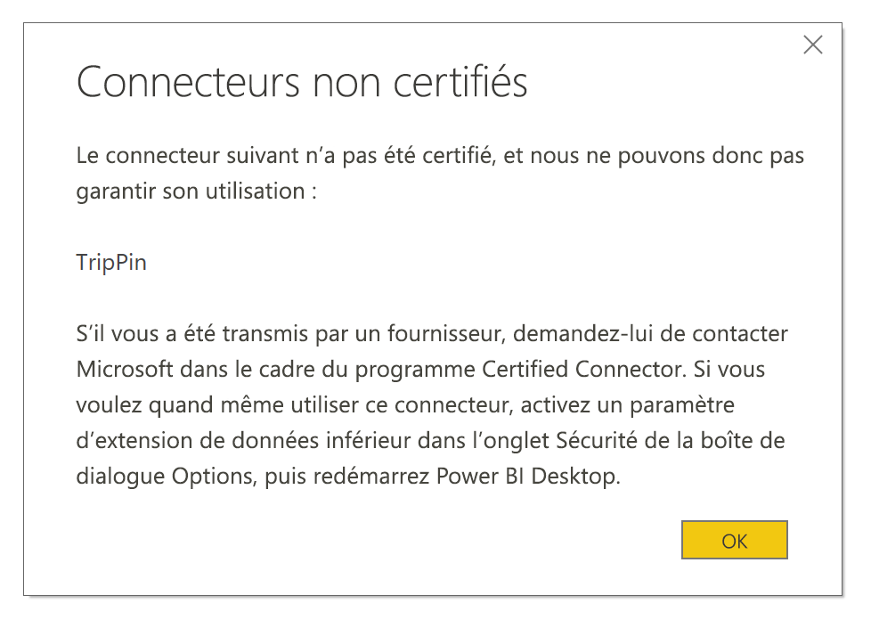

# Extensibilité des connecteurs dans Power BI

Power BI peut se connecter aux données par le biais de connecteurs existants et de sources de données génériques comme ODBC, OData, OLE DB, Web, CSV, XML et JSON. Les développeurs peuvent aussi activer de nouvelles sources de données avec des extensions de données personnalisées appelées *connecteurs personnalisés*. Certains connecteurs personnalisés sont certifiés et distribués par Microsoft en tant que *connecteurs certifiés*.

Pour utiliser des connecteurs personnalisés non certifiés qui ont été développés par un fournisseur tiers ou par vous-même, vous devez changer les paramètres de sécurité Power BI Desktop afin d’autoriser le chargement des extensions sans validation ni avertissement. Étant donné que ce code peut gérer les informations d’identification, y compris les envoyer via HTTP, et ignorer les niveaux de confidentialité, utilisez ce paramètre de sécurité uniquement si vous avez entièrement confiance en vos connecteurs personnalisés.

Une autre option est possible : le développeur signe le connecteur avec un certificat et fournit les informations dont vous avez besoin pour l’utiliser sans changer vos paramètres de sécurité. Pour plus d’informations, consultez [Connecteurs tiers de confiance](desktop-trusted-third-party-connectors.md).

## Connecteurs personnalisés

Les connecteurs personnalisés non certifiés peuvent être de divers types, qu’il s’agisse d’API métier critiques pour les petites entreprises ou de services destinés à un large secteur d’activité pour lesquels Microsoft n’a pas publié de connecteur. Beaucoup de connecteurs sont distribués par des fournisseurs. Si vous avez besoin d’un connecteur de données spécifique, contactez le fournisseur. 

Pour utiliser un connecteur personnalisé non certifié, placez le fichier *.pq*, *.pqx*, *.m* ou *.mez* du connecteur dans le dossier *\[Documents]\\Power BI Desktop\\Custom Connectors*. Si le dossier n’existe pas, créez-le.

Changez les paramètres de sécurité de l’extension de données de la façon suivante :

Dans Power BI Desktop, sélectionnez **Fichier** > **Options et paramètres** > **Options** > **Sécurité**.

Sous **Extensions de données**, sélectionnez **(Non recommandé) Autoriser le chargement de toutes les extensions sans validation ni avertissement**. Sélectionnez **OK**, puis redémarrez Power BI Desktop. 

Le paramètre de sécurité par défaut des extensions de données Power BI Desktop est **(Recommandé) Autoriser uniquement le chargement d’extensions Microsoft certifiées et d’extensions tierces approuvées**. Avec ce paramètre, si des connecteurs personnalisés non certifiés sont détectés sur votre système, la boîte de dialogue **Connecteurs non certifiés** s’affiche au démarrage de Power BI Desktop et liste les connecteurs dont le chargement n’est pas sécurisé.

Pour corriger le problème, vous pouvez soit modifier votre paramètre de sécurité **Extensions de données**, soit supprimer les connecteurs non certifiés dans votre dossier *Connecteurs personnalisés*.

## Connecteurs certifiés

Un sous-ensemble limité d’extensions de données sont considérées comme *certifiées*. Même si Microsoft distribue les connecteurs, elle n’est pas responsable de leurs performances ou de la continuité de leur fonctionnement. Le développeur tiers qui a créé le connecteur est responsable de sa maintenance et de son support. 

Dans Power BI Desktop, les connecteurs tiers certifiés sont listés dans la boîte de dialogue **Obtenir des données**, avec les connecteurs génériques et courants. Vous n’avez pas besoin de changer les paramètres de sécurité existants pour utiliser les connecteurs certifiés.

Si vous voulez faire certifier un connecteur personnalisé, demandez à votre fournisseur de contacter dataconnectors@microsoft.com.
