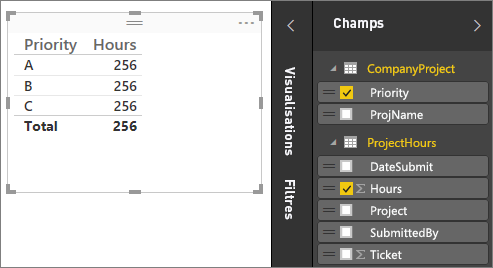
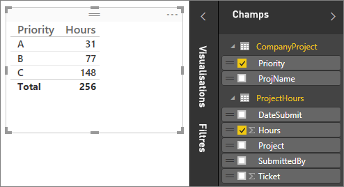
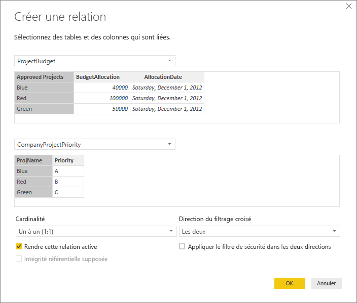
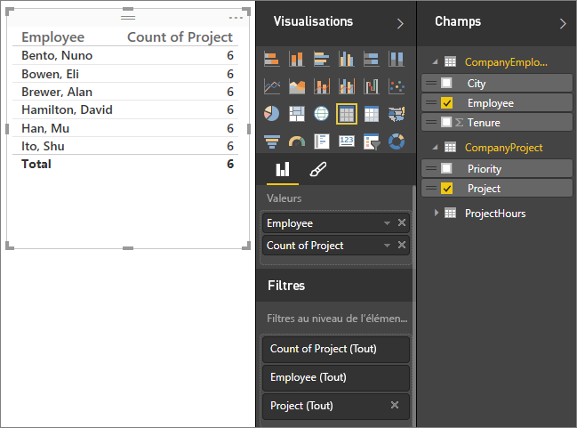
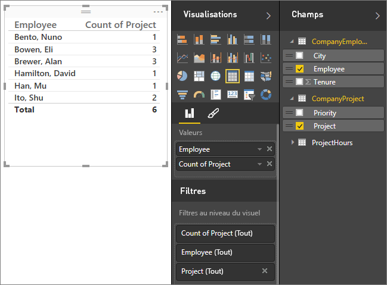
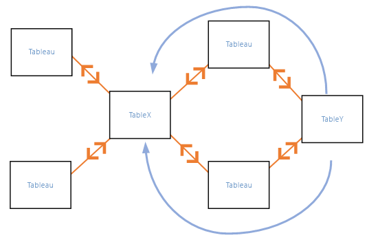
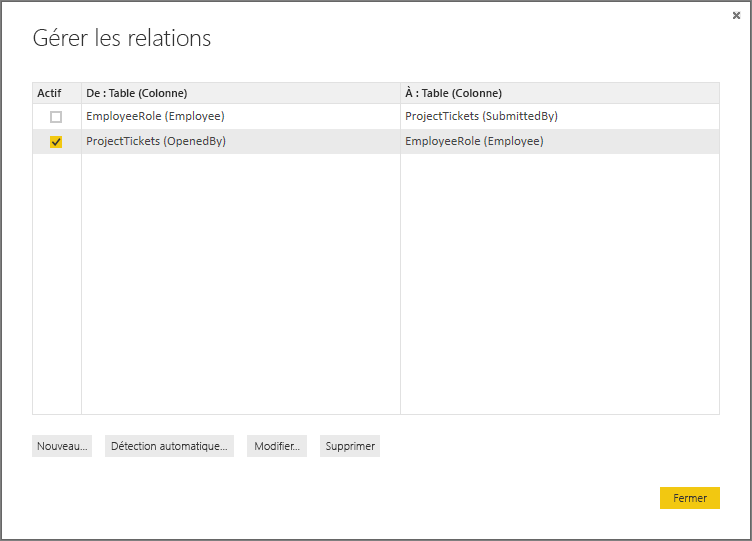
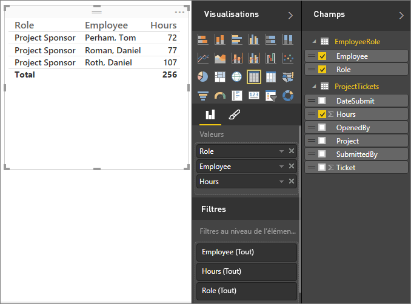
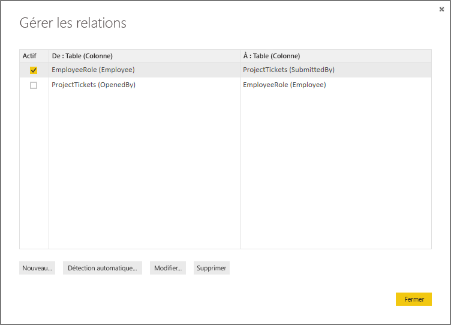

# Créer et gérer des relations dans Power BI Desktop
Quand vous importez plusieurs tables, vous êtes souvent amené à effectuer des analyses impliquant les données de ces tables. Les relations entre ces tables sont nécessaires pour obtenir des résultats précis et afficher les informations correctes dans vos rapports. Power BI Desktop facilite la création de ces relations. Dans la plupart des cas, vous n’avez rien à faire ; la fonctionnalité Détection automatique se charge de tout. Toutefois, dans certains cas, vous pouvez être amené à créer des relations vous-même ou à apporter des modifications à une relation. Dans les deux cas, il est important de comprendre le fonctionnement des relations dans Power BI Desktop et comment les créer et les modifier.

## Détection automatique pendant le chargement
Si vous interrogez plusieurs tables en même temps, quand les données sont chargées, Power BI Desktop tente de trouver et de créer des relations pour vous. Les propriétés Cardinalité, Direction du filtrage croisé et Active sont automatiquement définies. Power BI Desktop examine les noms des colonnes des tables que vous interrogez pour déterminer s’il existe des relations potentielles. S’il en existe, ces relations sont automatiquement créées. Si Power BI Desktop ne peut pas déterminer avec un niveau de confiance élevé qu’il existe une correspondance, il ne crée pas la relation automatiquement. Vous pouvez néanmoins utiliser la boîte de dialogue Gérer les relations pour créer ou modifier des relations.

## Créer une relation à l’aide de la fonctionnalité Détection automatique
Sous l’onglet **Accueil**, cliquez sur **Gérer les relations**\>**Détection automatique**.

## Créer une relation manuellement
1. Sous l’onglet **Accueil**, cliquez sur **Gérer les relations**\>**Nouveau**.
2. Dans la boîte de dialogue **Créer une relation**, dans la première liste déroulante de tables, sélectionnez une table, puis sélectionnez la colonne que vous souhaitez utiliser dans la relation.
3. Dans la seconde liste déroulante de tables, sélectionnez l’autre table que vous souhaitez dans la relation, puis l’autre colonne que vous souhaitez utiliser, puis cliquez sur **OK**.

Par défaut, Power BI Desktop configure automatiquement les propriétés Cardinalité (direction), Direction du filtrage croisé et Active pour votre nouvelle relation. Toutefois, vous pouvez les changer si nécessaire. Pour plus d’informations, consultez la section Présentation des options supplémentaires plus loin dans cet article.

## Modifier une relation
1. Sous l’onglet **Accueil**, cliquez sur **Gérer les relations**.
2. Dans la boîte de dialogue **Gérer les relations**, sélectionnez la relation, puis cliquez sur **Modifier**.

## Configurer des options supplémentaires
Quand vous créez ou modifiez une relation, vous pouvez configurer des options supplémentaires.  Par défaut, les options supplémentaires sont configurées automatiquement d’après une estimation. Cette configuration étant déterminée par les données des colonnes, elle peut varier d’une relation à l’autre.

## Cardinalité
**Plusieurs à un (\*:1)** : il s’agit du type par défaut, le plus courant. La colonne d’une table peut avoir plusieurs instances d’une valeur, tandis que la table connexe, souvent appelée table de recherche, n’a qu’une seule instance d’une valeur donnée.

**Un à un (1:1)** : la colonne d’une table n’a qu’une seule instance d’une valeur donnée et la table connexe n’a qu’une seule instance d’une valeur donnée.

Pour plus d’informations sur la modification de la cardinalité, consultez la section Présentation des options supplémentaires plus loin dans cet article.

## Direction du filtrage croisé
**À double sens** : il s’agit de la direction par défaut, la plus courante. Pendant les opérations de filtrage, les deux tables sont traitées comme s’il s’agissait d’une table unique.  Cela fonctionne bien avec une table unique entourée de plusieurs tables de choix.  Une table de valeurs de ventes réelles avec une table de choix pour le service constitue un bon exemple.  On parle souvent de configuration de schéma en étoile (une table centrale avec plusieurs tables de choix.)  Toutefois, si vous avez plusieurs tables qui possèdent aussi des tables de choix (certaines en commun), vous ne devez pas utiliser le paramètre À double sens.  Pour continuer avec l’exemple précédent, vous avez également une table de ventes budgétées qui enregistre le budget cible pour chaque service.  Et la table des services est connectée à la fois à la table des ventes et à la table du budget.  Évitez le paramètre À double sens pour ce type de configuration.

**À sens unique** : les choix de filtrage dans les tables connectées agissent sur la table dans laquelle les valeurs sont agrégées. Si vous importez un modèle de données Power Pivot dans Excel 2013 ou version antérieure, toutes les relations ont une seule direction. 

Pour plus d’informations sur le changement de direction du filtrage croisé, consultez la section Présentation des options supplémentaires plus loin dans cet article.

## Rendre cette relation active
Quand cette option est cochée, la relation fait office de relation par défaut active.  S’il existe plusieurs relations entre deux tables, la relation active offre un moyen à Power BI Desktop de créer automatiquement des visualisations qui incluent les deux tables.

Pour plus d’informations sur la façon de rendre une relation active, consultez la section Présentation des options supplémentaires plus loin dans cet article.

## Présentation des relations
Une fois que vous avez connecté deux tables avec une relation, vous pouvez utiliser les données des deux tables comme s’il s’agissait d’une table unique ; ainsi, vous n’avez pas à vous soucier des détails de la relation et vous n’avez pas besoin d’aplatir ces tables dans une table unique avant de les importer.  Dans de nombreuses situations, Power BI Desktop peut créer automatiquement des relations à votre place. Toutefois, si Power BI Desktop ne peut pas déterminer avec une grande certitude qu’une relation entre deux tables doit exister, il ne crée pas automatiquement la relation. Dans ce cas, vous devez la créer vous-même.   

Nous allons suivre un petit didacticiel pour mieux illustrer le fonctionnement des relations dans Power BI Desktop.

>[!TIP]
>Vous pouvez effectuer cette leçon vous-même. Copiez la table HeuresProjet ci-dessous dans une feuille de calcul Excel, sélectionnez toutes les cellules, puis cliquez sur **Insertion**\>**Tableau**. Dans la boîte de dialogue **Créer un tableau**, cliquez sur **OK**. Dans **Nom du tableau**, tapez **HeuresProjet**. Faites de même pour la table ProjetEntreprise. Vous pouvez ensuite importer les données avec l’option **Obtenir des données** dans Power BI Desktop. Sélectionnez votre classeur et le tables comme source de données.

La première table, HeuresProjet, contient les tickets de travail qui enregistrent le nombre d’heures qu’une personne a travaillé sur un projet particulier.  

**HeuresProjet**

| **Ticket** | **SoumisPar** | **Heures** | **Projet** | **DateSoumission** |
| ---:|:--- | ---:|:--- | ---:|
| 1001 |Brewer, Alan |22 |Bleu |1/1/2013 |
| 1002 |Brewer, Alan |26 |Rouge |2/1/2013 |
| 1003 |Ito, Shu |34 |Jaune |12/4/2012 |
| 1004 |Brewer, Alan |13 |Orange |1/2/2012 |
| 1005 |Bowen, Eli |29 |Violet |10/1/2013 |
| 1006 |Bento, Nuno |35 |Vert |2/1/2013 |
| 1007 |Hamilton, David |10 |Jaune |10/1/2013 |
| 1008 |Han, Mu |28 |Orange |1/2/2012 |
| 1009 |Ito, Shu |22 |Violet |2/1/2013 |
| 1010 |Bowen, Eli |28 |Vert |10/1/2013 |
| 1011 |Bowen, Eli |9 |Bleu |10/15/2013 |

La seconde table, ProjetEntreprise, est une liste de projets affectés d’une priorité (A, B ou C). 

**ProjetEntreprise**

| **NomProjet** | **Priorité** |
| --- | --- |
| Bleu |A |
| Rouge |B |
| Vert |C |
| Jaune |C |
| Violet |B |
| Orange |C |

Notez que chaque table possède une colonne de projet. Chacune a un nom légèrement différent, mais les valeurs semblent identiques. Ce point est important, et nous y reviendrons un peu plus tard.

Nos deux tables étant importées dans un modèle, nous allons maintenant créer un rapport. La première chose que nous voulons obtenir est le nombre d’heures soumises par priorité de projet ; nous sélectionnons donc les champs **Priorité** et **Heures**.

 

Si nous regardons notre table dans le canevas de rapport, nous constatons que le nombre d’heures est **256,00** pour chaque projet et que c’est également le total. C’est clairement incorrect. Pourquoi ? Car nous ne pouvons pas calculer une somme de valeurs à partir d’une table (champ Heures de la table Projet), ventilées en fonction des valeurs d’une autre table (champ Priorité de la table ProjetEntreprise) sans qu’il existe une relation entre ces deux tables.

Nous allons donc créer une relation entre ces deux tables.

Vous vous souvenez de ces colonnes communes aux deux tables avec un nom de projet et comportant des valeurs similaires ? Nous allons utiliser ces deux colonnes pour créer une relation entre nos tables.

Pourquoi ces colonnes ? Si nous observons la colonne Projet du tableau HeuresProjet, nous y trouvons des valeurs telles que Bleu, Rouge, Jaune et Orange. Comme vous pouvez le constater, plusieurs lignes contiennent la même valeur. Nous avons donc de nombreuses valeurs de couleur pour Projet.

Par contre, la colonne NomProjet du tableau ProjetEntreprise ne contient qu’une occurrence de chaque valeur de couleur de projet. Chaque valeur de couleur de cette table est unique ; cela est important, car nous pouvons créer une relation entre les deux tables. Dans ce cas, il s’agit d’une relation plusieurs-à-un. Dans une relation plusieurs-à-un, au moins une colonne d’une des tables doit contenir des valeurs uniques. Il existe des options supplémentaires pour certaines relations, que nous verrons plus tard, mais pour l’instant nous allons créer une relation entre les colonnes Projet de chaque table.

### Pour créer la relation
1. Cliquez sur **Gérer les relations**.
2. Dans **Gérer les relations**, cliquez sur **Nouveau**. La boîte de dialogue **Créer une relation** s’ouvre, dans laquelle nous pouvons sélectionner les tables, les colonnes et les paramètres supplémentaires que nous souhaitons pour notre relation.
3. Dans la première table, sélectionnez **HeuresProjet**, puis la colonne **Projet**. Il s’agit du côté « plusieurs » de notre relation.
4. Dans la seconde table, sélectionnez **ProjetEntreprise**, puis la colonne **NomProjet**. Il s’agit du côté « un » de notre relation.  
5. Cliquez sur **OK** dans les boîtes de dialogue **Créer une relation** et **Gérer les relations**.

Pour que la démonstration soit le plus explicite, nous avons créé la relation manuellement. Nous aurions pu cliquer simplement sur le bouton Détection automatique dans la boîte de dialogue Gérer les relations. En fait, la fonctionnalité Détection automatique l’aurait déjà fait pour vous quand vous avez chargé les données si les deux colonnes avaient le même nom. Mais nous n’aurions eu aucun mérite.

À présent, réexaminons la table dans le Canevas de rapport.

 

Ça va beaucoup mieux maintenant, non ?

Quand nous additionnons les heures par Priorité, Power BI Desktop recherche chaque instance des valeurs de couleur uniques dans la table de choix ProjetEntreprise, puis recherche chaque instance de chacune de ces valeurs dans la table ProjetEntreprise et calcule une somme totale pour chaque valeur unique.

C’était assez facile. En fait, la fonctionnalité Détection automatique aurait même pu vous éviter tout ce travail.

## Présentation des options supplémentaires
Quand une relation est créée, manuellement ou avec la fonctionnalité Détection automatique, Power BI Desktop configure automatiquement les options supplémentaires en fonction des données de vos tables. Vous pouvez configurer ces propriétés de relation supplémentaires situées tout en bas de la boîte de dialogue Créer/modifier une relation.

 

Comme nous l’avons dit, ces propriétés sont généralement définies automatiquement et vous n’avez pas besoin d’y toucher ; toutefois, vous pouvez être amené à configurer ces options vous-même.

## Les futures mises à jour des données nécessitent une cardinalité différente
Normalement, Power BI Desktop peut déterminer automatiquement la meilleure cardinalité pour la relation.  Si vous avez besoin de remplacer le paramétrage automatique car vous savez que les données changeront ultérieurement, vous pouvez utiliser le contrôle Cardinalité. Examinons un exemple où nous devons sélectionner une cardinalité différente.

La table PrioritéProjetEntreprise ci-dessous répertorie tous les projets de l’entreprise et leur priorité. La table BudgetProjet regroupe les projets pour lesquels un budget a été approuvé.

**BudgetProjet**

| **ProjetsApprouvés** | **AllocationBudget** | **DateAllocation** |
|:--- | ---:| ---:|
| Bleu |40,000 |12/1/2012 |
| Rouge |100,000 |12/1/2012 |
| Vert |50,000 |12/1/2012 |

**PrioritéProjetEntreprise**

| **Projet** | **Priorité** |
| --- | --- |
| Bleu |A |
| Rouge |B |
| Vert |C |
| Jaune |C |
| Violet |B |
| Orange |C |

Si nous créons une relation entre la colonne Projet de la table PrioritéProjetEntreprise et la colonne ProjetsApprouvés de la table BudgetProjet, comme suit :

 

La cardinalité prend automatiquement la valeur Un à un (1:1) et la direction du filtrage croisé la valeur À double sens (comme indiqué).  En effet, pour Power BI Desktop, la meilleure combinaison des deux tables ressemble à ceci :

| **Projet** | **Priorité** | **AllocationBudget** | **DateAllocation** |
|:--- | --- | ---:| ---:|
| Bleu |A |40,000 |12/1/2012 |
| Rouge |B |100,000 |12/1/2012 |
| Vert |C |50,000 |12/1/2012 |
| Jaune |C |  |  |
| Violet |B |  |  |
| Orange |C |  |  |

Il existe une relation un à un entre nos deux tables, car la colonne Projet de la table combinée ne contient pas de doublons. La colonne Projet est unique, car chaque valeur n’y apparaît qu’une seule fois. Ainsi, les lignes des deux tables peuvent être combinées directement sans aucune duplication.

Toutefois, supposons que les données sont censées changer à la prochaine actualisation. Une version actualisée de la table BudgetProjet fait apparaître des lignes supplémentaires pour les valeurs Bleu et Rouge :

**BudgetProjet**

| **ProjetsApprouvés** | **AllocationBudget** | **DateAllocation** |
| --- | ---:| ---:|
| Bleu |40,000 |12/1/2012 |
| Rouge |100,000 |12/1/2012 |
| Vert |50,000 |12/1/2012 |
| Bleu |80,000 |6/1/2013 |
| Rouge |90,000 |6/1/2013 |

 Cela signifie que la meilleure combinaison des deux tables ressemble maintenant à ceci : 

| **Projet** | **Priorité** | **AllocationBudget** | **DateAllocation** |
| --- | --- | ---:| ---:|
| Bleu |A |40,000 |12/1/2012 |
| Rouge |B |100,000 |12/1/2012 |
| Vert |C |50,000 |12/1/2012 |
| Jaune |C |  |  |
| Violet |B |  |  |
| Orange |C |  |  |
| Bleu |A |80000 |6/1/2013 |
| Rouge |B |90000 |6/1/2013 |

Dans cette nouvelle table combinée, la colonne Projet contient des doublons.  Les deux tables d’origine n’auront pas de relation un à un une fois la table actualisée. Dans ce cas, comme nous savons que ces mises à jour ultérieures engendreront des doublons dans la colonne Projet, nous souhaitons définir la cardinalité sur Plusieurs à un (\*:1), avec la composante « plusieurs » côté BudgetProjet et la composante « un » côté PrioritéProjetEntreprise.

## Ajustement de la direction du filtrage croisé pour un jeu complexe de tables et de relations
Pour la plupart des relations, la direction du filtrage croisé est définie sur « À double sens ».  Toutefois, dans certaines circonstances plus rares, vous pouvez être amené à la définir différemment, comme dans le cas où vous importez un modèle à partir d’une ancienne version de Power Pivot, où chaque relation est définie sur une direction à sens unique. 

Le paramètre À double sens permet à Power BI Desktop de traiter tous les aspects des tables connectées comme s’il s’agissait d’une table unique.  Dans certaines situations, toutefois, Power BI Desktop ne peut pas définir la direction du filtrage croisé d’une relation sur « À double sens » tout en conservant un ensemble non ambigu de valeurs par défaut pour la création de rapports. En règle générale, la direction du filtrage croisé d’une relation n’est pas définie sur À double sens si cela risque de créer une ambiguïté.  Si la valeur par défaut de la direction du filtrage croisé ne fonctionne pas, essayez de la définir sur une table particulière ou sur À double sens.

Le filtrage croisé À sens unique fonctionne dans de nombreuses situations.  En fait, si vous importez un modèle de données Power Pivot dans Excel 2013 ou version antérieure, toutes les relations sont définies sur À sens unique.  Dans le cas d’une direction à sens unique, les choix de filtrage dans les tables connectées agissent sur la table où se produit l’agrégation.  Parfois, le filtrage croisé peut être un peu difficile à comprendre. Nous allons donc étudier un exemple.

 

Dans le cas du filtrage croisé à sens unique, si vous créez un rapport qui récapitule les heures de projet, vous pouvez choisir de récapituler (ou filtrer) par ProjetEntreprise, Priorité ou EmployéEntreprise, Ville.   Si toutefois vous souhaitez obtenir le nombre d’employés par projet (ce qui est moins fréquent), cela ne fonctionne pas. Vous obtenez une colonne de valeurs identiques.  Dans l’exemple ci-dessous, la direction du filtrage croisé des deux relations est définie sur une direction à sens unique, en l’occurrence vers la table HeuresProjet :

 

La spécification du filtrage s’étend de ProjetEntreprise à EmployéEntreprise (comme illustré dans l’image ci-dessous) mais ne va pas jusqu’à Employé.  Toutefois, si vous définissez la direction du filtrage croisé sur À double sens, l’opération fonctionne.  Le paramètre À double sens permet d’étendre la spécification du filtrage à Employé.

 

Avec la direction du filtrage croisé définie sur À double sens, notre rapport semble désormais correct :

 

Le filtrage croisé à double sens convient pour un modèle de relations entre tables tel que le modèle ci-dessus. On parle généralement de schéma en étoile, comme illustré ci-dessous :

 

La direction du filtrage croisé ne fonctionne pas correctement avec un modèle plus général fréquent dans les bases de données, comme dans le diagramme ci-dessous :

 

Si vous disposez d’un modèle de tables comme celui-ci, avec des boucles, le filtrage croisé peut créer un ensemble de relations ambigu. Par exemple, si vous additionnez les valeurs d’un champ de la table X et que vous choisissez de filtrer par un champ de la table Y, il est difficile de savoir si le filtrage doit passer par la table supérieure ou inférieure. Un exemple courant de ce genre de modèle est TableX (une table de ventes avec des données réelles) et TableY (une table contenant des données de budget). Les tables intermédiaires sont des tables de choix utilisées par les deux tables, par exemple Division ou Région. 

Comme dans le cas des relations actives/inactives, Power BI Desktop ne vous autorise pas à définir une relation À double sens si cela crée une ambiguïté dans les rapports. Vous avez plusieurs moyens de résoudre le problème. Voici les deux plus courants :

* Supprimez les relations ou marquez-les comme inactives pour réduire l’ambiguïté. Vous pourrez peut-être ensuite définir le filtrage croisé d’une relation sur À double sens.
* Importez une table deux fois (avec un nom différent la deuxième fois) pour éliminer les boucles.  Ainsi, le modèle de relations s’apparente à un schéma en étoile.  Avec un schéma en étoile, toutes les relations peuvent être À double sens.

## Relation active incorrecte
Quand Power BI Desktop crée automatiquement des relations, il rencontre parfois plus d’une relation entre deux tables.  Dans ces cas de figure, une seule des relations est définie comme relation active.  La relation active fait office de relation par défaut. Ainsi, quand vous choisissez des champs dans deux tables différentes, Power BI Desktop peut créer automatiquement une visualisation pour vous.  Toutefois, dans certains cas, la relation sélectionnée automatiquement peut être incorrecte.  Vous pouvez utiliser la boîte de dialogue Gérer les relations pour définir une relation comme active ou inactive, ou vous pouvez définir la relation active dans la boîte de dialogue Modifier la relation. 

Pour s’assurer qu’il y a une relation par défaut, Power BI Desktop n’autorise qu’une seule relation active entre deux tables à tout moment donné.  Ainsi, vous devez définir la relation actuelle comme inactive, puis définir la relation de votre choix comme relation active.

Examinons un exemple. Voici deux tables, TicketsProjet et RôleEmployé.

**TicketsProjet**

| **Ticket** | **OuvertPar** | **SoumisPar** | **Heures** | **Projet** | **DateSoumission** |
| ---:|:--- |:--- | ---:|:--- | ---:|
| 1001 |Perham, Tom |Brewer, Alan |22 |Bleu |1/1/2013 |
| 1002 |Roman, Daniel |Brewer, Alan |26 |Rouge |2/1/2013 |
| 1003 |Roth, Daniel |Ito, Shu |34 |Jaune |12/4/2012 |
| 1004 |Perham, Tom |Brewer, Alan |13 |Orange |1/2/2012 |
| 1005 |Roman, Daniel |Bowen, Eli |29 |Violet |10/1/2013 |
| 1006 |Roth, Daniel |Bento, Nuno |35 |Vert |2/1/2013 |
| 1007 |Roth, Daniel |Hamilton, David |10 |Jaune |10/1/2013 |
| 1008 |Perham, Tom |Han, Mu |28 |Orange |1/2/2012 |
| 1009 |Roman, Daniel |Ito, Shu |22 |Violet |2/1/2013 |
| 1010 |Roth, Daniel |Bowen, Eli |28 |Vert |10/1/2013 |
| 1011 |Perham, Tom |Bowen, Eli |9 |Bleu |10/15/2013 |

**RôleEmployé**

| **Employé** | **Rôle** |
| --- | --- |
| Bento, Nuno |Chef de projet |
| Bowen, Eli |Chargé de projet |
| Brewer, Alan |Chef de projet |
| Hamilton, David |Chargé de projet |
| Han, Mu |Chargé de projet |
| Ito, Shu |Chargé de projet |
| Perham, Tom |Parrain de projet |
| Roman, Daniel |Parrain de projet |
| Roth, Daniel |Parrain de projet |

Il existe en fait ici deux relations : une entre le champ SoumisPar de la table TicketsProjet et le champ Employé de la table RôleEmployé, l’autre entre le champ OuvertPar de la table TicketsProjet et le champ Employé de la table RôleEmployé.

 

Si nous ajoutons les deux relations au modèle (OuvertPar en premier), la boîte de dialogue Gérer les relations indique que la relation OuvertPar est active :

 

Maintenant, si nous créons, dans le canevas de rapport, un rapport qui utilise les champs Rôle et Employé de la table RôleEmployé et le champ Heures de la table TicketsProjet dans une visualisation de table, seuls apparaissent les parrains de projet, car eux seuls ont ouvert un ticket de projet.

 

Nous pouvons modifier la relation active pour remplacer OuvertPar par SoumisPar. Dans Gérer les relations, nous décochons la relation TicketsProjet(OuvertPar)/RôleEmployé(Employé) et nous cochons la relation TicketsProjet(SoumisPar)/RôleEmployé(Employé).

## Afficher toutes les relations dans la vue Relation
Parfois, votre modèle comporte plusieurs tables avec des relations complexes. La vue Relation dans Power BI Desktop montre toutes les relations dans votre modèle, leur direction et leur cardinalité dans un diagramme personnalisable et facile à comprendre. Pour plus d’informations, consultez [Vue Relation dans Power BI Desktop](desktop-relationship-view.md).

