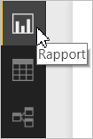
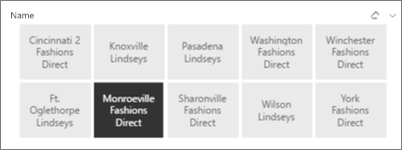
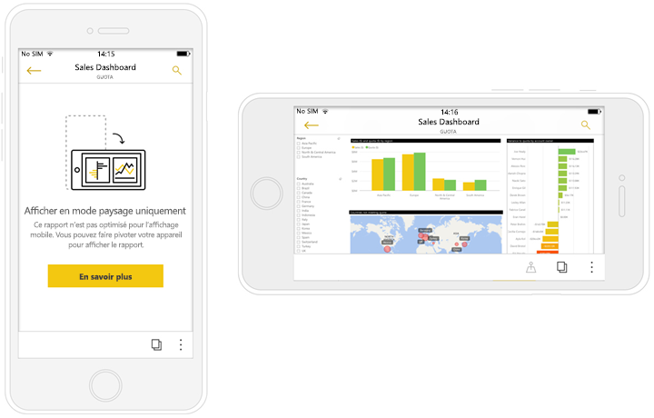

# Créer des rapports optimisés pour les applications Power BI pour téléphone
Quand vous [créez un rapport dans Power BI Desktop](desktop-report-view.md), vous pouvez améliorer son utilisation dans les applications mobiles des téléphones en créant une version destinée spécifiquement à l’affichage sur téléphone. Adaptez votre rapport au téléphone en réorganisant et redimensionnant les visuels ou en choisissant d’en inclure uniquement une partie. Vous bénéficiez ainsi d’une expérience optimale. Vous pouvez également créer des [*visuels* réactifs](#optimize-a-visual-for-any-size) et des [segments réactifs](#enhance-slicers-to-to-work-well-in-phone-reports) qui se redimensionnent pour l’affichage sur un téléphone. De plus, si vous ajoutez des filtres à votre rapport, ceux-ci apparaissent automatiquement dans le rapport pour téléphone. Les lecteurs de votre rapport peuvent les afficher et les utiliser pour filtrer le rapport.

## Disposer une page de rapport pour un affichage sur téléphone dans Power BI Desktop
Après que vous avez [créé un rapport dans Power BI Desktop](desktop-report-view.md), vous pouvez l’optimiser pour les téléphones.

1. Dans Power BI Desktop, sélectionnez **Affichage Rapport** dans la barre de navigation gauche.
   
    
2. Sous l’onglet **Vue**, sélectionnez **Mode téléphone**.  
   
    
   
    Un canevas de téléphone vide s’affiche. Tous les visuels de la page de rapport d’origine sont répertoriés dans le volet Visualisations à droite.
3. Pour ajouter un visuel au mode téléphone, faites-le glisser du volet Visualisations vers le canevas du téléphone.
   
    Les rapports sur téléphone utilisent une grille. Quand vous faites glisser des visuels sur le canevas mobile, ils s’alignent sur cette grille.
   
    
   
    Vous pouvez ajouter tout ou partie des visuels de la page de rapport principale à la page de rapport pour téléphone. Vous ne pouvez ajouter chaque visuel qu’une seule fois.
4. Vous pouvez redimensionner vos visuels sur la grille, comme vous le feriez pour les vignettes des tableaux de bord et tableaux de bord mobiles.
   
   > [!NOTE]
   > La grille du rapport sur téléphone s’adapte aux téléphones de différentes tailles. Le rapport s’affiche correctement aussi bien sur les petits que les grands écrans.
   > 
   > 
   
   

## Optimiser un visuel pour toute taille
Vous pouvez configurer les visuels de vos tableaux de bord ou rapports de façon à ce qu’ils soient *réactifs*, changeant de manière dynamique pour afficher une quantité maximale de données et d’informations, quelle que soit la taille de l’écran. 

Quand un visuel change de taille, Power BI hiérarchise la vue de données, par exemple, en supprimant le remplissage et en déplaçant automatiquement la légende vers le haut du visuel de façon à ce que celui-ci reste informatif, même quand sa taille diminue.

Vous choisissez d’activer ou non la réactivité pour chaque visuel. En savoir plus sur l’[optimisation des visuels](desktop-create-responsive-visuals.md).

## Considérations relatives à la création de dispositions de rapport sur téléphone
* Pour les rapports contenant plusieurs pages, vous pouvez optimiser toutes les pages ou seulement quelques unes. 
* Si vous avez défini la couleur d’arrière-plan d’une page de rapport, le rapport sur téléphone a la même couleur d’arrière-plan.
* Vous ne pouvez pas modifier les paramètres de mise en forme pour le téléphone uniquement. La mise en forme est cohérente entre les dispositions principales et mobiles. Par exemple, les tailles de police sont identiques.
* Pour modifier un visuel, comme sa mise en forme, le jeu de données associé, les filtres ou tout autre attribut, revenez au mode de création de rapports standard.
* Power BI fournit des titres et noms de page par défaut pour les rapports sur téléphone dans l’application mobile. Si vous avez créé des visuels de texte pour des titres et noms de pages dans votre rapport, envisagez de ne pas les ajouter à vos rapports sur téléphone.     

## Supprimer un visuel de la disposition de téléphone
* Pour supprimer un visuel, cliquez sur la croix (X) dans le coin supérieur droit du visuel sur le canevas de téléphone ou sélectionnez-le et appuyez sur **Supprimer**.
  
   La suppression du visuel ici a seulement pour effet de le supprimer de la zone de dessin de disposition pour téléphone. Le visuel et le rapport d’origine ne sont pas affectés.
  
   

## Améliorer les segments pour optimiser leur fonctionnement dans les rapports sur téléphone
Les segments offrent un filtrage sur canevas des données de rapport. Quand vous concevez des segments dans le mode de création de rapports standard, vous pouvez modifier certains paramètres des segments pour faciliter leur utilisation dans les rapports sur téléphone :

* Décidez si les lecteurs du rapport peuvent sélectionner un seul ou plusieurs éléments.
* Placez une zone autour du segment pour faciliter la lecture du rapport.
* Définissez le segment sur vertical, horizontal ou *réactif*. 

Si vous rendez le segment réactif, des options supplémentaires apparaissent lorsque vous modifiez sa taille et sa forme. Il peut être grand, petit, large ou étroit. S’il est suffisamment petit, il se transforme en simple icône de filtre sur la page de rapport. 

En savoir plus sur la [création de segments réactifs](power-bi-slicer-filter-responsive.md).

## Publier un rapport sur téléphone
* Pour publier la version sur téléphone d’un rapport, [publiez le rapport principal de Power BI Desktop vers le service Power BI](desktop-upload-desktop-files.md) ; la version sur téléphone est publiée en même temps.
  
    En savoir plus sur [le partage et les autorisations dans Power BI](service-how-to-collaborate-distribute-dashboards-reports.md).

## Afficher des rapports optimisés et non optimisés sur un téléphone
Dans les applications mobiles des téléphones, Power BI détecte automatiquement les rapports sur téléphone optimisés et non optimisés. Si un rapport optimisé pour les téléphones existe, l’application de téléphone Power BI ouvre automatiquement le rapport en mode Rapport sur téléphone.

Si un rapport optimisé pour le téléphone n’existe pas, le rapport s’ouvre en mode paysage non optimisé.  

Dans un rapport sur téléphone, orienter le téléphone en mode paysage a pour effet d’ouvrir le rapport dans la vue non optimisée avec la disposition du rapport d’origine, que le rapport soit optimisé ou non.

Si seules certaines pages sont optimisées, les lecteurs voient un message qui s’affiche en mode portrait et indique que le rapport est disponible en mode paysage.

Les lecteurs du rapport peuvent tourner leur téléphone sur le côté pour afficher la page en mode paysage. Apprenez-en davantage sur l’[interaction avec les rapports Power BI optimisés pour votre téléphone](mobile-apps-view-phone-report.md).

## Étapes suivantes
* [Créer une vue téléphone d’un tableau de bord dans Power BI](service-create-dashboard-mobile-phone-view.md)
* [Afficher les rapports Power BI optimisés pour votre téléphone](mobile-apps-view-phone-report.md)
* [Créer des visuels réactifs optimisés pour toute taille](desktop-create-responsive-visuals.md)
* D’autres questions ? [Essayez d’interroger la communauté Power BI](http://community.powerbi.com/)

