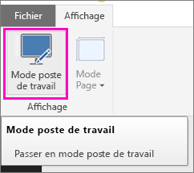
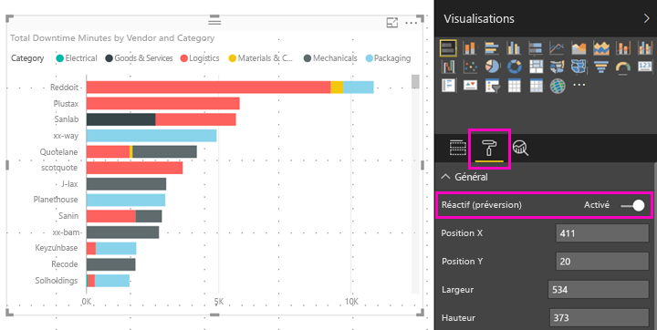

# Optimiser des visuels Power BI de toutes tailles
Vous pouvez configurer les visuels de vos tableaux de bord ou rapports de façon à ce qu’ils soient *réactifs*, changeant de manière dynamique pour afficher une quantité maximale de données et d’informations, quelle que soit la taille de l’écran.

Quand un visuel change de taille, Power BI hiérarchise la vue de données, par exemple, en supprimant le remplissage et en déplaçant automatiquement la légende vers le haut du visuel de façon à ce que celui-ci reste informatif, même quand sa taille diminue. La réactivité est particulièrement utile dans les visuels de l’application mobile Power BI sur les téléphones.

Vous pouvez activer la réactivité des visuels avec les axes X et Y ainsi que les segments.

## Activer la réactivité dans Power BI Desktop
1. Dans Power BI Desktop, sous l’onglet **Affichage**, vérifiez que vous êtes en **Mode poste de travail**.
   
    
2. Sélectionnez un visuel, puis, dans le volet **Visualisations**, sélectionnez la section **Format**.
3. Développez **Général** > définissez **Réactif** sur **Activé**.
   
    
   
     Désormais, lorsque vous [créez un rapport optimisé pour le téléphone](desktop-create-phone-report.md), puis ajoutez cet visuel, celui-ci se redimensionne harmonieusement.

## Activer la réactivité dans le service Power BI
Vous activez la réactivité pour un visuel dans un rapport via le service Power BI. Vous devez être en mesure de modifier le rapport.

1. Dans un rapport dans le service Power BI ([https://powerbi.com](https://powerbi.com)), sélectionnez **Modifier le rapport**.
2. Sélectionnez un visuel, puis, dans le volet **Visualisations**, sélectionnez la section **Format**.
3. Développez **Général** > définissez **Réactif** sur **Activé**.
   
    
   
     Désormais, lorsque vous [créez une vue téléphone d’un tableau de bord](service-create-dashboard-mobile-phone-view.md), puis ajoutez ce visuel, celui-ci se redimensionne harmonieusement.

## Étapes suivantes
* [Créer des rapports optimisés pour les applications Power BI pour téléphone](desktop-create-phone-report.md)
* [Créer une vue téléphone d’un tableau de bord dans Power BI](service-create-dashboard-mobile-phone-view.md)
* [Afficher les rapports Power BI optimisés pour votre téléphone](mobile-apps-view-phone-report.md)
* D’autres questions ? [Essayez d’interroger la communauté Power BI](http://community.powerbi.com/)

