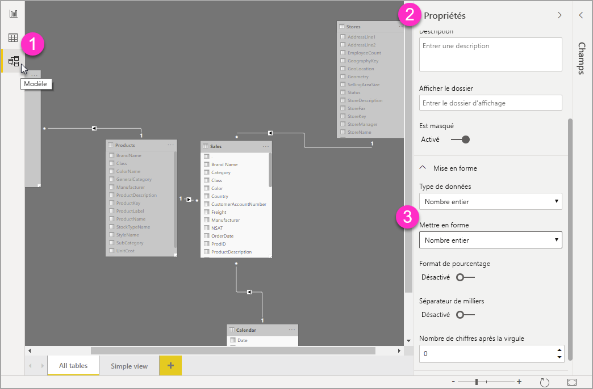

# Utiliser des chaînes de format personnalisées dans Power BI Desktop

Avec les chaînes de format personnalisées dans **Power BI Desktop**, vous pouvez personnaliser la façon dont les champs s’affichent dans les éléments visuels et vous assurer que vos rapports se présentent exactement comme vous le souhaitez.

## Comment utiliser des chaînes de format personnalisées

Pour créer des chaînes de format personnalisées, sélectionnez le champ dans la vue **Modélisation**, puis sélectionnez **Format** dans le volet **Propriétés**.

Une fois que vous avez sélectionné **Personnalisé** dans la liste déroulante **Format**, vous pouvez faire votre choix dans une liste de chaînes de format couramment utilisées. 

## Syntaxe de format personnalisé prise en charge

Les chaînes de format personnalisées suivent la syntaxe VBA, commune à Excel et à d’autres produits Microsoft, mais ne prennent pas en charge toutes les syntaxes utilisées dans les autres produits. 

Les tableaux suivants définissent la syntaxe prise en charge dans Power BI.

Le tableau suivant indique les **symboles de date** pris en charge :

| **Symbole** | **Plage** |
| --- | --- |
| _d_ | 1-31 (jour du mois, sans zéro non significatif) |
| _dd_ | 01-31 (jour du mois, avec un zéro non significatif) |
| _m_ | 1-12 (mois de l’année, sans zéro non significatif, en commençant par janvier = 1) |
| _mm_ | 01-12 (mois de l’année, avec un zéro non significatif, en commençant par janvier = 01) |
| _mmm_ | Affiche les noms de mois abrégés (les noms de mois Hijri n’ont pas d’abréviation) |
| _mmmm_ | Affiche les noms de mois complets |
| _y_ | 1-366 (Jour de l’année) |
| _yy_ | 00-99 (deux derniers chiffres de l’année) |
| _yyyy_ | 100-9999 (année à trois ou quatre chiffres) |

Le tableau suivant indique les **symboles d’heure** pris en charge :

| **Symbole** | **Plage** |
| --- | --- |
| _h_ | 0-23 (1-12 avec &quot;AM&quot; ou &quot;PM&quot; ajouté) (heure de la journée, sans zéro non significatif) |
| _hh_ | 00-23 (01-12 avec &quot;AM&quot; ou &quot;PM&quot; ajouté) (heure de la journée, avec un zéro non significatif) |
| _n_ | 0-59 (minute de l’heure, sans zéro non significatif) |
| _nn_ | 00-59 (minute de l’heure, avec un zéro non significatif) |
| _m_ | 0-59 (minute de l’heure, sans zéro non significatif). Uniquement si précédé de _h_ ou _hh_ |
| _mm_ | 00-59 (minute de l’heure, avec un zéro non significatif). Uniquement si précédé de _h_ ou _hh_ |
| _s_ | 0-59 (seconde de la minute, sans zéro non significatif) |
| _ss_ | 00-59 (seconde de la minute, avec un zéro non significatif) |

Vous pouvez voir un [exemple](https://docs.microsoft.com/office/vba/language/reference/user-interface-help/format-function-visual-basic-for-applications#example) de mise en forme des chaînes de valeur personnalisées.

Une expression de format définie par l’utilisateur pour les nombres peut avoir de une à trois sections séparées par des points-virgules. Si vous incluez des points-virgules sans rien entre, la section manquante ne s’affichera pas (elle sera &quot;&quot;). Si le point-virgule n’est pas spécifié, le format positif est utilisé.

Voici des exemples de formats différents pour différentes chaînes de valeur :

|   | **Chaînes de format** |   |   |   |
| --- | --- | --- | --- | --- |
| **Valeurs** | **0.00;-0.0;&quot;Zéro&quot;** | **0.00;;** | **0.00;-0.0;** | **0.00;** |
| **-1.234** | -1.2 | &quot;&quot; | -1.2 | &quot;&quot; |
| **0** | &quot;Zéro&quot; | &quot;&quot; | &quot;&quot; | 0,00 |
| **1.234** | 1.23 | 1.23 | 1.23 | 1.23 |

Le tableau suivant identifie les **formats de date et d’heure nommés** prédéfinis :

| **Nom de format** | **Description** |
| --- | --- |
| **Date générale** | Affichez une date et/ou une heure, par exemple, 4/3/93 05:34 PM. S’il n’y a pas de partie fractionnaire, affiche uniquement une date, par exemple, 4/3/93. S’il n’existe pas de partie entière, affiche uniquement l’heure, par exemple, 05:34 PM. L’affichage de la date est déterminé par vos paramètres système. |
| **Date longue** | Affiche une date en fonction du format de date longue de votre système. |
| **Date courte** | Affiche une date à en fonction du format de date courte de votre système. |
| **Heure longue** | Affiche une heure en fonction du format d’heure longue de votre système. Comprend les heures, les minutes et les secondes. |
| **Heure courte** | Affiche une heure au format 24 heures, par exemple 17:45. |

Formats numériques nommés

Le tableau suivant identifie les **formats numériques nommés** prédéfinis :

| **Nom de format** | **Description** |
| --- | --- |
| **Nombre général** | Affiche les nombres sans séparateur de milliers. |
| **Devise** | Affiche le nombre avec séparateur de milliers, le cas échéant ; affiche deux chiffres à droite du séparateur décimal. La sortie est basée sur les paramètres régionaux du système. |
| **Fixe** | Affiche au moins un chiffre à gauche et deux chiffres à droite du séparateur décimal. |
| **Standard** | Affiche le nombre avec le séparateur de milliers, au moins un chiffre à gauche et deux chiffres à droite du séparateur décimal. |
| **Pourcentage** | Affiche le nombre multiplié par 100 avec un signe de pourcentage ( **%** ) ajouté à droite ; affiche toujours deux chiffres à droite du séparateur décimal. |
| **Scientifique** | Utilise la notation scientifique standard. |

Le tableau suivant identifie les caractères que vous pouvez utiliser pour créer des **formats de date/heure définis par l’utilisateur**.

| **Caractère** | **Description** |
| --- | --- |
| ( **:** ) | Séparateur d’heure. Pour certains paramètres régionaux, d’autres caractères peuvent être utilisés pour représenter le séparateur d’heure. Le séparateur d’heure sépare les heures, les minutes et les secondes lors de la mise en forme des valeurs d’heure. Le caractère réel utilisé comme séparateur d’heure dans le résultat mis en forme est déterminé par vos paramètres système. |
| ( **/** ) | Séparateur de date. Pour certains paramètres régionaux, d’autres caractères peuvent être utilisés pour représenter le séparateur de date. Le séparateur de date sépare le jour, le mois et l’année lorsque les valeurs de date sont mises en forme. Le caractère réel utilisé comme séparateur de date dans le résultat mis en forme est déterminé par vos paramètres système. |
| d | Affiche le jour sous la forme d’un nombre sans zéro non significatif (1–31). |
| dd | Affiche le jour sous la forme d’un nombre avec un zéro non significatif (de 01 à 31). |
| ddd | Affiche le jour sous forme abrégée (Sun à Sat). Localisé. |
| dddd | Affiche le jour en entier (Sunday à Saturday). Localisé. |
| m | Affiche le mois sous la forme d’un nombre sans zéro non significatif. (1–12). Si m suit immédiatement h ou hh, les minutes sont affichées au lieu du mois. |
| mm | Affiche le mois sous la forme d’un nombre sans zéro non significatif (01–12). Si m suit immédiatement h ou hh, les minutes sont affichées au lieu du mois. |
| mmm | Affiche le mois sous forme abrégée (Jan à Déc). Localisé. |
| mmmm | Affiche le mois sous forme d’un nom de mois complet (Janvier – Décembre). Localisé. |
| y | Affiche le jour de l’année sous la forme d’un nombre (de 1 à 366). |
| yy | Affiche l’année sous la forme d’un nombre à deux chiffres (de 00 à 99). |
| yyyy | Affiche l’année sous la forme d’un nombre à 4 chiffres (100 à 9999). |
| h | Affiche l’heure sous la forme d’un nombre sans zéro non significatif (0 à 23). |
| hh | Affiche l’heure sous la forme d’un nombre avec un zéro non significatif (00 à 23). |
| n | Affiche la minute sous la forme d’un nombre sans zéro non significatif (0 à 59). |
| nn | Affiche la minute sous la forme d’un nombre sans zéro non significatif (00–59). |
| s | Affiche la seconde sous la forme d’un nombre sans zéro non significatif (0–59). |
| ss | Affiche la seconde sous la forme d’un nombre sans zéro non significatif (00–59). |
| AM/PM | Utilisez l’horloge de 12 heures et affichez un AM en majuscules avec toute heure avant midi ; un PM en majuscules avec toute heure comprise entre midi et 23h59. |

Le tableau suivant identifie les caractères que vous pouvez utiliser pour créer des **formats de nombre définis par l’utilisateur**.

| **Caractère** | **Description** |
| --- | --- |
| Aucune | Affichez le nombre sans mise en forme. |
| (**0**) | Espace réservé de chiffre. Affiche un chiffre ou un zéro. Si l’expression contient un chiffre à l’emplacement où la valeur 0 apparaît dans la chaîne de format, elle est affichée. Sinon, affiche un zéro à cette position. Si le nombre contient moins de chiffres que de zéros (de part et d’autre du séparateur décimal) dans l’expression de format, affiche des zéros au début ou à la fin. Si le nombre contient plus de chiffres à droite du séparateur décimal qu’il y a de zéros à droite du séparateur décimal dans l’expression de format, arrondit le nombre à autant de décimales qu’il y a de zéros. Si le nombre contient plus de chiffres à gauche du séparateur décimal qu’il y a de zéros à gauche du séparateur décimal dans l’expression de format, affiche les chiffres supplémentaires sans modification. |
| ( **#** ) | Espace réservé de chiffre. Affiche un chiffre ou rien. Si l’expression contient un chiffre à l’emplacement où la valeur # apparaît dans la chaîne de format, elle est affichée. Sinon, n’affiche rien à cette position. Ce symbole fonctionne comme l’espace réservé de chiffre 0, sauf que les zéros de début et de fin ne sont pas affichés si le nombre a le même nombre ou un nombre de chiffres inférieur à celui des caractères # de part et d’autre du séparateur décimal dans l’expression de format. |
| ( **.** ) | Espace réservé de décimale. Dans certains paramètres régionaux, une virgule est utilisée comme séparateur décimal. L’espace réservé de décimale détermine le nombre de chiffres affichés à gauche et à droite du séparateur décimal. Si l’expression de format contient uniquement des signes numériques à gauche de ce symbole, les nombres inférieurs à 1 commencent par un séparateur décimal. Pour afficher un zéro non significatif avec les nombres fractionnaires, utilisez 0 comme premier espace réservé de chiffre à gauche du séparateur décimal. Le caractère réel utilisé comme espace réservé décimal dans le résultat mis en forme dépend du format numérique reconnu par votre système. |
| ( **%)** | Espace réservé de pourcentage. L’expression est multipliée par 100. Le caractère de pourcentage ( **%** ) est inséré à l’emplacement où il apparaît dans la chaîne de format. |
| ( **,** ) | Séparateur des milliers. Dans certains paramètres régionaux, un point est utilisé comme séparateur des milliers. Le séparateur des milliers sépare les milliers des centaines au sein d’un nombre qui a quatre décimales ou plus à gauche du séparateur décimal. L’utilisation standard du séparateur de milliers est spécifiée si le format contient un séparateur de milliers entouré par des espaces réservés de chiffre (**0** ou **#** ). Deux séparateurs de milliers adjacents ou un séparateur de milliers immédiatement à gauche du séparateur décimal (qu’une décimale soit spécifiée ou non) signifient &quot;mettre à l’échelle le nombre en le divisant par 1000, en arrondissant si nécessaire.&quot; Par exemple, vous pouvez utiliser la chaîne de forma &quot;##0,,&quot; pour représenter 100 millions comme 100. Les nombres inférieurs à 1 million sont affichés comme 0. Deux séparateurs de milliers adjacents dans toute position autre qu’immédiatement à gauche du séparateur décimal sont traités simplement comme spécifiant l’utilisation d’un séparateur de milliers. Le caractère réel utilisé pour le séparateur de milliers dans le résultat mis en forme dépend du format numérique reconnu par votre système. |
| ( **:** ) | Séparateur d’heure. Pour certains paramètres régionaux, d’autres caractères peuvent être utilisés pour représenter le séparateur d’heure. Le séparateur d’heure sépare les heures, les minutes et les secondes lors de la mise en forme des valeurs d’heure. Le caractère réel utilisé comme séparateur d’heure dans le résultat mis en forme est déterminé par vos paramètres système. |
| ( **/** ) | Séparateur de date. Pour certains paramètres régionaux, d’autres caractères peuvent être utilisés pour représenter le séparateur de date. Le séparateur de date sépare le jour, le mois et l’année lorsque les valeurs de date sont mises en forme. Le caractère réel utilisé comme séparateur de date dans le résultat mis en forme est déterminé par vos paramètres système. |
| (**E- E+ e- e+** ) | Format scientifique. Si l’expression de format contient au moins un espace réservé de chiffre (**0** ou **#** ) à droite de E-, E+, e- ou e+, le nombre est affiché au format scientifique et E ou e est inséré entre le nombre et son exposant. Le nombre d’espaces réservés de chiffre à droite détermine le nombre de chiffres dans l’exposant. Utilisez E- ou e- pour placer un signe moins à côté des exposants négatifs. Utilisez E+ ou e+ pour insérer un signe moins à côté des exposants négatifs et un signe plus à côté des exposants positifs. |
| **- + $**  ( ) | Affiche un caractère littéral. Pour afficher un caractère autre que ceux répertoriés, faites-le précéder d’une barre oblique inverse (\) ou placez-le entre guillemets doubles (&quot; &quot;). |
| (* *\** ) | Affiche le caractère suivant dans la chaîne de format. Pour afficher un caractère ayant une signification spéciale sous forme de caractère littéral, faites-le précéder d’une barre oblique inverse (\). La barre oblique inverse elle-même n’est pas affichée. L’utilisation d’une barre oblique inverse revient à mettre le caractère suivant entre guillemets doubles. Pour afficher une barre oblique inverse, utilisez deux barres obliques inverses (\\). Exemples de caractères pouvant être affichés comme caractères littéraux : caractères de mise en forme de date et d’heure (a, c, d, h, m, n, p, q, s, t, w, y, / et :), caractères de format numérique (#, 0, %, E, e, virgule et point), et caractères de format de chaîne (@, &amp;, \&lt;, \&gt; et !). |
| (&quot;ABC&quot;) | Affiche la chaîne à l’intérieur des guillemets doubles (&quot; &quot;). |

## Étapes suivantes
Les articles suivants pourraient également vous intéresser :

* [Chaînes de format VBA](https://docs.microsoft.com/office/vba/language/reference/user-interface-help/format-function-visual-basic-for-applications#example)
* [Mesures dans Power BI Desktop](desktop-measures.md)
* [Types de données dans Power BI Desktop](desktop-data-types.md)
* [Mise en forme conditionnelle dans les tables](desktop-conditional-table-formatting.md)

