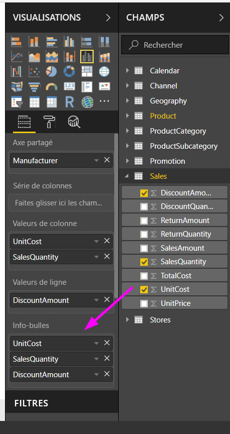

# Personnalisation des info-bulles dans Power BI Desktop
Les info-bulles offrent un moyen élégant de fournir des informations contextuelles et des détails supplémentaires sur les points de données d’un élément visuel. L’illustration suivante montre une info-bulle appliquée à un graphique dans Power BI Desktop.

Quand une visualisation est créée, l’info-bulle par défaut indique la valeur et la catégorie du point de données. Il existe de nombreux cas où le fait de pouvoir personnaliser les informations d’une info-bulle serait utile et fournirait du contexte et des informations supplémentaires aux utilisateurs qui visualisent l’élément visuel. Les info-bulles personnalisées vous permettent de spécifier des points de données supplémentaires qui s’affichent avec l’info-bulle.

## Comment personnaliser les info-bulles
Pour créer une info-bulle personnalisée, dans la zone **Champs** du volet **Visualisations**, il vous suffit de faire glisser un champ dans le compartiment **Info-bulles**, présenté dans l’illustration suivante. Dans l’illustration suivante, deux champs ont été placés dans le compartiment **Info-bulles**.

Après avoir ajouté les info-bulles au champ, il suffit de pointer sur un point de données dans la visualisation pour que les valeurs des champs s’affichent dans l’info-bulle.

## Personnalisation des info-bulles avec la fonction d’agrégation ou de calculs rapides
Vous pouvez aller un peu plus loin dans la personnalisation d’une info-bulle en sélectionnant une fonction d’agrégation ou un *Calcul rapide*. Pour ce faire, sélectionnez la flèche à côté du champ situé dans le compartiment **Info-bulles**, puis choisissez l’une des options disponibles.

Il existe plusieurs façons de personnaliser les **info-bulles**, via les champs disponibles dans un jeu de données, dans le but de communiquer des informations et des indications rapides aux utilisateurs qui visualisent vos tableaux de bord et rapports.

