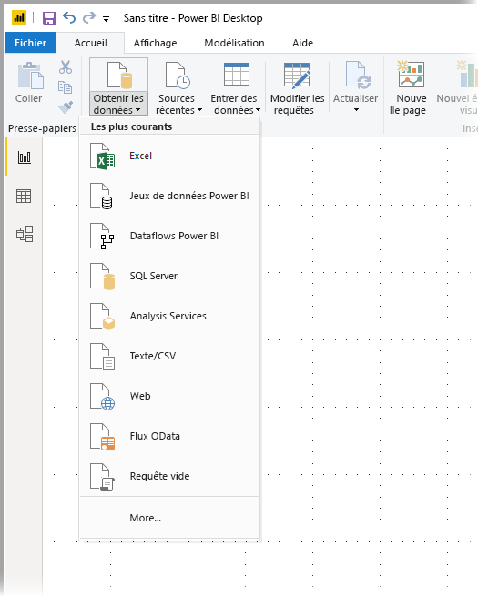
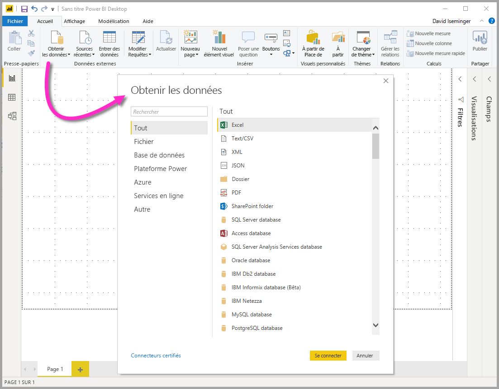
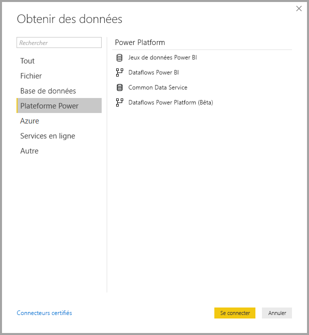
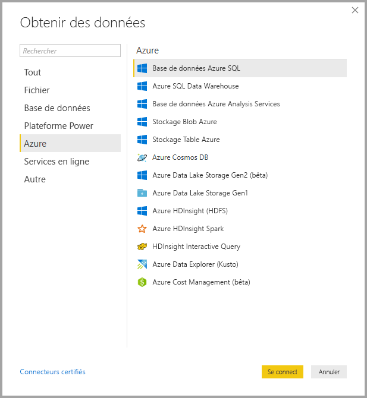
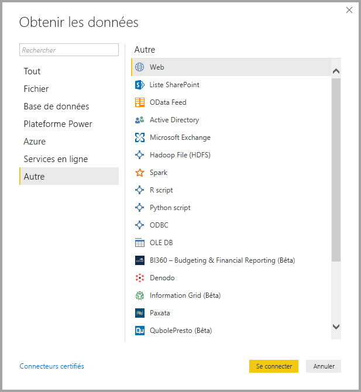
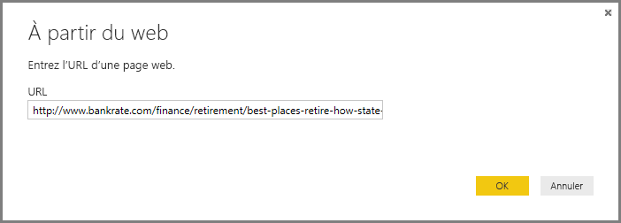
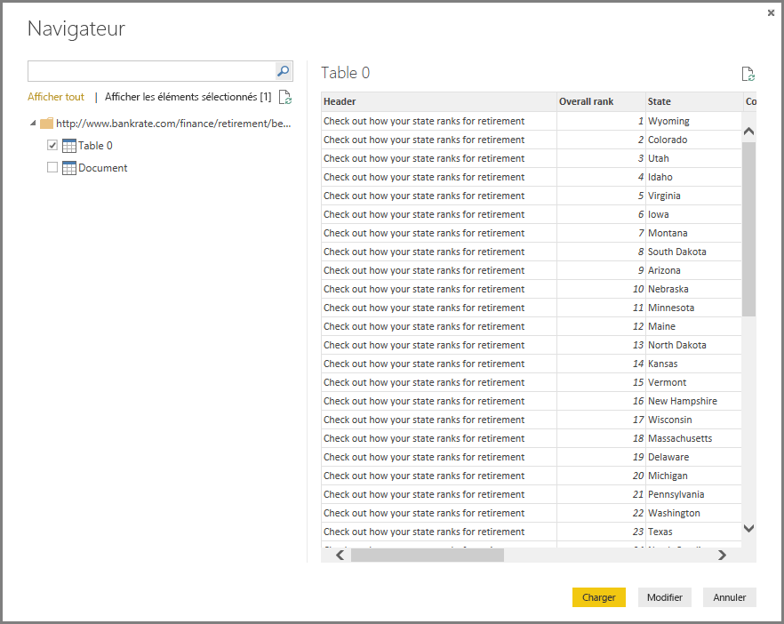

# <a name="data-sources-in-power-bi-desktop"></a>Sources de données dans Power BI Desktop

Power BI Desktop vous permet de vous connecter aux données de nombreuses sources différentes. Pour obtenir la liste complète des sources de données disponibles, consultez [Sources de données Power BI](power-bi-data-sources.md).

Connectez-vous aux données à l’aide du ruban **Accueil**. Pour afficher le menu des types de données **Les plus courants**, sélectionnez l’étiquette du bouton **Obtenir des données** ou la flèche vers le bas.



Pour accéder à la boîte de dialogue **Obtenir des données**, affichez le menu des types de données **Les plus courants** et sélectionnez **Plus**. Vous pouvez également faire apparaître la fenêtre **Obtenir des données** (et contourner le menu **Les plus courants**) en sélectionnant directement l’icône **Obtenir des données**.



> [!NOTE]
> L’équipe Power BI enrichit en permanence les sources de données disponibles pour Power BI Desktop et le service Power BI. Par conséquent, les premières versions des sources de données en cours de création sont souvent marquées de la mention **Bêta** ou **Préversion**. Une source de données marquée de la mention **Bêta** ou **Préversion** présente un support et des fonctionnalités limités et ne doit pas être utilisée dans les environnements de production. De plus, une source de données marquée de la mention **Bêta** ou **Préversion** pour Power BI Desktop risque de ne pas être utilisable dans le service Power BI ou dans d’autres services Microsoft tant qu’elle n’a pas été mise à la disposition générale.

> [!NOTE]
> Bon nombre de connecteurs de données pour Power BI Desktop ont besoin d’Internet Explorer 10 (ou une version plus récente) pour l’authentification. 


## <a name="data-sources"></a>Sources de données

La boîte de dialogue **Obtenir des données** organise les types de données dans les catégories suivantes :

* Tout
* Fichier
* Base de données
* Power Platform
* Azure
* Services en ligne
* Autre

La catégorie **Toutes** comprend tous les types de connexion de données de toutes les catégories.

### <a name="file-data-sources"></a>Sources de données Fichier

La catégorie **Fichier** fournit les connexions de données suivantes :

* Excel
* Texte/CSV
* XML
* JSON
* Dossier
* PDF
* Dossier SharePoint

L’image suivante montre la fenêtre **Obtenir les données** pour **Fichier**.


### <a name="database-data-sources"></a>Sources de données Base de données

La catégorie **Base de données** fournit les connexions de données suivantes :

* Base de données SQL Server
* Base de données Access
* Base de données SQL Server Analysis Services
* Base de données Oracle
* Base de données IBM DB2
* Base de données IBM Informix (bêta)
* IBM Netezza
* Base de données MySQL
* Base de données PostgreSQL
* Base de données Sybase
* Base de données Teradata
* Base de données SAP HANA
* Serveur d’applications SAP Business Warehouse
* Serveur de messages SAP Business Warehouse
* Amazon Redshift
* Impala
* Google BigQuery
* Vertica
* Snowflake
* Essbase
* Cubes AtScale
* BI Connector Data Virtuality LDW (Beta)
* Denodo
* Dremio
* Exasol
* Indexima (bêta)
* InterSystems IRIS (bêta)
* Jethro (bêta)
* Kyligence
* MarkLogic

> [!NOTE]
> Certains connecteurs de base de données doivent être activés. Pour cela, sélectionnez **Fichier > Options et paramètres > Options**, puis sélectionnez **Fonctionnalités en version préliminaire** et activez le connecteur. Si vous ne voyez pas certains des connecteurs mentionnés ci-dessus et que vous souhaitez les utiliser, vérifiez les paramètres **Fonctions en version préliminaire**. Notez également qu’une source de données marquée de la mention *Bêta* ou *Préversion* a un support et des fonctionnalités limités et ne doit pas être utilisée dans les environnements de production.

L’image suivante montre la fenêtre **Obtenir les données** pour **Base de données**.


### <a name="power-platform-data-sources"></a>Sources de données Power Platform

La catégorie **Power Platform** fournit les connexions de données suivantes :

* Jeux de données Power BI
* Dataflows Power BI
* Common Data Service
* Dataflows Power Platform

L’image suivante représente la fenêtre **Obtenir des données** pour **Power Platform**.



### <a name="azure-data-sources"></a>Sources de données Azure

La catégorie **Azure** fournit les connexions de données suivantes :

* Base de données Azure SQL
* Azure SQL Data Warehouse
* Base de données Azure Analysis Services
* Stockage Blob Azure
* Stockage Table Azure
* Azure Cosmos DB
* Azure Data Lake Storage Gen2
* Azure Data Lake Storage Gen1
* Azure HDInsight (HDFS)
* Azure HDInsight Spark
* HDInsight Interactive Query
* Azure Data Explorer (Kusto)
* Azure Cost Management
* Azure Time Series Insights (bêta)

L’image suivante montre la fenêtre **Obtenir les données** pour **Azure**.



### <a name="online-services-data-sources"></a>Sources de données Online Services

La catégorie **Services en ligne** fournit les connexions de données suivantes :

* Liste SharePoint Online
* Microsoft Exchange Online
* Dynamics 365 (Online)
* Dynamics NAV
* Dynamics 365 Business Central
* Dynamics 365 Business Central (local)
* Microsoft Azure Consumption Insights (bêta)
* Azure DevOps (bêta)
* Azure DevOps Server (bêta)
* Objets Salesforce
* Rapports Salesforce
* Google Analytics
* Adobe Analytics
* appFigures (bêta)
* Data.World – Obtenir le jeu de données (bêta)
* GitHub (bêta)
* LinkedIn Sales Navigator (bêta)
* MailChimp (bêta)
* Marketo (bêta)
* Mixpanel (bêta)
* Planview Enterprise One - PRM (bêta)
* Planview Projectplace (bêta)
* QuickBooks Online (bêta)
* Smartsheet
* SparkPost (bêta)
* SweetIQ (bêta)
* Planview Enterprise One – CTM (bêta)
* Twilio (bêta)
* tyGraph (bêta)
* Webtrends (bêta)
* Zendesk (bêta)
* Dynamics 365 Customer Insights (bêta)
* Emigo Data Source
* Entersoft Business Suite (bêta)
* FactSet Analytics (Beta)
* Industrial App Store
* Intune Data Warehouse (bêta)
* Microsoft Graph Security (Bêta)
* Product Insights (bêta)
* Quick Base
* TeamDesk (bêta)
* Analyse du temps de travail (bêta)

L’illustration suivante montre la fenêtre **Obtenir les données** pour **Services en ligne**


### <a name="other-data-sources"></a>Autres sources de données

La catégorie **Autre** fournit les connexions de données suivantes :

* Web
* Liste SharePoint
* Flux OData
* Active Directory
* Microsoft Exchange
* Fichier Hadoop (HDFS)
* Spark
* Script R
* Script Python
* ODBC
* OLE DB
* BI360 - Budgets & Rapports financiers (bêta)
* FHIR
* Information Grid (bêta)
* Jamf Pro (Beta)
* MicroStrategy pour Power BI
* Paxata
* QubolePresto (bêta)
* Roamler (bêta)
* Siteimprove (bêta)
* SurveyMonkey (bêta)
* Tenforce (Smart) (bêta)
* Vena (bêta)
* Workforce Dimensions (bêta)
* Zucchetti HR Infinity (Beta)
* Requête vide

L’image suivante montre la fenêtre **Obtenir les données** pour **Autre**.



> [!NOTE]
> À ce stade, il n’est pas possible de se connecter aux sources de données personnalisées sécurisées à l’aide d’Azure Active Directory.

## <a name="connecting-to-a-data-source"></a>Connexion à une source de données

Pour vous connecter à une source de données, sélectionnez la source de données dans la fenêtre **Obtenir les données** et sélectionnez **Se connecter**. Dans l’image suivante, l’option **Web** est sélectionnée dans la catégorie de connexions de données **Autre**.


Une fenêtre de connexion s’affiche, spécifique au type de connexion de données. Si des informations d’identification sont requises, vous êtes invité à les fournir. L’image suivante montre la saisie d’une URL pour établir une connexion à une source de données web.



Entrez l’URL ou les informations de connexion à la ressource, puis sélectionnez **OK**. Power BI Desktop établit la connexion à la source de données et présente les sources de données disponibles dans le **Navigateur**.



Pour charger les données, sélectionnez le bouton **Charger** dans la partie inférieure du volet **Navigateur**. Pour transformer ou modifier la requête dans l’Éditeur Power Query avant de charger les données, sélectionnez le bouton **Transformer les données**.

C’est là tout ce qu’il faut savoir pour se connecter à des sources de données dans Power BI Designer ! Essayez de vous connecter à des données à partir de notre liste grandissante de sources de données et consultez-la régulièrement : nous continuons de l’enrichir en permanence.

## <a name="using-pbids-files-to-get-data"></a>Utilisation de fichiers PBIDS pour l’obtention de données

Les fichiers PBIDS sont des fichiers Power BI Desktop qui ont une structure spécifique et dont l’extension .PBIDS signifie qu’il s’agit de fichiers de source de données Power BI.

Vous pouvez créer un fichier PBIDS afin de simplifier l’expérience **Obtenir des données** pour les créateurs de rapports de votre organisation. Pour faciliter l’utilisation des fichiers PBIDS par un nouvel auteur de rapports, nous recommandons qu’un administrateur crée ces fichiers pour les connexions courantes.

Lorsqu’un auteur ouvre un fichier PBIDS, Power BI Desktop s’ouvre et invite l’utilisateur à fournir des informations d’identification pour s’authentifier et se connecter à la source de données indiquée dans le fichier. La boîte de dialogue **Navigation** s’affiche et l’utilisateur doit sélectionner les tables de cette source de données à charger dans le modèle. Il doit également sélectionner la ou les bases de données si aucune n’a été précisée dans le fichier PBIDS.

Il peut alors commencer à créer des visualisations ou à sélectionner **Sources récentes** pour charger un nouvel ensemble de tables dans le modèle.

Actuellement, les fichiers PBIDS ne gèrent qu’une seule source de données dans un même fichier. La spécification de plusieurs sources de données génère une erreur.

Pour créer le fichier PBIDS, l’administrateur doit indiquer les entrées requises pour une connexion unique. Il peut également préciser le mode de connexion : DirectQuery ou Importation. Si le **mode** est absent ou Null dans le fichier, l’utilisateur qui ouvre le fichier dans Power BI Desktop est invité à sélectionner **DirectQuery** ou **Importation**.

### <a name="pbids-file-examples"></a>Exemples de fichiers PBIDS

Cette section fournit des exemples de sources de données couramment utilisées. Le type de fichier PBIDS ne gère que les connexions de données qui sont également prises en charge dans Power BI Desktop, à deux exceptions près : Live Connect et Blank Query.

Le fichier PBIDS ne comporte *pas* les informations d’authentification et les informations sur les tables et les schémas.  

Les extraits de code suivants montrent plusieurs exemples courants de fichiers PBIDS, mais ils ne sont pas complets ni exhaustifs. Pour les autres sources de données, vous pouvez vous reporter au [Format DSR (référence de source de données) pour les informations de protocole et d’adresse](https://docs.microsoft.com/azure/data-catalog/data-catalog-dsr#data-source-reference-specification).

Ces exemples sont proposés à titre indicatif, ne sont pas pensés pour être exhaustifs et n’incluent pas tous les connecteurs pris en charge au format DSR. L’administrateur ou l’organisation peut créer ses propres sources de données en utilisant ces exemples comme guides, afin de créer et de prendre en charge ses propres fichiers de source de données.

#### <a name="azure-as"></a>Azure AS

```json
{ 
    "version": "0.1", 
    "connections": [ 
    { 
        "details": { 
        "protocol": "analysis-services", 
        "address": { 
            "server": "server-here" 
        }, 
        } 
    } 
    ] 
}
```

#### <a name="folder"></a>Dossier

```json
{ 
  "version": "0.1", 
  "connections": [ 
    { 
      "details": { 
        "protocol": "folder", 
        "address": { 
            "path": "folder-path-here" 
        } 
      } 
    } 
  ] 
} 
```

#### <a name="odata"></a>OData

```json
{ 
  "version": "0.1", 
  "connections": [ 
    { 
      "details": { 
        "protocol": "odata", 
        "address": { 
            "url": "URL-here" 
        } 
      } 
    } 
  ] 
} 
```

#### <a name="sap-bw"></a>SAP BW

```json
{ 
  "version": "0.1", 
  "connections": [ 
    { 
      "details": { 
        "protocol": "sap-bw-olap", 
        "address": { 
          "server": "server-name-here", 
          "systemNumber": "system-number-here", 
          "clientId": "client-id-here" 
        }, 
      } 
    } 
  ] 
} 
```

#### <a name="sap-hana"></a>SAP Hana

```json
{ 
  "version": "0.1", 
  "connections": [ 
    { 
      "details": { 
        "protocol": "sap-hana-sql", 
        "address": { 
          "server": "server-name-here:port-here" 
        }, 
      } 
    } 
  ] 
} 
```

#### <a name="sharepoint-list"></a>Liste SharePoint

L’URL doit pointer vers le site SharePoint proprement dit, et non vers une liste au sein du site. Les utilisateurs obtiennent un navigateur qui leur permet de sélectionner une ou plusieurs listes à partir de ce site, chacune d’elles devenant une table du modèle.

```json
{ 
  "version": "0.1", 
  "connections": [ 
    { 
      "details": { 
        "protocol": "sharepoint-list", 
        "address": { 
          "url": "URL-here" 
        }, 
       } 
    } 
  ] 
} 
```

#### <a name="sql-server"></a>SQL Server

```json
{ 
  "version": "0.1", 
  "connections": [ 
    { 
      "details": { 
        "protocol": "tds", 
        "address": { 
          "server": "server-name-here", 
          "database": "db-name-here (optional) "
        } 
      }, 
      "options": {}, 
      "mode": "DirectQuery" 
    } 
  ] 
} 
```

#### <a name="text-file"></a>Fichier texte

```json
{ 
  "version": "0.1", 
  "connections": [ 
    { 
      "details": { 
        "protocol": "file", 
        "address": { 
            "path": "path-here" 
        } 
      } 
    } 
  ] 
} 
```

#### <a name="web"></a>Web

```json
{ 
  "version": "0.1", 
  "connections": [ 
    { 
      "details": { 
        "protocol": "http", 
        "address": { 
            "url": "URL-here" 
        } 
      } 
    } 
  ] 
} 
```

#### <a name="dataflow"></a>Dataflow

```json
{
  "version": "0.1",
  "connections": [
    {
      "details": {
        "protocol": "powerbi-dataflows",
        "address": {
          "workspace":"workspace id (Guid)",
          "dataflow":"optional dataflow id (Guid)",
          "entity":"optional entity name"
        }
       }
    }
  ]
}
```

## <a name="next-steps"></a>Étapes suivantes

Power BI Desktop permet d’effectuer des tâches très diverses. Pour plus d’informations sur ses fonctionnalités, passez en revue les ressources suivantes :

* [Qu’est-ce que Power BI Desktop ?](desktop-what-is-desktop.md)
* [Vue d’ensemble des requêtes dans Power BI Desktop](desktop-query-overview.md)
* [Types de données dans Power BI Desktop](desktop-data-types.md)
* [Mettre en forme et combiner des données dans Power BI Desktop](desktop-shape-and-combine-data.md)
* [Tâches courantes relatives aux requêtes dans Power BI Desktop](desktop-common-query-tasks.md)
