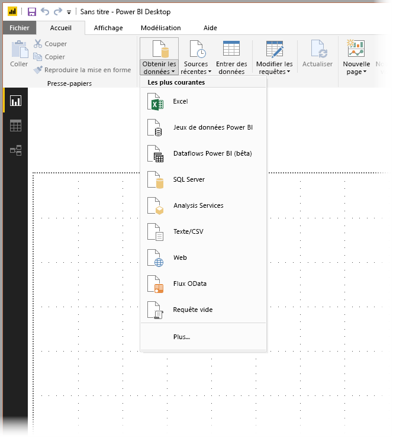
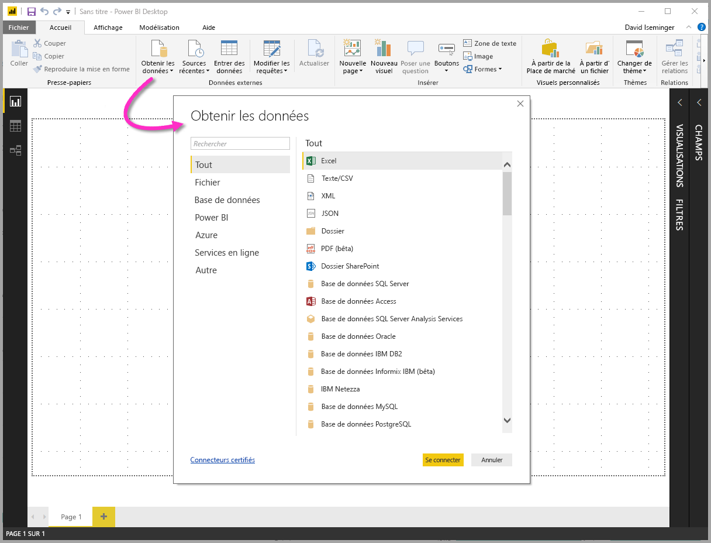
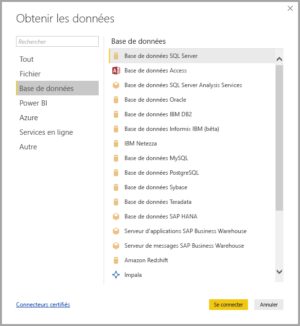
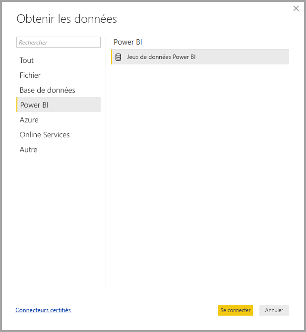
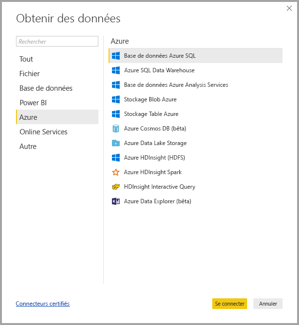
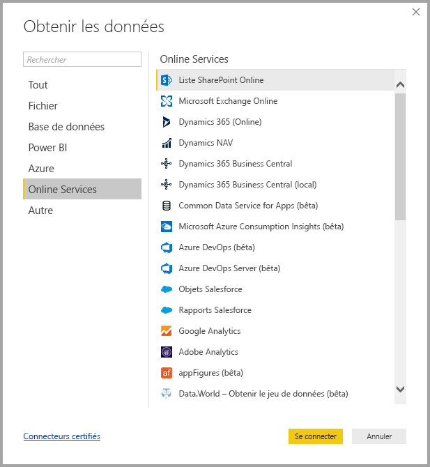
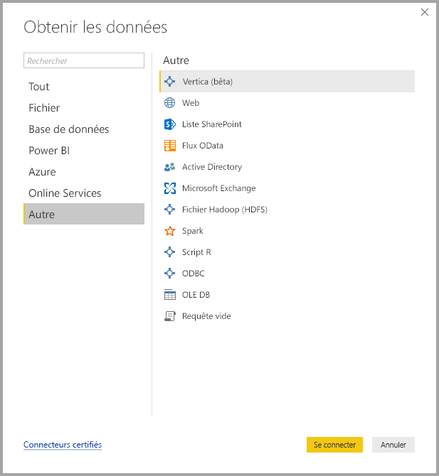
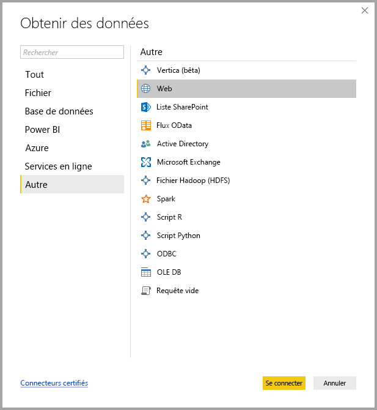

# Sources de données dans Power BI Desktop
Power BI Desktop vous permet de vous connecter aux données de nombreuses sources différentes. La liste complète des sources de données disponibles figure au bas de cette page.

Pour vous connecter à des données, sélectionnez **Obtenir des données** à partir du ruban **Accueil**. Sélectionnez la flèche orientée vers le bas ou le texte **Obtenir les données** sur le bouton pour afficher le menu des types de données **Les plus courantes** illustré dans l’image suivante :

En sélectionnant **Plus...** dans le menu **Les plus courantes**, vous accédez à la fenêtre **Obtenir les données**. Vous pouvez également faire apparaître la fenêtre **Obtenir les données** (et ignorer le menu **Les plus courantes** ) en sélectionnant directement le **bouton d’icône** **Obtenir les données**.

> [!NOTE]
> L’équipe Power BI enrichit en permanence les sources de données disponibles pour **Power BI Desktop** et le **service Power BI**. Par conséquent, les premières versions des sources de données en cours de création sont souvent marquées de la mention *Bêta* ou *Préversion*. Une source de données marquée de la mention *Bêta* ou *Préversion* a un support et des fonctionnalités limités et ne doit pas être utilisée dans les environnements de production.
> 
> 

## Sources de données
Les types de données sont organisés dans les catégories suivantes :

* Toutes
* Fichier
* Base de données
* Power BI
* Azure
* Online Services
* Autre

La catégorie **Toutes** comprend tous les types de connexion de données de toutes les catégories.

La catégorie **Fichier** fournit les connexions de données suivantes :

* Excel
* Texte/CSV
* XML
* JSON
* Dossier
* Dossier SharePoint

L’image suivante montre la fenêtre **Obtenir les données** pour **Fichier**.

La catégorie **Base de données** fournit les connexions de données suivantes :

* Base de données SQL Server
* Base de données Access
* Base de données SQL Server Analysis Services
* Base de données Oracle
* Base de données IBM DB2
* Base de données Informix IBM (bêta)
* IBM Netezza
* Base de données MySQL
* Base de données PostgreSQL
* Base de données Sybase
* Base de données Teradata
* Base de données SAP HANA
* SAP Business Warehouse Application Server
* SAP Business Warehouse Message Server (bêta)
* Amazon Redshift
* Impala
* Google BigQuery
* Snowflake
* Exasol

> [!NOTE]
> Certains connecteurs de base de données doivent être activés. Pour cela, sélectionnez **Fichier > Options et paramètres > Options**, puis sélectionnez **Fonctionnalités en version préliminaire** et activez le connecteur. Si vous ne voyez pas certains des connecteurs mentionnés ci-dessus et que vous souhaitez les utiliser, vérifiez les paramètres **Fonctions en version préliminaire**. Notez également qu’une source de données marquée de la mention *Bêta* ou *Préversion* a un support et des fonctionnalités limités et ne doit pas être utilisée dans les environnements de production.
> 
> 

L’image suivante montre la fenêtre **Obtenir les données** pour **Base de données**.

La catégorie **Power BI** fournit les connexions de données suivantes :

* Jeux de données Power BI
* Pools de données Power BI (bêta)

L’image suivante montre la fenêtre **Obtenir des données** pour **Power BI**.

La catégorie **Azure** fournit les connexions de données suivantes :

* Azure SQL Database
* Azure SQL Data Warehouse
* Base de données Azure Analysis Services
* Stockage Blob Azure
* Stockage Table Azure
* Azure Cosmos DB (bêta)
* Azure Data Lake Store
* Azure HDInsight (HDFS)
* Azure HDInsight Spark (bêta)
* HDInsight Interactive Query (bêta)
* Azure KustoDB (bêta)

L’image suivante montre la fenêtre **Obtenir les données** pour **Azure**.

La catégorie **Services en ligne** fournit les connexions de données suivantes :

* Liste SharePoint Online
* Microsoft Exchange Online
* Dynamics 365 (en ligne)
* Dynamics NAV (bêta)
* Dynamics 365 Business Central
* Common Data Service for Apps (bêta)
* Common Data Service (bêta)
* Microsoft Azure Consumption Insights (bêta)
* Visual Studio Team Services (version bêta)
* Objets Salesforce
* Rapports Salesforce
* Google Analytics
* Adobe Analytics
* appFigures (bêta)
* comScore Digital Analytix (bêta)
* Dynamics 365 pour Insights client (bêta)
* Data.World - Obtenir le jeu de données (bêta)
* Facebook
* GitHub (bêta)
* MailChimp (bêta)
* Marketo (bêta)
* Mixpanel (bêta)
* Planview Enterprise One - PRM (bêta)
* Planview Projectplace (bêta)
* QuickBooks Online (bêta)
* Smartsheet
* SparkPost (bêta)
* Stripe (bêta)
* SweetIQ (bêta)
* Planview Enterprise One - CMT (bêta)
* Twilio (bêta)
* tyGraph (bêta)
* Webtrends (bêta)
* Zendesk (bêta)
* TeamDesk (bêta)

L’illustration suivante montre la fenêtre **Obtenir les données** pour **Services en ligne**

La catégorie **Autre** fournit les connexions de données suivantes :

* Vertica (bêta)
* Web
* Liste SharePoint
* Flux OData
* Active Directory
* Microsoft Exchange
* Fichier Hadoop (HDFS)
* Spark (bêta)
* Script R
* ODBC
* OLE DB
* Requête vide

L’image suivante montre la fenêtre **Obtenir les données** pour **Autre**.

> [!NOTE]
> À ce stade, il n’est pas possible de se connecter aux sources de données personnalisées sécurisées à l’aide d’Azure Active Directory.
> 
> 

## Connexion à une source de données
Pour vous connecter à une source de données, sélectionnez la source de données dans la fenêtre **Obtenir les données** et sélectionnez **Se connecter**. Dans l’image suivante, l’option **Web** est sélectionnée dans la catégorie de connexions de données **Autre**.

Une fenêtre de connexion s’affiche, spécifique au type de connexion de données. Si des informations d’identification sont requises, vous êtes invité à les fournir. L’image suivante montre la saisie d’une URL pour établir une connexion à une source de données web.

Une fois l’URL ou les informations de connexion à la ressource entrées, sélectionnez **OK**. Power BI Desktop établit la connexion à la source de données et présente les sources de données disponibles dans le **Navigateur**.

Vous pouvez charger les données en sélectionnant le bouton **Charger** situé en bas du volet **Navigateur**, ou modifier la requête avant de charger les données en sélectionnant le bouton **Modifier**.

C’est là tout ce qu’il faut savoir pour se connecter à des sources de données dans Power BI Designer ! Essayez de vous connecter à des données à partir de notre liste grandissante de sources de données et consultez-la régulièrement : nous continuons de l’enrichir en permanence.

## Étapes suivantes
Power BI Desktop vous permet d’effectuer des tâches très diverses. Pour plus d’informations sur ses fonctionnalités, passez en revue les ressources suivantes :

* [Qu’est-ce que Power BI Desktop ?](desktop-what-is-desktop.md)
* [Présentation des requêtes dans Power BI Desktop](desktop-query-overview.md)
* [Types de données dans Power BI Desktop](desktop-data-types.md)
* [Mettre en forme et combiner des données dans Power BI Desktop](desktop-shape-and-combine-data.md)
* [Tâches courantes relatives aux requêtes dans Power BI Desktop](desktop-common-query-tasks.md)    
