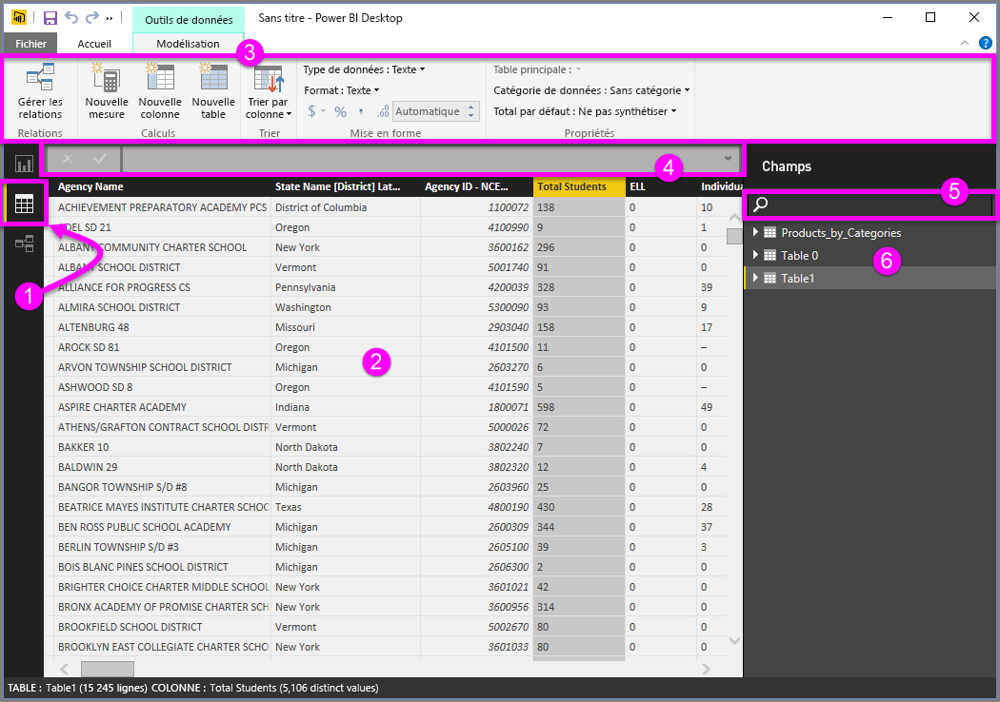
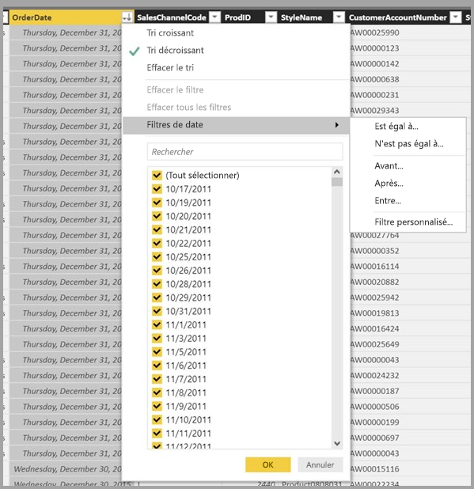

# Vue Données dans Power BI Desktop
La **vue Données** vous permet d’inspecter, d’explorer et de comprendre les données dans votre modèle **Power BI Desktop**. Elle diffère de la façon dont vous affichez les données, les colonnes et les tables dans **l’Éditeur de requête**. Avec la vue Données, vous examinez vos données *après* qu’elles sont été chargées dans le modèle.

Quand vous modélisez vos données, vous souhaitez parfois consulter le contenu réel d’une table ou d’une colonne sans créer d’élément visuel sur le canevas de rapport, bien souvent jusqu’au niveau de la ligne. C’est particulièrement utile lorsque vous créez des mesures et des colonnes calculées ou quand vous devez identifier un type de données ou une catégorie de données.

Regardons de plus près certains des éléments trouvés dans la **vue Données**.

1. **Icône de la vue Données** : Sélectionnez cette icône pour accéder à la vue Données.

2. **Grille de données** : Montre la table sélectionnée et toutes les colonnes et les lignes qu’elle contient. Les colonnes masquées dans la **vue Rapport** sont grisées. Vous pouvez cliquer avec le bouton droit sur une colonne pour afficher des options.

3. **Ruban de modélisation** : Ici, vous pouvez gérer les relations, créer des calculs, changer le type de données, le format ou la catégorie de données d’une colonne.

4. **Barre de formule** : Entrez des formules DAX pour des mesures et des colonnes calculées.

5. **Rechercher** : Recherchez une table ou une colonne dans votre modèle.

6. **Liste de champs** : Sélectionnez une table ou une colonne à voir dans la grille de données.

## Filtrage dans la vue Données

Vous pouvez également filtrer et trier les données dans la **vue Données**. Chaque colonne affiche une icône qui identifie le sens du tri (si appliqué).

Vous pouvez filtrer des valeurs individuelles ou utiliser le filtrage avancé en fonction des données de la colonne. 

> [!NOTE]
> Quand un modèle Power BI est créé dans une autre culture que celle de votre interface utilisateur actuelle (par exemple, si le modèle a été créé en anglais des États-Unis et que vous l’affichez en français), la zone de recherche ne s’affiche que pour les champs de texte de l’interface utilisateur et rien d’autre.
