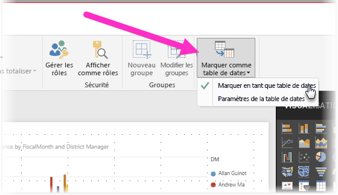

# Définir et utiliser des tables de dates dans Power BI Desktop

**Power BI Desktop** fonctionne en arrière-plan pour identifier automatiquement les tables comme des **tables de dates**, puis crée des hiérarchies de dates et d’autres métadonnées de publication pour votre modèle, à votre place. Vous pouvez ensuite utiliser ces hiérarchies intégrées lors de la création de fonctionnalités de rapport comme des visuels, des tables, des mesures rapides, des segments et ainsi de suite. Power BI Desktop effectue cette opération en créant des tables masquées à votre place, que vous pouvez ensuite utiliser pour vos rapports et expressions DAX.

De nombreux analystes de données préfèrent créer leurs propres tables de dates, ce qui ne pose aucun problème. Dans **Power BI Desktop**, vous pouvez spécifier la table que vous souhaitez que votre modèle utilise comme **table de dates**, puis créer des visuels, des tables, des mesures rapides, etc., liés à la date à l’aide des données de cette table de table. Lorsque vous spécifiez votre propre table de dates, vous contrôlez les hiérarchies de dates créées dans votre modèle de contrôle, puis vous les utilisez dans de **rapides mesures** et d’autres opérations exploitant la table de dates de votre modèle. 

## Définition de votre propre table de dates

Pour définir une **table de dates**, sélectionnez la table que vous souhaitez utiliser comme table de dates dans le volet **Champs**, cliquez sur la table puis sélectionnez **Marquer comme table de dates** dans le menu qui s’affiche, comme illustré dans l’image suivante.

Vous pouvez également choisir la table puis sélectionner **Marquer comme table de dates** dans le ruban **Modélisation** présenté ici.

Lorsque vous spécifiez votre propre **table de dates**, Power BI Desktop effectue les validations suivantes de cette colonne et de ses données, pour vous assurer que les données :

* contiennent des valeurs uniques ;
* ne contiennent aucune valeur null ;
* contiennent des valeurs de dates contiguës (du début à la fin) ;
* s’il s’agit d’un type de données **Date/Heure**, qu’elles affichent le même horodatage entre chaque valeur

Deux scénarios permettent de votre propre table de dates, chacun suivant un processus logique :

* Le premier scénario consiste à utiliser une table de dates de base (canonique) et la hiérarchie. Il s’agit d’une table dans vos données répondant aux critères de validation décrits précédemment pour une table de dates. 

* Dans le second scénario, vous utilisez une table provenant par exemple d’Analysis Services, avec un champ *dim date* champ que vous souhaitez utiliser comme table de dates. 

Une fois que vous spécifiez une table de dates, vous pouvez désigner la colonne qui servira de colonne de dates dans cette table. Pour cela, sélectionnez la table dans le volet **Champs**, puis cliquez avec le bouton droit sur la table et choisissez **Marquer comme table de dates > Paramètres de la table de dates**. La fenêtre suivante s’affiche, dans laquelle vous pouvez sélectionner la colonne à utiliser comme table de date dans le menu déroulant.

Il est important de noter que lorsque vous spécifiez votre propre table de dates, **Power BI Desktop** ne crée pas automatiquement les hiérarchies qui seraient intégrées dans votre modèle à votre place. Si vous désélectionnez ultérieurement votre table de dates (et que n’avez plus de table de dates définie manuellement), Power BI Desktop recrée automatiquement pour vous les tables de dates intégrées, pour les colonnes de dates de la table.

Il est également important de noter que lorsque vous marquer une table comme table de dates, la table de dates intégrée créée automatiquement par Power BI Desktop est supprimée, et les visuels ou les expressions DAX que vous avez créés précédemment en fonction de ces tables intégrées ne fonctionneront plus correctement. 

## Marquage de votre table de dates comme type de données approprié

Lorsque vous spécifiez votre propre **table de dates**, vous devez vous assurer que le type de données est correctement défini. Vous devez définir le **type de données** sur **Date/Heure** ou **Date**. Pour cela, procédez comme suit :

1. Sélectionnez votre **table de dates** dans le volet **Champs** (en développant ce volet si nécessaire), puis choisissez la colonne à utiliser comme date.
   
     

2. Dans l’onglet **Modélisation**, sélectionnez **Type de données :** puis cliquez sur la flèche déroulante pour afficher les types de données disponibles.

    

3. Spécifiez le type de données de votre colonne. 

## Étapes suivantes

Les articles suivants pourraient également vous intéresser.

* [Types de données dans Power BI Desktop](desktop-data-types.md)

 