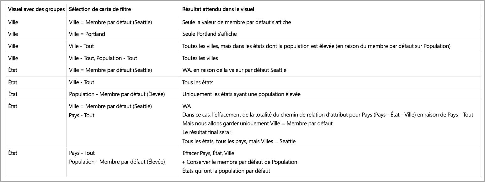

# Membre par défaut dans des modèles multidimensionnels dans Power BI

Vous pouvez vous connecter à des modèles multidimensionnels dans Power BI et créer des rapports permettant de visualiser toutes sortes de données dans le modèle. Lorsque des modèles multidimensionnels sont utilisés, Power BI applique des règles au traitement des données, en fonction de la colonne définie comme *membre par défaut*. 

Avec les modèles multidimensionnels, Power BI traite les données du modèle en fonction de l’endroit où est utilisée la colonne contenant l’attribut **DefaultMember**. L’attribut *DefaultMember* est défini dans le langage CSDL (Conceptual Schema Definition Language) pour une colonne en particulier dans un modèle multidimensionnel. Plus d’informations sur le membre par défaut, voir [l’article sur les propriétés de cet attribut](https://docs.microsoft.com/sql/analysis-services/multidimensional-models/attribute-properties-define-a-default-member?view=sql-server-2017). À l’exécution d’une requête DAX, le membre par défaut spécifié dans le modèle est appliqué automatiquement.

Cet article explique comment Power BI se comporte avec des modèles multidimensionnels dans différentes circonstances, en fonction de l’emplacement du *membre par défaut*. 

## Utiliser des cartes de filtrage

Lors de la création d’une carte de filtrage sur un champ comportant un membre par défaut, la valeur de champ du membre par défaut est sélectionnée automatiquement dans la carte de filtrage. Par conséquent, tous les visuels affectés par la carte de filtrage conservent leurs modèles par défaut dans la base de données. Les valeurs de ces cartes de filtrage reflètent ce membre par défaut.

Si le membre par défaut est supprimé, le fait de désélectionner la valeur l’efface pour tous les visuels auxquels s’applique la carte de filtrage, et les valeurs affichées ne reflètent pas le membre par défaut.

Supposons par exemple que nous ayons une colonne *Devise* dont le membre par défaut a la valeur *USD* :

* Dans cet exemple, si l’on a une carte qui indique *Total des ventes*, le membre par défaut est appliqué à la valeur et l’on voit les ventes correspondant à « USD ».
* Si l’on fait glisser *Devise* dans le volet des cartes de filtrage, la valeur par défaut sélectionnée est *USD*. La valeur de *Total des ventes* reste la même, car le membre par défaut est appliqué.
* Toutefois, si l’on désélectionne la valeur *USD* de la carte de filtrage, le membre par défaut de *Devise* est désactivé : *Total des ventes* reflète maintenant toutes les devises.
* Par conséquent, lorsque l’on sélectionne une autre valeur dans la carte de filtrage (par exemple, *EUR*), en parallèle du membre par défaut, *Total des ventes* reflète le filtre *Devise {USD, EUR}*.

## Comportement de regroupement

Dans Power BI, chaque fois que vous regroupez un visuel sur une colonne comportant un *membre par défaut*, Power BI efface le *membre par défaut* de cette colonne et son chemin de relation d’attribut. Ainsi, le visuel affiche toutes les valeurs, et pas seulement les valeurs par défaut.

## Chemins de relation d’attribut

Les chemins de relation d’attribut fournissent des *membres par défaut* dotés de puissantes fonctionnalités, mais sont également sources de complexité. Lorsqu’il rencontre des chemins de relation d’attribut, Power BI les suit pour effacer les membres par défaut supplémentaires des autres colonnes, et ainsi assurer une gestion cohérente et précise des données des visuels.

Pour clarifier ce comportement, prenons l’exemple de configuration de chemins de relation d’attribut suivant :

Supposons maintenant que les *membres par défaut* suivants sont définis pour ces colonnes :

* City > Seattle
* State > WA
* Country > US
* Population > Large

Examinons à présent ce qui se passe lorsque chacune des colonnes est utilisée dans Power BI. Voici les résultats obtenus lorsque des visuels sont regroupés sur les colonnes suivantes :

* **City** : Power BI affiche toutes les villes en effaçant tous les **membres par défaut** de *City*, *State* et *Country*, mais conserve le **membre par défaut** de *Population* ; il efface la totalité du chemin de relation d’attribut de *City*.
    > [!NOTE]
    > *Population* ne se trouve pas dans le chemin de relation d’attribut de *City* ; il est seulement lié à *State*. C’est pourquoi Power BI ne l’efface pas.
* **State** : Power BI affiche tous les *State* en effaçant tous les **membres par défaut** de *City*, *State*, *Country* et *Population*.
* **Country** : Power BI affiche tous les pays en effaçant tous les **membres par défaut** de *City*, *State* et *Country*, mais conserve le **membre par défaut** de *Population*.
* **City et State** : Power BI efface tous les **membres par défaut** de toutes les colonnes.

Le chemin de relation d’attribut des groupes affichés dans le visuel est effacé. 

Si un groupe ne figure pas dans le visuel, mais qu’il fait partie du chemin de relation d’attribut d’une autre colonne regroupée, les règles suivantes s’appliquent :

* Toutes les branches du chemin de relation d’attribut ne sont pas effacées automatiquement.
* Le groupe est toujours filtré par ce **membre par défaut** non effacé.

### Segments et cartes de filtrage

Lorsque des segments ou des cartes de filtrage sont utilisés, le comportement suivant se produit :

* Lorsqu’un segment ou une carte de filtrage est chargé avec des données, Power BI effectue un regroupement sur la colonne dans le visuel. Le comportement d’affichage est donc identique à celui de la section précédente.

Étant donné que les segments et les cartes de filtrage sont souvent utilisés pour interagir avec d’autres visuels, la logique d’effacement des **membres par défaut** des visuels concernés fonctionne comme dans le tableau suivant. 

Ce tableau s’appuie sur les données d’exemple utilisées précédemment dans cet article :

Les règles suivantes s’appliquent au comportement de Power BI dans ces circonstances.

Power BI efface le **membre par défaut** d’une colonne donnée si :

* Power BI effectue un regroupement sur cette colonne.
* Power BI effectue un regroupement sur une colonne associée à cette colonne (n’importe où dans le chemin de relation d’attribut, que ce soit plus haut ou plus bas).
* Power BI applique un filtre sur une colonne qui se trouve dans le chemin de relation d’attribut (en haut ou en bas).
* La colonne possède une carte de filtrage à l’état *TOUT*.
* La colonne possède une carte de filtrage sur laquelle une valeur est sélectionnée (Power BI reçoit un filtre pour la colonne).

Power BI n’efface pas le **membre par défaut** d’une colonne donnée si :

* La colonne possède une carte de filtrage à l’état par défaut, et Power BI effectue un regroupement sur une colonne dans son chemin de relation d’attribut.
* La colonne se trouve au-dessus d’une autre colonne dans le chemin de relation d’attribut, colonne pour laquelle Power BI dispose d’une carte de filtrage à l’état par défaut.

## Étapes suivantes

Cet article visait à décrire le comportement de Power BI avec les membres par défaut dans les modèles multidimensionnels. Les articles suivants pourraient également vous intéresser : 

* [Afficher les éléments sans données dans Power BI](desktop-show-items-no-data.md)
* [Sources de données dans Power BI Desktop](desktop-data-sources.md)
