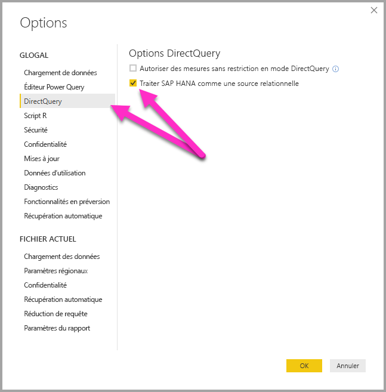
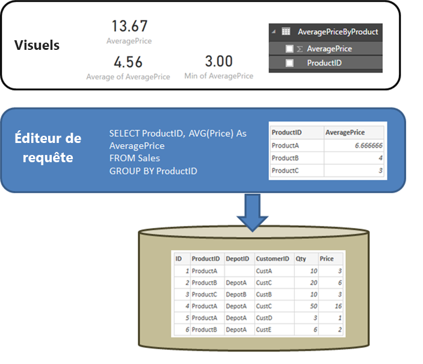

# DirectQuery et SAP HANA
Vous pouvez vous connecter aux sources de données **SAP HANA** directement avec **DirectQuery**. Il existe deux moyens de se connecter à SAP HANA :

* **Traiter SAP HANA comme une source multidimensionnelle (par défaut) :** Dans ce cas, le comportement sera celui de Power BI quand il se connecte à d’autres sources multidimensionnelles, comme SAP Business Warehouse ou Analysis Services. Lors d’une connexion à SAP HANA avec ce paramètre, une seule vue d’analytique ou de calcul est sélectionnée, et toutes ses mesures, toutes ses hiérarchies et tous ses attributs sont disponibles dans la liste des champs. Quand des visuels sont créés, les données d’agrégation sont toujours extraites de SAP HANA. Il s’agit de l’approche recommandée et de l’approche par défaut pour les nouveaux rapports DirectQuery sur SAP HANA.

* **Traiter SAP HANA comme une source relationnelle :** Dans ce cas, Power BI traite SAP HANA comme une source relationnelle. Cela offre une plus grande souplesse, mais il faut veiller à ce que les mesures soient agrégées comme prévu et éviter des problèmes de performances.

L’approche utilisée pour se connecter est déterminée par une option d’outil globale, définie en sélectionnant **Fichier > Options et paramètres**, puis **Options > DirectQuery** et enfin l’option  **Traiter SAP HANA comme une source relationnelle**, comme dans l’image suivante. 

L’option consistant à traiter SAP HANA comme une source relationnelle est l’approche utilisée pour tous les *nouveaux* rapports DirectQuery sur SAP HANA. Elle n’a aucun effet ni sur les connexions SAP HANA existantes dans le rapport actuel, ni sur les connexions des autres rapports ouverts. Par conséquent, si l’option est décochée, les nouvelles connexions ajoutées à SAP HANA dans la boîte de dialogue **Obtenir des données** seront établies en traitant SAP HANA comme une source multidimensionnelle. À l’inverse, si un autre rapport qui se connecte également à SAP HANA est ouvert, il continue à se comporter conformément à l’option définie *au moment de sa création*. Cela signifie que tous les rapports créés avant février 2018 qui se connectent à SAP HANA continuent à traiter SAP HANA comme une source relationnelle. 

Les deux approches représentent des comportements très différents, et il n’est pas possible de passer de l’une à l’autre pour un rapport existant. 

Examinons plus en détail ces deux approches tour à tour.

## Traiter SAP HANA comme une source multidimensionnelle (par défaut)

Toutes les nouvelles connexions à SAP HANA utilisent cette méthode de connexion par défaut, c’est-à-dire qu’elles traitent SAP HANA comme une source multidimensionnelle. Pour traiter une connexion à SAP HANA comme une source relationnelle, sélectionnez **Fichier > Options et paramètres > Options**, puis cochez la case sous **DirectQuery > Traiter SAP HANA comme une source relationnelle**. Tant que cette fonctionnalité est en **préversion**, les rapports créés suivant l’approche multidimensionnelle ne sont *pas* publiables sur le service Power BI ; ils produiraient sinon des erreurs à l’ouverture dans le service Power BI.  

Dans le cas d’une connexion à SAP HANA en tant que source multidimensionnelle, les principes suivants s’appliquent :

* Dans le **navigateur Obtenir des données**, vous pouvez sélectionner une seule vue SAP HANA. Il n’est pas possible de sélectionner des mesures ou des attributs individuellement. Aucune requête n’est définie au moment de la connexion, à la différence de l’approche consistant à importer des données ou à utiliser DirectQuery tout en traitant SAP HANA comme une source relationnelle. Cela signifie également qu’il n’est pas possible d’utiliser directement une requête SQL SAP HANA si cette méthode de connexion est sélectionnée.

* L’ensemble des mesures, des hiérarchies et des attributs de la vue sélectionnée s’affichent dans la liste des champs. 

* Quand une mesure est utilisée dans un visuel, sa valeur fait l’objet d’une requête auprès de SAP HANA au niveau d’agrégation nécessaire au visuel. En ce qui concerne les mesures non additives (compteurs, taux, etc.), toutes les agrégations sont effectuées par SAP HANA ; aucune autre n’est réalisée par Power BI. 

* Pour garantir l’obtention de valeurs d’agrégation correctes auprès de SAP HANA, certaines restrictions s’imposent. Par exemple, il n’est pas possible d’ajouter des colonnes calculées ou de combiner des données de plusieurs vues SAP HANA dans le même rapport. 

La solution qui consiste à traiter SAP HANA comme une source multidimensionnelle n’offre pas autant de souplesse que l’approche *relationnelle*, mais elle est plus simple et garantit des valeurs d’agrégation correctes sur les mesures SAP HANA complexes, ainsi que des performances généralement supérieures. 

La liste **Champ** contient l’ensemble des mesures, des attributs et des hiérarchies provenant de la vue SAP HANA. Sachez que les comportements suivants s’appliquent avec cette méthode de connexion :

* Tout attribut compris dans au moins une hiérarchie sera masqué par défaut. Il est toutefois possible de l’afficher en cas de besoin, en sélectionnant **Voir les éléments masqués** dans le menu contextuel de la liste des champs. Si nécessaire, il peut être rendu visible dans le même menu contextuel.

* Dans SAP HANA, un attribut peut être défini de façon à utiliser un autre attribut comme étiquette. Par exemple, **Product** (avec les valeurs 1, 2, 3, etc.) pourrait utiliser **ProductName** (avec les valeurs Bike, Shirt, Gloves, etc.) comme étiquette. Dans ce cas, un seul champ **Product** s’affichera dans la liste des champs, dont les valeurs seront les étiquettes Bike, Shirt, Gloves, etc., mais qui sera triée et dont l’unicité sera déterminée par les valeurs de clés 1, 2, 3, etc. Une colonne masquée **Product.Key** est également créée, ce qui permet d’accéder aux valeurs de clés sous-jacentes si nécessaire. 

Les variables définies dans la vue SAP HANA sous-jacente s’affichent au moment de se connecter. Il est alors possible d’entrer les valeurs nécessaires. Celles-ci peuvent être modifiées par la suite en sélectionnant **Modifier les requêtes** dans le ruban, puis **Gérer les paramètres** dans le menu déroulant qui s’affiche. 

Les opérations de modélisation autorisées sont plus restrictives que dans le cas général avec DirectQuery, car il est nécessaire de vérifier que les données d’agrégation correctes peuvent toujours être obtenues auprès de SAP HANA. Toutefois, il reste possible d’effectuer de nombreux ajouts et modifications, notamment de définir des mesures, de renommer et de masquer des champs et de définir des formats d’affichage. Tous ces changements sont conservés lors de l’actualisation, et les modifications non conflictuelles éventuellement apportées à la vue SAP HANA sont appliquées. 

### Autres restrictions de modélisation

Voici les autres grandes restrictions qui portent sur la modélisation en cas de connexion à SAP HANA avec DirectQuery (en tant que source multidimensionnelle) : 

* **Aucune prise en charge des colonnes calculées :** la possibilité de créer des colonnes calculées est désactivée. Cela signifie également que le regroupement et le clustering, qui permettent de créer des colonnes calculées, ne sont pas disponibles.
* **Autres limitations concernant les mesures :** des limitations supplémentaires sont imposées aux expressions DAX utilisables dans les mesures, afin de refléter le niveau de prise en charge offert par SAP HANA.
* **Aucune prise en charge de la définition de relations :** seule une vue peut être interrogée dans un rapport ; par conséquent, la définition de relations n’est pas prise en charge.
* **Aucune vue de données :** la **vue de données** affiche normalement les données détaillées dans les tables. Étant donné la nature des sources OLAP comme SAP HANA, cette vue n’est pas disponible sur SAP HANA.
* **Les détails des colonnes et des mesures sont fixes :** la liste de colonnes et de mesures de la liste de champs est fixée par la source sous-jacente et ne peut pas être modifiée. Par exemple, il n’est pas possible de supprimer une colonne, ni de modifier son type de données (il est en revanche possible de la renommer).
* **Autres limitations dans DAX :** il existe des limitations supplémentaires pour les expressions DAX qui peuvent être utilisées dans les définitions de mesures, afin de refléter les limitations de la source. Par exemple, il n’est pas possible d’utiliser une fonction d’agrégation sur une table.

### Autres restrictions de visualisation

Il existe des restrictions dans les visuels au moment de se connecter à SAP HANA avec DirectQuery (en tant que source multidimensionnelle) : 
* **Aucune agrégation de colonnes :** il n’est pas possible de modifier l’agrégation d’une colonne sur un visuel ; elle est toujours définie sur *Ne pas résumer*.

## Traiter SAP HANA comme une source relationnelle 

Le fait de se connecter à SAP HANA en tant que source relationnelle offre un peu plus de souplesse. Par exemple, il est possible de créer des colonnes calculées, d’inclure des données provenant de plusieurs vues SAP HANA et de créer des relations entre les tables qui en résultent. Toutefois, il faut alors bien comprendre certains aspects du traitement des connexions afin de s’assurer que : 

* On obtient bien les résultats attendus lorsque la vue SAP HANA contient des mesures non additives (par exemple, des comptages de valeurs ou des moyennes, plutôt que des sommes simples).
* Les requêtes qui en résultent sont efficaces.

Il est utile de commencer par clarifier le comportement d’une source relationnelle comme SQL Server lorsque la requête définie dans la boîte de dialogue **Obtenir des données** ou dans **l’Éditeur de requêtes** effectue une agrégation. Dans l’exemple suivant, une requête définie dans **l’Éditeur de requêtes** retourne le prix moyen par *ProductID*.  

Si vous importez les données dans Power BI (plutôt que d’utiliser DirectQuery), les résultats sont les suivants :

* Les données sont importées au niveau d’agrégation défini par la requête créée dans **l’éditeur de requête**. Par exemple, prix moyen par produit. Cela génère une table à deux colonnes (*ProductID* et *AveragePrice*) qui peut être utilisée dans les visuels.
* Dans un visuel, toute agrégation subséquente (par exemple *Sum*, *Average*, *Min*, autres) est effectuée sur ces données importées. Par exemple, si l’on inclut *AveragePrice* sur un visuel, l’agrégat *Sum* est utilisé par défaut et retourne la somme des valeurs *AveragePrice* de chaque *ProductID*, ce qui donnerait 13,67 dans notre exemple. Cela s’applique également à toute autre fonction d’agrégation (telle que *Min*, *Average*, etc.) utilisée sur le visuel. Par exemple, *Average* de *AveragePrice* retourne la moyenne de 6,66, 4 et 3, soit 4,56, et non la moyenne de *Price* sur les six enregistrements de la table sous-jacente, qui elle est égale à 5,17.
  
Si vous utilisez **DirectQuery** (sur cette même source relationnelle) au lieu de l’importation, la même sémantique s’applique et les résultats sont identiques :  

* Avec la même requête, exactement les mêmes données sont présentées à la couche de création de rapports, ce qui est logique, même si les données ne sont pas réellement importées.

* Dans un visuel, toute agrégation subséquente (*Sum*, *Average*, *Min*, autres) est de nouveau effectuée sur la table logique à partir de la requête. Là encore, un visuel contenant *Average* de *AveragePrice* renvoie la même valeur de 4,56.
  
Étudions maintenant SAP HANA lorsque la connexion est traitée comme une source relationnelle. Power BI peut utiliser les *vues analytiques* et les *vues de calcul* dans SAP HANA, qui peuvent toutes contenir des mesures. À ce jour cependant, l’approche de SAP HANA suit les principes décrits précédemment dans cette section : la requête définie dans la boîte de dialogue **Obtenir des données** ou dans **l’Éditeur de requêtes** détermine les données disponibles ; toutes les agrégation effectuées par la suite dans un visuel porteront sur ces données. Ce principe s’applique à la fois à l’importation et à DirectQuery.  
Toutefois, étant donné la nature de SAP HANA, la requête définie dans la boîte de dialogue **Obtenir des données** initiale ou **l’éditeur de requête** est toujours une requête d’agrégation et comprend généralement des mesures pour lesquelles l’agrégation effectivement utilisée est définie par la vue SAP HANA.

L’équivalent de l’exemple SQL Server ci-dessus est qu’il existe une vue SAP HANA contenant *ID*, *ProductID*, *DepotID*, et des mesures, notamment *AveragePrice*, définies dans la vue comme *Average of Price*.  
    
Si, dans l’expérience **Obtenir des données**, les sélections concernaient **ProductID** et la mesure **AveragePrice**, cela définirait une requête sur la vue qui demanderait ces données d’agrégation (dans un souci de simplicité, l’exemple précédent utilise du pseudo-SQL qui ne correspond pas à la syntaxe exacte du SQL SAP HANA). Ensuite, toutes les agrégations supplémentaires définies dans un visuel agrègent une nouvelle fois les résultats d’une telle requête. Là encore, comme pour SQL Server, ce principe s’applique à la fois à l’importation et à DirectQuery. Notez que dans le cas de DirectQuery, la requête définie dans la boîte de dialogue **Obtenir des données** ou **l’éditeur de requête** est utilisée dans une sous-sélection au sein d’une requête unique envoyée à SAP HANA et, par conséquent, toutes les données ne sont pas incluses par lecture avant une agrégation supplémentaire.  

Toutes ces considérations et tous ces comportements nécessitent de prendre en compte les points suivants pour utiliser DirectQuery sur SAP HANA :  

* Chaque fois que la mesure est non additive dans SAP HANA (par exemple, pas *Sum*, *Min* ou *Max*), vous devez surveiller toute agrégation supplémentaire effectuée dans les visuels.

* Dans la boîte de dialogue **Obtenir des données** ou **l’éditeur de requête**, seules les colonnes requises pour récupérer les données nécessaires doivent être incluses, afin de refléter le fait que le résultat est une requête, qui doit être une requête raisonnable qu’il est possible d’envoyer à SAP HANA. Par exemple, si des dizaines de colonnes sont sélectionnées avec l’idée qu’elles serviront peut-être dans des visuels subséquents, alors, même pour DirectQuery, un simple visuel signifie que la requête d’agrégation utilisée dans la sous-sélection contient ces dizaines de colonnes, ce qui entraîne des performances très médiocres.
  
Examinons un exemple. Dans l’exemple suivant, si l’on sélectionne cinq colonnes (**CalendarQuarter**, **Color**, **LastName**, **ProductLine** et **SalesOrderNumber**) dans la boîte de dialogue **Obtenir des données**, ainsi que la mesure *OrderQuantity*, alors la création par la suite d’un visuel simple contenant Min OrderQuantity aura pour conséquence d’envoyer la requête SQL suivante à SAP HANA. La partie ombrée correspond à la sous-sélection, qui contient la requête provenant de la boîte de dialogue **Obtenir des données** / **Éditeur de requêtes**. Si cette sous-sélection donne un résultat avec une cardinalité très élevée, les performances SAP HANA qui en résulteront seront probablement médiocres.  

   
À cause de ce comportement, il est recommandé de limiter les éléments sélectionnés dans la boîte de dialogue **Obtenir des données** ou dans **l’Éditeur de requêtes** aux éléments nécessaires, tout en produisant une requête raisonnable pour SAP HANA.  

## Meilleures pratiques 

Dans les deux approches de connexion à SAP HANA, les recommandations portant sur l’utilisation de DirectQuery s’appliquent également à SAP HANA, en particulier celles qui sont liées au maintien de bonnes performances. Elles sont décrites en détail dans l’article [Utiliser DirectQuery dans Power BI](desktop-directquery-about.md).
   
## Limites

La liste suivante décrit toutes les fonctionnalités de SAP HANA qui ne sont pas entièrement prises en charge ou se comportent différemment avec Power BI. 

* **Hiérarchies de type parent-enfant** : les hiérarchies de type parent-enfant ne seront pas visibles dans Power BI.
En effet, Power BI accède à SAP HANA avec l’interface SQL ; or, les hiérarchies de type parent-enfant ne sont pas entièrement accessibles par SQL.
* **Autres métadonnées sur les hiérarchies** : la structure de base des hiérarchies s’affiche dans Power BI ; toutefois, certaines métadonnées des hiérarchies (par exemple, le contrôle du comportement de hiérarchies déséquilibrées) n’auront aucun effet.
Il s’agit là encore d’une limitation imposée par l’interface SQL.
* **Connexion par SSL** : il n’est pas possible de se connecter à des instances SAP HANA configurées pour utiliser SSL.
* **Prise en charge des vues d’attributs** : Power BI peut se connecter à des vues d’analyse et de calcul, mais il ne peut pas se connecter directement à des vues d’attributs.
* **Prise en charge des objets Catalogue** : Power BI ne peut pas se connecter à des objets Catalogue.
* **Modification de variables après publication** : il n’est pas possible de modifier les valeurs des variables SAP HANA directement dans le service Power BI une fois le rapport publié. 
 
## Problèmes connus 
La liste suivante décrit tous les problèmes connus qui peuvent survenir en cas de connexion à SAP HANA (DirectQuery) avec Power BI. 

* **Problème SAP HANA en cas de requête sur des compteurs et d’autres mesures** : SAP HANA retourne des données incorrectes si une connexion est établie à une vue d’analyse, et qu’une mesure de type compteur et d’autres mesures de taux sont incluses dans le même visuel. Ce problème est couvert par la SAP Note 2128928 (Résultats inattendus en cas de requête sur une colonne calculée et un compteur). La mesure du taux sera alors incorrecte. 

* **Plusieurs colonnes Power BI à partir d’une seule colonne SAP HANA** : dans le cas des vues de calcul où une colonne SAP HANA est utilisée dans plusieurs hiérarchies, SAP HANA les expose sous la forme de deux attributs distincts. Par conséquent, deux colonnes sont créées dans Power BI.  Elles sont toutefois masquées par défaut, et toutes les requêtes impliquant les hiérarchies, ou directement les colonnes, se comportent correctement. 
 
## Étapes suivantes

Pour plus d’informations sur DirectQuery, consultez les ressources suivantes :

* [DirectQuery dans Power BI](desktop-directquery-about.md)
* [Sources de données prises en charge par DirectQuery](desktop-directquery-data-sources.md)
* [DirectQuery et SAP BW](desktop-directquery-sap-bw.md)
* [Passerelle de données locale](service-gateway-onprem.md)

