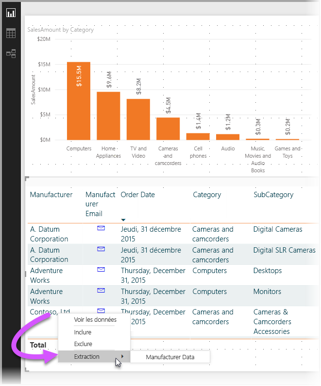
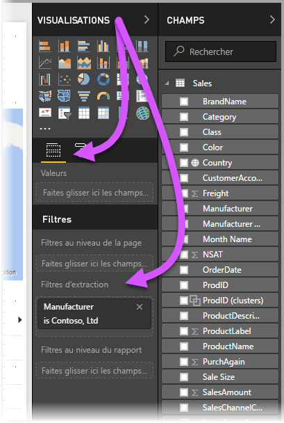
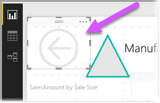
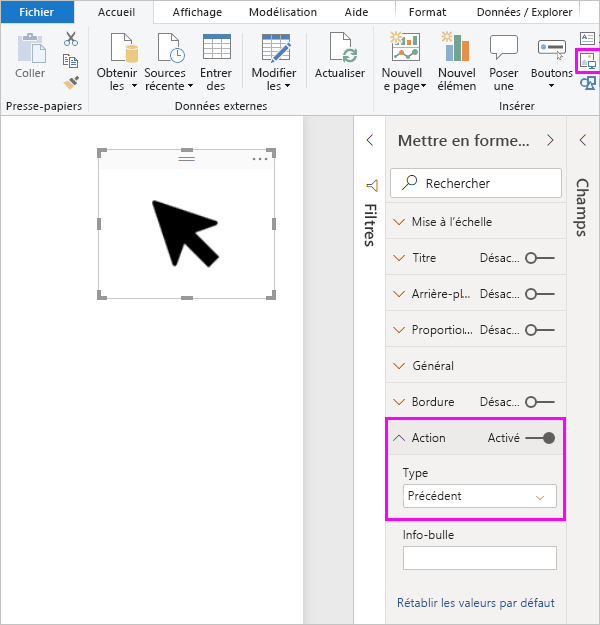
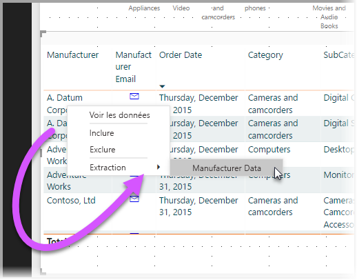
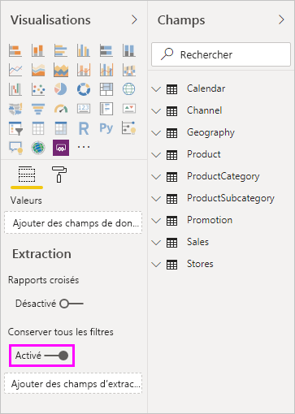
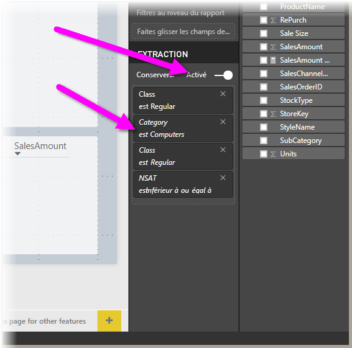
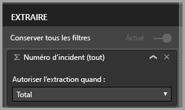

# Utiliser une extraction dans Power BI Desktop
Dans Power BI Desktop, une *extraction* vous permet de créer une page de rapport qui se concentre sur une entité spécifique, par exemple, un fournisseur, un client ou un fabricant. Pour utiliser l’extraction, sélectionnez-la en cliquant avec le bouton droit sur un point de données d’une autre page de rapport, puis en accédant à la page ayant le focus pour obtenir des détails filtrés pour ce contexte.

## Utilisation d’une extraction
1. Si vous souhaitez utiliser l’extraction, créez une page de rapport contenant les visuels que vous voulez associer au type d’entité pour lequel vous allez produire une extraction. 

    Par exemple, supposons que vous souhaitiez fournir la fonctionnalité d’extraction à des fabricants. Dans ce cas, vous pouvez créer une page d’extraction avec des visuels présentant le total des ventes, le nombre total d’unités fournies, les ventes par catégorie, les ventes par région, et ainsi de suite. Ainsi, lorsque vous opérez l’extraction vers cette page, les visuels ont spécifiquement trait au fabricant que vous avez sélectionné.

2. Dans cette page d’extraction, dans la section **Champs** du volet **Visualisations**, faites glisser le champ pour lequel vous souhaitez permettre une extraction dans le puits **Filtres d’extraction**.

    

    Lorsque vous ajoutez un champ à la zone **Filtres d’extraction**, Power BI Desktop crée automatiquement un visuel de bouton *Précédent*. Ce visuel devient un bouton dans les rapports publiés. Les utilisateurs qui consomment votre rapport dans le service Power BI peuvent utiliser ce bouton pour revenir à la page du rapport où ils étaient précédemment.

    

> [!IMPORTANT]
> Vous pouvez configurer et effectuer une extraction vers une page dans le même rapport. Toutefois, vous ne pouvez pas procéder à une extraction vers une page d’un autre rapport.  

## Utiliser votre propre image pour un bouton Précédent    
 Étant donné que le bouton Précédent est une image, vous pouvez remplacer l’image de ce visuel par n’importe quelle image de votre choix. Il continuera à fonctionner comme un bouton Précédent afin que les consommateurs de rapports puissent revenir à la page d’origine. 

Si vous souhaitez utiliser votre propre image pour le bouton précédent, effectuez les étapes suivantes :

1. Dans l’onglet **Accueil**, sélectionnez **Image**. Recherchez ensuite votre image et placez-la dans la page d’extraction.

2. Sélectionnez votre nouvelle image sur la page d’extraction. Dans le volet **Mettre en forme l’image**, définissez le curseur **Action** sur **Activé**, puis définissez le **Type** sur **Précédent**. Votre image fonctionne désormais comme un bouton Précédent.

    

    
     Les utilisateurs peuvent maintenant cliquer avec le bouton droit sur un point de données dans votre rapport et afficher un menu contextuel qui prend en charge l’extraction vers cette page. 

    

    Lorsque les consommateurs du rapport choisissent d’effectuer l’extraction, la page est filtrée pour afficher les informations relatives au point de données sur lequel ils ont cliqué avec le bouton droit. Par exemple, supposons qu’ils aient cliqué avec le bouton droit sur un point de données concernant Contoso (un fabricant) et qu’ils l’aient sélectionné pour l’extraction. La page d’extraction à laquelle ils accèdent est filtrée sur Contoso.

## Passer tous les filtres dans l’extraction

Vous pouvez passer tous les filtres appliqués dans la fenêtre d’extraction. Par exemple, vous ne pouvez sélectionner qu’une seule catégorie de produits et de visuels filtrés pour cette catégorie avant de sélectionner l’extraction. Vous aimeriez peut-être savoir à quoi ressemble l’extraction avec tous ces filtres appliqués.

Pour conserver tous les filtres appliqués, dans la section **Extraction** du volet **Visualisations**, définissez **Garder tous les filtres** sur **Activé**. 

Lorsque vous extrayez un visuel, vous pouvez voir les filtres qui ont été appliqués comme résultat du visuel source avec les filtres temporaires appliqués. Dans la section **Extraction** du volet **Visualisation**, ces filtres temporaires apparaissent en italique. 

Vous pouvez effectuer cette opération avec les pages d’info-bulles. Toutefois, celles-ci donneraient l’impression de ne pas fonctionner correctement. Pour cette raison, il n’est pas recommandé de procéder ainsi avec les info-bulles.

## Ajouter une mesure à l’extraction

En plus du passage de tous les filtres dans la fenêtre d’extraction, vous pouvez ajouter une mesure ou une colonne numérique totalisée dans la zone d’extraction. Faites glisser le champ d’extraction dans la carte **Extraction** pour l’appliquer. 

Lorsque vous ajoutez une mesure (ou une colonne numérique totalisée), vous pouvez extraire sur la page si le champ est utilisé dans la zone *Valeur* d’un visuel.

C’est tout ce que vous avez à faire pour utiliser une extraction dans vos rapports. C’est un excellent moyen d’obtenir une vue développée des informations d’une entité que vous avez sélectionnée pour votre filtre d’extraction.

## Étapes suivantes

Les articles suivants pourraient également vous intéresser :

* [Use cross-report drillthrough in Power BI Desktop](desktop-cross-report-drill-through.md) (Utiliser une extraction interrapport dans Power BI Desktop)
* [Utilisation de segments Power BI Desktop](visuals/power-bi-visualization-slicers.md)

