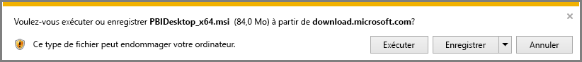

# Obtenir Power BI Desktop
**Power BI Desktop** vous permet de créer des requêtes, des modèles et des rapports avancés qui visualisent des données. Avec **Power BI Desktop**, vous pouvez créer des modèles de données et des rapports et partager votre travail en le publiant sur le service Power BI.  Le téléchargement de **Power BI Desktop** est gratuit.

Vous pouvez obtenir **Power BI Desktop** de deux façons. Celles-ci sont décrites dans les sections suivantes :

* **Télécharger** directement (package que vous téléchargez et installez sur votre ordinateur)
* Installer en tant qu’application sur le **Microsoft Store**

Quelle que soit l’option choisie, vous obtenez la dernière version de **Power BI Desktop** sur votre ordinateur. Il existe toutefois quelques différences qui sont décrites dans les sections suivantes.

## Télécharger Power BI Desktop
Pour télécharger la version la plus récente de **Power BI Desktop**, cliquez sur l’icône de téléchargement en haut à droite du service Power BI et sélectionnez **Power BI Desktop**.

Vous pouvez également télécharger la dernière version de Power BI Desktop en cliquant sur la page de téléchargement suivante :

* [**Téléchargement de Power BI Desktop** (versions 32 et 64 bits)](https://powerbi.microsoft.com/desktop).
  
  

Quel que soit le type de téléchargement, une fois que vous avez téléchargé **Power BI Desktop**, vous êtes invité à exécuter le fichier d’installation :

Depuis la version de juillet 2019, **Power BI Desktop** est fourni sous forme de package d’installation .exe unique qui contient toutes les langues prises en charge. Il existe des fichiers .exe distincts pour les versions 32 et 64 bits. Les packages .msi seront abandonnés après la version de septembre 2019. Vous devrez dès lors utiliser l’exécutable .exe pour l’installation. Cette approche s’avère bien plus simple et pratique (surtout pour les administrateurs) quand il s’agit de distribuer, mettre à jour et installer. Vous pouvez aussi utiliser des paramètres de ligne de commande pour personnaliser le processus d’installation, comme décrit dans la section [Utilisation des options de ligne de commande pendant l’installation](#using-command-line-options-during-installation), plus loin dans cet article.

Une fois que vous lancez le package d’installation, **Power BI Desktop** s’installe en tant qu’application et s’exécute sur votre bureau.

> [!NOTE]
> L’installation de la version téléchargée (MSI) et de la version du **Microsoft Store** de **Power BI Desktop** sur le même ordinateur (parfois appelée installation *côte à côte*) n’est pas prise en charge.
> 
> 

## Installer en tant qu’application sur le Microsoft Store
Vous pouvez également récupérer **Power BI Desktop** sur le Microsoft Store en cliquant sur le lien suivant :

* [Installer **Power BI Desktop** sur le **Microsoft Store**](http://aka.ms/pbidesktopstore)

  

Il peut être intéressant de récupérer **Power BI Desktop** sur le Microsoft Store pour plusieurs raisons :

* **Mises à jour automatiques** : Windows télécharge automatiquement la dernière version en arrière-plan dès qu’elle est disponible. Votre version est donc toujours à jour.
* **Téléchargements plus petits** : le **Microsoft Store** s’assure que seuls les composants qui ont été modifiés lors de la mise à jour sont téléchargés sur votre ordinateur. Le téléchargement de chaque mise à jour s’en trouve donc réduit.
* **Le privilège d’administration n’est pas obligatoire** : quand vous téléchargez le package directement et que vous l’installez, vous devez être administrateur pour que l’installation aboutisse. Si vous vous procurez **Power BI Desktop** sur le Microsoft Store, le privilège Administrateur n’est *pas* obligatoire.
* **Déploiement activé** : la version du **Microsoft Store** est plus facile à *déployer* auprès des utilisateurs de l’organisation. Elle peut mettre à disposition **Power BI Desktop** par le biais du **Microsoft Store pour Entreprises**.
* **Détection de la langue** : la version du **Microsoft Store** comprend toutes les langues prises en charge et vérifie celle qui est utilisée sur l’ordinateur à chaque démarrage. Cela affecte également la localisation des modèles créés dans **Power BI Desktop**, par exemple les hiérarchies de dates intégrées correspondent à la langue que **Power BI Desktop** utilisait lorsque le fichier .pbix a été créé.

L’installation de **Power BI Desktop** sur le Microsoft Store fait l’objet de quelques limitations et mises en garde :

* Si vous utilisez le connecteur SAP, vous devrez peut-être déplacer vos fichiers de pilote SAP vers le dossier *Windows\System32*.
* L’installation de **Power BI Desktop** à partir du Microsoft Store ne copie pas les paramètres utilisateur de la version .exe. Vous devrez peut-être vous reconnecter à vos dernières sources de données et entrer à nouveau vos identifiants de source de données. 

> [!NOTE]
> L’installation de la version téléchargée (MSI) et de la version du **Microsoft Store** de **Power BI Desktop** sur le même ordinateur (parfois appelée installation *côte à côte*) n’est pas prise en charge. Il est recommandé de désinstaller manuellement **Power BI Desktop** avant de le télécharger sur le **Microsoft Store**.
> 
> [!NOTE]
> La version Power BI Report Server de **Power BI Desktop** est une installation distincte et différente des versions présentées dans cet article. Pour plus d’informations sur la version Report Server de **Power BI Desktop**, voir [Créer un rapport Power BI pour Power BI Report Server](report-server/quickstart-create-powerbi-report.md).
> 
> 

## Utilisation de Power BI Desktop
Quand vous lancez **Power BI Desktop**, un écran de *Bienvenue* s’affiche.

Si vous utilisez **Power BI Desktop** pour la première fois (si l’installation n’est pas une mise à niveau), vous êtes invité à remplir un formulaire et à répondre à quelques questions ou à vous connecter au **service Power BI** avant de continuer.

Dès lors, vous pouvez commencer à créer des modèles de données ou des rapports, puis les partager avec d’autres utilisateurs sur le service Power BI. Consultez les liens **plus d’informations** référencés à la fin de cet article pour être redirigé vers des guides qui peuvent vous aider à maîtriser **Power BI Desktop**.

## Configuration minimale requise
La liste suivante présente la configuration minimale requise pour exécuter **Power BI Desktop** :

* Windows 7/ Windows Server 2008 R2 ou version ultérieure
* .NET 4.5
* Internet Explorer 10 ou version ultérieure
* **Mémoire (RAM) :** Au moins 1 Go de disponible (1,5 Go ou plus recommandés).
* **Affichage :** Résolution minimale recommandée de 1440 x 900 ou 1600 x 900 (16:9). Les résolutions inférieures telles que 1024 x 768 ou 1280 x 800 ne sont pas recommandées, car certains contrôles comme la fermeture de l’écran de démarrage apparaissent au-delà de ces résolutions.
* **Paramètres d’affichage de Windows :** Si vos paramètres d’affichage sont définis pour modifier la taille du texte, les applications et les autres éléments de plus de 100 %, il est possible que vous ne puissiez pas afficher certaines boîtes de dialogue qui doivent être fermées ou auxquelles vous devez répondre pour pouvoir continuer en utilisant **Power BI Desktop**. Si vous rencontrez ce problème, vérifiez vos **Paramètres d’affichage** en accédant à **Paramètres > Système > Affichage** dans Windows, puis utilisez le curseur pour rétablir les paramètres d’affichage sur 100 %.
* **Processeur :** 1 gigahertz (GHz) ou plus rapide (processeur x86 ou x64 bits recommandé).

## Considérations et limitations

Nous voulons toujours que vous ayez une expérience satisfaisante avec Power BI Desktop. I est possible que vous rencontriez un problème avec Power BI Desktop. Par conséquent, cette section contient des solutions ou des suggestions pour résoudre les problèmes qui peuvent survenir. 

### Utilisation des options de ligne de commande pendant l’installation 

Quand vous installez Power BI Desktop, vous pouvez définir les propriétés et les options avec des commutateurs de ligne de commande. Cela s’avère particulièrement utile pour les administrateurs qui gèrent ou facilitent l’installation de Power BI Desktop dans les organisations. Ces options s’appliquent aux installations .msi et .exe. 

|Option de ligne de commande  |Comportement  |
|---------|---------|
|-q, -quiet, -s, -silent     |installation sans assistance         |
|-passive     |affiche uniquement la barre de progression pendant l’installation         |
|-norestart     |dispense de la nécessité de redémarrer l’ordinateur         |
|-forcerestart     |redémarre l’ordinateur après l’installation sans invite         |
|-promptrestart     |invite l’utilisateur si un redémarrage de l’ordinateur est nécessaire (option par défaut)         |
|-l<>, -log<>     |journalise l’installation dans un fichier spécifique, celui-ci étant spécifié dans <>         |
|-uninstall     |désinstalle Power BI Desktop         |
|-repair     |répare l’installation (ou procède à l’installation si le logiciel n’est pas actuellement installée)         |
|-package, -update     |installe Power BI Desktop (par défaut, du moment que -uninstall ou -repair ne sont pas spécifiés)         |

### Problèmes rencontrés lors de l’utilisation de versions précédentes de Power BI Desktop

Certains utilisateurs rencontrent une erreur semblable à la suivante si vous utilisez une version obsolète de **Power BI Desktop** : 

    "We weren't able to restore the saved database to the model" 

La mise à jour vers la version actuelle de Power BI Desktop résout généralement ce problème.

### Notifications de désactivation
Nous vous recommandons de mettre à jour vers la version la plus récente de Power BI Desktop pour profiter des progrès en matière de fonctionnalités, de performances, de stabilité, ainsi que d’autres améliorations. Certaines organisations peuvent ne pas vouloir que les utilisateurs mettent à jour vers chaque nouvelle version. Vous pouvez désactiver les notifications en modifiant le Registre comme suit :

1. À l’aide de l’Éditeur du Registre, accédez à *HKEY_LOCAL_MACHINE\SOFTWARE\Microsoft\Microsoft Power BI Desktop*
2. Créez une nouvelle entrée avec les paramètres suivants : *REG_DWORD : DisableUpdateNotification*
3. Définissez la valeur de cette nouvelle entrée sur **1**.

Vous devez redémarrer votre ordinateur pour que la modification prenne effet.

### Power BI Desktop se charge avec un écran partiel.

Dans certaines circonstances, y compris certaines configurations de résolution d’écran, certains utilisateurs peuvent voir de grandes zones noires dans le contenu affiché dans Power BI Desktop. C’est généralement plutôt dû à des mises à jour récentes du système d’exploitation qui affectent le rendu des éléments que directement à la manière dont Power BI Desktop présente le contenu. Quoi qu'il en soit, les grandes zones noires ne sont pas aussi attrayantes que d’excellents visuels. Par conséquent, pour résoudre ce problème, procédez comme suit :

1. Appuyez sur la touche Démarrer et tapez le mot *flou* dans la barre de recherche qui s’affiche.
2. Dans la boîte de dialogue qui s’affiche, sélectionnez l’option : *Laisser Windows corriger les applications qui sont floues.*
3. Redémarrez Power BI Desktop.

Ce problème peut être résolu après la publication des mises à jour ultérieures de Windows. 
 

## Étapes suivantes
Après avoir installé **Power BI Desktop**, consultez le contenu suivant pour apprendre à maîtriser l’application :

* [Qu’est-ce que Power BI Desktop ?](desktop-what-is-desktop.md)
* [Présentation des requêtes dans Power BI Desktop](desktop-query-overview.md)
* [Sources de données dans Power BI Desktop](desktop-data-sources.md)
* [Se connecter aux données dans Power BI Desktop](desktop-connect-to-data.md)
* [Mettre en forme et combiner des données dans Power BI Desktop](desktop-shape-and-combine-data.md)
* [Tâches courantes relatives aux requêtes dans Power BI Desktop](desktop-common-query-tasks.md)   

