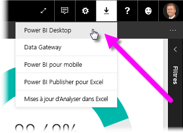
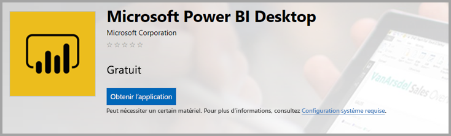
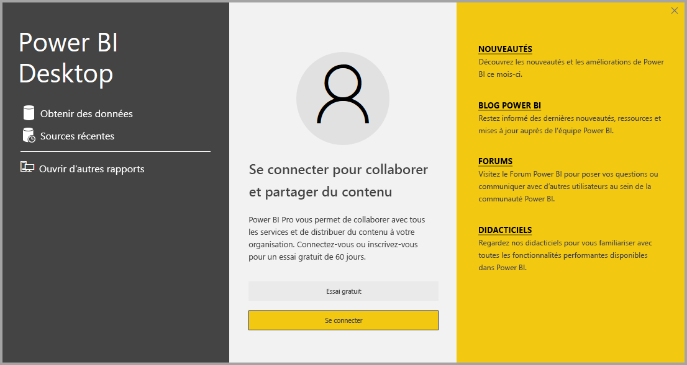

# <a name="get-power-bi-desktop"></a>Obtenir Power BI Desktop
Power BI Desktop vous permet de créer des requêtes, des modèles et des rapports avancés qui visualisent des données. Avec Power BI Desktop, vous pouvez construire des modèles de données, créer des rapports et partager votre travail en le publiant sur le service Power BI. Le téléchargement de Power BI Desktop est gratuit.

Vous pouvez obtenir Power BI Desktop de deux façons. Celles-ci sont décrites dans les sections suivantes :

* [Installer en tant qu’application à partir du Microsoft Store](#install-as-an-app-from-the-microsoft-store).
* [Télécharger directement en tant qu’exécutable que vous installez sur votre ordinateur](#download-power-bi-desktop-directly).

Chacune des deux approches vous permet d’obtenir la dernière version de Power BI Desktop sur votre ordinateur. Il existe toutefois quelques différences qui sont décrites dans les sections suivantes.

## <a name="install-as-an-app-from-the-microsoft-store"></a>Installer en tant qu’application sur le Microsoft Store
Il existe plusieurs façons d’accéder à la version la plus récente de Power BI Desktop à partir du Microsoft Store. 

1. Utilisez une des options suivantes pour ouvrir la page **Power BI Desktop** du Microsoft Store :

   - Ouvrez un navigateur et accédez directement à la page [Power BI Desktop](https://aka.ms/pbidesktopstore) du Microsoft Store.

    - Dans le [service Power BI](https://docs.microsoft.com/power-bi/service-get-started), sélectionnez l’icône **Télécharger** en haut à droite, puis sélectionnez **Power BI Desktop**.

      

   - Accédez à la [page du produit Power BI Desktop](https://powerbi.microsoft.com/desktop/), puis sélectionnez **Télécharger gratuitement**.
  
2. Une fois arrivé dans la page **Power BI Desktop** du Microsoft Store, sélectionnez **Installer**.

     

Obtenir Power BI Desktop à partir du Microsoft Store offre quelques avantages :

* **Mises à jour automatiques** : Windows télécharge automatiquement la dernière version en arrière-plan dès qu’elle est disponible : votre version est donc toujours à jour.
* **Téléchargements plus petits** : Microsoft Store garantit que seuls les composants qui ont été modifiés lors de la mise à jour sont téléchargés sur votre ordinateur : le téléchargement de chaque mise à jour s’en trouve donc réduit.
* **Le privilège d’administrateur n’est pas nécessaire** : Quand vous téléchargez le package directement et que vous l’installez, vous devez être administrateur pour que l’installation aboutisse. Si vous vous procurez Power BI Desktop auprès du Microsoft Store, le privilège d’administrateur n’est *pas* nécessaire.
* **Déploiement activé** : Via le Microsoft Store pour Entreprises, vous pouvez *déployer* plus facilement Power BI Desktop auprès de tous les membres de votre organisation

* **Détection de la langue** : La version du Microsoft Store comprend toutes les langues prises en charge et vérifie celle qui est utilisée sur votre ordinateur à chaque démarrage. Cette prise en charge de la langue affecte également la traduction des modèles créés dans Power BI Desktop. Par exemple, les hiérarchies de dates intégrées correspondent à la langue utilisée par Power BI Desktop lors de la création du fichier .pbix.

Les considérations et limitations suivantes s’appliquent quand vous installez Power BI Desktop à partir du Microsoft Store :

* Si vous utilisez le connecteur SAP, vous devrez peut-être déplacer vos fichiers de pilote SAP vers le dossier *Windows\System32*.
* L’installation de Power BI Desktop à partir du Microsoft Store ne copie pas les paramètres utilisateur de la version .exe. Il peut être nécessaire de vous reconnecter à vos sources de données récentes et de réentrer vos informations d’identification pour ces sources de données. 

> [!NOTE]
> La version Power BI Report Server de Power BI Desktop est une installation distincte et différente des versions présentées dans cet article. Pour plus d’informations sur la version Report Server de Power BI Desktop, consultez [Créer un rapport Power BI pour Power BI Report Server](report-server/quickstart-create-powerbi-report.md).
> 
> 

## <a name="download-power-bi-desktop-directly"></a>Télécharger Power BI Desktop directement
  
  Pour télécharger le fichier exécutable de Power BI Desktop à partir du Centre de téléchargement, sélectionnez **Télécharger** dans la [page du Centre de téléchargement](https://www.microsoft.com/download/details.aspx?id=58494). Ensuite, spécifiez si vous voulez télécharger un fichier d’installation 32 bits ou 64 bits.

  

### <a name="install-power-bi-desktop-after-downloading-it"></a>Installer Power BI Desktop après l’avoir téléchargé
Vous êtes invité à exécuter le fichier d’installation une fois son téléchargement terminé.

À compter de la version de juillet 2019, Power BI Desktop est fourni sous la forme d’un seul package d’installation .exe qui contient toutes les langues prises en charge, avec un fichier .exe distinct pour les versions 32 bits et 64 bits. Les packages .msi ne sont plus disponibles à compter de la version de septembre 2019 : le fichier exécutable .exe est désormais nécessaire pour l’installation. Cette approche s’avère bien plus simple et pratique (surtout pour les administrateurs) quand il s’agit de distribuer, mettre à jour et installer. Vous pouvez aussi utiliser des paramètres de ligne de commande pour personnaliser le processus d’installation, comme décrit dans [Utilisation des options de ligne de commande pendant l’installation](#using-command-line-options-during-installation).

Quand vous lancez le package d’installation, Power BI Desktop s’installe en tant qu’application et s’exécute sur votre ordinateur.


> [!NOTE]
> L’installation de la version (MSI) téléchargée (dépréciée) et de la version Microsoft Store de Power BI Desktop sur le même ordinateur (parfois appelée installation *côte à côte*) n’est pas prise en charge. Désinstallez manuellement Power BI Desktop avant de le télécharger depuis le Microsoft Store.
> 

## <a name="using-power-bi-desktop"></a>Utilisation de Power BI Desktop
Quand vous lancez Power BI Desktop, un écran de bienvenue s’affiche.



Si vous utilisez Power BI Desktop pour la première fois (c’est-à-dire si l’installation n’est pas une mise à niveau), vous êtes invité à remplir un formulaire ou à vous connecter au service Power BI avant de pouvoir continuer.

Dès lors, vous pouvez commencer à créer des modèles de données ou des rapports, puis les partager avec d’autres utilisateurs sur le service Power BI. Consultez la section [Étapes suivantes](#next-steps) pour obtenir des liens vers des guides qui vous aident à démarrer avec Power BI Desktop.

## <a name="minimum-requirements"></a>Configuration minimale requise
La liste suivante présente la configuration minimale requise pour exécuter Power BI Desktop :

* Windows 7/ Windows Server 2008 R2 ou version ultérieure
* .NET 4.5
* Internet Explorer 10 ou version ultérieure
* Mémoire (RAM) : Au moins 1 Go de disponible (1,5 Go ou plus recommandés).
* Affichage : Résolution minimale recommandée de 1440 x 900 ou 1600 x 900 (16:9). Les résolutions inférieures, comme 1024 x 768 ou 1280 x 800, ne sont pas recommandées parce que certaines commandes (comme la fermeture de l’écran de démarrage) s’affichent en dehors de ces résolutions.
* Paramètres d’affichage de Windows : Si vous définissez vos paramètres d’affichage de façon à changer la taille du texte, des applications et d’autres éléments à plus de 100 %, vous risquez de ne pas voir certaines boîtes de dialogue avec lesquelles vous devez interagir pour continuer à utiliser Power BI Desktop. Si vous rencontrez ce problème, vérifiez vos paramètres d’affichage dans Windows en accédant à **Paramètres** > **Système** > **Affichage**, puis utilisez le curseur pour rétablir les paramètres d’affichage à 100 %.
* Processeur : Processeur x86 à 1 gigahertz (GHz) ou plus rapide 32 bits ou 64 bits recommandé

## <a name="considerations-and-limitations"></a>Considérations et limitations

Nous voulons que votre expérience avec Power BI Desktop soit géniale. Parce que vous pouvez parfois rencontrer un problème avec Power BI Desktop, cette section contient donc des solutions ou des suggestions pour résoudre ces problèmes. 

### <a name="using-command-line-options-during-installation"></a>Utilisation des options de ligne de commande pendant l’installation 

Quand vous installez Power BI Desktop, vous pouvez définir les propriétés et les options avec des commutateurs de ligne de commande. Ces paramètres sont particulièrement utiles pour les administrateurs qui gèrent ou facilitent l’installation de Power BI Desktop dans les organisations. Ces options s’appliquent aux installations .msi et .exe. 


|Option de ligne de commande  |Comportement  |
|---------|---------|
|-q, -quiet, -s, -silent     |Installation sans assistance         |
|-passive     |Affiche la barre de progression seulement pendant l’installation         |
|-norestart     |Supprime la nécessité de redémarrer l’ordinateur         |
|-forcerestart     |Redémarre l’ordinateur après l’installation, sans invite         |
|-promptrestart     |Demande à l’utilisateur dans le cas où un redémarrage de l’ordinateur est nécessaire (par défaut)         |
|-l<>, -log<>     |Journalise l’installation dans un fichier spécifique, celui-ci étant spécifié dans <>         |
|-uninstall     |Désinstalle Power BI Desktop         |
|-repair     |Répare l’installation (ou procède à l’installation si le logiciel n’est actuellement pas installé)         |
|-package, -update     |Installe Power BI Desktop (par défaut, du moment que -uninstall ou -repair ne sont pas spécifiés)         |

Vous pouvez également utiliser les paramètres de syntaxe suivants, que vous spécifiez avec une syntaxe *propriété = valeur* :

|Paramètre  |Signification  |
|---------|---------|
|ACCEPT_EULA     |Requiert une valeur de 1 pour accepter automatiquement le CLUF         |
|ENABLECXP     |La valeur 1 active le programme d’expérience utilisateur qui capture des données de télémétrie sur l’utilisation du produit         |
|INSTALLDESKTOPSHORTCUT     |La valeur 1 ajoute un raccourci au Bureau         |
|INSTALLLOCATION     |Chemin auquel vous souhaitez installer         |
|LANGUAGE     |Code des paramètres régionaux (par exemple en-US, de-DE, pr-BR) pour forcer la langue par défaut de l’application. Si vous ne spécifiez pas la langue, Power BI Desktop affiche la langue du système d’exploitation Windows. Vous pouvez changer ce paramètre dans la boîte de dialogue **Options**.         |
|REG_SHOWLEADGENDIALOG     |La valeur 0 désactive l’affichage de la boîte de dialogue qui apparaît avant la connexion à Power BI Desktop         |
|DISABLE_UPDATE_NOTIFICATION     |La valeur 1 désactive les notifications de mise à jour.         |


Par exemple, vous pouvez exécuter Power BI Desktop avec les options et paramètres suivants pour installer sans interface utilisateur, en utilisant la langue Allemand : 

```-quiet LANG=de-DE ACCEPT_EULA=1```

### <a name="installing-power-bi-desktop-on-remote-machines"></a>Installation de Power BI Desktop sur des machines distantes

Si vous déployez Power BI Desktop auprès de vos utilisateurs avec un outil qui nécessite un fichier Windows Installer (fichier .msi), vous pouvez extraire le fichier .msi du fichier .exe d’installation de Power BI Desktop. Utilisez un outil tiers, comme WiX Toolset.

> [!NOTE]
> Comme il s’agit d’un produit tiers, les options de WiX Toolset peuvent changer sans préavis. Consultez leur documentation pour obtenir les informations les plus récentes, ou contactez leur liste de diffusion utilisateur pour obtenir de l’aide.

1. Sur l’ordinateur où vous avez téléchargé le programme d’installation de Power BI Desktop, installez la dernière version de [WiX Toolset](https://wixtoolset.org/).
2. Ouvrez une fenêtre de ligne de commande en tant qu’administrateur et accédez au dossier où vous avez installé WiX Toolset.
3. Exécutez la commande suivante : 
    
    ```Dark.exe <path to Power BI Desktop installer> -x <output folder>```

    Par exemple :

    ``` Dark.exe C:\PBIDesktop_x64.exe -x C:\output```

    Le dossier de sortie contient un dossier nommé *AttachedContainer*, qui contient les fichiers .msi.

La mise à niveau d’une installation à partir d’un fichier .exe vers un fichier .msi que vous avez extrait à partir d’un fichier .exe n’est pas prise en charge.   Pour effectuer cette mise à niveau, vous devez d’abord désinstaller l’ancienne version de Power BI Desktop que vous avez.

### <a name="issues-when-using-previous-releases-of-power-bi-desktop"></a>Problèmes rencontrés lors de l’utilisation de versions précédentes de Power BI Desktop

Certains utilisateurs peuvent rencontrer une erreur similaire au message suivant s’ils utilisent une version obsolète de Power BI Desktop : 

*Nous n’avons pas pu restaurer la base de données enregistrée dans le modèle* 

La mise à jour vers la version actuelle de Power BI Desktop résout généralement ce problème.

### <a name="disabling-notifications"></a>Notifications de désactivation
Nous vous recommandons de mettre à jour vers la version la plus récente de Power BI Desktop pour profiter des progrès en matière de fonctionnalités, de performances, de stabilité, ainsi que d’autres améliorations. Certaines organisations peuvent ne pas vouloir que les utilisateurs mettent à jour vers chaque nouvelle version. Vous pouvez désactiver les notifications en modifiant le Registre comme suit :

1. Dans l’Éditeur du Registre, accédez à la clé **HKEY_LOCAL_MACHINE\SOFTWARE\Microsoft\Microsoft Power BI Desktop**.
2. Créez une entrée **REG_DWORD** dans la clé avec le nom suivant : **DisableUpdateNotification**.
3. Définissez la valeur de cette nouvelle entrée sur **1**.
4. Redémarrez votre ordinateur pour que cette modification prenne effet.

### <a name="power-bi-desktop-loads-with-a-partial-screen"></a>Power BI Desktop se charge avec un écran partiel.

Dans certaines circonstances, y compris certaines configurations de résolution d’écran, certains utilisateurs peuvent voir de grandes zones noires dans le contenu affiché dans Power BI Desktop. Ce problème est généralement plutôt dû à des mises à jour récentes du système d’exploitation qui affectent le rendu des éléments que directement à la manière dont Power BI Desktop présente le contenu. Suivez ces étapes pour résoudre ce problème :

1. Appuyez sur la touche **Démarrer** et entrez *flou* dans la barre de recherche qui s’affiche.
2. Dans la boîte de dialogue qui s’affiche, sélectionnez l’option : **Laisser Windows corriger les applications qui sont floues.**
3. Redémarrez Power BI Desktop.

Il est possible que ce problème soit résolu après la publication de mises à jour ultérieures de Windows. 
 

## <a name="next-steps"></a>Étapes suivantes
Une fois Power BI Desktop installé, consultez le contenu suivant pour être rapidement opérationnel :

* [Qu’est-ce que Power BI Desktop ?](desktop-what-is-desktop.md)
* [Présentation des requêtes dans Power BI Desktop](desktop-query-overview.md)
* [Sources de données dans Power BI Desktop](desktop-data-sources.md)
* [Se connecter aux données dans Power BI Desktop](desktop-connect-to-data.md)
* [Mettre en forme et combiner des données dans Power BI Desktop](desktop-shape-and-combine-data.md)
* [Tâches courantes relatives aux requêtes dans Power BI Desktop](desktop-common-query-tasks.md)   

