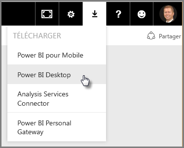
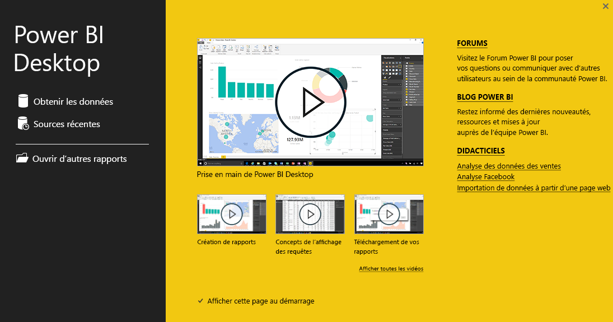

# Prise en main de Power BI Desktop
Bienvenue dans le **Guide de prise en main de Power BI Desktop**. Cette courte présentation de Power BI Desktop vous permettra de vous familiariser avec son fonctionnement. Elle vous montrera ce que l’application peut faire et vous permettra d’être plus vite apte à créer des modèles de données fiables, ainsi que des rapports de haute qualité, qui amplifieront vos efforts décisionnels. 

Vous préférez regarder une démonstration au lieu de lire de la documentation ? N’hésitez pas à [visionner notre vidéo de prise en main](desktop-videos.md). En outre, si vous souhaitez suivre la présentation en examinant les exemples de données correspondants, vous pouvez [télécharger cet exemple de classeur Excel](http://go.microsoft.com/fwlink/?LinkID=521962).

Power BI Desktop vous permet de créer une collection de requêtes, des connexions de données et des rapports pouvant être aisément partagés avec d’autres utilisateurs. Power BI Desktop intègre des technologies Microsoft qui ont fait leurs preuves, telles que le puissant moteur de requête, la modélisation des données et les visualisations, et fonctionne de façon transparente avec le [**service Power BI**](https://app.powerbi.com/) en ligne.

L’association de **Power BI Desktop** (qui permet aux analystes et à d’autres de créer des connexions de données, des modèles et des rapports de qualité) et du [**service Power BI**](https://preview.powerbi.com/) (qui permet de partager les rapports Power BI Desktop pour que d’autres utilisateurs puissent les afficher et manipuler) simplifie la modélisation, la création, le partage et le développement des analyses de données.

Les analystes de données reconnaîtront Power BI Desktop comme un outil puissant, flexible et hautement accessible qui leur permettra de mettre en forme leurs données, de créer des modèles robustes et d’élaborer des rapports bien structurés.

## Comment utiliser ce guide ?
Vous pouvez utiliser ce guide de deux façons : parcourez-le rapidement pour vous faire une idée de l’application ou lisez chaque section pour comprendre en profondeur comment fonctionne Power BI Desktop.

Si vous êtes pressé, vous pouvez survoler ce guide en quelques minutes, ce qui vous permettra de vous faire une idée concrète du fonctionnement de Power BI Desktop et de la manière de l’utiliser. Ce guide se compose principalement de captures d’écran qui illustrent le fonctionnement de Power BI Desktop.

Pour approfondir vos connaissances, vous pouvez lire chaque section intégralement, effectuer les opérations et obtenir votre propre fichier Power BI Desktop. Vous pourrez ensuite le publier dans le **service Power BI** et le partager avec d’autres utilisateurs.

## Fonctionnement de Power BI Desktop
Power BI Desktop vous permet de *vous connecter à des données* (généralement plusieurs sources de données), de *mettre en forme ces données* (à l’aide de requêtes générant des modèles de données pertinents et intéressants) et d’utiliser ces modèles pour *créer des rapports* (que vous pourrez partager avec d’autres utilisateurs pour qu’ils les exploitent et les développent).

Une fois ces étapes terminées (connexion, mise en forme des données et création de rapports), vous pourrez enregistrer le travail au format de fichier Power BI Desktop, avec l’extension .pbix. Un fichier Power BI Desktop peut être partagé comme tout autre fichier, mais la meilleure façon de partager des fichiers Power BI Desktop consiste à les charger (partager) dans le [**service Power BI**](https://preview.powerbi.com/). 

Power BI Desktop centralise, simplifie et rationalise le processus de conception et de création de rapports et de référentiels décisionnels, qui serait autrement éclaté, déconnecté et difficile.

Prêt à essayer ? Nous pouvons commencer.

## Installer et exécuter Power BI Desktop
Vous pouvez télécharger Power BI Desktop à partir du service **Power BI** en sélectionnant l’icône d’ **engrenage** , puis en sélectionnant **Power BI Desktop**.

Power BI Desktop est installé en tant qu’application et s’exécute sur votre Bureau.

Quand vous lancez Power BI Desktop, un écran *Bienvenue* s’affiche.

Vous pouvez **Obtenir des données**, consulter les **Sources récentes**ou **Ouvrir d’autres** **rapports** directement à partir de l’écran *Bienvenue* (à l’aide des liens figurant dans le volet gauche). Si vous fermez l’écran (en sélectionnant le **x** dans le coin supérieur droit), la vue **Rapport** de Power BI Desktop s’affiche.

Power BI Desktop propose trois vues : **Rapport** , **Données****Relations** . Power BI Desktop comprend également un **Éditeur de requête**qui s’ouvre dans une fenêtre distincte. L’ **Éditeur de requête**permet de créer des requêtes et de transformer des données, puis de charger ce modèle de données filtrées dans Power BI Desktop pour créer des rapports.

L’écran suivant montre les icônes des trois vues à gauche de Power BI Desktop : **Rapport**, **Données**et **Relations**(de haut en bas). La vue actuellement affichée est indiquée par une barre jaune à gauche de l’icône. Dans le cas présent, c’est la vue **Rapport** qui est actuellement affichée. Vous pouvez changer de vue en cliquant sur l’une de ces trois icônes.

Une fois l’application Power BI Desktop installée, vous pouvez vous connecter à des données, les mettre en forme et créer des rapports (généralement dans cet ordre). Dans les sections suivantes, nous passerons en revue chacune de ces opérations.

## Connectez-vous à vos données
Quand l’application Power BI Desktop est installée, vous pouvez vous connecter au monde en perpétuelle expansion des données. Il existe *toutes sortes* de sources de données disponibles dans la fenêtre Requête. L’illustration ci-dessous montre comment se connecter aux données, en sélectionnant l’onglet **Accueil** du ruban, puis **Obtenir des données \> Autres**.

 

Dans le cadre de cette présentation rapide, nous allons nous connecter à deux sources de données **web** différentes.

Imaginez que vous soyez à la retraite, vous voulez vivre quelque part où il fait souvent beau, où les impôts sont bas et à proximité de services de santé. D’autre part, si vous êtes analyste de données, vous pouvez rechercher de telles informations pour aider vos clients. Par exemple, vous voulez peut-être aider un détaillant en lunettes de soleil à cibler ses ventes là où l’ensoleillement est maximal.

Dans les deux cas, la ressource web suivante contient des données intéressantes sur ces thèmes, et sur d’autres :

[*http://www.bankrate.com/finance/retirement/best-places-retire-how-state-ranks.aspx*](http://www.bankrate.com/finance/retirement/best-places-retire-how-state-ranks.aspx)

Sélectionnez **Obtenir des données \> Web**et collez cette adresse.

 

Quand vous sélectionnez **OK**, la fonctionnalité **Requête** de Power BI Desktop entre en jeu. Elle contacte la ressource web et la fenêtre **Navigateur** retourne ce qu’elle a trouvé dans cette page web. Dans le cas présent, elle a trouvé une table (*Table 0*) et le document web global. Cette table nous intéresse. Sélectionnez-la dans la liste. La fenêtre **Navigateur** affiche un aperçu.

 

À ce stade, vous pouvez modifier la requête avant de charger la table, en sélectionnant **Modifier** au bas de la fenêtre, ou vous pouvez charger la table.

Quand vous sélectionnez **Modifier**, l’Éditeur de requête se lance et présente une vue représentative de la table. Le volet **Paramètres d’une requête** s’affiche (dans le cas contraire, vous pouvez sélectionner **Affichage** dans le ruban, puis **Afficher \> Paramètres d’une requête** pour afficher le volet **Paramètres d’une requête**). Vous obtenez :

 

Pour plus d’informations sur la connexion aux données, consultez [Se connecter à des données dans Power BI Desktop](desktop-connect-to-data.md).

Dans la section suivante, nous ajusterons les données afin qu’elles répondent à nos besoins. Le processus d’ajustement de données connectées s’appelle la *mise en forme* des données.

## Mettre en forme et combiner des données
À présent que nous sommes connectés à une source de données, nous avons besoin d’ajuster les données pour répondre à nos besoins. Parfois, l’ajustement consiste à *transformer* les données, par exemple à renommer des colonnes ou des tables, à remplacer du texte par des nombres, à supprimer des lignes, à définir la première ligne comme en-têtes, etc.

L’Éditeur de requête dans Power BI Desktop propose un grand nombre de menus contextuels, en plus des tâches disponibles sur le ruban. La plupart des éléments que vous pouvez sélectionner dans la section **Transformer** du ruban est également disponible en cliquant avec le bouton droit sur un élément (par exemple, sur une colonne) et en choisissant une option dans le menu qui s’affiche.

## Mettre en forme les données
Quand vous mettez en forme des données dans **l’Éditeur de requête**, vous fournissez des instructions pas à pas (**l’Éditeur de requête** effectue cela pour vous) pour ajuster les données au fur et à mesure que **l’Éditeur de requête** les charge et les présente. La source de données d’origine n’est pas affectée. Seule cette vue particulière des données est ajustée ou *mise en forme*.

Les étapes que vous spécifiez (par exemple, renommer une table, transformer un type de données ou supprimer des colonnes) sont enregistrées par **l’Éditeur de requête**. Chaque fois que cette requête se connecte à la source de données, ces mêmes opérations sont effectuées afin que les données soient toujours mises en forme de la manière que vous spécifiez. Ce processus se produit chaque fois que vous utilisez la requête dans Power BI Desktop ou pour toute personne qui utilise votre requête partagée, comme dans le service **Power BI**. Ces étapes sont capturées, de manière séquentielle, dans le volet **Paramètres d’une requête**, sous **Étapes appliquées**.

L’illustration suivante montre le volet **Paramètres d’une requête** pour une requête qui a été mise en forme. Nous passerons en revue chacune de ces étapes dans les paragraphes suivants.

 

Revenons à nos données de retraite, que nous avons trouvées en nous connectant à une source de données web, et mettons en forme ces données pour répondre à nos besoins.

Pour commencer, la plupart des classements ont été importés dans l’ **Éditeur de requête** en tant que nombres entiers, mais pas tous (une colonne contenait du texte et des nombres et n’a donc pas été convertie automatiquement). Nous avons besoin de ces données sous forme de nombres. Pour cela, il suffit de cliquer avec le bouton droit sur l’en-tête de colonne et de sélectionner **Modifier le type \> Nombre entier** pour modifier le type de données. S’il est nécessaire de sélectionner plusieurs colonnes, vous pouvez commencer par sélectionner une colonne, maintenir la touche **Maj**enfoncée pour sélectionner des colonnes adjacentes supplémentaires, puis cliquer avec le bouton droit sur un en-tête de colonne pour modifier toutes les colonnes sélectionnées. Vous pouvez également utiliser **Ctrl** pour sélectionner des colonnes non adjacentes.

 

Vous pouvez également modifier, ou *transformer* , ces colonnes de texte pour les définir comme en-têtes à l’aide du ruban **Transformer** . Voici le ruban **Transformer** , avec une flèche pointant vers le bouton **Type de données** qui vous permet de modifier le type de données actuel.

 

Notez que dans **Paramètres d’une requête**, la section **Étapes appliquées** reflète les modifications apportées. Pour supprimer une étape quelconque du processus de mise en forme, il suffit de sélectionner cette étape, puis de sélectionner le **X** à gauche de l’étape.

 

Il convient d’apporter encore quelques modifications pour obtenir la requête que nous voulons :

* *Supprimez la première colonne* : nous n’en avons pas besoin. Elle inclut uniquement des lignes redondantes qui stipulent « Check out how your state ranks for retirement », ce qui découle directement du fait qu’il s’agit d’une table basée sur le web.

<!-- -->

* *Corrigez certaines erreurs* : dans la page web, une colonne incluait du texte avec des nombres (certains États liés à une catégorie). Cela ne pose pas de problème sur le site web, mais en pose pour notre analyse de données. Cela est facile à corriger (dans ce cas) et illustre certains aspects pratiques de **l’Éditeur de requête** et de sa section **Étapes appliquées**

<!-- -->

* *Modifiez le nom de la table* : le nom **Table 0** n’est pas un descripteur utile, mais il est facile de le modifier.

Toutes ces étapes sont illustrées dans **[Mettre en forme et combiner des données dans Power BI Desktop](desktop-shape-and-combine-data.md)**. N’hésitez pas à consulter cette page, ou poursuivez la lecture de ce document pour voir ce que vous feriez ensuite. La section suivante intervient après l’application des modifications ci-dessus.

## Combiner des données
Les données relatives aux différents États sont intéressantes et peuvent être utiles pour la création de requêtes et d’efforts d’analyse supplémentaires. Toutefois, elles posent un problème : la plupart de ces données utilisent une abréviation à deux lettres pour les codes d’États, à la place du nom complet de l’État. Nous avons besoin d’un moyen d’associer les noms des États à leurs abréviations.

Par chance, il existe une autre source de données publiques qui a précisément cette fonction, mais un effort important de mise en forme sera nécessaire pour la connecter à la table relative à la retraite. Voici la ressource web dédiée aux abréviations des États :

<http://en.wikipedia.org/wiki/List_of_U.S._state_abbreviations>

Dans le ruban **Accueil** de **l’Éditeur de requête**, sélectionnez **Obtenir des données \>Web**et tapez l’adresse, puis sélectionnez **OK**. La fenêtre **Navigateur** affiche ce qu’elle a trouvé dans cette page web.

 

Sélectionnez **Table[edit]** car elle inclut les données que nous souhaitons, mais un gros effort de mise en forme est nécessaire pour alléger les données de cette table. Toutes ces étapes sont également illustrées dans **[Mettre en forme et combiner des données dans Power BI Desktop](desktop-shape-and-combine-data.md)**. Pour résumer ces étapes, la procédure est la suivante :

Sélectionnez **Modifier**, puis :

* *Supprimez les deux lignes du haut* : elles résultent de la façon dont la table de cette page web a été créée et nous n’en avons pas besoin.

<!-- -->

* *Supprimez les 26 lignes du bas* : elles concernent les territoires, que nous n’avons pas besoin d’inclure.

<!-- -->
* *Filtrez Washington DC* : le tableau des statistiques de retraite n’incluant pas DC, nous allons l’exclure de notre liste.

<!-- -->

* *Supprimez quelques colonnes inutiles* : nous avons besoin uniquement du mappage des États avec leurs abréviations à deux lettres officielles, si bien que vous pouvez supprimer les autres colonnes.

<!-- -->

* *Utilisez la première ligne comme en-têtes* : comme vous avez supprimé les trois lignes du haut, la ligne actuellement en haut représente l’en-tête que nous voulons.

    >[!NOTE]
    >Il est maintenant judicieux de souligner que la *séquence* des étapes appliquées dans l’**Éditeur de requête** est importante et peut affecter la manière dont les données sont mises en forme. Il est également important de savoir comment une étape peut avoir un impact sur une étape ultérieure. Si vous supprimez une étape de la section **Étapes appliquées**, les étapes suivantes peuvent ne pas se comporter comme prévu initialement, en raison de l’impact de la séquence des étapes de la requête.

* *Renommez les colonnes et la table elle-même* : comme d’habitude, il existe plusieurs façons de renommer une colonne et vous pouvez choisir la méthode que vous préférez.

La mise en forme de la table *StateCodes* permet de combiner ces deux tables ou requêtes en une seule. Étant donné que les tables dont nous disposons maintenant sont le résultat des requêtes que vous avez appliquées aux données, elles sont souvent appelées *requêtes*.

Il existe deux façons principales de combiner des requêtes : par *fusion* et par *ajout*.

Pour ajouter une ou plusieurs colonnes à une autre requête, vous **fusionnez** les requêtes. Pour ajouter des lignes de données à une requête existante, vous **ajoutez** la requête.

Dans le cas présent, nous souhaitons fusionner les requêtes. Pour commencer, sélectionnez la requête *dans laquelle* vous allez fusionner l’autre requête, puis sélectionnez **Fusionner des requêtes** sous l’onglet **Accueil** du ruban.

 

La fenêtre **Fusionner** apparaît, vous invitant à sélectionner la table à fusionner dans la table déjà sélectionnée, puis les colonnes correspondantes à utiliser pour la fusion. Sélectionnez *State* dans la table (requête) *RetirementStats* , puis sélectionnez la requête *StateCodes* (opération simple ici, car il existe une seule autre requête, alors que quand vous vous connectez à de nombreuses sources de données, vous avez le choix entre de nombreuses requêtes). Quand vous sélectionnez les colonnes correspondantes appropriées ( *State* dans *RetirementStats* et *State Name* dans *StateCodes* ), la fenêtre **Fusionner** ressemble à l’illustration ci-dessous et le bouton **OK** est activé.

 

Une colonne ( **NewColumn** ) est créée à la fin de la requête, qui correspond au contenu de la table (requête) qui a été fusionnée avec la requête existante. Toutes les colonnes de la requête fusionnée sont condensées dans la colonne **NewColumn**, mais vous pouvez choisir de **développer** la table et d’inclure les colonnes de votre choix. Pour développer la table fusionnée et sélectionner les colonnes à inclure, sélectionnez l’icône de développement (). La fenêtre **Développer** apparaît.

 

Dans le cas présent, comme nous voulons uniquement la colonne *State Code*, sélectionnez cette colonne, puis cliquez sur **OK**. Décochez la case **Utiliser le nom de la colonne d’origine comme préfixe**, car cette opération ne présente ici aucun intérêt. Si vous conservez cette option, la colonne fusionnée sera nommée *NewColumn.State Code* (nom de la colonne d’origine, ou *NewColumn*, suivi d’un point et du nom de la colonne insérée dans la requête).

>[!NOTE]
>Vous souhaitez explorer d’autres manières d’insérer la table *NewColumn* ? Vous pouvez faire des essais et si les résultats ne vous satisfont pas, supprimez simplement cette étape de la liste **Étapes appliquées** dans le volet **Paramètres d’une requête**. Votre requête retourne à l’état précédant l’application de l’étape **Développer**. Vous pouvez ainsi faire autant d’expérimentation que vous le souhaitez, jusqu’à ce que le processus de développement vous satisfasse.

Vous disposez à présent d’une requête (table) unique associant deux sources de données, dont chacune a été mise en forme pour répondre à nos besoins. Cette requête peut servir de base pour un grand nombre d’autres connexions de données intéressantes, telles que des statistiques de coût du logement, des données démographiques ou des opportunités de travail dans un État.

Pour une description plus complète de chacune de ces étapes de mise en forme et combinaison de données, consultez [Mettre en forme et combiner des données dans Power BI Desktop](desktop-shape-and-combine-data.md).

Pour le moment, nous disposons de suffisamment de données pour créer quelques rapports intéressants, intégralement dans Power BI Desktop. Puisqu’il s’agit d’une étape majeure, nous allons enregistrer ce fichier Power BI Desktop. Nous l’appellerons **Getting Started with Power BI Desktop** (Prise en main de Power BI Desktop). Pour appliquer les modifications dans **l’Éditeur de requête** et les charger dans Power BI Desktop, sélectionnez **Fermer et appliquer** dans le ruban **Accueil**.

## Créer des rapports
D’autres modifications peuvent être apportées après le chargement de la table, et vous pouvez recharger un modèle pour appliquer les modifications effectuées. Mais pour le moment, nous allons nous en contenter. Dans la vue **Rapport** de Power BI Desktop, vous pouvez commencer à générer des rapports.

La vue **Rapport** comporte cinq zones principales :

1. Le ruban, qui affiche les tâches courantes associées aux rapports et aux visualisations.
2. La vue **Rapport** , ou canevas, où les visualisations sont créées et organisées.
3. La zone d’onglets **Pages** le long de la partie inférieure, qui vous permet de sélectionner ou d’ajouter une page de rapport.
4. Le volet **Visualisations** , dans lequel vous pouvez modifier les visualisations, personnaliser les couleurs ou les axes, appliquer des filtres, faire glisser des champs, etc.
5. Le volet **Champs** , à partir duquel vous pouvez faire glisser des éléments de requête et des filtres jusque dans la vue **Rapport** ou dans la zone **Filtres** du volet **Visualisations** .
   
   

Il est possible de réduire les volets **Visualisations** et **Champs** en sélectionnant la petite flèche située le long du bord, pour agrandir la vue **Rapport** afin de créer des visualisations intéressantes. Quand vous modifiez des visualisations, vous remarquerez aussi la présence de flèches pointant vers le haut ou vers le bas, ce qui signifie que vous pouvez développer ou réduire cette section.

 

Pour créer une visualisation, faites glisser simplement un champ de la liste **Champs** dans la vue **Rapport** . Dans le cas présent, faisons glisser le champ *State* de *RetirementStats*, et voyons ce qui se passe.

 

Regardez... Power BI Desktop a créé automatiquement une visualisation cartographique, car il a détecté que le champ *State* contenait des données de géolocalisation.

Notez que le volet **Visualisations** propose différents types de visualisations. Par ailleurs, dans la zone située sous ces icônes, vous pouvez faire glisser des champs dans d’autres zones pour appliquer une légende ou modifier la visualisation.

 

Avançons un peu et voyons à quoi ressemble la vue du **rapport** après l’ajout d’une poignée de visualisations, ainsi que de quelques nouvelles pages de rapport. Pour plus d’informations sur les rapports, consultez [Vue Rapport dans Power BI Desktop](desktop-report-view.md).

La première page du rapport fournit une perspective des données basée sur leur *classement global*. Quand vous sélectionnez l’une des visualisations, le volet **Champs et Filtres** indique les champs sélectionnés et la structure de la visualisation (les champs appliqués à **Axe partagé**, **Valeurs de colonne**et **Valeurs de ligne**).

 

Ce rapport comporte six **pages** , chacune affichant certains éléments des données.

1. La première page, illustrée ci-dessus, montre tous les États sur la base de leur *classement global*.
2. La deuxième page se concentre sur les dix premiers États, sur la base de leur *classement global*.
3. La troisième page affiche les 10 meilleurs États en termes de coût de la vie (et les données associées).
4. La quatrième page porte sur la météorologie et filtre les 15 États les plus ensoleillés.
5. La cinquième page présente une visualisation et un graphique du bien-être communautaire dans les 15 États les mieux classés.
6. Enfin, les statistiques en matière de criminalité sont affichées, indiquant les dix meilleurs États (ainsi que les 10 derniers).

Voici à quoi ressemble la page de rapport portant sur le coût de la vie.

 

Vous pouvez créer toutes sortes de visualisations et de rapports intéressants.

## Partager votre travail
Maintenant que vous disposez d’un rapport Power BI Desktop relativement complet, vous pouvez le partager avec d’autres dans le service **Power BI** . Il existe plusieurs moyens de partager votre travail dans Power BI Desktop. Vous pouvez le publier sur le service **Power BI** service, charger le fichier .pbix directement à partir du service Power BI ou encore enregistrer le fichier .pbix et l’envoyer comme tout autre fichier.

Examinons pour commencer la publication sur le service **Power BI** directement à partir de Power BI Desktop. Dans le ruban **Accueil** , sélectionnez **Publier**.

Il se peut que vous soyez invité à vous connecter à Power BI.

Une fois que vous êtes connecté et que le processus de publication est terminé, la boîte de dialogue suivante s’affiche.

Quand vous vous connectez à Power BI, le fichier Power BI Desktop que vous venez de charger apparaît dans les sections **Tableaux de bord**, **Rapports**et **Jeux de données** du service.

Un autre moyen de partager votre travail consiste à le charger à partir du service **Power BI** . Le lien suivant permet d’accéder au service **Power BI** dans un navigateur :

`https://app.powerbi.com`

Sélectionnez **Obtenir des données** pour démarrer le processus de chargement de votre rapport Power BI Desktop.

 

La page **Obtenir des données** s’affiche, dans laquelle vous pouvez sélectionner l’origine de vos données. Dans le cas présent, sélectionnez **Obtenir** dans la zone **Fichiers** .

La vue **Fichiers** apparaît. Dans le cas présent, sélectionnez **Fichier local**.

Quand vous sélectionnez le fichier, Power BI charge le fichier.

Une fois le fichier chargé, vous pouvez le sélectionner dans **Rapports** , dans le volet gauche du service Power BI.

Le service **Power BI** affiche la première page du rapport. Au bas de la page, vous pouvez sélectionner n’importe quel onglet pour afficher cette page du rapport.

 

Vous pouvez apporter des modifications à un rapport dans le service **Power BI** en sélectionnant **Modifier le rapport** dans la partie supérieure du canevas.

Pour enregistrer votre rapport, sélectionnez **Fichier \>Enregistrer sous**à partir du service. Vous pouvez créer toutes sortes d’éléments visuels intéressants dans le service **Power BI** à partir de votre rapport et vous pouvez les épingler dans un *tableau de bord*. Pour en savoir plus sur les tableaux de bord dans le service **Power BI****[, consultez les conseils de conception d’un tableau de bord de qualité](service-dashboards-design-tips.md)**.

 

Une fois le rapport enregistré, sélectionnez l’icône **Partager** dans la page principale.

 

À ce stade, vous pouvez envoyer un courrier électronique à des collègues avec lesquels vous souhaitez partager le tableau de bord.

 

Pour plus d’informations sur la création, le partage et la modification de tableaux de bord, consultez [Partager un tableau de bord](service-share-dashboards.md).

Vous pouvez réaliser toutes sortes de combinaisons et de visualisations remarquables de données à l’aide de Power BI Desktop et du service Power BI. Consultez la section suivante pour plus d’informations.

## Étapes suivantes
Power BI Desktop vous permet d’effectuer des tâches très diverses. Pour plus d’informations sur ses fonctionnalités, passez en revue les ressources suivantes :

* [Présentation des requêtes dans Power BI Desktop](desktop-query-overview.md)
* [Sources de données dans Power BI Desktop](desktop-data-sources.md)
* [Se connecter aux données dans Power BI Desktop](desktop-connect-to-data.md)
* [Mettre en forme et combiner des données dans Power BI Desktop](desktop-shape-and-combine-data.md)
* [Tâches courantes relatives aux requêtes dans Power BI Desktop](desktop-common-query-tasks.md)   

