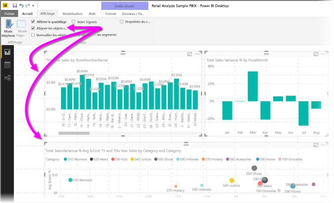

# Utiliser le quadrillage et l’alignement sur la grille dans les rapports Power BI Desktop
Le canevas de rapport **Power BI Desktop** offre un quadrillage qui vous permet d’aligner proprement les visuels sur une page de rapport, ainsi qu’une fonctionnalité d’alignement sur la grille qui permet de respecter les mêmes espaces entre les visuels dans un rapport.

Dans **Power BI Desktop**, vous pouvez également modifier l’ordre de plan (amener vers l’avant, amener vers l’arrière) des objets sur un rapport, ainsi qu’aligner ou répartir uniformément les visuels sélectionnés sur le canevas.

### Activation du quadrillage et de la grille automatique
Pour activer le quadrillage et l’alignement sur la grille, sélectionnez le ruban **Affichage**, puis cochez les cases **Afficher le quadrillage** et **Aligner les objets sur la grille**. Vous pouvez sélectionner une ou plusieurs zones ; elles fonctionnent indépendamment les unes des autres.

> [!NOTE]
> Si les options **Afficher le quadrillage** et **Aligner les objets sur la grille** sont désactivées, connectez-vous à n’importe quelle source de données pour les activer.
> 
> 

### Utilisation du quadrillage
Le quadrillage est constitué de repères visuels qui vous permettent de voir si plusieurs visuels sont alignés correctement. Lorsque vous tentez de déterminer si plusieurs visuels sont alignés horizontalement ou verticalement, utilisez le quadrillage pour savoir si leurs bordures sont parfaitement alignées.

Vous pouvez utiliser *CTRL + clic* pour sélectionner plusieurs visuels à la fois et d’afficher les bordures de ceux-ci afin de les aligner correctement.

#### Utilisation du quadrillage dans les visuels
Dans Power BI, les visuels contiennent également un quadrillage qui sert de repère visuel pour comparer des valeurs et des points de données. Depuis la publication de septembre 2017 de **Power BI Desktop**, vous pouvez gérer le quadrillage dans les visuels à l’aide de la carte **Axe X** ou **Axe Y** (en fonction du type de visuel), figurant dans la section **Format** du volet **Visualisations**. Vous pouvez gérer les aspect suivants du quadrillage dans un visuel :

* activer ou désactiver le quadrillage ;
* modifier la couleur du quadrillage ;
* ajuster le trait (épaisseur) du quadrillage ;
* sélectionner le style de trait du quadrillage dans le visuel (continu, en tirets ou en pointillés).

La modification de certains aspects d’un quadrillage peut être particulièrement utile dans les rapports où les visuels s’affichent sur un arrière-plan foncé. L’illustration suivante montre la section *Quadrillage* de la carte **Axe X**.

### Utilisation de l’alignement sur la grille
Lorsque vous activez **l’alignement des objets sur la grille**, tous les visuels du canevas **Power BI Desktop** que vous déplacez (ou redimensionnez) sont automatiquement alignés sur l’axe de grille le plus proche, ce qui permet de vérifier plus aisément que les visuels sont alignés sur le même emplacement ou la même taille dans le sens de la largeur ou de la hauteur.

Ces quelques opérations d’utilisation du **quadrillage** et de l’**alignement sur la grille** suffisent à vérifier que les éléments visuels sont parfaitement alignés dans vos rapports.

### Utilisation de l’ordre de plan, de l’alignement et de la répartition
Vous pouvez également gérer l’ordre avant-arrière des visuels d’un rapport, souvent appelé *ordre de plan* des éléments. Cela vous permet de faire chevaucher les visuels dans comme vous le souhaitez, puis d’ajuster l’ordre avant-arrière de chaque visuel. Pour ajuster cet ordre, utilisez les boutons **Amener vers l’avant** et **Amener vers l’arrière**, situés dans la section **Organiser** du ruban **Format**, qui apparaît dès que vous sélectionnez un ou plusieurs visuels sur la page et n’est pas affiché si aucun visuel n’est sélectionné.

Le ruban **Format** vous permet également d’aligner vos visuels de différentes façons. Vous pouvez ainsi afficher vos visuels sur la page dans l’alignement le mieux adapté.

Lorsqu’un visuel est sélectionné, utilisez le bouton **Aligner** pour aligner le visuel sur le bord (ou le centre) du canevas du rapport, comme illustré dans l’image suivante.

Lorsque deux ou plusieurs visuels sont sélectionnés, ils sont alignés ensemble et utilisent la limite alignée existante des visuels pour l’alignement. Par exemple, avec deux visuels sélectionnés et le bouton *Aligner à gauche* sélectionné, les visuels s’alignent sur la limite la plus à gauche de tous les visuels.

Vous pouvez également répartir vos visuels sur le canevas de rapport, verticalement ou horizontalement. Pour cela, utilisez simplement le bouton **Répartir** du ruban **Format**.

En effectuant quelques sélections parmi les outils de quadrillage, d’alignement et de répartition, vos rapports s’affichent comme vous le souhaitez.

