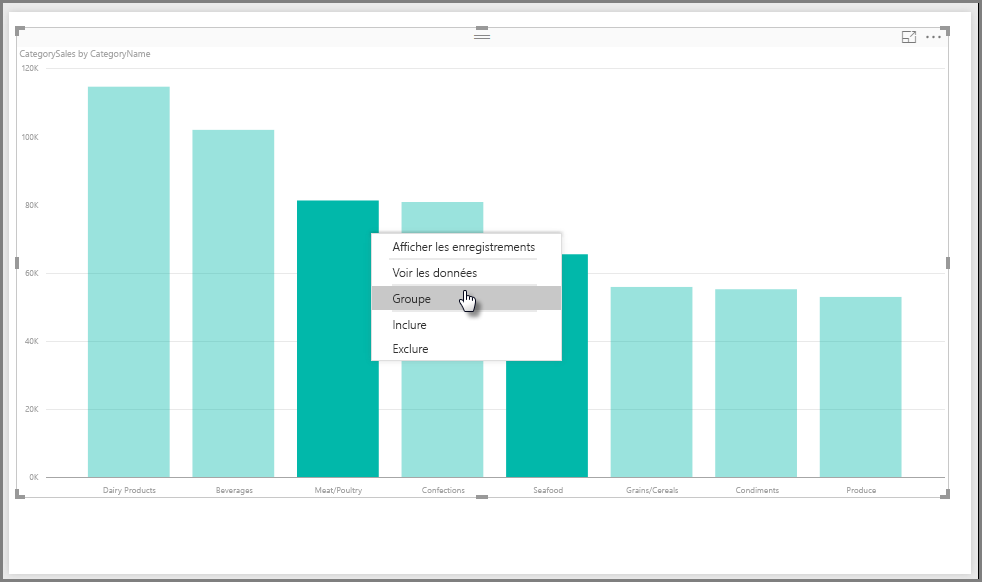
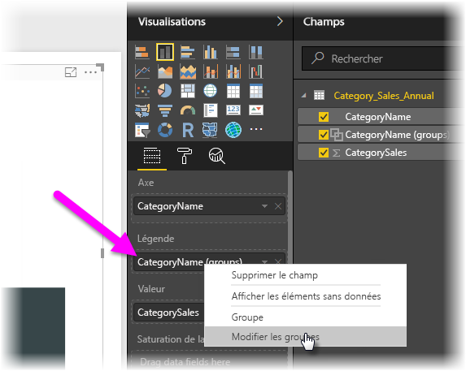
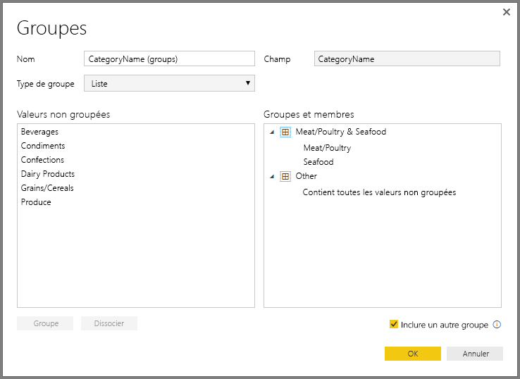
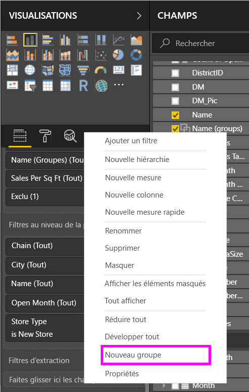
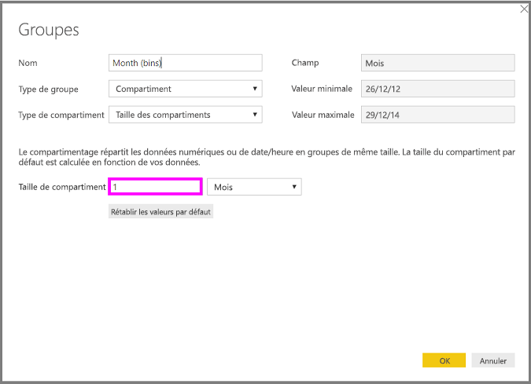
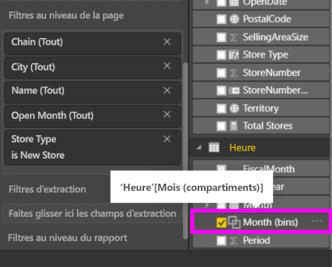

# Utiliser le regroupement et le compartimentage dans Power BI Desktop
Lorsque Power BI Desktop crée des visuels, il regroupe vos données en blocs (ou groupes) en fonction des valeurs trouvées dans les données sous-jacentes. Cela suffit généralement, mais vous pouvez affiner la présentation de ces segments. Par exemple, vous pouvez placer trois catégories de produits dans une catégorie supérieure (un *groupe*). Ou vous pouvez souhaiter afficher les chiffres de ventes dans des compartiments de 1 000 000 dollars, au lieu de compartiments de 923 983 dollars.

Dans Power BI Desktop, vous pouvez *regrouper* des points de données pour vous aider à afficher, analyser et explorer plus clairement les données et les tendances de vos visuels. Vous pouvez également définir la *taille du compartiment* pour placer des valeurs dans des groupes de taille égale qui vous permettent de visualiser les données de manière explicite. Cette action est souvent appelée *binning*.

## Utilisation du regroupement
Pour utiliser le regroupement, sélectionnez deux éléments ou plus d’un visuel à l’aide de Ctrl+clic pour sélectionner plusieurs éléments. Cliquez ensuite avec le bouton droit sur l’un des éléments de sélection, puis choisissez **Grouper** dans le menu contextuel.

Une fois créé, le groupe est ajouté au compartiment **Légende** du visuel. Le groupe s’affiche également dans la liste **Champs**.

Une fois que vous disposez d’un groupe, vous pouvez facilement en modifier les membres. Cliquez avec le bouton droit sur le champ à partir du compartiment **Légende** ou de la liste **Champs**, puis choisissez **Modifier les groupes**.

Dans la boîte de dialogue **Groupes**, vous pouvez créer des groupes ou modifier les groupes existants. Vous pouvez également *renommer* un groupe. Il vous suffit de double-cliquer sur le titre du groupe dans la zone **Groupes et membres**, puis d’entrer un nouveau nom.

Vous pouvez effectuer toutes sortes d’opérations avec les groupes. Vous pouvez ajouter des éléments de la liste **Valeurs non groupées** dans un nouveau groupe ou dans les groupes existants. Pour créer un groupe, sélectionnez deux éléments ou plus (à l’aide de Ctrl+clic) à partir de la zone **Valeurs non groupées**, puis sélectionnez le bouton **Grouper** sous cette zone.

Vous pouvez ajouter une valeur non groupée dans un groupe existant : sélectionnez simplement une des **valeurs non groupées**, puis le groupe existant auquel vous souhaitez l’ajouter et sélectionnez le bouton **Grouper**. Pour supprimer un élément d’un groupe, sélectionnez-le dans la zone **Groupes et membres**, puis sélectionnez **Dissocier**. Vous pouvez également déplacer des catégories non groupées dans le groupe **Autre** ou les laisser non groupées.

> [!NOTE]
> Vous pouvez créer des groupes pour n’importe quel champ de la zone **Champs** sans avoir à effectuer une sélection multiple à partir d’un visuel existant. Cliquez avec le bouton de droite et sélectionnez **Nouveau groupe** dans le menu qui s’affiche.

## Utilisation du compartimentage
Vous pouvez définir la taille de compartiment des champs numériques et horaires dans **Power BI Desktop.** Vous pouvez utiliser le compartimentage (binning) pour redimensionner correctement les données affichées par Power BI Desktop.

Pour appliquer une taille de compartiment, cliquez avec le bouton droit sur un **champ** et choisissez **Nouveau groupe**.

Dans la boîte de dialogue **Groupes**, configurez la **taille de compartiment** souhaitée.

Lorsque vous sélectionnez **OK**, vous remarquez qu’un nouveau champ s’affiche dans le volet **Champs** et que **(compartiments)** a été ajouté. Vous pouvez ensuite faire glisser ce champ sur le canevas pour utiliser la taille de compartiment dans un visuel.

Pour voir le *compartimentage* en action, regardez cette [vidéo](https://www.youtube.com/watch?v=BRvdZSfO0DY).

Voici tout ce que vous deviez savoir sur l’utilisation du *regroupement* et du *compartimentage* pour vous assurer que les visuels de vos rapports affichent vos données uniquement comme vous le souhaitez.
